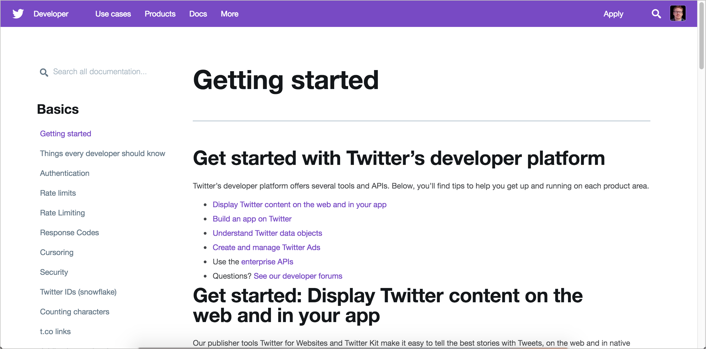
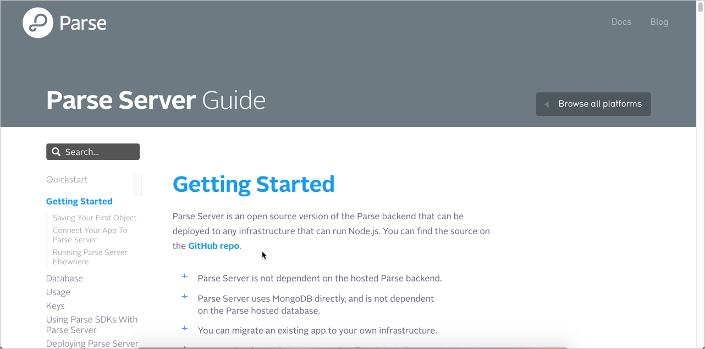
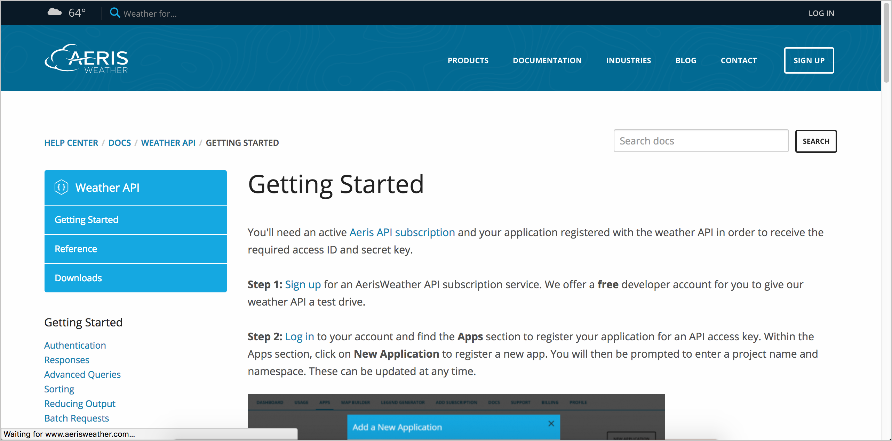

# Руководство по началу работы

После раздела «Обзор API» обычно идет раздел «Начало работы», в котором подробно описываются первые шаги, которые пользователи должны пройти для использования API. Этот раздел часто включает весь процесс от начала до конца, сжатый настолько просто, насколько это возможно.

[Цель раздела "Начало работы"](#purpose)

[Кнопка `Run in Postman`](#button)

[Примеры разделов "Начало работы"](#samples)

- [Paypal](#paypal)

- [Twitter](#twitter)

- [Parse Server](#parse)

- [Adsense](#adsense)

- [Aeris](#aeris)

- [Watson and IBM Cloud](#ibm)

[Практическое занятие: Раздел "Начало работы"](#activity)

## Цель раздела "Начало работы"

Раздел «Начало работы» это как `Hello World` для разработчиков, только с API. "Начало работы" ведет за руку пользователя от начала до конца при создании простейшего возможного вывода с системой. Для `Hello World` самым простым выводом является сообщение «Hello World». Для API это может быть успешный ответ на самый простой запрос.

> Раздел «Начало работы» это как `Hello World`, только с API. Сколько времени понадобится разработчику, чтобы получить максимально простой ответ, используя ваш API?

И `Hello World` и "Начало работы" преследуют одну и ту же цель: показать пользователю, как использовать инфраструктуру, API или какую-либо другую систему, для получения простого и легкого результата, чтобы пользователи получили полное представление о работе системы, API и т.д.

В качестве примера можно взять общий базовый сценарий использования API и показать, как создать запрос, а также какой ответ возвращается. Если разработчик сможет успешно выполнить такой вызов, значит и с остальными не должно возникнуть проблем.

Раздел "Начало работы" может содержать следующие пункты:

- Войти в аккаунт;
- Получить API ключ;
- Создание запроса
- Оценка ответа.

> Раздел "Начало работы" обычно знакомит пользователей с процессом от начала до конца, но сжатым и простым способом.

Поместите ссылку на раздел "Начало работы" на домашней странице документации. Сделайте так, чтобы разработчики могли с легкостью использовать API для получения определенного результата. Если подразумевается использование предварительно подготовленных учетных записей или конфигураций настройки, нужно продумать и это.

## Кнопка `Run in Postman`

В разделе "Начало работы"  можно рассмотреть возможность добавления кнопки `Run in Postman`. (Postman - это клиент REST API GUI, который мы изучили ранее в разделе [Отправка запросов в Postman](https://github.com/Starkovden/Documenting_APIs/blob/master/2.%20Using%20an%20API%20like%20a%20developer/2.3.%20Submit%20requests%20through%20Postman.md#%D0%BE%D1%82%D0%BF%D1%80%D0%B0%D0%B2%D0%BA%D0%B0-%D0%B7%D0%B0%D0%BF%D1%80%D0%BE%D1%81%D0%BE%D0%B2-%D0%B2-postman).) Если есть [конечные точки API, интегрированные с Postman](https://github.com/Starkovden/Documenting_APIs/blob/master/2.%20Using%20an%20API%20like%20a%20developer/2.3.%20Submit%20requests%20through%20Postman.md#%D0%BE%D1%82%D0%BF%D1%80%D0%B0%D0%B2%D0%BA%D0%B0-%D0%B7%D0%B0%D0%BF%D1%80%D0%BE%D1%81%D0%BE%D0%B2-%D0%B2-postman), можно экспортировать свои коллекции Postman в виде виджета для встраивания в HTML-страницу.

[`Run in Postman`](https://www.getpostman.com/api-network/) это кнопка, которая при нажатии импортирует информацию об API в Postman, чтобы пользователи могли выполнять вызовы с помощью клиента Postman. Таким образом, кнопка `Run in Postman` позволяет импортировать интерактивный пробный интерфейс API для конечных точек на веб-страницу.

Чтобы попробовать `Run in Postman`, можно [импортировать спецификацию OpenAPI в Postman](https://learning.getpostman.com/docs/postman/collections/data_formats/#importing-postman-data) или ввести информацию об API вручную. Затем посмотрите раздел Postman/docs, [как создать кнопку `Run in Postman`](https://learning.getpostman.com/docs/postman_for_publishers/run_button/creating_run_button/).

Множество демонстраций Run in Postman можно посмотреть [здесь](https://www.getpostman.com/api-network/). Многие из этих демонстраций перечислены в [сети API Postman](https://www.getpostman.com/api-network/).

> сеть API Postman

Вот демо `Run in Postman` с использованием конечной точки `weather` API OpenWeatherMap (с которой мы работали [раннее](https://github.com/Starkovden/Documenting_APIs/blob/master/2.%20Using%20an%20API%20like%20a%20developer/2.1.%20Scenario%20for%20using%20a%20weather%20API.md#%D1%81%D1%86%D0%B5%D0%BD%D0%B0%D1%80%D0%B8%D0%B9-%D0%B8%D1%81%D0%BF%D0%BE%D0%BB%D1%8C%D0%B7%D0%BE%D0%B2%D0%B0%D0%BD%D0%B8%D1%8F-api-%D0%BF%D1%80%D0%BE%D0%B3%D0%BD%D0%BE%D0%B7%D0%BD%D1%8B%D1%85-%D1%81%D0%B5%D1%80%D0%B2%D0%B8%D1%81%D0%BE%D0%B2)):

Если нажать на кнопку, будет предложено открыть коллекцию в клиенте Postman:

> Вариант открытия коллекции

[Postman](https://github.com/Starkovden/Documenting_APIs/blob/master/2.%20Using%20an%20API%20like%20a%20developer/2.3.%20Submit%20requests%20through%20Postman.md#%D0%BE%D1%82%D0%BF%D1%80%D0%B0%D0%B2%D0%BA%D0%B0-%D0%B7%D0%B0%D0%BF%D1%80%D0%BE%D1%81%D0%BE%D0%B2-%D0%B2-postman) предоставляет мощный клиент REST API, с которым знакомы многие разработчики. Postman позволяет пользователям настраивать ключ и параметры API и сохранять эти значения. Хотя Postman не имеет возможности вызова в браузере, как в Swagger UI, во многих отношениях клиент Postman более полезен, поскольку позволяет пользователям настраивать и сохранять сделанные ими запросы. Postman - тот инструмент, который внутренние разработчики часто используют для хранения запросов API при тестировании и изучении функциональности.

Особенно, если ваши пользователи уже знакомы с Postman, `Run in Postman` является хорошим вариантом для пользователей, чтобы опробовать API, потому что он позволяет пользователям легко генерировать необходимый код для отправки запросов практически в любой язык. Это дает пользователям отправную точку, где они могут опираться на информацию для создания более подробных и настраиваемых вызовов.

Если в документации еще нет функции `Try it out`, кнопка `Run in Postman` предоставляет такую интерактивность простым способом, не требуя жертв со стороны единственного источника знаний для документации.

Недостатком является то, что в Postman не попадают описания параметров и конечных точек. Кроме того, если пользователи незнакомы с Postman, им может быть трудно понять, как им пользоваться. Редакторы `Try it out`, которые запускаются непосредственно в браузере, как правило, более просты и лучше интегрируют документацию.

## Примеры разделов "Начало работы"

Ниже приведены несколько примеров разделов "Начало работы" в API. Если сравнить различные разделы «Начало работы», можно увидеть, что некоторые из них являются подробными, а некоторые - высокоуровневыми и краткими. В общем, чем дольше можно вести разработчика за руку, тем лучше. Тем не менее, раздел должен быть кратким, а не  многословным с другой документацией. Ключевым моментом является то, чтобы показать пользователю полный, от и до, процесс работы с API.

### Paypal

"Начало работы" Paypal содержит довольно много деталей, начиная с авторизации, запросов и других деталей до первого запроса. Хотя этот уровень детализации не так краток, он помогает сориентировать пользователей на необходимую им информацию. Чистый и понятный формат.

### Twitter

> Начало работы в Твиттер

На стартовой странице Twitter есть несколько разделов, посвященных началу работы, для разных целей разработки. Текст лаконичен и понятен. В разделе размещены ссылки на другую документацию для получения более подробной информации. В целях краткости можно следовать такой же стратегии - быть кратким и ссылаться на другие страницы, которые содержат более подробную информацию.

### Parse Server

> Начало работы Parse Server

Раздел "Начало" работы в Parse Server содержит большое количество деталей и подробное описание различных этапов. Для более подробных шагов по подключению вашего приложения и запуску сервера в другом месте, в разделе размещена ссылка на дополнительную информацию.

### Adsense

> Начало работы Adsense

"Начало работы" Adsense выделяет некоторые основные предпосылки для начала работы на платформе. После того, как вы настроитесь, он предоставляет «краткое руководство по началу работы». Такое руководство знакомит пользователей с простым сценарием от начала до конца, помогая им понять продукт и его возможности.

### Aeris

> Начало работы Aeris

Начало работы в сервисе погоды Aeris предоставляет информацию для настройки приложения, а затем делает запрос на одном из нескольких популярных языков. Хотя показ кода на определенных языках, несомненно, более полезен для программистов, использующих данный язык, примеры кода могут быть неуместны для других пользователей (например, разработчики Java могут найти код Python неуместным, и наоборот). Фокусировка на определенном языке часто является компромиссом.

### Watson and IBM Cloud

> Начало работы Watson and IBM Cloud

В разделе "Начало работы" Watson и IBM Cloud перечислены три шага. Тем не менее, это не полное руководство по началу работы. Пользователь может только выбрать сервис для своего проекта. В итоге кодировать начинаем с помощью Watson Dashboard.

В идеале, раздел "Начало работы" должен помочь пользователю увидеть ощутимые результаты, но возможно ли это или нет, зависит от API.

##  Практическое занятие: Раздел "Начало работы"

В своем [найденном опен-сорс проекте](https://github.com/Starkovden/Documenting_APIs/blob/master/3.%20Documenting%20API%20endpoints/3.9.%20Activity%20Find%20an%20open%20source%20project.md#%D0%BF%D1%80%D0%B0%D0%BA%D1%82%D0%B8%D1%87%D0%B5%D1%81%D0%BA%D0%BE%D0%B5-%D0%B7%D0%B0%D0%BD%D1%8F%D1%82%D0%B8%D0%B5-%D0%BF%D0%BE%D0%B8%D1%81%D0%BA-open-source-%D0%BF%D1%80%D0%BE%D0%B5%D0%BA%D1%82%D0%B0) найдем раздел "Начало работы" и ответим на следующие вопросы:

- Есть ли у API раздел "Начало работы"?
- Описан ли процесс начала работы от и до в разделе?
- Можно ли успешно выполнить все шаги в разделе?
- Сколько времени занимает освоение раздела?
- Отобразятся ли предположения о вашем техническом уровне в документации при попытках упростить инструкцию?
