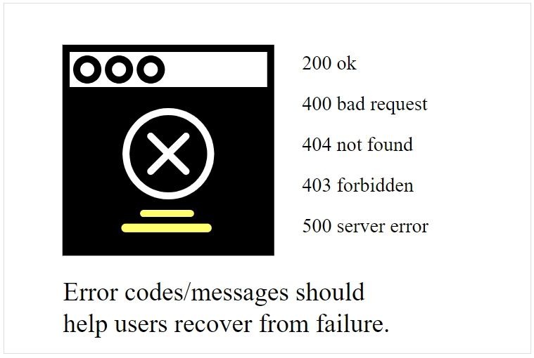

# Коды статусов и ошибок

Коды состояния и ошибок - это число в заголовке ответа, который указывает общую классификацию ответа - например, был ли запрос успешным (200), привел ли к ошибке сервера (500), были ли проблемы с авторизацией (403), и так далее. Стандартные коды состояния обычно не требуют большого количества документации, но пользовательские коды состояния и ошибки, специфичные для API, нужны. Коды ошибок, в частности, помогают в устранении неисправных запросов.

#### Содержание раздела

[Пример кода статуса в заголовке curl](#curlSample)

[Где перечислять HTTP-ответ и коды ошибок](#listResponse)

[Где взять коды статусов и шибок](#getStatus)

[Как перечислить коды состояния](#listStatus)

[Коды состояния и ошибок помогают в устранении неполадок](#assist)

[Примеры кодов статусов и шибок](#examples)

- [Context.io](#Context)

- [Twitter](#twitter)

- [Mailchimp](#mailchimp)

- [Flickr](#flickr)

[Практическое занятие: Коды статусов и ошибок](#activity)

## Пример кода статуса в заголовке curl

Коды статусов не отображаются в тебе ответа. Они содержатся в хэдере, который может быть не видим по умолчанию.

Помните, когда мы отправляли обратный вызов в разделе [Создание curl запроса](https://github.com/Starkovden/Documenting_APIs/blob/master/2.%20Using%20an%20API%20like%20a%20developer/2.5.%20Make%20a%20curl%20call.md#%D1%81%D0%BE%D0%B7%D0%B4%D0%B0%D0%B5%D0%BC-curl-%D0%B2%D1%8B%D0%B7%D0%BE%D0%B2)? Чтобы получить заголовок ответа, добавляем --include или -i к запросу curl. Если нужно, чтобы в ответе возвращался только заголовок ответа (и ничего больше), используем заглавную букву -I, например:

    curl -I -X GET "https://api.openweathermap.org/data/2.5/weather?zip=95050&appid=fd4698c940c6d1da602a70ac34f0b147&units=imperial"

Заголовок ответа выглядит следующим образом:

    HTTP/1.1 200 OK
    Server: openresty
    Date: Thu, 06 Dec 2018 22:58:41 GMT
    Content-Type: application/json; charset=utf-8
    Content-Length: 446
    Connection: keep-alive
    X-Cache-Key: /data/2.5/weather?units=imperial&zip=95050
    Access-Control-Allow-Origin: *
    Access-Control-Allow-Credentials: true
    Access-Control-Allow-Methods: GET, POST

Первая строка, `HTTP / 1.1 200 OK`, сообщает нам статус запроса (`200`). Большинство API REST следуют стандартному протоколу для заголовков ответов. Например, `200` - это не просто произвольный код, выбранный разработчиками OpenWeatherMap API. `200` - это общепринятый код для успешного HTTP-запроса. (Если изменить метод, то получим другой код состояния.)

С помощью запроса GET довольно легко определить, успешен ли запрос, потому что получаем ожидаемый ответ. Но предположим, делаем запрос POST, PUT или DELETE, когда мы меняем данные, содержащиеся в ресурсе. Как узнать, был ли запрос успешно обработан и получен API? Коды ответа HTTP в заголовке ответа будут указывать, была ли операция успешной. Коды состояния HTTP - это просто сокращения длинных сообщений.

> Коды состояния довольно тонкие, но когда разработчик работает с API, коды могут быть единственным «интерфейсом», который имеет разработчик. Если получится контролировать сообщения, которые видит разработчик, это будет большой победой юзабилити.

Слишком часто коды состояния неинформативны, плохо написаны и сообщают мало или вообще никакой полезной информации пользователю для преодоления ошибки. По большому счету, коды состояния должны помогать пользователям в восстановлении после ошибок.

Можно посмотреть список общих [кодов состояния REST API здесь] и общий список кодов статуса HTTP здесь. Хотя, возможно, было бы полезно включить несколько стандартных кодов состояния, нет необходимости в полном документировании всех стандартных кодов состояния, особенно если они редко запускаются вашим API.

## Где перечислять HTTP-ответ и коды ошибок

## Где взять коды статусов и шибок

## Как перечислить коды состояния

## Коды состояния и ошибок помогают в устранении неполадок

## Примеры кодов статусов и шибок

### Context.io

### Twitter

### Mailchimp

### Flickr

##  Практическое занятие: Коды статусов и ошибок
