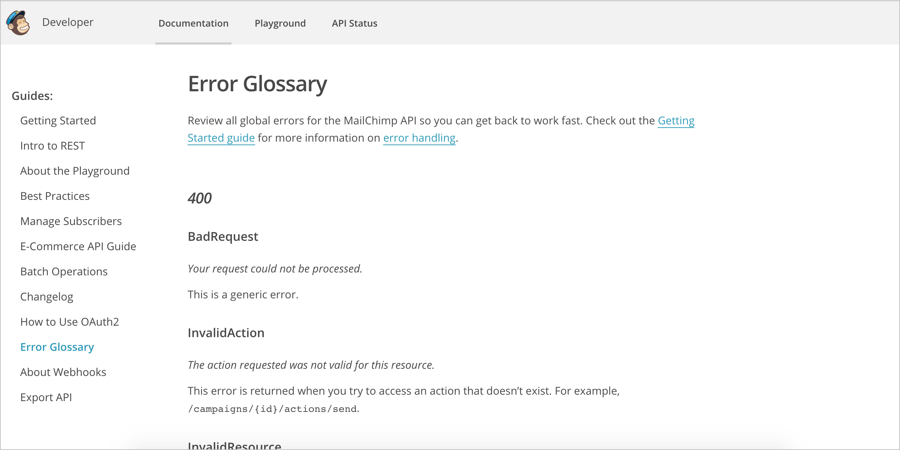

# Коды статусов и ошибок

Коды состояния и ошибок - это число в заголовке ответа, который указывает общую классификацию ответа - например, был ли запрос успешным (200), привел ли к ошибке сервера (500), были ли проблемы с авторизацией (403), и так далее. Стандартные коды состояния обычно не требуют большого количества документации, но пользовательские коды состояния и ошибки, специфичные для API, нужны. Коды ошибок, в частности, помогают в устранении неисправных запросов.

#### Содержание раздела

[Пример кода статуса в заголовке curl](#curlSample)

[Где перечислять HTTP-ответ и коды ошибок](#listResponse)

[Где взять коды статусов и ошибок](#getStatus)

[Как перечислить коды состояния](#listStatus)

[Коды состояния и ошибок помогают в устранении неполадок](#assist)

[Примеры кодов статусов и шибок](#examples)

- [Context.io](#Context)

- [Twitter](#twitter)

- [Mailchimp](#mailchimp)

- [Flickr](#flickr)

[Практическое занятие: Коды статусов и ошибок](#activity)

## Пример кода статуса в заголовке curl

Коды статусов не отображаются в тебе ответа. Они содержатся в хэдере, который может быть не видим по умолчанию.

Помните, когда мы отправляли обратный вызов в разделе [Создание curl запроса](https://github.com/Starkovden/Documenting_APIs/blob/master/2.%20Using%20an%20API%20like%20a%20developer/2.5.%20Make%20a%20curl%20call.md#%D1%81%D0%BE%D0%B7%D0%B4%D0%B0%D0%B5%D0%BC-curl-%D0%B2%D1%8B%D0%B7%D0%BE%D0%B2)? Чтобы получить заголовок ответа, добавляем --include или -i к запросу curl. Если нужно, чтобы в ответе возвращался только заголовок ответа (и ничего больше), используем заглавную букву -I, например:

    curl -I -X GET "https://api.openweathermap.org/data/2.5/weather?zip=95050&appid=fd4698c940c6d1da602a70ac34f0b147&units=imperial"

Заголовок ответа выглядит следующим образом:

    HTTP/1.1 200 OK
    Server: openresty
    Date: Thu, 06 Dec 2018 22:58:41 GMT
    Content-Type: application/json; charset=utf-8
    Content-Length: 446
    Connection: keep-alive
    X-Cache-Key: /data/2.5/weather?units=imperial&zip=95050
    Access-Control-Allow-Origin: *
    Access-Control-Allow-Credentials: true
    Access-Control-Allow-Methods: GET, POST

Первая строка, `HTTP / 1.1 200 OK`, сообщает нам статус запроса (`200`). Большинство API REST следуют стандартному протоколу для заголовков ответов. Например, `200` - это не просто произвольный код, выбранный разработчиками OpenWeatherMap API. `200` - это общепринятый код для успешного HTTP-запроса. (Если изменить метод, то получим другой код состояния.)

С помощью запроса GET довольно легко определить, успешен ли запрос, потому что получаем ожидаемый ответ. Но предположим, делаем запрос POST, PUT или DELETE, когда мы меняем данные, содержащиеся в ресурсе. Как узнать, был ли запрос успешно обработан и получен API? Коды ответа HTTP в заголовке ответа будут указывать, была ли операция успешной. Коды состояния HTTP - это просто сокращения длинных сообщений.

> Коды состояния довольно тонкие, но когда разработчик работает с API, коды могут быть единственным «интерфейсом», который имеет разработчик. Если получится контролировать сообщения, которые видит разработчик, это будет большой победой юзабилити.

Слишком часто коды состояния неинформативны, плохо написаны и сообщают мало или вообще никакой полезной информации пользователю для преодоления ошибки. По большому счету, коды состояния должны помогать пользователям в восстановлении после ошибок.

Можно посмотреть список общих [кодов состояния REST API здесь](https://www.restapitutorial.com/httpstatuscodes.html) и [общий список кодов HTTP статусов здесь](https://en.wikipedia.org/wiki/List_of_HTTP_status_codes). Хотя, возможно, было бы полезно включить несколько стандартных кодов состояния, нет необходимости в полном документировании всех стандартных кодов состояния, особенно если они редко запускаются в API.

## Где перечислять HTTP-ответ и коды ошибок

Практичнее, если API будут иметь одну страницу с ответами и кодами ошибок ко всему API. Отдельная страница с перечнем кодов состояния (вместо добавления кода состояния в каждую конечную точку) позволяет более детально описать каждый код без переполнения других частей документации. Такой подход уменьшает избыточность и ощущение информационной перегрузки.

С другой стороны, если какие-то коды состояния и ошибок больше подходят к определенным конечным точкам, чем другие, имеет смысл вывести такие коды состояния и ошибок на страницы с описаниями конечных точек.

Такая стратегия может заключаться в том, чтобы привлечь внимание к каким-либо особенно важным кодам состояния или ошибок для конкретной конечной точки, а затем перейти к централизованной странице «Коды ответов и состояний» для получения полной информации.

## Где взять коды статусов и шибок

Коды состояния и ошибок могут быть неочевидны в документации API. Вероятно, придется попросить разработчиков предоставить список всех кодов состояния и ошибок, которые уникальны для API. Иногда разработчики хардкодят коды состояния и ошибок непосредственно в программном коде, и у них нет простых способов передать полный список (что также затрудняет локализацию).

В результате может потребоваться танцы с бубнами, чтобы найти все коды. В частности, возможно [придется сломать API](https://github.com/Starkovden/Documenting_APIs/blob/master/5.%20Testing%20API%20documentaion/5.3.%20Test%20all%20instructions%20yourself.md#%D1%81%D0%B0%D0%BC%D0%BE%D1%81%D1%82%D0%BE%D1%8F%D1%82%D0%B5%D0%BB%D1%8C%D0%BD%D0%BE%D0%B5-%D1%82%D0%B5%D1%81%D1%82%D0%B8%D1%80%D0%BE%D0%B2%D0%B0%D0%BD%D0%B8%D0%B5-%D0%B2%D1%81%D0%B5%D1%85-%D0%B8%D0%BD%D1%81%D1%82%D1%80%D1%83%D0%BA%D1%86%D0%B8%D0%B9), чтобы увидеть все возможные коды ошибок. Например, если [превысить ограничение скорости](https://github.com/Starkovden/Documenting_APIs/blob/master/6.%20Non-reference%20API%20topics/6.6.%20Rate%20limiting%20and%20thresholds.md) для определенного запроса, API может вернуть специальную ошибку или код состояния. Такой пользовательский код обязательно нужно задокументировать. В разделе устранения неполадок в API можно специально разместить примеры получения кодов ошибок.

## Как перечислить коды состояния

Коды статусов и ошибок можно привести в виде списка определений или таблицы, например так:

| Status code | Значение |
|:--|:--|
| `200` | Успешный запрос и ответ |
| `400` | Неверно заданные параметры или другой неверный запрос |

## Коды состояния и ошибок помогают в устранении неполадок

Коды состояния и ошибок особенно полезны при устранения неполадок. Таким образом, можно рассматривать коды ошибок как дополнение к разделу по устранению неполадок.

Каждая часть документации может быть полезна в разделе, посвященном устранению неполадок. В разделе, посвященном устранению неполадок, можно описать, что происходит, когда пользователи уходят с проторенной дорожки и спотыкаются в темном лесу. Коды состояния похожи на подсказки, которые помогут пользователям вернуться на правильный путь.

В разделе по устранению неполадок можно перечислить сообщения об ошибках, связанных со следующими ситуациями:

- использование неправильных API ключей;
- использование неверных API ключей;
- параметры не соответствуют типам данных;
- API выдает исключение;
- нет данных для возврата ресурса;
- превышен предел скорости;
- параметры находятся за пределами приемлемых максимальной и минимальной границ;
- обязательный параметр отсутствует в конечной точке.

текст ошибки должен точно документироваться, чтобы она легко появлялась при поиске.

## Примеры кодов статусов и ошибок

Ниже приведены несколько вариантов разделов с кодами статусов и ошибок.

### Context.io

> Коды статусов и ошибок [Conext.io](https://context.io/)

Clearbit не только документирует стандартные коды состояния, но также описывает уникальные параметры, возвращаемые их API. Большинство разработчиков, вероятно, знакомы с кодами 200, 400 и 500, поэтому эти коды не требуют много пояснений. Но если API имеет уникальные коды, описывать их нужно адекватно и подробно.

### Twitter

> Коды статусов и ошибок [Twitter](https://twitter.com/)

В Twitter не только описывается код и состояние, но также предоставляется полезная информация по устранению неполадок, потенциально помогая в устранении ошибок. Например, про ошибку `500` не просто сказано, что статус относится к неработающей службе, но и есть объяснение: «Обычно это временная ошибка, например, в ситуации высокой нагрузки или если у конечной точки временно возникают проблемы. Посетите [форумы разработчиков](https://twittercommunity.com/) на случай, если у других возникнут аналогичные проблемы, или повторите попытку позже».

Полезные сообщения такого рода - то, к чему должны стремиться технические писатели в разделе кодов состояния (по крайней мере, делать описания тех кодов, которые указывают на проблемы)

### Mailchimp

> Коды статусов и ошибок [Mailchimp](https://mailchimp.com/)

Mailchimp предоставляет удобочитаемые и понятные описания сообщений об ошибке. Например, в ошибке `403` вместо того, чтобы просто написать «Запрещено», Mailchimp объясняет причины, по которым можно получить ошибку запрещенного кода. У Mailchimp существует несколько типов ошибок 403. Запрос может быть запрещен из-за отключенной учетной записи пользователя или запроса, направленного не в тот центр обработки данных. В случае ошибки «WrongDataCenter» Mailchimp отмечает, что «она часто связана с неправильно настроенными библиотеками» и ссылается на дополнительную информацию о центрах обработки данных. Такой тип документации кода ошибки очень полезен для пользователей.

### Flickr

> Коды статусов и ошибок [Flikr](https://www.flickr.com/services/developer/api/)

В Flickr раздел «Коды ответов» встроен в описание каждой адресной темы API. Описания ошибок выглядят короткими. Хотя встраивание кодов ответов в каждую тему делает коды ошибок более заметными, в некоторых случаях такой подход менее полезен. Поскольку он встроен в каждую тему API, описания кодов ошибок должны быть краткими, иначе их содержимое будет перегружено информацией о запросе конечной точки.

Напротив, отдельная страница с перечнем кодов ошибок позволяет более подробно раскрывать каждый код, не вытесняя другую документацию. Отдельная страница также уменьшает избыточность и увеличивает объем информации.

##  Практическое занятие: Коды статусов и ошибок

В своем [найденном опен-сорс проекте](https://github.com/Starkovden/Documenting_APIs/blob/master/3.%20Documenting%20API%20endpoints/3.9.%20Activity%20Find%20an%20open%20source%20project.md#%D0%BF%D1%80%D0%B0%D0%BA%D1%82%D0%B8%D1%87%D0%B5%D1%81%D0%BA%D0%BE%D0%B5-%D0%B7%D0%B0%D0%BD%D1%8F%D1%82%D0%B8%D0%B5-%D0%BF%D0%BE%D0%B8%D1%81%D0%BA-open-source-%D0%BF%D1%80%D0%BE%D0%B5%D0%BA%D1%82%D0%B0) найдем информацию о кодах статусов и ошибок. Ответим на следующие вопросы:

- присутствуют описания кодов статусов и ошибок в проекте?
- где находится информация о кодах статусов и ошибок в контексте документации? Как отдельная тема? Ниже каждой конечной точки? Где-нибудь еще?
- имеет ли API какой-либо уникальный код статусов и ошибок?
- помогают ли коды ошибок пользователям восстанавливаться после ошибок?
- сделаем запрос на одну из конечных точек, затем целенаправленно изменим параметр, чтобы сделать недействительный запрос. Какой код статуса возвращается в ответе? Этот код состояния задокументирован?
