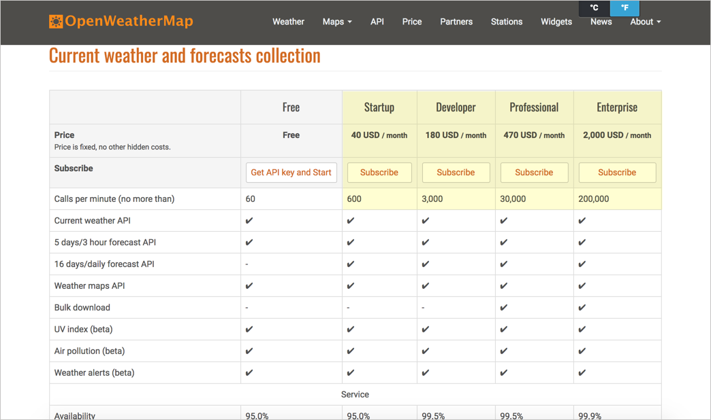
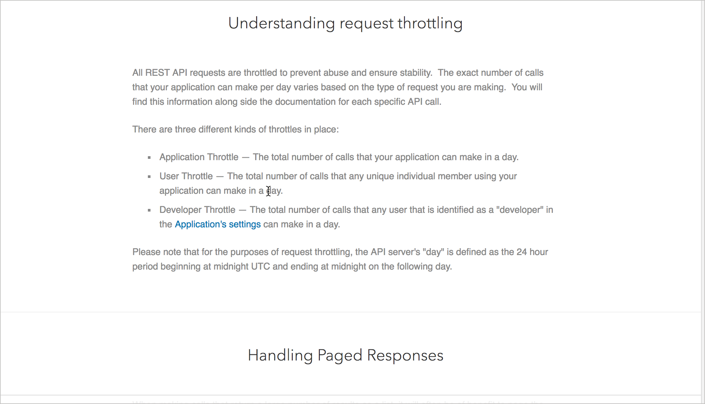
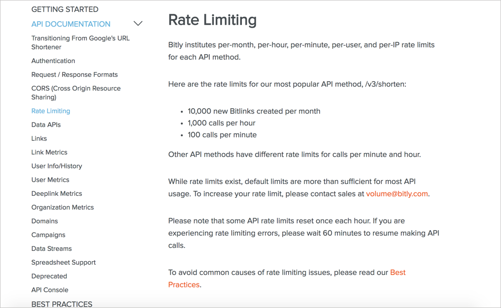

# Ограничения скорости

Ограничения скорости определяют, как часто можно осуществлять запросы по конкретной конечной точке. Обычно компании имеют разные уровни (например, бесплатные и профессиональные) и лицензии (с открытым исходным кодом, бизнес, коммерческие), соответствующие различным возможностям или ограничениям скорости API.

[Что покрывать при помощи ограничения скорости](#cover)

[Пример разделов "Ограничения скорости"](#examples)

- [GitHub](#github)

- [Linkedin](#linkedin)

- [Bitly](#bitly)

[Практическое занятие: Ограничения скорости](#activity)

## Что покрывать при помощи ограничения скорости

Компании, имеющие API зарабатывают деньги, взимая плату за доступ к API. Обычно различают низкое и высокое использование, часто освобождая варианты с низким использованием, чтобы разработчики могли исследовать и экспериментировать с API. На примере [API OpenWeatherMap Weather](https://openweathermap.org/price), который мы используем на этом курсе, можно увидеть, где начинается уровень ценообразования:

> Уровни ценообразования для API OpenWeatherMap. Каждый вызов - это запрос к API. Если на странице отображается только один запрос о погоде, и приходит более 60 посетителей в секунду, необходимо пройти мимо бесплатного уровня пользования.

Если сайт посещает сотни тысяч человек в день и каждая перезагрузка страницы дергает конечную точку API, нужно быть уверенным, что API может поддерживать такой тип трафика.

Ценообразование, относящееся к ограничениям скорости, - это, вероятно, информация, которая находится в области маркетинга, а не в области документации. Тем не менее, разработчикам стоит знать ключевые варианты поведения, включающие пороги ограничения скорости. Например:

- Замедляется ли получение ответов при превышении порога скорости?
- Приходится ли платить за каждый дополнительный запрос?
- Возвращает ли ответ определенный код состояния при превышении порога скорости (если да, то какой?)

Как разработчики обрабатывают ситуации, если, при внедрении кода в приложения, API не отвечает из-за нарушений ограничения скорости? Существуют ли условия и проверки для обработки таких сценариев с ограничениями? Может зависать виджет (или что-то еще, что может реализовывать API), или будет отображаться пустым, или будет происходит сбой?

> Ограничение скорости может показаться маркетинговой темой, но политики ограничения скорости и их влияние на вызовы API могут оказать существенное влияние на разработку.

## Пример разделов "Ограничения скорости"

Ниже приведены несколько примеров с разделами "Ограничения скорости" в API

### GitHub

> Ограничения скорости GitHub

Документация GitHub объясняет:

- ограничения скорости для аутентифицированных и не аутентифицированных запросов, которые возвращает заголовок,
- значение ограничивающих скорость заголовков (`X-RateLimit-Limit`, `X-RateLimit-Remaining` и `X-RateLimit-Reset`),
- как проверить текущее использование,
- как увеличить лимиты скорости для конкретного приложения,
- что происходит при злоупотреблении лимитами и многое другое.

### Linkedin

> Ограничения скорости LinkedIn

Документация Linkedin по ограничению скорости объясняет, что разные конечные точки API имеют разные ограничения. Существует три различных типа регулирования:

- регулирование приложений,
- регулирование пользователей;
- регулирование разработчиков.

Их документация также объясняет часовой пояс, используемый для отслеживания начала и конца дня.

### Bitly

Bitly предоставляет основную информацию на странице выше, а также [ссылки на лучшие практики для избегания проблем с ограничением скорости](https://dev.bitly.com/best_practices.html). Эти передовые практики включают советы о кэшировании, проблемах безопасности, длинных загрузок страниц, пакетной обработке, запросах большого объема, кодирования URL и многое другое.

Глядя на примеры, можно увидеть, что, хотя ограничение скорости может показаться простой темой, существуют уровни глубины и сложности, которые необходимо охватить. Актуальность темы зависит от нашего API и политики ограничений, установленных вашей компанией, но эта информация не может быть полностью загружена в маркетинг для обработки. Большая часть информации об ограничении скорости напрямую влияет на развитие.

##  Практическое занятие: Ограничения скорости

В своем [найденном опен-сорс проекте](https://github.com/Starkovden/Documenting_APIs/blob/master/3.%20Documenting%20API%20endpoints/3.9.%20Activity%20Find%20an%20open%20source%20project.md#%D0%BF%D1%80%D0%B0%D0%BA%D1%82%D0%B8%D1%87%D0%B5%D1%81%D0%BA%D0%BE%D0%B5-%D0%B7%D0%B0%D0%BD%D1%8F%D1%82%D0%B8%D0%B5-%D0%BF%D0%BE%D0%B8%D1%81%D0%BA-open-source-%D0%BF%D1%80%D0%BE%D0%B5%D0%BA%D1%82%D0%B0) найдем информацию об ограничениях в API документации. Ответим на следующие вопросы:

1. Есть ли у API ограничения?
2. Что произойдет в результате превышения ограничений?
3. Какой код статуса появится при превышении ограничений?
4. Какие ограничения скорости существуют для свободных (или разрабатываемых) уровней API?
