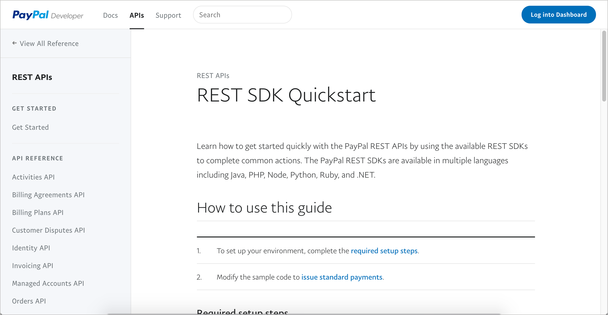
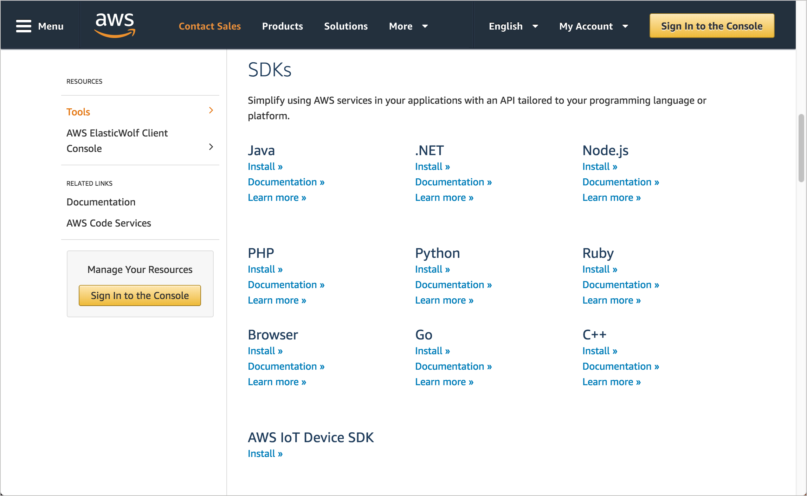

# SDK и пример приложений

Раздел "SDK (software development kits) и примеры приложений" аналогичен образцам и описаниям кода, но более обширен и обычно включает в себя целую коллекцию файлов, которые работают вместе как пакет или пример приложения. SDK может включать библиотеки, которые мы загружаем и встраиваем в свое приложение, и может состоять из инструментов, примеров приложений и другого кода.

[Что такое SDK?](#sdk)

[Какова роль технического писателя в документировании SDK и примеров приложений](#role)

[Примеры SDK и приложений](#samples)

- [OpenWeatherMap API](#OpenWeatherMap)

- [Paypal REST SDK](#paypal)

- [Heroku SDK](#heroku)

- [Amazon SDK](#Amazon)

- [Google Cloud SDK](#googlecloud)

[Практическое занятие: SDK](#activivty)

## Что такое SDK?

Термины API и SDK часто используются вместе, но они не являются синонимами. SDK реализуют независимый от языка REST API на определенном языке, таком как Java или C ++. API REST сами по себе не привязаны к какому-либо конкретному языку; обычно мы демонстрируем API, [совершая запросы, используя cURL](https://github.com/Starkovden/Documenting_APIs/blob/master/2.%20Using%20an%20API%20like%20a%20developer/2.5.%20Make%20a%20curl%20call.md#%D1%81%D0%BE%D0%B7%D0%B4%D0%B0%D0%B5%D0%BC-curl-%D0%B2%D1%8B%D0%B7%D0%BE%D0%B2), инструмент командной строки для отправки веб-запросов и получения ответов. Но разработчики не будут использовать запросы cURL при реализации API. Вместо этого они будут реализовывать запросы API, используя язык, на котором написано их приложение.

Например, приложения Python, C++ или Node выполняют запросы API разными способами. Каждый язык имеет свой собственный способ построения запросов к API. Можно использовать Postman или Paw для автоматической генерации простого запроса на определенном языке (см. [Автоматическая генерация примеров кода](https://github.com/Starkovden/Documenting_APIs/blob/master/3.%20Documenting%20API%20endpoints/3.6.%20Step%204%20Request%20example.md#%D0%B0%D0%B2%D1%82%D0%BE-%D0%B3%D0%B5%D0%BD%D0%B5%D1%80%D0%B0%D1%86%D0%B8%D1%8F-%D0%BF%D1%80%D0%B8%D0%BC%D0%B5%D1%80%D0%BE%D0%B2-%D0%BA%D0%BE%D0%B4%D0%B0)). SDK выводит реализацию на другой уровень. SDK могут включать в себя гораздо больше файлов или библиотек как часть реализации.

В статье [В чем разница между API и SDK?](https://nordicapis.com/what-is-the-difference-between-an-api-and-an-sdk/) Kristopher Sandoval объясняет SDK следующим образом:

> SDK расшифровывается как «Software Development Kit», что является отличным способом понять, это - набор. Подумайте о том, чтобы собрать модель автомобиля или самолета. При конструировании этой модели необходим целый комплект предметов, включая сами комплекты, инструменты, необходимые для их соединения, инструкции по сборке и так далее.
SDK или devkit функционируют во многом таким же образом, предоставляя набор инструментов, библиотек, соответствующей документации, примеров кода, процессов и / или руководств, которые позволяют разработчикам создавать программные приложения на определенной платформе. Если API - это набор строительных блоков, которые позволяют создавать что-то, SDK - это полноценный набор, облегчающий создание далеко за пределами того, что API может позволить.

Sandoval сравнивает примеры API и SDK Facebook, чтобы прояснить разницу. Он резюмирует разницу следующим образом: «SDK является строительными блоками приложения, тогда как API является языком его запросов». Другими словами, SDK предоставляет весь необходимый код, необходимый для создания приложения, которое использует API.

## Какова роль технического писателя в документировании SDK и примеров приложений

В руководстве SwaggerHub мы узнали, как [автоматически генерировать клиентские SDK](https://github.com/Starkovden/Documenting_APIs/blob/master/4.%20OpenAPI%20specification%20and%20Swagger/4.16.%20SwaggerHub%20introduction%20and%20tutorial.md#%D0%B0%D0%B2%D1%82%D0%BE-%D0%B3%D0%B5%D0%BD%D0%B5%D1%80%D0%B0%D1%86%D0%B8%D1%8F-%D0%BA%D0%BB%D0%B8%D0%B5%D0%BD%D1%82%D1%81%D0%BA%D0%BE%D0%B3%D0%BE-sdk) в интерфейсе SwaggerHub. Обычно, если ваша команда разработчиков предлагает клиентский SDK, вместо автоматически сгенерированного SDK будет код, который команда разработчиков готовит и тестирует. Команда разработчиков часто предоставляет SDK на нескольких целевых языках в зависимости от основного языка своего пользователя, что облегчает пользователям реализацию API.

Техническому писателю API, документирование SDK и примеров приложений является  более сложной задачей, поскольку SDK требуют знания одного или нескольких языков программирования. Вопрос о том, [сколько кода нужно знать техническому писателю](https://github.com/Starkovden/Documenting_APIs/blob/master/8.%20Getting%20a%20job%20in%20API%20documentation/8.2.%20How%20much%20code%20do%20you%20need%20to%20know.md) рассмотрим в модуле [Работа техписателя](https://github.com/Starkovden/Documenting_APIs/tree/master/8.%20Getting%20a%20job%20in%20API%20documentation#%D1%80%D0%B0%D0%B1%D0%BE%D1%82%D0%B0-%D1%82%D0%B5%D1%85%D0%BF%D0%B8%D1%81%D0%B0%D1%82%D0%B5%D0%BB%D1%8F), поэтому здесь в подробности не будем вдаваться. Обычно разработчики не ожидают от вас глубокого знания нескольких языков программирования, но некоторое понимание потребуется для их описания и просмотра документации. При принятии решения о том, называть ли блок кода функцией, классом, методом или другим именем, необходимо иметь базовое понимание терминов, используемых в языке.

> SDK и пример приложений

Если язык незнаком, можно просто взять то, что пишут инженеры, немного почистить его, попробовать пройтись по шагам, чтобы заставить работать любые примеры приложений, и посмотреть, какие отзывы приходят от пользователей. Обычно, если можно установить и работать с примером приложения и убедиться, что базовая документация для запуска приложения работает, а также то, что приложение делает, этого может быть достаточно. Но, конечно, для внесения любого существенного вклада в документацию SDK потребуется знание языка программирования, на котором написан SDK.

Как уже упоминалось в [Описание и образцы кода](https://github.com/Starkovden/Documenting_APIs/blob/master/6.%20Non-reference%20API%20topics/6.7.%20Code%20samples%20and%20tutorials.md#%D0%BE%D0%BF%D0%B8%D1%81%D0%B0%D0%BD%D0%B8%D0%B5-%D0%B8-%D0%BE%D0%B1%D1%80%D0%B0%D0%B7%D1%86%D1%8B-%D0%BA%D0%BE%D0%B4%D0%B0), не нужно документировать, как работает конкретный язык, как работает SDK компании. Предположительно, если инженер загружает Java SDK для API, это происходит потому, что инженер уже знаком с Java. Однако, если API был реализован особым образом в Java, нужно объяснить, почему был принят этот подход. (Конечно, для понимания разницы между документированием Java и документированием определенного подхода в реализации Java также требуется [понимание Java](https://github.com/Starkovden/Documenting_APIs/blob/master/9.%20Native%20library%20APIs/9.3.%20Java%20crash%20course.md).)

## Примеры SDK и приложений

В следующих примерах показана документация некоторых примеров SDK и примеров приложений.

### OpenWeatherMap API

> примеры кода OpenWeatherMap API

Примеры интеграции API OpenWeatherMap - это не просто короткие фрагменты кода, которые показывают, как вызывать конечную точку. Они представляют собой полноценные, сложные интеграции для различных платформ. Многие примеры кода хранятся в GitHub. У каждого сценария есть подробное объяснение.

Хорошая идея, если можно разместить свои примеры приложений и SDK на GitHub. Хранение кода на GitHub преследует две цели: во-первых, оно обычно ложится бременем на разработку поддержки и тестирования примеров кода, а также реагирует на проблемы, которые пользователи могут регистрировать в проекте. Во-вторых, это упрощает предоставление полнофункционального кода, поскольку пользователи могут клонировать проект и немедленно начать работу с ним. Команда разработчиков также может легко выпускать обновления.

### Paypal REST SDK

> SDK PayPal

В разделе [«Дополнительная информация» Paypal](https://developer.paypal.com/docs/api/quickstart/#additional-information) SDK содержат Node JS, PHP, Python, Ruby, Java и .NET SDK. Каждая реализация имеет свой собственный сайт GitHub, со своей вики, примером кода, исходными документами и многим другим. Если посмотреть некоторые из страниц GitHub (например, [сайт для PHP](https://paypal.github.io/PayPal-PHP-SDK/)), можно увидеть всю коллекцию языковых файлов для этого SDK. Эти сайты показывают, как SDK включают в себя различные типы файлов.

> PayPal PHP sdk

### Heroku SDK

Heroku SDK фактически управляется PubNub и включает в себя SDK Ruby, Java, Node JS, Python и PHP . Если посмотреть, например, [документацию по Python SDK](https://devcenter.heroku.com/articles/pubnub#python-sdk-documentation), там есть ссылки на начало работы, описания и справку по API.

Как было упомянуто ранее, маловероятно, что получится внести значительный вклад в написание или просмотр документации SDK при незнании языком, для которого создан SDK. Группы разработчиков обычно не ожидают, что технические писатели будут знакомы с несколькими языками. Скорее всего, мы будем полагаться на разработчиков, которые владеют языками и средами для создания  контента. Но для этого нам потребуется умело взаимодействовать с разработчиками и быть знакомыми с жаргоном и концепциями программирования.

Если разработчики говорят, что пользователи должны знать X, не стоит доверять их мнению из-за незнания языка. Лучше найти разработчиков на этом языке (даже своих разработчиков в других командах) для проверки документации. Если эти пользователи попросят больше подробностей, стоит связаться с командой разработчиков, чтобы предоставить нужные подробности.

Технические писатели, не знакомые с языком SDK, выступают в качестве посредников между авторами проекта и пользователями проекта. Технические писатели выявляют и устраняют пробелы в документации, и часто управляют публикацией и распространением документов. Но сам контент может быть слишком техническим для большинства технических писателей, играющих роль авторов контента. (Подробнее об этом в серии «Упрощенная сложность» статья под названием [Be both a generalist and specialist through your technical acuity](https://idratherbewriting.com/simplifying-complexity/both-a-generalist-and-specialist-at-same-time.html))

### Amazon SDK

> SDK Amazon AWS

Одной из примечательных характеристик документов AWS является  идентичность наборов документации SDK для каждого из языков. Идентичность приводит к предсказуемости и, следовательно, удобству использования. Однако в документах SDK видно, что для генерации документов для различных библиотек используются разные генераторы документов. Если посмотреть на ссылки API для каждой из библиотек SDK, то увидим генератор документации C++ для [документации C++ SDK](http://sdk.amazonaws.com/cpp/api/LATEST/index.html), генератор документации Ruby для [документации Ruby SDK](https://docs.aws.amazon.com/sdk-for-ruby/v3/api/index.html), генератор документации PHP для [PHP SDK](https://docs.aws.amazon.com/aws-sdk-php/v3/api/), генератор документации .NET для [документации .NET SDK](https://docs.aws.amazon.com/sdkfornet/v3/apidocs/Index.html), генератор документации Java [для документации Java SDK](https://docs.aws.amazon.com/AWSJavaSDK/latest/javadoc/index.html) и т.д.

Каждый язык программирования имеет свой собственный уникальный синтаксис и инструменты генерации документов. Синтаксис (который программисты используют непосредственно в коде - см. [Теги Javadoc](https://github.com/Starkovden/Documenting_APIs/blob/master/9.%20Native%20library%20APIs/9.5.%20Javadoc%20tags.md) для примера тегов Javadoc) отличается в зависимости от языка и инструмента, но в основном он похож. Поскольку документация генерируется из аннотаций в коде, разработчики пишут и поддерживают такую документацию. (Наличие разработчиков, пишущих и поддерживающих документацию уменьшает размытие документации.)

Но даже в этом случае существуют небольшие вариации от одной библиотеки к другой. Как инженеры гарантируют, что они используют то же описание для класса в Java, что и для Ruby и PHP? Инструменты для генерации документации или недостаточно умны, чтобы использовать фрагменты, или включены в общий онлайн-репозиторий. Обычно не используют переменные или другие методы одного источника. В результате, об одних и тех же понятиях могут быть разные описания в документации к разным SDK.

### Google Cloud SDK

> документация SDK Google Cloud

Google Cloud SDK предоставляет руководства по быстрому запуску для Linux, Debian, Ubuntu и других операционных систем. В руководствах объясняется, как устанавливать, настраивать и управлять командами SDK. Ссылка API для команд также включена.

Если взглянуть на Google Cloud SDK и Amazon SDK станет понятно, что при разнообразии SDK можно документировать и в ширь и в глубь. SDK специфичны для конкретного языка программирования, операционной системы или другого фреймворка, и поэтому попытка документировать эту категорию инструментов может быть сложной. Для документации SDK необходимо тесно сотрудничать с разработчиками и прислушиваться к отзывам пользователей.

##  Практическое занятие: SDK

В своем [найденном опен-сорс проекте](https://github.com/Starkovden/Documenting_APIs/blob/master/3.%20Documenting%20API%20endpoints/3.9.%20Activity%20Find%20an%20open%20source%20project.md#%D0%BF%D1%80%D0%B0%D0%BA%D1%82%D0%B8%D1%87%D0%B5%D1%81%D0%BA%D0%BE%D0%B5-%D0%B7%D0%B0%D0%BD%D1%8F%D1%82%D0%B8%D0%B5-%D0%BF%D0%BE%D0%B8%D1%81%D0%BA-open-source-%D0%BF%D1%80%D0%BE%D0%B5%D0%BA%D1%82%D0%B0) найдем информацию об SDK для API. Ответим на следующие вопросы:

1. Включает ли API любую SDK?
2. На каком языке представлена SDK?
3. Почему разработчики решили сделать SDK доступным на этом языке?
4. Насколько обширны инструкции по работе с этим SDK?
5. Где хранится код для SDK? В GitHub? В отдельном загружаемом zip-файле?
