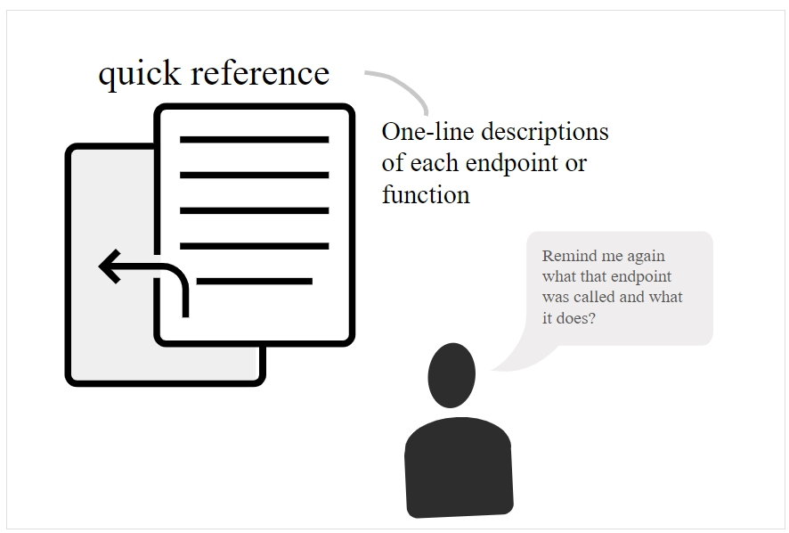

# Краткое справочное руководство

Краткое справочное руководство выполняет иную функцию, нежели руководства по началу работы. Хотя руководство по началу работы помогает новичкам ориентироваться, предоставляя сквозную инструкцию для выполнения простого запроса API, краткое справочное руководство помогает пользователям получить представление о системе в целом, часто путем предоставления списка конечных точек API.

#### Содержание раздела

[Необходимость в кратких справочных руководствах](#need)

[Преимущества чистой информации для изучения](#advantages)

[Примеры краткого руководства](#samples)

- [Eventful](#Eventful)

- [Parse](#Parse)

- [Shopify](#shopify)

[Практическое занятие: краткое справочное руководство](#activity)

## Необходимость в кратких справочных руководства

Будь то документация для конечного пользователя или документация для разработчика, в кратком справочном руководстве содержится 1-2-страничное руководство, где кратко описаны основные задачи и функции системы.

> Краткие справочные руководства содержат ключевую информацию, сжатую в краткий формат для удобства использования.

Краткое справочное руководство должно предоставить пользователю достаточно информации, чтобы понять суть системы, включая ключевые конечные точки и задачи. Часто конечные точки API имеют связь друг с другом, которые можно изобразить визуально. Вот пример диаграммы API, которую автор курса создал для одной из компаний:

> Формат краткого руководства

Текст в диаграмме приведен на латинице по соображениям конфиденциальности, поэтому логика может быть не совсем очевидной. Но в этом API конечные точки организованы в разные группы. Некоторые из групп имели несколько уровней в конечной точке, и несколько опций включения для каждой конечной точки. Диаграмма была создана в Adobe Illustrator и опубликована в формате PDF. Разработчики сочли такой формат полезным, потому что был охвачен API в целом, показав, как все конечные точки соединены друг с другом в логической гармонии. Для документации API обычное дело, что в кратком справочном руководстве перечислены сокращенные описания конечных точек. По этой причине вывод Swagger UI часто может служить кратким справочным руководством.

Вне документации API краткие справочные руководства, как правило, больше ориентированы на задачи. Для сервиса установки или настройки, может имеет смысл делать руководство более описательным, меньше используя визуальный формат. Вот пример макета для такого руководства:

> Такой формат краткого справочного руководства больше ориентирован на задачи, чем на конечные точки API.

В случае документации API, как правило, краткое справочное руководство фокусируется на визуальной группировке или отображении конечных точек, поскольку именно это составляет основную функциональность API.

## Преимущества чистой информации для изучения

## Примеры краткого руководства

### Eventful

### Parse

### Shopify

##  Практическое занятие: краткое справочное руководство
