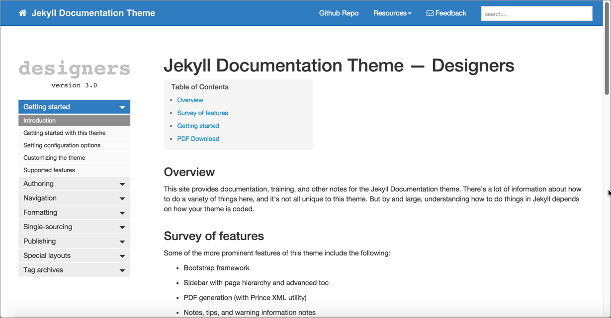
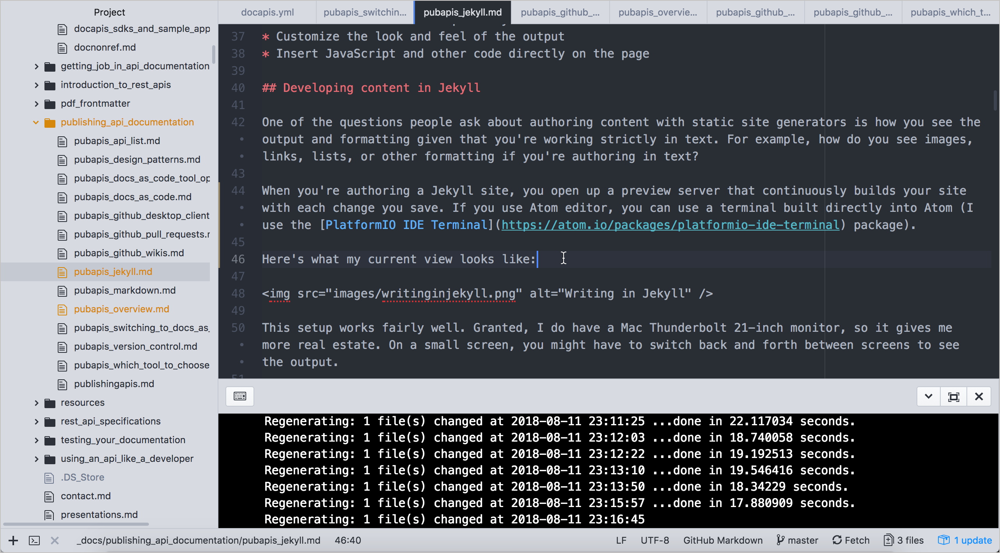

# Непрерывное развертывание Jekyll и CloudCannon

[Генераторы статических сайтов](https://github.com/Starkovden/Documenting_APIs/blob/master/7.%20Publishing%20your%20API%20documentation/7.10.%20Static%20site%20generators.md) - это разновидность компиляторов веб-сайтов, которые упаковывают группу файлов (обычно написанных на [Markdown](https://github.com/Starkovden/Documenting_APIs/blob/master/7.%20Publishing%20your%20API%20documentation/7.5.%20More%20about%20Markdown.md)) и превращают их в полностью развертываемый веб-сайт. Одним из наиболее популярных генераторов статических сайтов (глядя на количество загрузок, использования и сообщества) является [Jekyll](https://jekyllrb.com/). Автор курса выбрал его, т.к. имеет большой опыт, поэтому сосредоточимся здесь на Jekyll, особенно на том, как можно интегрировать Jekyll с CloudCannon для решения публикации с непрерывной доставкой.

[О Jekyll](#about)

[Разработка контента в Jekyll](#develop)

[Автоматизация сборок из GitHub](#build)

[Настройка темы документации на GitHub](#setup)

[Обновление репозитория GitHub](#update)

[Тема Jekyll Aviator](#aviator)

## О Jekyll

Jekyll - это [генератор статических сайтов]() на основе Ruby, то есть он использует Ruby в качестве основного языка программирования для компиляции сайта. Cайт с оригиналом курса и [блог автора](https://idratherbewriting.com/) используют Jekyll. [Здесь](https://developer.amazon.com/appstore/documentation) документация также использует Jekyll. С Jekyll можyj опубликовать полнофункциональный веб-сайт технической поддержки, который включает повторное использование контента, условную фильтрацию, переменные, вывод PDF и все то, что может понадобиться техническому писателю.

Вот [тема документации](https://idratherbewriting.com/documentation-theme-jekyll/), которую Том Джонсон разработал для Jekyll:

Здесь нет никакого специального форматирования конечной точки API, но платформа настолько гибкая, что можyj делать с ней все, что угодно, если знать HTML, CSS и JavaScript (основной язык Интернета). Благодаря генератору статического сайта у нас есть инструмент создания полноценного веб-сайта с использованием практически любого стиля или JavaScript-фреймворка. На веб-сайте Jekyll можно включить сложную навигацию, повторное использование контента, переменные и многое другое.

Генераторы статических сайтов дают большую гибкость. Такие сайты являются хорошим выбором, если нужен обширный контроль и гибкие настройки сайта. В них отсутствует привязка к жестким шаблонам и стилям. Свои собственные шаблоны и вещи можно определять и структурировать по желанию. Например, со статическими генераторами сайтов можно сделать следующее:

- писать в текстовом редакторе, работающем с Markdown;
- создавать кастомные шаблоны документации;
- использовать рабочий процесс репозитория контроля версий;
- настраивать внешний вид вывода документации;
- вставлять JavaScript и другой код прямо на странице.

## Разработка контента в Jekyll

Один из вопросов, которые люди задают при создании контента с помощью статических генераторов сайтов, - как выглядит вывод и форматирование, учитывая, что работа строго в тексте. Например, как выглядят изображения, ссылки, списки или другое форматирование при создании текста?

Вот как выглядит оригинал курса в Jekyll в редакторе Atom:

> отображение Atom во время работы в Jekyll

При создании сайта в Jekyll, сначала создается локальный предварительный просмотр с помощью этой команды:

        bundle exec jekyll serve

Ответ будет выглядеть примерно так:

        ~/projects/learnapidoc [master] $ bundle exec jekyll serve
        Configuration file: /Users/tomjoht/projects/learnapidoc/config.yml
                Source: /Users/tomjoht/projects/learnapidoc
            Destination: site
        Incremental build: disabled. Enable with --incremental
            Generating...
                           done in 6.457 seconds.
        Auto-regeneration: enabled for '/Users/tomjoht/projects/learnapidoc'
            Server address: http://127.0.0.1:4000/learnapidoc/
        Server running... press ctrl-c to stop.

> При использовании редактора Atom, можно использовать терминал, встроенный непосредственно в Atom (например пакет [Terminal Platform IDE](https://atom.io/packages/platformio-ide-terminal)).

После чего копируется адрес сервера предварительного просмотра (в данном случае http://127.0.0.1:4000/learnapidoc/) и вставляется в браузер. Этот сервер предварительного просмотра постоянно создает ваш сайт при каждом сохранении файла. Удобно использовать просмотр браузера рядом с редактором Atom, чтобы убедиться, что форматирование и изображения выглядят правильно:

> Сервер предпросмотра jekyll

Такая настройка очень удобна. Конечно, большой монитор дает больше недвижимости. На маленьком экране, возможно, придется переключаться между экранами назад и вперед, чтобы увидеть результат.

Следует признать, что формат Markdown прост в использовании, но подвержен ошибкам, особенно если есть сложное форматирование списка. Но в основном, писать в Markdown - это радость. Можно сосредоточиться на контенте, не зацикливаясь на тегах. Если нужны сложные теги, все, что можно написать в HTML или JavaScript, можно добавить на свою страницу.

## Автоматизация сборок из GitHub

Jekyll можно интегрировать в такие платформы, как GitHub Pages или CloudCannon, чтобы создавать публикации с непрерывном развертыванием. Непрерывное развертывание подразумевает автоматическое добавление коммитов репозитория сразу на сайт Jekyll.

[GitHub Pages]() бесплатен, используется автором курса для своего блога и  оригинала данного курса по документированию API. Но CloudCannon предоставляет больше возможностей, которые могут понадобиться организации. Итак, давайте последуем примеру публикации в [CloudCannon](https://cloudcannon.com/), которая описывает себя как «Облачная CMS для Jekyll».

На этом занятии мы создадим публикацию в CloudCanon, используя [тему документации для Jekyll](https://idratherbewriting.com/documentation-theme-jekyll/) (созданную автором курса). Не обязательно иметь компьютер с Windows, чтобы облегчить сборку и публикацию - сделать все через CloudCannon и Github. (Конечно, возможность сборки локально важна, при работе с Jekyll, но хотелось бы избежать здесь статей [по установке Jekyll](https://jekyllrb.com/docs/installation/) и просто продемонстрировать функции непрерывного развертывания, которые предоставляет такой хост, как CloudCannon.) Это руководство покажет, как подключиться к надежной платформе хостинга, которая читает контент, хранящийся и управляемый на GitHub.

## Настройка темы документации на GitHub

1. Переходим на страницу [Github темы документации для Jekyll](https://github.com/tomjoht/documentation-theme-jekyll) и нажимаем **Fork** в верхнем правом углу.

Когда мы нажимаем **Fork**, копия проекта (с тем же именем) добавляется в наш репозиторий Github. Проект становится доступным по адресу [https://github.com/{your github username}/documents-theme-jekyll]().

Иногда люди копируют репозитории, чтобы внести изменения, а затем предлагают Pull requests исходному репо. В других случаях люди копируют репозитории, чтобы создать исходную точку для ветки проекта оригинала. Github полностью посвящен совместному кодированию - конечная точка одного человека является отправной точкой другого человека, и несколько проектов могут быть объединены друг с другом. Узнать больше о копировании можно по [ссылке](https://help.github.com/en/articles/fork-a-repo).

2. Создаем учетную запись на [CloudCannon](https://cloudcannon.com/); войдем в систему, используя свои учетные данные GitHub.
3. После входа в систему нажимаем **Create Site**, и присваиваем новому сайту имя. Затем нажимаем **Enter**, чтобы создать сайт.
4. Выбираем ячейку **GitHub Repository**

> Синхронизация с GitHub

5. Выбираем репозиторий GitHub, который копировали, - document-theme-jekyll. Выберите ветку gh-pages.

## Обновление репозитория GitHub

## Тема Jekyll Aviator
