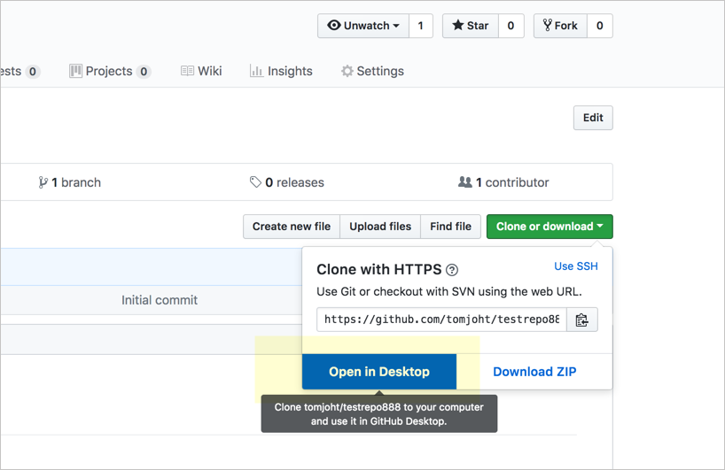
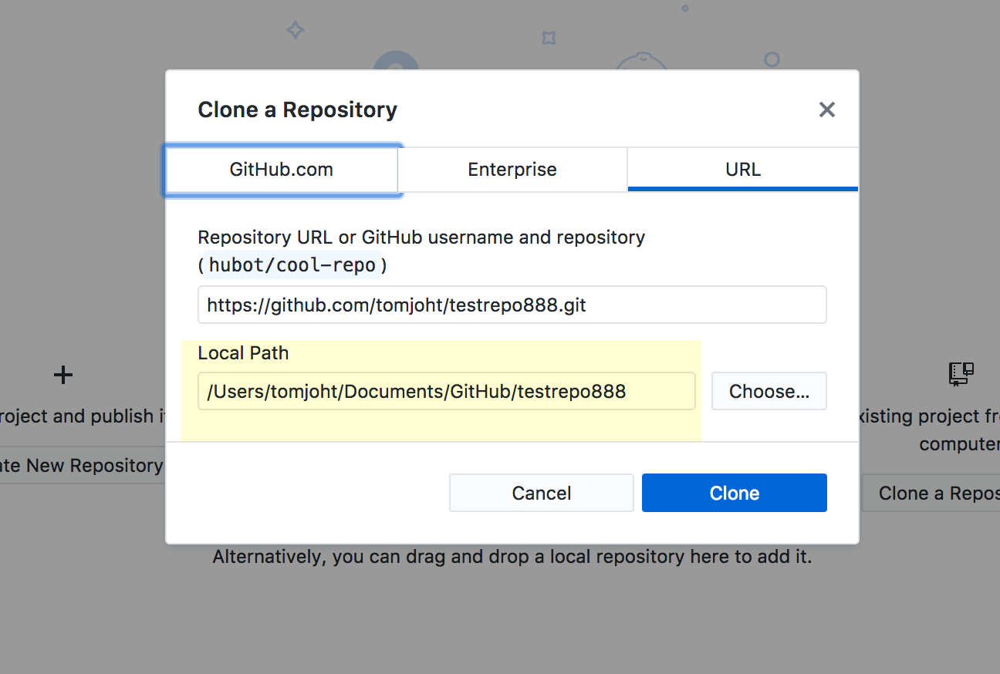
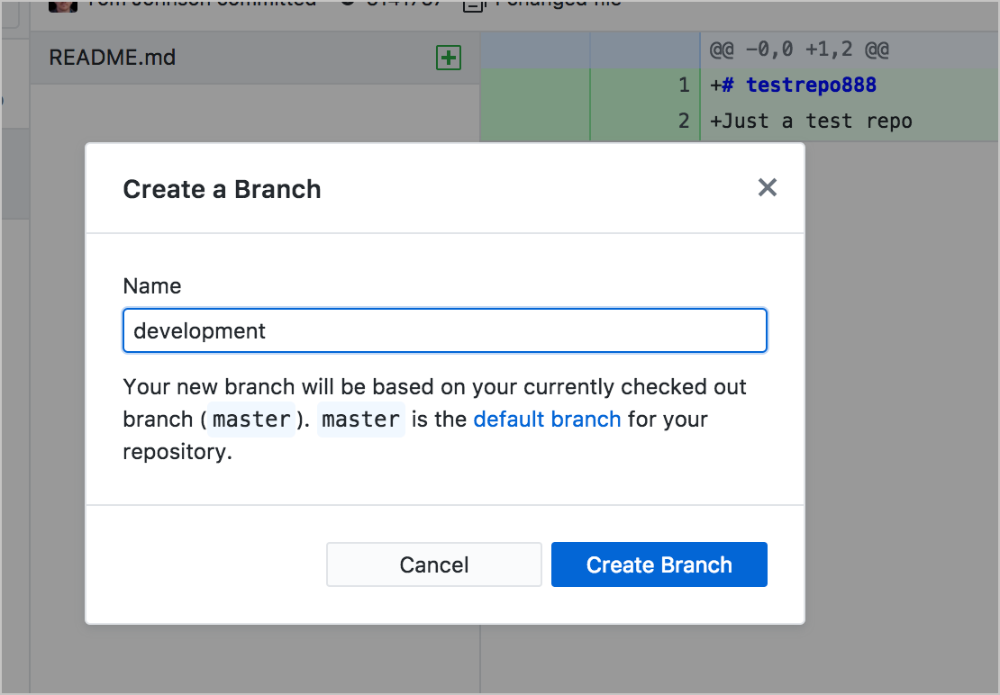
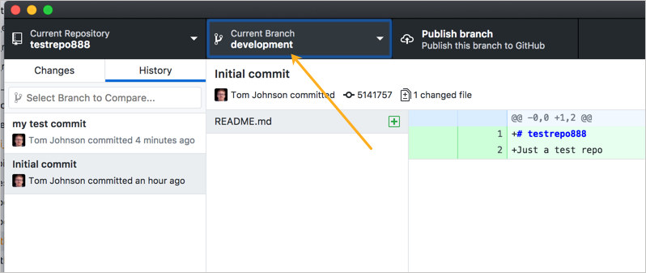
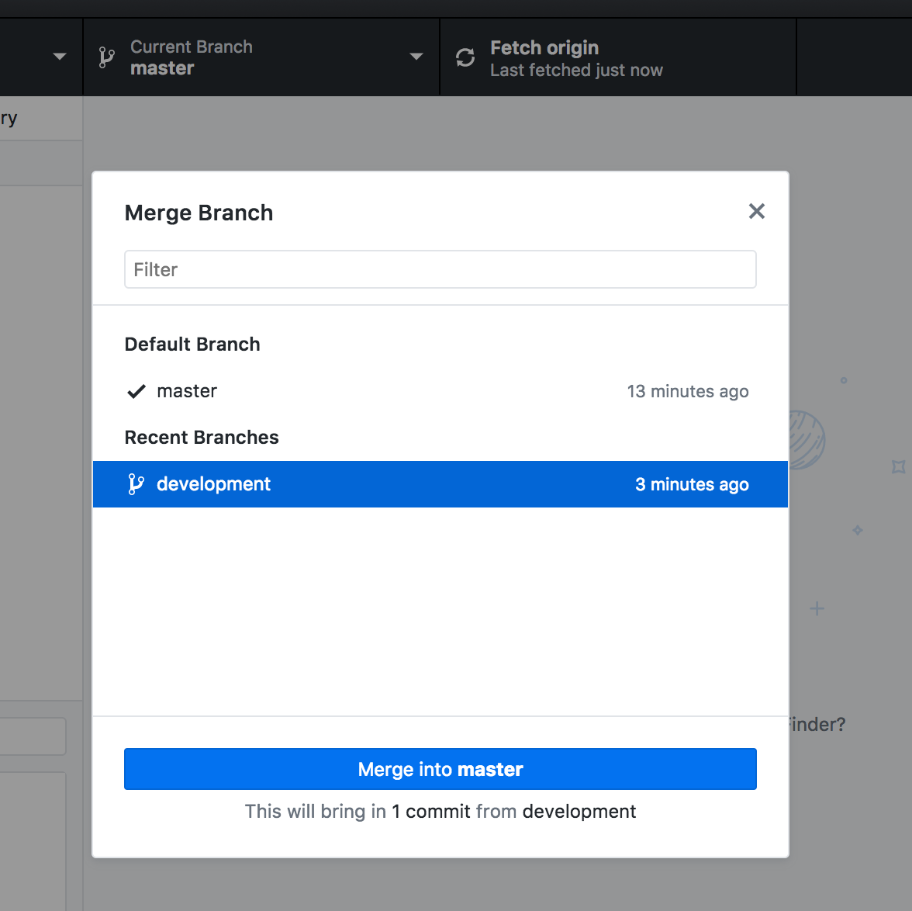

# 👨‍💻 Практическое занятие: Используем клиент GitHub для десктопа

Хотя большинство разработчиков используют командную строку при работе с системами контроля версий, существует много доступных клиентов с графическим интерфейсом, которые потенциально могут упростить процесс. Такие инструменты могут быть полезны, когда нужно увидеть, что изменилось в файле, поскольку графический интерфейс пользователя может быстро выделить и указать на происходящие изменения.

[Типичный процесс использования десктопного клиента](#workflow)

[Создание ветки](#create)

[Слияние ветки development с master](#merge)

[Слияние ветки через pull request](#merge-request)

[Управление конфликтами слияния](#manage)

[Заключение](#conclusion)

## Типичный процесс использования десктопного клиента

В этом разделе мы научимся использовать десктопный клиент GitHub для управления процессом Git.

> Вместо работы в Wiki GitHub (как делали в [предыдущем разделе по GitHub](https://github.com/Starkovden/Documenting_APIs/blob/master/7.%20Publishing%20your%20API%20documentation/7.7.%20Activity%20Manage%20content%20in%20a%20GitHub%20wiki.md#%D0%BF%D1%80%D0%B0%D0%BA%D1%82%D0%B8%D1%87%D0%B5%D1%81%D0%BA%D0%BE%D0%B5-%D0%B7%D0%B0%D0%BD%D1%8F%D1%82%D0%B8%D0%B5-%D1%83%D0%BF%D1%80%D0%B0%D0%B2%D0%BB%D1%8F%D0%B5%D0%BC-%D0%BA%D0%BE%D0%BD%D1%82%D0%B5%D0%BD%D1%82%D0%BE%D0%BC-%D0%B2-wiki-github)), будем работать в обычном Git-репозитории. В Wiki GitHub есть некоторые ограничения, когда дело касается отправки запросов.

Для настройки репозитория Git используя клиента GitHub Desktop:

1. Скачаем и установим [GitHub Desctop](https://desktop.github.com/). Запускам приложение и авторизуемся. (По идее у нас уже есть аккаунт на GitHub, но есть нет, то создаем его).
2. Заходим на страницу [github.com](https://github.com/) и ищем наш репозиторий, созданный в предыдущем разделе. Открываем именно репозиторий, а не страницу Wiki. (Если не практические занятия из прошлого раздела не сделаны, то создаем новый репозиторий).
3. Нажимаем кнопку `Clone or download` и выбираем `Open on desktop`

> Кнопка Onen in Desktop

4. Открываем приложение GitHub Desktop и переходим в `File > Clone Repository`.
5. В диалоговом окне выбираем **Open GitHub Desktop.app**. GitHub Desktop должен запуститься с диалоговым окном «Клонировать репозиторий», содержащим запрос, где клонировать репозиторий. При желании локальный путь можно изменить.
6. Переходим на вкладку **URL** и вставляем URL-адрес клона. В поле **Local Path** выбираем, куда клонировать репозиторий. Например:

> выбор адреса клонирования репозитория

7. Нажимаем `Clone`
8. Переходим в клонированный репозиторий и, либо добавляем простой текстовый файл с некоторым содержимым, либо вносим изменения в существующий файл.
9. Возвращаемся в GitHub Desktop. Видим, что новый файл добавлен список незафиксированных изменений в левой колонке.

> Незафиксированные изменения

В списке измененных файлов зеленый знак `+` означает добавление нового файла. Желтый круг означает изменения существующего файла.

10. В левом нижнем углу клиента GitHub Desktop (где написано Summary и Description) вводим описание коммита и кликаем **Commit to master**.

Когда мы фиксируем изменения, на левой панели исчезает список незафиксированных изменений. Однако изменения мы зафиксировали только локально. Коммит еще нужно отправить в удаленный (origin) репозиторий. («Origin» - это псевдоним, который относится к удаленному хранилищу.)

11. Наверху кликаем Push origin

Если посмотреть репозиторий в сети, то увидим, что внесенные изменения были перенесены в основную ветку в источнике. Можно перейти на вкладку **History** в клиенте GitHub Desktop (вместо вкладки **Changes**) или перейти в меню **View > Show History**, чтобы просмотреть ранее внесенные изменения.

> Многие предпочитают использовать терминал вместо графического интерфейса GitHub для рабочего стола, графический интерфейс упрощает визуальное восприятие изменений, внесенных в репозиторий. При желании можно комбинировать использование командной строки и клиента рабочего стола.

## Создание ветки

Теперь создадим ветку, внесем изменения и посмотрим как влияют изменения на ветку.

1. В GitHub Desktop переходим в **Branch > New Branch** и создаем новую ветвь. Назовем ее «development» и нажмем **Create Branch**.

> Создание новой ветки

После создания ветки, в центре раскрывающееся меню будет указывать на ту ветку, в которой мы работаем. Создание ветки копирует существующий контент (из ветки master) в новую ветку (development).

> работа с ветками

2. Откроем файл, которые ранее создали и внесем в него изменения, например добавим новую строку с текстом. Сохраним изменения.
3. Вернемся в GitHub Desktop и обратим внимание, что на вкладке «Changes» у нас появились новые измененные файлы.

Изменения в файле показывают удаленные строки красным и новые строки зеленым цветом. Цвета помогают увидеть, что изменилось.

4. Закоммитим изменения в левом нижнем углу и кликнем на **Commit to development**.

5. Нажимаем **Publish branch** (в верхней части окна GitHub Desktop), чтобы сделать локальную ветку также доступной в Origin (GitHub). (Всегда существует две версии ветки: локальная версия и удаленная версия.)

6. Вернемся в основную ветку (выбираем master в раскрывающемся меню). Затем посмотрим на свой файл (в текстовом редакторе). Стоит обратить внимание, что изменения, внесенные нами во время редактирования в ветке `development`, не отображаются в основной ветке.

Обычно новую ветку создают, когда вносят значительные изменения в контент. Например, нужно обновить раздел («Раздел X») в своих документах. Возможно, опубликовать другие обновления не нужно, прежде чем публиковать подробные изменения в Разделе X. Если работа была в той же ветке, было бы сложно выборочно загружать обновления для нескольких файлов за пределами Раздела X без отправки обновлений, которые сделали к файлам в разделе Х.

Посредством ветвления можно ограничить свои изменения конкретной версией, которая не запускается, пока не будут готовы изменения к объединению с master веткой.

## Слияние (merge) ветки development с master

Теперь научимся объединять наши ветки.

1. В GitHub Desktop переключитесь на ветку, в которую вы хотите объединить ветку development. В селекторе веток выберите ветку master.

2. Переходим **Branch > Merge into Current Branch**
3. В окне слияния выбираем ветку development и кликаем **Merge development into master**

> Merge в ветку master

После слияния веток изменения будут отображаться и в файле в ветке master.

4. Нажимаем **Push origin** для отправки изменений в удаленный репозиторий.

После этого наши изменения будут отображены в репозитории на GitHub.

## Слияние ветки через pull request

Теперь объединим ветку development с master, используя процесс pull request. Мы притворимся, что клонировали репозиторий разработчика, и хотим, чтобы разработчик влил наше изменение в ветку development. (Другими словами, у нас может нет прав на слияние веток в мастер.) Для этого мы создадим запрос на извлечение (pull request).

1. Как выше, переключаемся на ветку development, вносим изменения в содержимое файла, сохраняем и подтверждаем изменения. После внесения изменений нажимаем **Push origin**, чтобы отправить наши изменения в удаленную версию ветки разработки на GitHub.
2. В GitHub Desktop, с выбранной веткой development, переходим в **Branch > Create Pull Request**.

На сайте GiHub pull request выглядит так:

> Pull Request

## Управление конфликтами слияния

## Заключение
