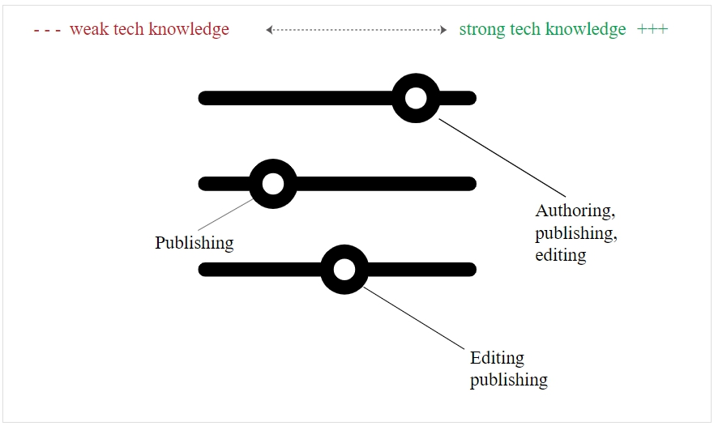
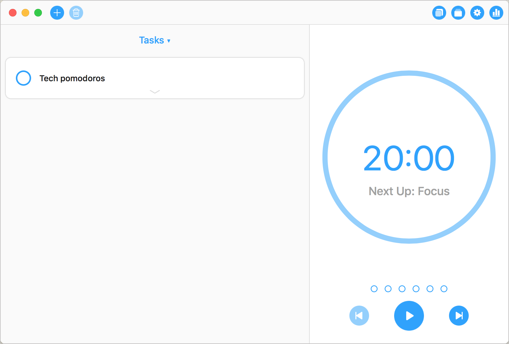

# Сколько кода нужно знать?

Роль разработчика документации подразумевает некоторый уровень знания кода. Но знать столько же, сколько разработчикам, не нужно. Приобретение таких глубоких технических знаний обычно будет стоить вам опыта в других областях.

[Идеальное сочетание: программист + писатель](#hybrid)

[Писатели, изучающие программирование](#writersLearn)

[Программисты, которые учатся писать](#progerLearn)

[Поверхностное понимание программирования](#understanding)

[Стратегии глубокого понимания технических ситуаций](#strategies)

[Техники изучения кода](#techniques)

[Быть универсалом - разочарование в карьере?](#disappointment)

<a name="hybrid"></a>
## Идеальное сочетание: программист + писатель

Столкнувшись с мультиязычными проблемами в документации, менеджеры по найму часто ищут технических писателей, которые раньше были программистами для выполнения таких задач. Есть много технических писателей, которые когда-то были программистами, и они вызывают больше уважения и более конкурентно способны в заданиях по разработке документации для разработчиков.

Но даже разработчики не могу знать больше нескольких языков. Поиск технического писателя, который владеет высоким уровнем владения английским языком в дополнение к обладанию глубокими техническими знаниями Java, Python, C ++, .NET, Ruby, в дополнение к знаниям [инструментов документации](../Publishing-doc/Doc-as-code-tools.md), чтобы облегчить процесс создания / публикации от начала до конца, подобен поиску единорога. (Другими словами, таких технических писателей на самом деле не существует)

Если найдется такой технический писатель, этот человек, вероятно, зарабатывает небольшое состояние на контрактных ставках и имеет почти безграничный выбор рабочих мест. Компании часто считают необходимым знание нескольких языков программирования, но понимают, что никогда не найдут кандидата, который был бы одновременно Уильямом Шекспиром и Стивом Возняком.

Почему такой гибрид не существует? Частично потому, что чем больше человек входит в мировоззрение компьютерного программирования, тем больше он начинает думать в терминах и процессах компьютера. Компьютеры по определению не являются людьми. Чем больше вы разрабатываете код, тем больше ваш мозг начинает думать и выражать себя с помощью этих нечеловеческих, управляемых компьютером механизмов. В конечном счете, вы все меньше и меньше общаетесь с людьми, используя естественную речь, и больше погружаетесь в нечеловеческий механический жаргон. (Об этой концепции более подробно в посте [Уменьшение сложности технического языка](https://idratherbewriting.com/simplifying-complexity/reducing-the-complexity-of-technical-language.html).

Такое умственное преобразование является и хорошим и плохим - хорошим, потому что другие инженеры в том же компьютерном мышлении могут лучше вас понять, но плохим, потому что любой, кто не придерживается этой точки зрения и терминологии, уже будет несколько потерян.

<a name="writersLearn"></a>
## Писатели, изучающие программирование

При поиске кандидатов лучше отдать предпочтение писателю, который изучал программирование, или программисту, который учился писать? У каждого подхода есть свои плюсы и минусы. Давайте сначала рассмотрим писателей, которые изучают программирование, а затем в следующей части рассмотрим обратное: программисты, которые научились писать.


В книге «[Достаточно быть опасным: радость плохого Python](http://hackwrite.com/posts/enough-to-be-dangerous/)» Адам Вуд утверждает, что технические писатели не должны быть опытными программистами, наравне с разработчиками. Научиться плохо кодировать (как это обычно бывает у писателей, которые учатся кодировать) часто достаточно для выполнения задач, необходимых для документирования. Таким образом, Вуд прибивается к лагерю писателей, изучавших программирование. Вуд пишет:

> Вы уже знаете, как трудно перейти с нуля (или даже 1) к действительно квалифицированному разработчику. И вы встретили слишком много неопытных разработчиков, чтобы интересоваться этим путем.
> Итак, как вы начали?
> Решив, что вы никогда не будете писать код приложения. Вы не собираетесь быть разработчиком. Вы даже не станете «кодером».
> Вы собираетесь стать техническим писателем с плохими навыками кодирования.

Вуд говорит, что технические писатели, которые учатся программировать, часто недооценивают степень сложности изучения кода. Чтобы достичь мастерства разработчика с готовым к использованию кодом, техническим писателям потребуется потратить гораздо больше времени, чем они могут. Как таковые, технические писатели не должны стремиться к тому же уровню, что и разработчик. Вместо этого они должны довольствоваться минимальными способностями к кодированию или «достаточно, чтобы быть опасным».

Джеймс Рея, отвечая на пост [Общий специалист против специалиста](https://idratherbewriting.com/2016/12/20/changing-roles-of-technical-writers/), также говорит, что "адекватных" технических знаний обычно достаточно для выполнения работы, а приобретение более глубоких технических знаний дает убывающую отдачу, поскольку это означает, что другие аспекты документации, вероятно, будут игнорироваться. Рея пишет:

> Я бы не стремился к глубоким техническим знаниям. Я бы стремился к адекватным техническим знаниям, признавая, что то, что составляет адекватность, может варьироваться в зависимости от проекта, и что технические знания должны расти со временем из-за погружения в документацию и ознакомления с технологией и отраслью.
> Я полагаю, что необходимость в глубоких технических знаниях для писателей уменьшается с ростом размера команд и тем, что другие навыки становятся более важными, чем для небольших команд. Я не утверждаю, что глубокие технические знания бесполезны. Я полагаю, что пренебрежение глубокими техническими знаниями (чтобы его негативно сформулировать) имеет менее серьезные последствия, чем пренебрежение содержанием, набором документов или соображениями рабочего процесса. [Adding Value as a Technical Writer](https://withintheordinary.wordpress.com/2016/12/21/adding-value-as-a-technical-writer/)

Другими словами, если тратить слишком много времени на изучение кода, за счет ухода от других задач документирования, таких как формирование информационной архитектуры, анализ пользовательских метрик, наблюдение за рабочими процессами перевода, разработка пользовательских персон, обеспечение четкой навигации и многое другое, технический контент документации может улучшиться, но общий сайт документации будет ухудшаться.

Кроме того, в то время как инженеры могут заполнить необходимые глубокие технические знания, никто не будет предоставлять задачи технического общения вместо технического писателя. В качестве доказательства посмотрите на любую корпоративную вики. Корпоративные вики являются яркими примерами того, что происходит, когда инженеры (или другие нетехнологические писатели) пишут и публикуют документацию. Некоторые страницы могут быть богаты техническими подробностями, но степень ROT (redundant, outdated, trivial content (*избыточный, устаревший, тривиальный контент*)) усложняется, навигация страдает, ясность становится запутанной, и почти никто не может ничего найти.

<a name="progerLearn"></a>
## Программисты, которые учатся писать

Теперь взглянем с другой стороны. Каковы преимущества найма программистов, которые научились писать? В отличие от Вуда и Реи, [Джеймс Нейман](https://www.drjamesneiman.com/), опытный технический писатель API, говорит, что технические писатели нуждаются в инженерных знаниях, таких как степень по информатике или предыдущий опыт работы инженером, чтобы преуспеть в роли API-документации.

Нейман говорит, что техническим писателям часто приходится заглядывать через плечо разработчика, смотреть код или слушать краткое 15-минутное объяснение инженера, а затем возвращаться к своему рабочему столу для создания документации. Возможно, придется брать примеры кода на Java и создавать эквивалентные примеры на другом языке, например C ++, все самостоятельно. По мнению Неймана, технические писатели API нуждаются в значительных технических знаниях, чтобы преуспеть в своей роли.

Нейман и [Эндрю Дэвис](http://www.synergistech.com/contact_us.html) (рекрутер для технических писателей API в Бэй Ареа) недавно выступили с докладом [«Поиск подходящего технического писателя API»](https://www.youtube.com/watch?v=lmNHBg20ql0&feature=youtu.be&t=1314) на конференции API в Лондоне. Их формат презентации включает в себя вопросы и ответы между ними. Можно смотреть с 22-ой минуты.

Вот расшифровка двух вопросов в их интервью (немного исправлена ​​для удобства чтения):

```
Эндрю: Что важно для ваших отношений с каждым новым клиентом?

Джеймс: Будучи частью команды разработчиков продукта, главное - это общение внутри команды. Коммуникация важна, чтобы не отставать от того, что меняется (и я ожидаю, что все изменится очень быстро, особенно в неупорядоченной среде, где люди пытаются поддержать продукт). Мне также нужно зарабатывать и сохранять доверие.

Почему я должен это говорить? Если я собираюсь сидеть с командой инженеров, мне нужно, чтобы они позволили мне войти в их исходный код, чтобы я мог изменить их комментарии к исходному коду. Мне нужно будет иметь возможность выбирать мозги инженера только в течение пятнадцати и пятнадцати минут - и получать значимую информацию из этого интервью, чтобы я мог пойти и подготовить необходимую документацию и сделать ее правильно с первого раза. Если я не понял правильно с первого раза, я потратил впустую время инженера, и я потратил впустую деньги компании.

Эндрю: Может ли технический специалист без опыта разработки написать отличную документацию по API?

Джеймс: Точно нет. У занятой команды инженеров нет возможности обучить человека без степени информатики. Это просто реальность. Инженеры в лучшем случае могут говорить с вами на некоторой версии английского языка, которая может быть или не быть их родным языком. У них не так много времени, и они ожидают, что вы закончите свои мысли за них. Это означает, что вы должны быть в состоянии сидеть рядом с ними и смотреть на то, как они кодируют, а затем уметь копировать это, расширять его и даже создавать примеры.

Они могут сказать: «Вот пример. Вы можете расширить его, добавить эти другие API, разработать этот вариант использования для нас. У нас не было времени закончить это». Они могут сказать:« Хорошо, позвольте мне показать вам, как это работает в Задаче C; мы также поддерживаем это на Java. Можете ли вы создать что-то похожее на Java? »

Если у вас нет такого опыта разработки, нереально ожидать, что вы, например, сможете обучить кого-то со степенью магистра по английскому языку (и который является очень умным человеком, но в остальном не техническим), чтобы делать такие вещи.
```
Имейте в виду, что Дэвис и Нейман пытаются убедить все больше европейских стран использовать Synergistech в качестве их агентства по подбору персонала для поиска и найма писателей, пишущих о технологиях API, поэтому они предъявляют потребность в тех, кто разбирается в технических разработках. Этих супер-технически подкованных писателей найти сложнее - отсюда и потребность в опытных рекрутерах. Независимо от повестки дня, Нейман и Дэвис доказывают более высокий уровень кодирования, чем Вуд или Рея.

Уровень знаний в области программирования, несомненно, зависит от положения, среды и ожиданий в вашей компании. Возможно, если у технического специалиста нет больших инженерных знаний, инженеры просто отправят [фрагменты кода](../conceptual-topics/code-samples.md) технического писателя для вставки в документы. Но без технической проницательности для полного понимания, тестирования и интеграции кода значимым образом, технический писатель будет во власти инженеров и их кратких объяснений или загадочных встроенных комментариев. Роль технического писателя будет сводиться к тому, чтобы быть редактором / издателем, а не писателем.

По опыту Тома Джонсона, объяснение Неймана того, что разработчики инструктируют технических писателей создавать похожий код на других языках (на основе 15-минутного разговора за столом инженера), заходит слишком далеко. Хотя Том и  создавал простые примеры кода JavaScript (на основе шаблона, который мне показали инженеры), его никогда не просили создавать примеры кода для других языков. Он мог бы автоматически генерировать фрагменты кода для запросов веб-API (используя Postman), но разработка кода для нескольких языков, как правило, является большей обязанностью программиста, а не технического писателя.

Далее Нейман говорит, что в одной компании он протестировал код от инженеров и обнаружил, что большая часть его опиралась на программы, утилиты или другие конфигурации, уже настроенные на компьютерах разработчиков. Таким образом, инженеры не знали начальные настройки, которые потребуются пользователям для правильной работы кода. Нейман говорит, что это одна из опасностей простого копирования и вставки кода от инженеров в документацию. Такой код может работать на компьютере разработчика, но не сработает у пользователей.

Этот комментарий  звучит более правдоподобно. Как и было сказано в модуле [Тестирование документации по API](../testing-api-doc/README.md), мы должны иметь возможность тестировать конечные точки, примеры кода и SDK, чтобы писать и оценивать документацию. Обычно правда, что программисты (которые настраивали свои машины несколько месяцев назад) давно забыли или даже не могут идентифицировать все платформы, конфигурации и другие утилиты, которые они установили, чтобы заставить что-то работать. Чем более технично подкован технический писатель, тем более мощную роль он может играть в формировании информации.

Нейман - бывший инженер и говорит, что за свою карьеру он, работал с 20-25 различными языками программирования. По его словам, способность быстро выучить новый язык и освоить его - это ключевая характеристика его успеха в технической консультации.

Но компании делают ошибку, полагая, что программисты, ставшие техническими писателями, могут легко справиться с задачами написания, потому что, [каждый может писать](https://idratherbewriting.com/2018/08/09/writing-no-longer-a-skill/), верно? Тем не менее, без опыта написания, программисты, которые сейчас пишут, могут иметь мало опыта в тех областях, где это действительно имеет значение.

Например, недавно автор курса работал с командой инженеров над новой функцией голосовой связи для их продукта. Инженерная команда частично базировалась в Индии и других местах, и они часто встречались (в рабочее время Индии), чтобы сформировать документ о новой голосовой функции. Эта документация и функция постоянно менялись, поэтому команда продолжала перебирать контент в течение примерно двух недель после встреч с заинтересованными сторонами, архитекторами решений и другими рецензентами. После каждого обзора команда отправляла документ для редактирования и публиковала его для отзывов заинтересованных сторон.

Том Джонсон не был непосредственно связан с командой, и при этом он не был выделенным ресурсом для команды. Он просто выступил в роли редактора и издателя. Но нужно было развернуть бред, который они написали с большой скоростью, обычно за 1-2 часа. Поскольку этот проект был одним из многих, которыми он занимался, приходилось быстро реструктурировать и переписывать контент (иногда касаясь каждого предложения), чтобы он читался так, как его написал носитель языка, а не инженеры в другой стране. В это же время он работал над переписыванием веб-сайта своей команды и другими проектами.

Был коллега по техническим вопросам, бывший инженер, и часто Том задавался вопросом, обладает ли он теми же навыками письма, чтобы редактировать этот контент с той же скоростью и эффективностью, что и автор курса, который неплохо умеет писать и редактировать. В конце концов, посмотрите на его блог. Всего за пару часов вечером он может написать пост, который стоит прочитать утром. Могут ли это сделать инженеры, которым не хватает письменных знаний? Если технические писатели все чаще играют роли публикации / редактирования, а не разрабатывают контент напрямую (потому что контент настолько высокотехнологичен, что его могут создавать только специалисты), то не должны ли компании отдавать предпочтение опыту написания документации над техническими способностями (в некоторой степени)?

Кроме того, компании, которые полагают, что «каждый может писать» не различают разные уровни написания. Одно дело писать согласованные предложения в абзаце или даже в одной теме, но может ли писатель прочитать более 20 страниц в системе документации и обеспечить согласованность по всем темам? Может ли писатель связывать воедино рабочие процессы и "прогулки" по крупным системам? Может ли писатель перевести информацию из долгого и сложного процесса в понятное краткое справочное руководство? Навыки создания документации лежат в основе спектра, и хотя большинство специалистов появляются где-то в спектре, их умений может быть недостаточно, чтобы преуспеть в способах, которые обеспечивают более глубокую ценность для документации.

В целом, технические писатели всех мастей все чаще играют универсальные роли, и в этих универсальных ролях сильные навыки написания документации, а не специальные знания, могут быть более важными. Безусловно, сочетание двух навыков - письменной и технической экспертизы - является нокаутирующим ударом на рынке труда.

<a name="understanding"></a>
## Поверхностное понимание программирования

Давайте постараемся найти лучшего кандидата на работу, найдя некоторую золотую середину между двумя крайностями. Очевидно, что технические писатели должны понимать код, но им, вероятно, не нужно быть инженерами в той степени, в которой утверждает Нейман (писать свой собственный код на других языках).

Хотя могут быть клиентские реализации на различных языках программирования в компании, реализации будут краткими. Скорее всего, необходимая документация будет касаться REST API, и будет множество справочных реализаций или демонстрационных приложений на других языках.

Не обязательно обладать глубокими техническими знаниями о каждой из платформ для предоставления документации. Знание языков программирования должно быть более широким, а не глубоким. Вероятно, будет полезно иметь представление о фундаментальных концепциях программирования и знакомстве с несколькими языками, а не о глубоких технических знаниях только одного языка.

Наличие широких технических знаний о нескольких языках программирования нелегко осуществить. Погрузившись в изучение нескольких языков, можно начать путаться в понятиях.

И если не погружаться в язык на регулярной основе, никакого движения вперед и вверх не будет. Это будет Сизифов труд, катим валун вверх по холму (изучая язык программирования), только чтобы откатить валун назад вниз (забыв, что узнали) в следующем месяце.

Полное погружение - единственный способ свободно владеть языком, будь то ссылки на языки программирования или разговорные языки. Как таковые, технические писатели находятся в невыгодном положении, когда дело доходит до изучения программирования. Чтобы полностью погрузиться в игру, можно сосредоточиться на одном базовом языке программирования (например, Java) и лишь ненадолго поизучать другие языки (таких как Python, C ++, .NET, Ruby, Objective C и JavaScript).

Конечно, на это уйдет много времени. Не стоит ожидать, что будет много времени на самом деле для изучения языка программирования. Лучше всего, если получится сделать обучение программированию одним из «хобби».

<a name="strategies"></a>
## Стратегии глубокого понимания технических ситуаций

Предположим, мы глубоко погрузились в API, которые требуют знания намного больше технических деталей, чем у нас есть в настоящее время (несмотря на то, что программы обучения изучают больше)? Как можно обойтись без глубоких знаний программирования?

Нужно иметь в виду, что уровень участия в редактировании, публикации и разработке зависит от уровня технических знаний писателя. Если писатель хорошо разбирается в технологиях, то может создавать, редактировать и публиковать их. Если у него слабые технические знания, его роль может включать только публикацию. Следующая диаграмма спектра иллюстрирует этот диапазон участия:



> Степень, в которой тех. писатель может публиковать, редактировать и писать, зависит от уровня его технических знаний.

Если застрял в области публикации / редактирования, можно побеседовать с инженерами о том, что происходит в коде (записать эти обсуждения), а затем постараться описать действия как можно более четко. Всегда можно вернуться к идее, что для тех пользователей, которым нужен Python, код Python должен выглядеть знакомым. Хорошо написанный код должен быть в некотором смысле информативным в том, что он делает. Если в подходе нет чего-то странного или нестандартного, инженеры, свободно владеющие кодом, должны иметь представление о том, как работает код.

В документации необходимо сосредоточиться на информации более высокого уровня, на вопросе "почему?", лежащем в основе подхода, выделении любых нестандартных методов и общих стратегиях, лежащих в основе кода. Эту информацию можно получить у разработчиков в информационных интервью. Детали того, "что?" будет очевидно в коде или могут быть сведены к минимуму. (См. [Описание и образцы кода](../conceptual-topics/code-samples.md) )

После решения, сколько деталей включить, стоит помнить, что, хотя аудитория состоит из разработчиков, это не значит, что они все эксперты на каждом языке. Например, разработчик может быть программистом на Java, который знает достаточно iOS, чтобы реализовать что-то на iOS, но для более детального знания разработчик может зависеть от примеров кода в документации. И наоборот, разработчик, имеющий реальный опыт работы с iOS, может использовать его в мире Java и полагаться на свою документацию для реализации базовой реализации.

Подробная информация в документации всегда приветствуется, но можно использовать [подход с постепенным раскрытием информации](https://idratherbewriting.com/2012/08/09/applying-progressive-information-disclosure-to-online-help-navigation/), чтобы опытные пользователи не увязли в деталях для новичков. Расширяемые разделы, дополнительные страницы или другие способы группировки более базовой детализации (если есть возможность ее предоставить) могут быть хорошим подходом.

Есть причина, по которой работа по разработке документации для разработчиков оплачивается лучше - работа включает в себя гораздо больше трудностей и проблем, в дополнение к техническому опыту. В то же время, именно эти проблемы делают работу более интересной и полезной.

<a name="techniques"></a>
## Техники изучения кода

Разнообразие и сложность языков программирования - проблема, которую не так то легко решить. Чтобы стать успешным техническим писателем API, необходимо включить регулярный технический курс обучения. Всегда нужно учиться выживать в этой области.

К счастью, есть много полезных ресурсов (например - [Safari Books Online от O'Reilly](https://www.oreilly.com/) ). Если получится поработать пару часов в день, прогресс будет приятным сюрпризом.

Сложность изучения программирования, вероятно, является самым напряженным аспектом документации API. Какой объем программирования нужно знать? Сколько времени потратить на изучение кода? Какой приоритет должен быть при обучении технологиям?

Например, посвящаете ли вы два часа в день изучению кода на конкретном языке продукта, который вы документируете? Должны ли вы вырезать это время вне времени вашего работодателя, или ваше собственное, или оба? Как вы выполняете другую работу по документации, учитывая, что встречи и прочие задачи обычно съедают еще 2 часа рабочего времени? Какие стратегии вы должны реализовать, чтобы изучать код таким образом, чтобы не забывать его? Что если то, что вы изучаете, мало связано или не имеет отношение к коду, который вы документируете?

В посте под названием [Strategies for learning technology – podcast recommendation and a poll](https://idratherbewriting.com/2018/08/10/how-much-time-devoted-to-learning-tech-is-needed/), есть ссылка на 10-минутный подкаст Tech Comm с [Amruta Ranade по изучению новых технологий](https://www.stitcher.com/podcast/uah-technical-writing/10minute-tech-comm/e/supersized-holiday-spectacular-41636141), и опрос читателей, чтобы немного узнать об их технических привычках. В [ответах читателей](https://www.questionpro.com/t/PEGKEZcj57) большинство указало, что они должны тратить 30-60 минут на изучение технологии каждый день, но большинство тратят на это от 0 до 20 минут. Чтобы узнать, они используют общий поиск Google. В основном они посвящают это время обучению технологиям на работе, хотя некоторые делят время между работой на дому.

Возможно, 20 минут в день недостаточно для удовлетворения потребностей в знаниях. Шестьдесят минут более уместны, но на самом деле, если хочется добиться прогресса, нужно посвящать примерно вдвое больше времени. Найти 1-2 часов времени (и мотивации) на работе, для изучения нового материала - это маловероятно. Технология обучения часто кажется побочным занятием, которое отвлекает от реальных обязанностей.

Кроме того, информация, которую нужно документировать в настоящий момент, может быть слишком сложна, чтобы просто учиться на ней, просматривая учебники по Safari Books или другим источникам. Но просто начать потреблять продвинутый материал не получится. Сначала надо пройти по основополагающим темам, а такое медленное развитие ощущается как касательное к реальной работе, которая должна быть выполнена.

Например, может понадобиться документировать эквивалент концепций Advanced Calculus. Но чтобы использовать Advanced Calculus, нужно построить фундамент с помощью тригонометрии и алгебры. Проводя время за изучением тригонометрии и алгебры вместо концепций Advanced Calculus, которые необходимо документировать, может сложиться впечатление, что нет никакого прогресса в документации.

Одна из стратегий, состоит в том, чтобы разделить обучение на «pomodoros» (техника, названная в честь кухонных таймеров). Используя технику Pomodoro, устанавливается таймер на 20 минут и концентрируемся на своей задаче обучения в течение этого отрезка времени. Можно поставить цель совершить столько «pomodoros» в день, сколько нужно. Примерно через 1-2 месяца регулярных «pomodoros» прогресс будет очевиден. Пример приложения Focus для таймера «pomodoros»:



Вдобавок, стоит вести список заметок о технических деталях, с которыми приходится сталкиваться, во время документирования, а затем во время «pomodoros» сосредоточиться на том, что указано в ваших технических заметках.


Тем не менее, техника pomodoro не решает проблему. Все еще трудно выделить время для «pomodoros». Всякий раз, «pomodoros» вытесняют другие действия.


Есть много вопросов о том, как выучить код, но нет всех ответов. Но вот что известно:

- документация для разработчиков требует знание кода, хотя количество необходимых знаний спорно;
- нужно понимать объяснения инженеров, в том числе [используемые термины](../conceptual-topics/api-glossary.md). Объяснения в вашей документации должны быть сосредоточены на вопросе "почему?", а не "как?";
- нужно быть в состоянии [протестировать код](../testing-api-doc/overview-testing.md), чтобы определить предположения, на которые инженеры часто не обращают внимания;
- чтобы процветать в карьере документации API, нужно непрерывное обучение;
- выполнение нескольких «pomodoros» в день в течение недель и месяцев может привести к значительному прогрессу вашего технического знания.

<a name="disappointment"></a>
## Быть универсалом - разочарование в карьере?

Технические писатели, скорее всего, будут универсалами с кодом, не умеющим его самостоятельно разрабатывать, но знающим достаточно, чтобы справиться с этим, часто получая примеры кода от инженеров и объясняя основные функции кода на высоком уровне.

Кто-то может расценить плохую способность технического писателя писать код и поверхностные технические знания разочаровывающими. В конце концов, если есть желание преуспеть в карьере, обычно это означает, изучение чего-то основательно, верно? Нужно хотеть быть экспертом в своей области.

Осознание того, что ваши знания в области кодирования, как правило, будут меньше, чем у разработчиков, может показаться удручающим. Такое несоответствие позиционирует технических писателей как граждан второго сорта в компании. Это как степени магистра, когда вокруг все с докторской степенью.

Тем не менее, утешение в том, что задача технического писателя не писать код, а создавать полезную документацию. Создание полезной документации - это не просто знание кода. Есть сотня деталей, которые влияют на создание хорошей документации. Пока есть цель создавать отличную документацию, а не учиться писать код, не будет чувства разочарования, будучи плохим программистом. Такая перспектива не решает все проблемы, но обеспечивает утешение.


Для получения дополнительной информации о работе с кодом:

- [SDK и пример приложений](../conceptual-topics/sdks-sample-apps.md)
- [Описание и образцы кода](../conceptual-topics/code-samples.md)
