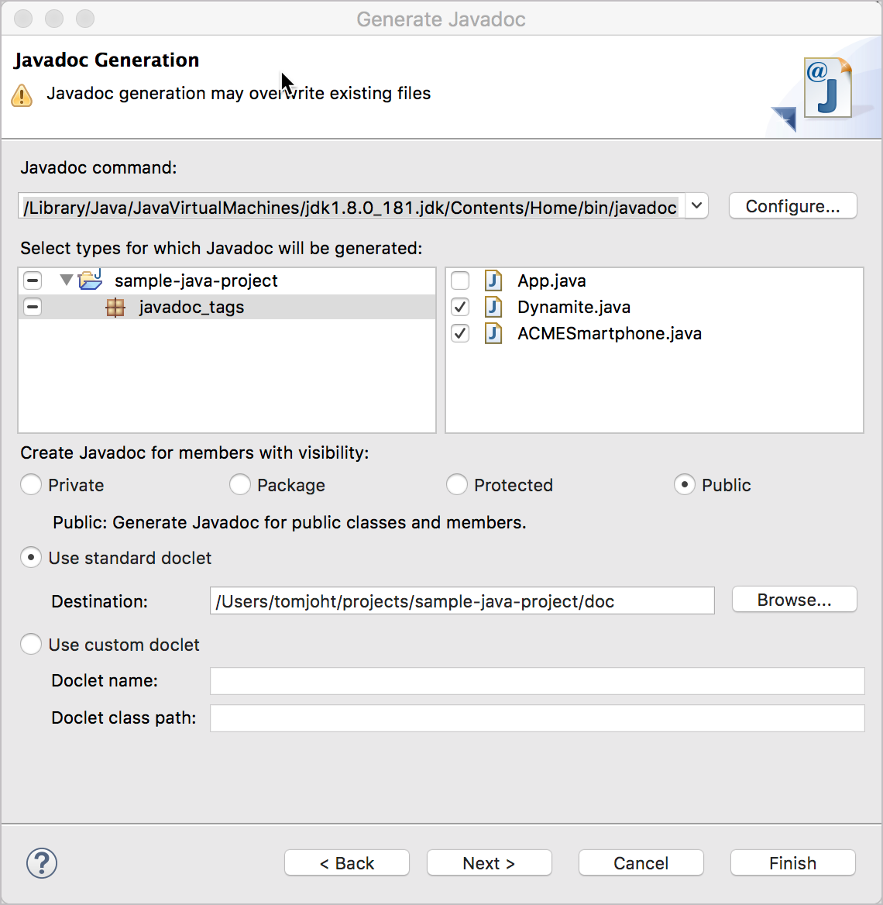
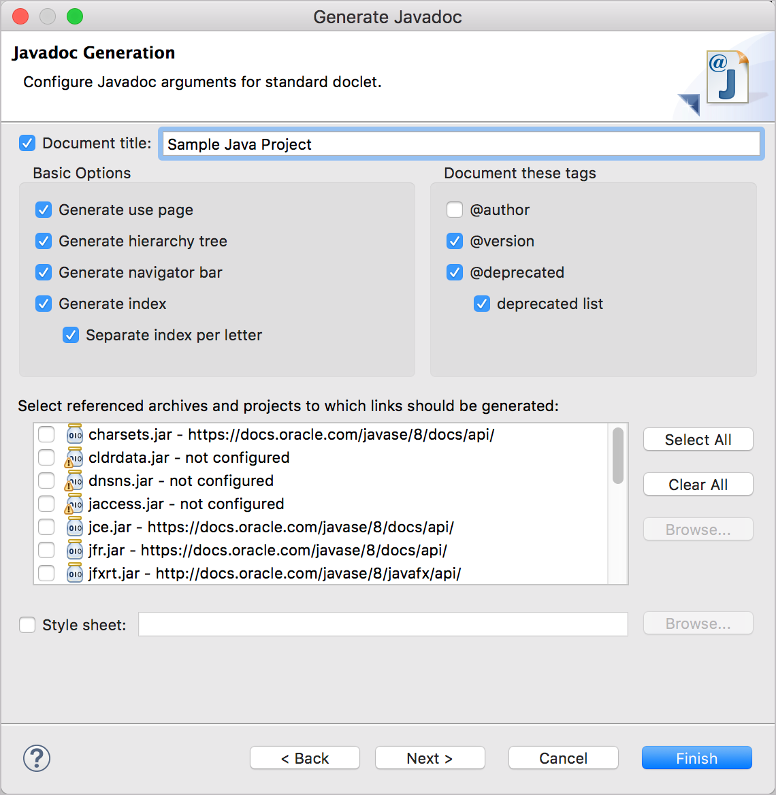
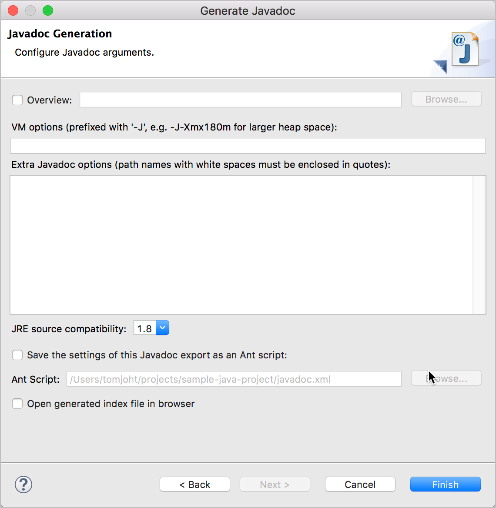
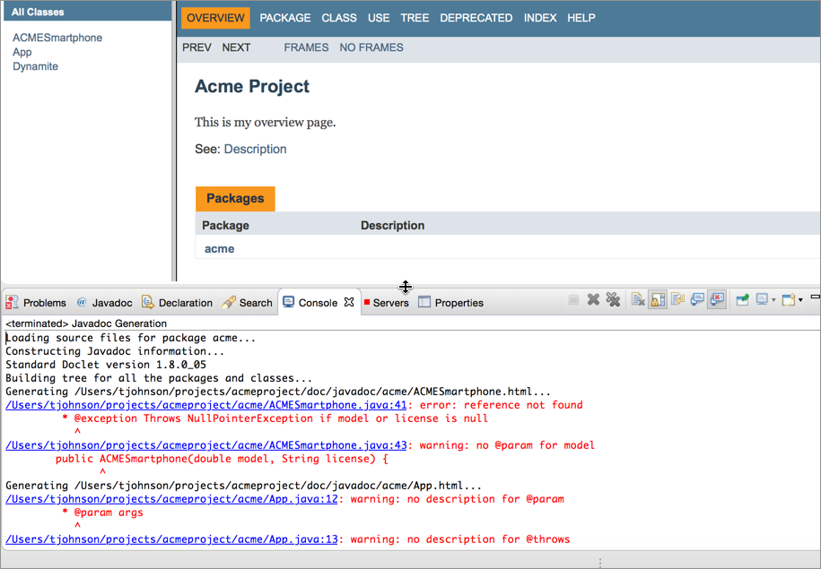

# Практическое занятие: Генерация Javadoc из примера проекта

Javadoc является стандартным выводом для API Java. Создание Javadoc довольно простое. Javadoc генерируется с помощью так называемого «доклета». Различные доклеты могут по-разному анализировать аннотации Java и создавать разные выходные данные. Но по большому счету почти каждая документация по Java использует стандартный доклет. Выходные данные Javadoc знакомы разработчикам Java и приветствуются ими.

Javadoc поддерживается Oracle. Разработчики могут интегрировать вывод Javadoc непосредственно в свою IDE, что делает документацию удобной и легко доступной. Фактически, Javadoc часто доставляется таким образом, а не разворачивается и загружается на сервер. Javadoc содержит только справочную документацию. В документацию нельзя добавлять какие-либо концептуальные файлы справки или изменять макет.

[Генерация Javadoc](#generate)

[Javadoc и проверка ошибок](#error)

[Изучение параметров Javadoc](#parameters)

[Автоматическое создание Javadoc](#build)

## 👨‍💻 Генерация Javadoc

В этом упражнении создадим Javadoc из загруженного ранее [примера проекта Java](Get-the-sample-Java-project.md). Посмотреть итоговый [вывод Javadoc можно здесь](https://idratherbewriting.com/learnapidoc/assets/files/javadoc/index.html).

1. В Eclipse переходим в **File > Export**;
2. Раскроем **Java** и выберем **Javadoc**. И нажмем кнопку **Next**;
3. Выбираем свой проект и пакет. После, в правой панели классы, которые нужно включить в Javadoc: в этом примере это будут **Dynamite.java** и **ACMESmartphone.java**.

Выбирать класс `App.java`, который содержит метод `main` не нужно, потому что не нужно предоставлять документацию по Java для вашей программы. Javadoc предоставит документацию для классов, которые разработчики могут использовать в своих программах. В этом примере проекта основной метод включен в App.java, но он мог бы быть включен в файл и с другим именем.

4. Выбираем вариант видимости: Private, Package, Protected, или Public. Как правило выбирают **Public**.

API, может иметь множество вспомогательных или служебных классов, используемых в бэкэнде, но разработчиками будет использоваться только определенное количество классов. Эти классы созданы public. Классы, которые разработчики будут использовать, формируют аспект API библиотеки классов.

5. Убедимся, что радиобаттон **Use standard doclet** выбран (Выбирается по умолчанию).
6. Нажимаем кнопку **Browse** и выбираем место, куда выводить сгенерированный Javadoc. По умолчанию он будет генерироваться в подпапке `doc`, созданной в той же папке, где хранится код. Таким образом, просматривать Javadoc можно непосредственно в Eclipse IDE.

На этом занятии выберем другое место вывода (например, папку на рабочем столе или в документах), отличное от используемого по умолчанию. Причина в том, что проект уже имеет сгенерированный Javadoc в папке с документами, поэтому можно даже не понять, что файл Javadoc создан, т.к. новый вывод просто перезапишет существующие файлы документов.

> Когда разработчики предоставляют библиотеки Java, они часто добавляют документацию непосредственно в JAR-файл. Пользователи привыкли искать документацию в папке doc.

7. Нажимаем  **Next** и видим окно с дополнительными настройками конфигураций.

Здесь вы можете выбрать пропуски тегов, такие как @author и @deprecated. Как правило, исключается тег @author, поскольку он может быть важен только внутри, а не снаружи. Можно выбрать различные параметры во фрейме Javadoc. Если есть кастомизированная таблица стилей, то указать ее можно здесь. Скорее всего, изменения стиля будут только поверхностными, например, с цветами.

8. Нажимаем **Next**

Здесь можно выбрать HTML-страницу, которая будет [обзорной страницей в Javadoc](https://docs.oracle.com/javase/7/docs/technotes/tools/windows/javadoc.html#overviewcomment). Можно выбрать любую HTML-страницу, и она будет включена в индекс.

9. Нажимаем кнопку **Finish**

Если кнопка **Finish** неактивна, это может быть связано с тем, что Eclipse не может найти нужный исполняемый файл Javadoc. Можно нажать **Configure** и найти файл вручную. На MacBook Pro файл Javadoc находится по адресу `/Library/Java/JavaVirtualMachines/jdk1.8.0_171.jdk/Contents/Home/bin/javadoc`.

Если будет предложено обновить местоположение Javadoc (которое, вероятно, отличается от местоположения рабочего пространства Eclipse), стоит это сделать, нажав **Yes to all**.

Перейдите к месту назначения и откройте файл index.html в браузере, чтобы просмотреть файлы.

> Если возникли проблемы со сборкой Javadoc, получившуюся документацию можно посмотреть [здесь](https://idratherbewriting.com/learnapidoc/assets/files/javadoc/index.html).

## Javadoc и проверка ошибок

Javadoc также проверяет теги по фактическому коду. Если есть параметры, исключения или возвраты, которые не соответствуют параметрам, исключениям или возвратам в фактическом коде, то Javadoc будет показывать предупреждения.

## 👨‍💻 Изучение параметров Javadoc

Можно попробовать удалять некоторые параметры из метода и снова генерировать Javadoc. Перед этим нужно убедиться, что окно консоли открыто, чтобы можно было видеть предупреждения об ошибках.

## Автоматическое создание Javadoc

В большинстве проектов файл Javadoc никогда не создается вручную, как описано здесь. Javadoc позволяет строить его из командной строки, передавая ему файл конфигурации. У большинства разработчиков есть инструмент управления сборкой, где они могут настраивать выходные данные из своего кода, включая Javadoc. Если разработчики попросят собрать Javadoc, скорее всего, их система управления сборкой может быть несколько примитивной. Тем не менее, может быть полезно создать выходные данные Javadoc самостоятельно (как описано здесь), чтобы протестировать и просмотреть выходные данные, прежде чем создавать их с помощью инструмента управления сборкой.
