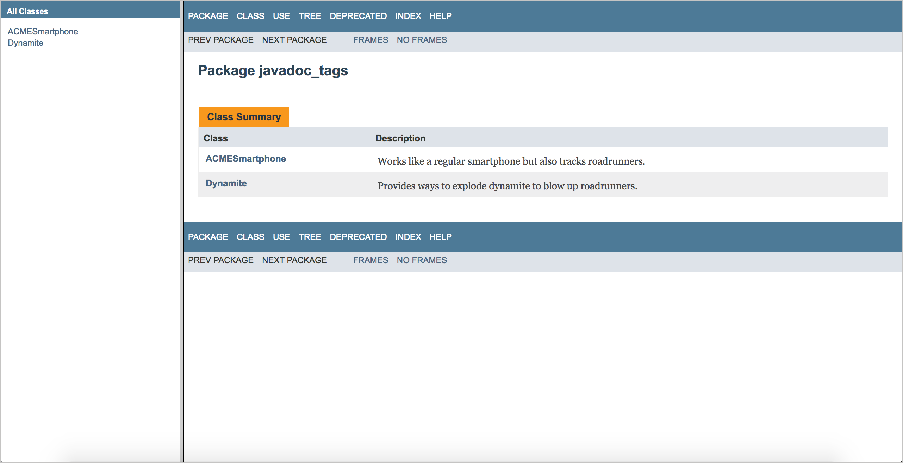
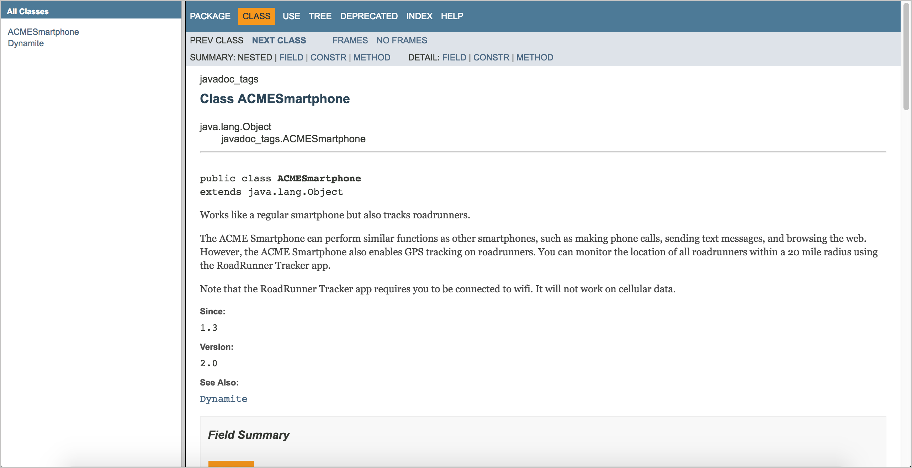
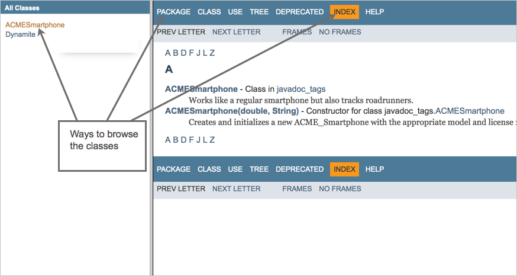

# Изучение вывода Javadoc

Выходные данные Javadoc не сильно изменились за последние 20 лет, поэтому в некотором смысле они предсказуемы и знакомы. С другой стороны, выходные данные устарели и в них отсутствуют некоторые важные функции, такие как поиск или возможность добавления дополнительных страниц. В этой теме мы рассмотрим, как организован Javadoc.

[Резюме класса](#summary)

[Детали класса](#details)

[Другая навигация](#navigation)

## Резюме класса

Открываем файл `index.html`в папке Javadoc, которую сгенерировали на [практическом занятии: Генерация Javadoc из примера проекта](Activity-Generate-Javadoc.md)

Вкладка "Резюме класса" показывает краткую версию каждого из классов. Описание, которое писали для каждого класса, отображается здесь. Это своего рода краткое справочное руководство по API.

Для отображения деталей класса кликаем по его имени (в нашем примере это `ACMESmartphone` или `Dynamite`)

## Детали класса

При просмотре страницы класса, мы получаем сводку полей, конструкторов и методов для класса. Опять же, это просто обзор. Если прокрутить вниз, то увидим полную информацию о каждом из этих элементов.

## Другая навигация

Если кликнуть на вкладку **Package** вверху, можно просмотреть классы по пакетам. Или можно перейти к классу, щелкнув имя класса в левом столбце. Также можно просмотреть все, кликнув **Index**.

Для получения справки по организации Javadoc нужно кликнуть на вкладку **Help** вверху на навигационной панели.
