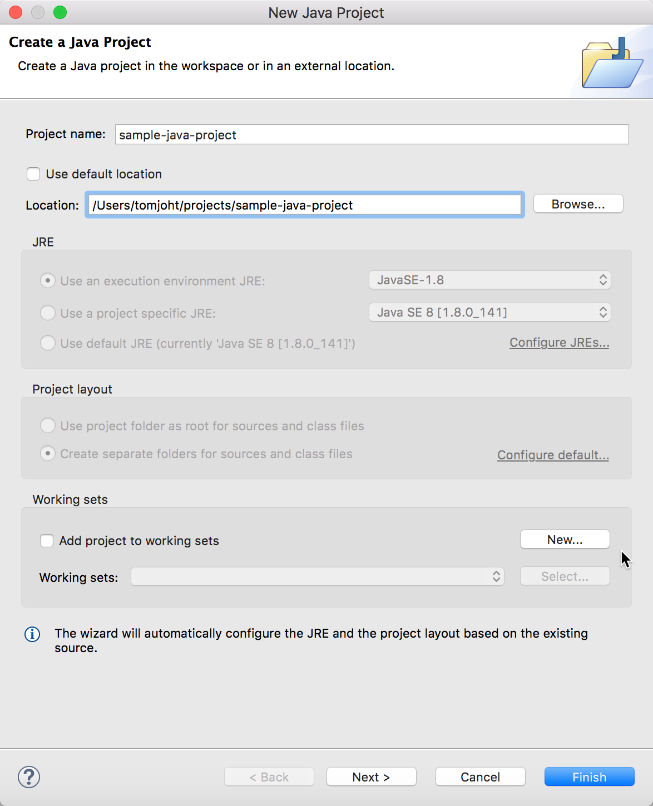
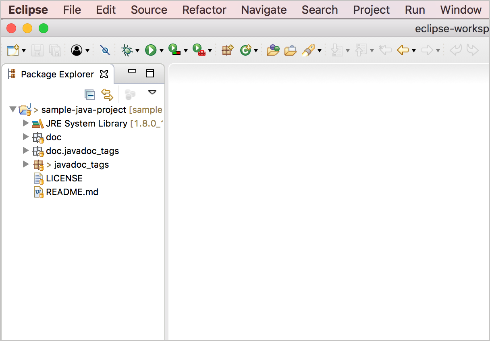
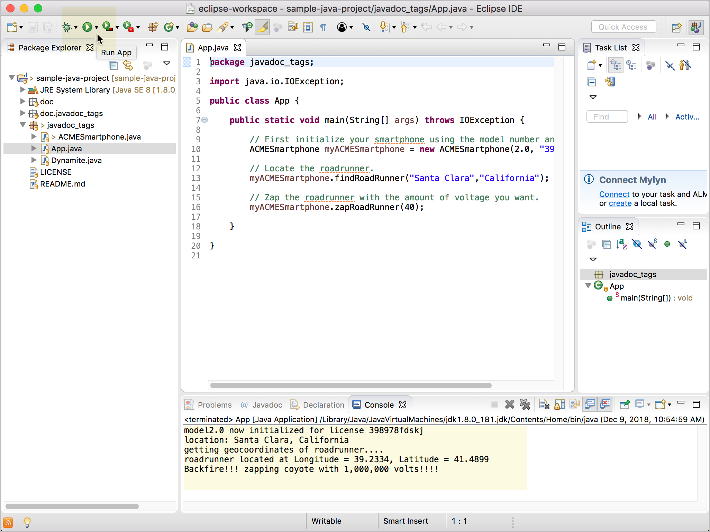
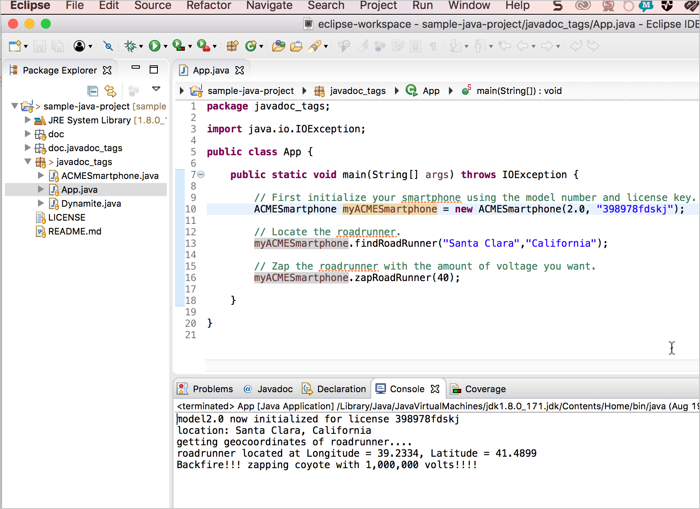

# Получаем пример Java проекта

Чтобы понять документацию API Java, полезно увидеть контекст того, что описывает документация. Как различные теги отображаются в Javadoc изучим на примере  Java-приложения [sample-java-project](https://github.com/tomjoht/sample-java-project).

[Пример проекта Java](#sample)

[Скачиваем и открываем проект в Eclipse](#open)

[Изучаем пример проекта Java](#play)

[Дополнительная информация о проектах Maven](#notes)

<a name="sample"></a>
## Пример проекта Java

Пример проекта (доступен по адресу [github.com/tomjoht/sample-java-project](https://github.com/tomjoht/sample-java-project) ) представляет собой небольшое Java-приложение с различными инструментами, которые койот будет использовать для захвата птицы-бегуна. Существует два класса (`ACMESmartphone` и `Dynamite`) и другой класс с именем `App`, который ссылается на классы.

Эта программа только печатает небольшие сообщения в консоли, и она достаточно проста, чтобы быть поучительной. Цель приложения - продемонстрировать различные теги документов, их размещение и способы их визуализации в Javadoc.

<a name="open"></a>
## 👨‍💻 Скачиваем и открываем проект в Eclipse

Одной из непосредственных задач технического писателя при редактировании Javadoc является открытие проекта и получение исходного кода в IDE.

1. Переходим к [примеру проекта](https://github.com/tomjoht/sample-java-project) и клонируем проект используя контроль версий

```
git clone https://github.com/tomjoht/sample-java-project
```

Узнать основы контроля версий можно в разделе [Система контроля версий (пример Git)](../Publishing-doc/Version-control-system.md)

2. Если IDE Eclipse еще не установлен, самое время его [установить](Overview-of-library.md#eclipse).

3. Открываем Eclipse и переходим к проекту: **File > New > Java Project**

4. Снимаем галочку в чекбоксе **Use default location** и нажимаем кнопку `Browse...` для выбора папки, где находится клон проекта. Нажимаем кнопку `Open`


> Импорт проекта


5. Нажимаем кнопку `Finish` чтобы закрыть диалоговое окно.

Файлы проекта видны в левой панели (Package Explorer) Eclipse.


> Вид IDE Eclipse

<a name="play"></a>
## 👨‍💻 Изучаем пример проекта Java

Это Java-приложение не много умеет. Его единственная цель - создать несколько классов, которые демонстрируют некоторые аннотации Javadoc. Запустим приложение для ознакомления.

1. В левой панели откроем **javadoc_tags**.
2. Дважды кликнем по файлу **App.java** для его открытия.
3. Нажимаем кнопку **Run App**


> Запуск приложения в Eclipse

Основной метод (`public static void main (String [] args) вызывает IOException`), который появляется в файле **App.java**, выполняет функции, определенные в файлах другого пакета (`ACMESmartphone.java` и `Dynamite.java`).

```
public static void main(String[] args) throws IOException {

  // First initialize your smartphone using the model number and license key.
  ACMESmartphone myACMESmartphone = new ACMESmartphone(2.0, "398978fdskj");

  // Locate the roadrunner.
  myACMESmartphone.findRoadRunner("Santa Clara","California");

  // Zap the roadrunner with the amount of voltage you want.
  myACMESmartphone.zapRoadRunner(40);

}
```

Просмотреть подробную информацию о каждой функции можно щелкнув файлы классов `ACMESmartphone.java` и `Dynamite.java`.

Затем приложение выводит следующий текст в консоль:

```
model2.0 now initialized for license 398978fdskj
location: Santa Clara, California
getting geocoordinates of roadrunner....
roadrunner located at Longitude = 39.2334, Latitude = 41.4899
Backfire!!! zapping coyote with 1,000,000 volts!!!!
```


> Выполнение программы

<a name="notes"></a>
## Дополнительная информация о проектах Maven

Прежде чем закончить вводную тему о начале работы с Java-проектом, стоит сделать заметку о Maven. Проекты Java часто имеют много зависимостей от пакетов, которые являются сторонними библиотеками или, по крайней мере, нестандартными утилитами Java. Вместо того, чтобы требовать от пользователей загрузки дополнительных пакетов и добавления их в свой класс вручную, разработчики часто используют Maven для управления пакетами. (Maven для Java, как Gradle для Android.)

В проектах Maven используется файл pom.xml, который определяет зависимости. Eclipse поставляется с уже установленным Maven, поэтому, импортируя проект Maven и устанавливая его, плагин Eclipse Maven извлекает все зависимости проекта и добавляет их в наш проект.

Разбираемый здесь [образец проекта](https://github.com/tomjoht/sample-java-project) не использует Maven, но есть вероятность, что, получая проект Java от разработчиков, вы не импортируете его так, как описано ранее. Вместо этого он импортируется как существующий проект Maven.

Чтобы импортировать проект Maven в Eclipse, нужно перейти в меню **File > Import > Maven > Existing Maven Projects** и нажать кнопку **Next**. В поле «Корневой каталог» нажать **Browse** и перейти к папке проекта Java (которая содержит компонент Maven. XML-файл), а затем нажать кнопку **Open**. Затем нажать кнопку **Finish** в диалоговом окне. В левой панели Eclipse нужно кликнуть правой кнопкой мыши по папке Java и выбрать **Run as Maven Install**. Maven извлекает необходимые пакеты и создает проект. Если сборка прошла успешно, в консоли появится сообщение «BUILD SUCCESS» . После чего можно использовать исходный код в собранном проекте.
