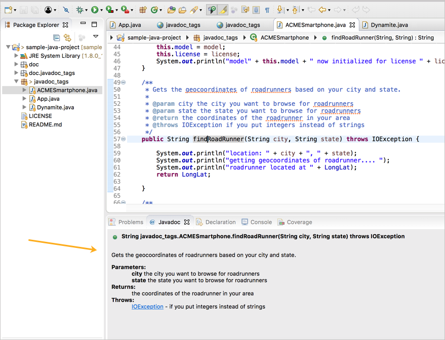

# Тэги Javadoc

Javadoc - это генератор документов, который просматривает исходные файлы Java для конкретных аннотаций. Он анализирует аннотации в выводе Javadoc. Знать аннотации очень важно, потому что именно так создается Javadoc.

[Комментарии или тэги Javadoc](#commentsortags)

[Общие тэги Javadoc](#commonTags)

[К каким элементам добавлять тэги Javadoc?](#whentoAdd)

[Модификаторы public и private в Javadoc](#publicorPrivate)

[Описание](#description)

[Избегаем @author](#author)

[Порядок тэгов](#tegOrder)

[@param тэги](#param)

[@return тэги](#return)

[@throws тэги](#throws)

[Комментарии к конструкторам](#constructors)

[Комментарии к полям](#fields)

[Кейсы, где комментарии не нужны](#cases)

[@see тэги](#see)

[Ссылки](#links)

[Предпросмотр комментариев Javadoc](#preview)

[Зачем такие подробности о тэгах Javadoc?](#details)

[Дополнительная информация о Javadoc](#moreInfo)

<a name="commentsortags"></a>
## Комментарии или тэги Javadoc

Обычно комментарии в Java выглядят так:

```
// sample comment...

/*
sample comment
*/
```

Javadoc ничего не делает с такими комментариями.

Чтобы включить контент в Javadoc, добавляем две звездочки в начале, перед классом или методом:

```
/**
*
*
*
*
*/
```

В Eclipse, если ввеcnb `/**` и нажать return, он автоматически заполнит оставшуюся часть синтаксиса.


Формат для добавления различных элементов выглядит следующим образом:

```
/**
* [short description]
* <p>
* [long description]
*
* [author, version, params, returns, throws, see, other tags]
* [see also]
*/
```

Реальный пример комментариев метода в Javadoc:

```
/**
* Zaps the roadrunner with the number of volts you specify.
* <p>
* Do not exceed more than 30 volts or the zap function will backfire.
* For another way to kill a roadrunner, see the {@link Dynamite#blowDynamite()} method.
*
* @exception IOException if you don't enter a data type amount for the voltage
* @param voltage the number of volts you want to send into the roadrunner's body
* @see #findRoadRunner
* @see Dynamite#blowDynamite
*/
public void zapRoadRunner(int voltage) throws IOException {
   if (voltage < 31) {
       System.out.println("Zapping roadrunner with " + voltage + " volts!!!!");
   }
   else {
    System.out.println("Backfire!!! zapping coyote with 1,000,000 volts!!!!");
   }
}
```

Описание Javadoc и тэги помещаем перед классом или методом (нет необходимости в пробелах между описанием и классом или методом).

<a name="commonTags"></a>
## Общие тэги Javadoc

Ниже приведены наиболее распространенные тэги, используемые в Javadoc. У каждого тэга есть слово, которое следует за ним. Например, `@param latitude` означает, что параметром является «широта».

> [Длинный пример тэгов Javadoc из Oracle](https://www.oracle.com/technetwork/java/javase/documentation/index-137868.html#examples).

Рассмотрим несколько общих тэгов Javadoc:

- `@author` Человек, который внес значительный вклад в код. Применяется только на уровне класса, пакета или обзора. Не включен в вывод Javadoc. Не рекомендуется включать этот тэг, поскольку авторство часто меняется.
- `@param` Параметр, который принимает метод или конструктор.
- `@deprecated` этим тэгом помечаются класс или метод, которые больше не используются. Такой тэг будет размещен на видном месте в Javadoc. Сопровождается тэгом `@see` или `{@link}`.
- `@return` Что возвращает метод.
- `@see` Создает список "см.также". Используется в паре с тэгом `{@link}` для связи с содержимым.
- `{@link}` Используется для создания ссылок на другие классы или методы. Пример: `{@link Foo# bar}` ссылается на метод `bar`, который принадлежит классу `Foo`. Для ссылки на метод в том же классе, просто добавляется `#bar`.
- `@since 2.0` Версия с момента добавления функции.
- `@throws` Вид исключения, которое выдает метод. Обратим внимание, что для проверки этого тэга в коде должно быть указано исключение. В противном случае Javadoc выдаст ошибку. Тэг `@exception` является альтернативным тэгом.
- `@Override` Используется с интерфейсами и абстрактными классами. Выполняет проверку, чтобы увидеть, является ли метод переопределением.

<a name="whentoAdd"></a>
## К каким элементам добавлять тэги Javadoc?

Тэги Javadoc добавляют к классам, методам и полям.

- тэги `@author` и `@version` добавляются только к классам и интерфейсам.
- тэг `@param` только для методов и конструкторов.
- тэг `@return` только для методов.
- тэг `@throws` для классов и методов.

<a name="publicorPrivate"></a>
## Модификаторы public и private в Javadoc

Javadoc включает классы, методы и т.д., модификатором `public`. Элементы, помеченные как `private`, не включаются в Javadoc, если специально не выбран **private** при создании Javadoc. Если опустить `public` из исходного кода, по умолчанию класс или метод доступны только для пакета. В этом случае он не будет включен в Javadoc.

<a name="description"></a>
## Описание

Javadoc предоставляет как краткое, так и длинное описание. Вот пример, показывающий, как отформатирована часть описания:

```
/**
* Short one line description.
* <p>
* Longer description. If there were any, it would be
* here.
* <p>
* And even more explanations to follow in consecutive
* paragraphs separated by HTML paragraph breaks.
*
* @param variable Description text text text.
* @return Description text text text.
*/
public int methodName (...) {
// method body with a return statement
}
```

Этот пример взят из [статьи в Википедии](https://en.wikipedia.org/wiki/Javadoc)

Краткое описание является первым предложением c кратким описанием класса или метода в Javadoc. После точки анализатор перемещает остальную часть описания в длинное описание. для обозначения начала нового абзаца используется html-тэг `<p>`. Окружать абзацы открывающими и закрывающими тэгами `<p>` не нужно, потому что компилятор Javadoc автоматически добавляет их. HTML можно использовать в описаниях, таких как неупорядоченный список, кодовые тэги, полужирные тэги или другие.

После описания вводится пустая строка (для удобства чтения), а затем добавляются тэги. Под тэгами добавить описание контента невозможно. Только методы и классы могут иметь тэги, а не поля. Поля (переменные) имеют только описания.

Первое предложение в примере очень похоже на элемент `shortdesc` в DITA. Предполагается, что это первое предложение является кратким описанием всего класса или метода. Если в одном из ваших слов есть точка (например, `Dr. Jones`), после точки нужно удалить пробел, добавив `Dr.&nbsp;Jones` для его соединения.

Лучше избегать использования ссылок в первом предложении. После точки следующее предложение будет длинным абзацем, поэтому нужно загрузить первое предложение, чтобы оно было описательным. Время глаголов должно быть в настоящем времени, например, *получает, помещает, отображает, вычисляет* ...

Если метод настолько очевиден (например, printPage), что описание («печатает страницу») становится избыточным и выглядит бесполезным? В этих случаях Oracle говорит, что можно опустить фразу «печатать страницу» и вместо этого попытаться предложить другое понимание. Oracle предлагает:

> Добавить описание под именем API. Лучшие имена API являются «самодокументируемыми», то есть они в основном говорят вам, что делает API. Если комментарий к документу просто повторяет имя API в форме предложения, он не предоставляет больше информации. Например, если в описании метода используются только слова, которые встречаются в имени метода, то это вообще ничего не добавляет к тому, что вы могли бы вывести. Идеальный комментарий выходит за рамки этих слов и всегда должен вознаградить вас некоторой информацией, которая не сразу была очевидна из названия API. -  [How to write javadoc comments](https://www.oracle.com/technetwork/articles/java/index-137868.html)

<a name="author"></a>
## Избегаем `@author`

Комментируя лучшие практики Javadoc, некоторые люди рекомендуют использовать @author, потому что значение автора легко теряет актуальность, а элемент управления исходным кодом обеспечивает лучшее указание на последнего автора. (См. [Javadoc coding standards](https://blog.joda.org/2012/11/javadoc-coding-standards.html) для подробной информации.)

<a name="tegOrder"></a>
## Порядок тэгов

Oracle предлагает следующий порядок тэгов:

```
@author (classes and interfaces)
@version (classes and interfaces)
@param (methods and constructors)
@return (methods)
@throws (@exception is an older synonym)
@see
@since
@serial
@deprecated
```


<a name="param"></a>
## `@param` тэги

тэги `@param` применяются только к методам и конструкторам, которые принимают параметры. После тэга `@param` добавляется имя параметра, а затем описание параметра в нижнем регистре без точки, например:

```
@param url the web address of the site
```


Описание параметра - это фраза, а не полное предложение. Порядок нескольких тэгов `@param` должен соответствовать их порядку в методе или конструкторе.

[Стивен Коулборн рекомендует](https://blog.joda.org/2012/11/javadoc-coding-standards.html) добавить дополнительный пробел после имени параметра, чтобы повысить удобочитаемость.


Что касается включения типа данных в описание параметра, Oracle говорит:

> По соглашению, первым существительным в описании является тип данных параметра. (Артикли «a», «an» и «the» могут предшествовать существительному.) Исключение делается для примитива int, где тип данных обычно опускается. (См. [How to write doc comments using Javadoc](https://www.oracle.com/technetwork/java/javase/documentation/index-137868.html#tag).)


Пример, который дает Oracle, выглядит следующим образом:

```
@param ch the character to be tested
```

Тип данных также виден и из параметров в методе. Поэтому, даже если не включать типы данных, пользователям будет видно, что они собой представляют.

После имени параметра может быть несколько пробелов, чтобы все определения параметров были выстроены в линию.

тэги `@param` должны быть предоставлены для каждого параметра в методе или конструкторе. Невыполнение этого требования приведет к ошибке и предупреждению при рендеринге Javadoc.

Обычно у классов нет параметров. Есть одно исключение: дженерики. Универсальные классы (дженерики) - это классы, которые работают с различными типами объектов. Объект указывается в качестве параметра в классе в скобках: `<>`. Хотя руководство Javadoc от Oracle не упоминает их, можно добавить тэг `@param` для универсального класса, чтобы отметить параметры для универсального класса. Детали в [посте на  StackOverflow](https://stackoverflow.com/questions/2015972/is-there-a-javadoc-tag-for-documenting-generic-type-parameters). Вот пример с этой страницы:

```
/**
* @param <T> This describes my type parameter
    */
    class MyClass<T>{

        }
```

<a name="return"></a>
## `@return` тэги


Возвращают значения только методы, поэтому только методы получают тэг `@return`. Если метод имеет модификатор `void`, он ничего не возвращает. Если в нем нет `void`, нужно включить тэг `@return`, чтобы избежать ошибки при компиляции Javadoc.

<a name="throws"></a>
## `@throws` тэги

Тэги `@throws` добавляются  в методы или классы только в том случае, если метод или класс генерируют ошибку определенного типа. Вот пример:

```
@throws IOException if your input format is invalid
```

Стивен Коулборн рекомендует начинать описание тэга throws с предложения «if» для удобства чтения. Он говорит:

> За функцией` @throws` обычно следует if ... и остальная часть фразы, описывающая условие. Например, `@throws, if the file could not be found`. Это способствует удобочитаемости исходного кода и при его создании.

Несколько тэгов `@throws` располагают в алфавитном порядке.

<a name="constructors"></a>
## Комментарии к конструкторам

Рекомендуется включать конструктор в класс. Однако, если конструктор отсутствует, Javadoc автоматически создает конструктор в Javadoc, но исключает любое описание конструктора.

Конструкторы имеют тэги `@param`, но не тэги `@return`. Все остальное так же, как и с методами.

<a name="fields"></a>
## Комментарии к полям

Поля имеют только описания. Можно добавлять комментарии в поле, если бы поле было чем-то, что пользователь будет использовать.


<a name="cases"></a>
## Кейсы, где комментарии не нужны

Oracle говорит, что есть три сценария, где комментарии к документу наследуются, поэтому вам не нужно включать комментарии в эти сценарии:

- когда метод в классе переопределяет метод в суперклассе;
- когда метод в интерфейсе переопределяет метод в суперинтерфейсе;
- когда метод в классе реализует метод в интерфейсе
(См. [How to write Javadoc comments](https://www.oracle.com/technetwork/java/javase/documentation/index-137868.html#tag) )

<a name="see"></a>
## `@see` тэги

Тэг `@see` предоставляет ссылку. Существуют различные способы обозначить то, на что надо ссылаться, чтобы создать ссылку. При ссылке на поле, конструктор или метод в том же поле, используется `#`.

При ссылке на другой класс, сначала пишется имя этого класса, затем `#` и имя конструктора, метода или поля.

При ссылке на класс в другом пакете, сначала указывается имя пакета, затем класс и так далее. Пример из Oracle:

```
@see #field
@see #Constructor(Type, Type...)
@see #Constructor(Type id, Type id...)
@see #method(Type, Type,...)
@see #method(Type id, Type, id...)
@see Class
@see Class#field
@see Class#Constructor(Type, Type...)
@see Class#Constructor(Type id, Type id)
@see Class#method(Type, Type,...)
@see Class#method(Type id, Type id,...)
@see package.Class
@see package.Class#field
@see package.Class#Constructor(Type, Type...)
@see package.Class#Constructor(Type id, Type id)
@see package.Class#method(Type, Type,...)
@see package.Class#method(Type id, Type, id)
```

Для подробной информации см. [How to write Javadoc comments](https://www.oracle.com/technetwork/java/javase/documentation/index-137868.html#tag)

<a name="links"></a>
## Ссылки

Создавать ссылки на другие классы и методы можно используя тэг `{@link}`.

Пример создания ссылки из [Javadoc coding standards]
(https://blog.joda.org/2012/11/javadoc-coding-standards.html):

```
/**
* First paragraph.
* <p>
* Link to a class named 'Foo': {@link Foo}.
* Link to a method 'bar' on a class named 'Foo': {@link Foo#bar}.
* Link to a method 'baz' on this class: {@link #baz}.
* Link specifying text of the hyperlink after a space: {@link Foo the Foo class}.
* Link to a method handling method overload {@link Foo#bar(String,int)}.
*/
public ...
```

Для ссылки на другой метод в том же классе используется формат: `{@link #baz}`. Чтобы связать метод с другим классом, используется формат: `{@link Foo # baz}`. Тем не менее, не надо мудрить с гиперссылкой. При обращении к другим классам можно использовать тэги `<code>`.

Для изменения связанного текста, после слова `#baz` пишется: `@see #baz Baz Method`.

<a name="preview"></a>
## Предпросмотр комментариев Javadoc

В Eclipse вкладку Javadoc можно использовать в нижней части экрана, для просмотра информации Javadoc, включенную для просматриваемого класса.



<a name="details"></a>
## Зачем такие подробности о тэгах Javadoc?

Для чего здесь добавлено много конкретных деталей и рекомендаций по стилю тэгов Javadoc? Для понимания того, что аннотации для Javadoc следуют множеству стилевых соглашений и лучших практик. Эти соглашения и рекомендации не всегда могут быть очевидны или соблюдаются в файлах Java, с которыми приходится работать. Можно добавить большую ценность, просто убедившись, что содержимое соответствует таким стилевым соглашениям.

<a name="moreInfo"></a>
## Дополнительная информация о Javadoc

[Oracle’s explanation of Javadoc tags](https://www.oracle.com/technetwork/articles/java/index-137868.html)

[Javadoc](https://docs.oracle.com/javase/7/docs/technotes/tools/windows/javadoc.html)
