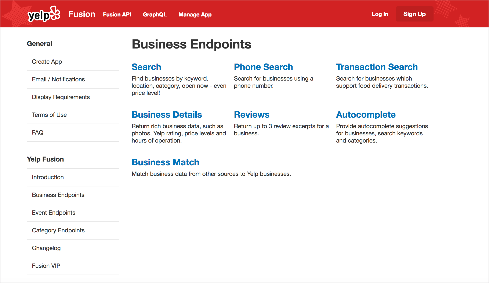
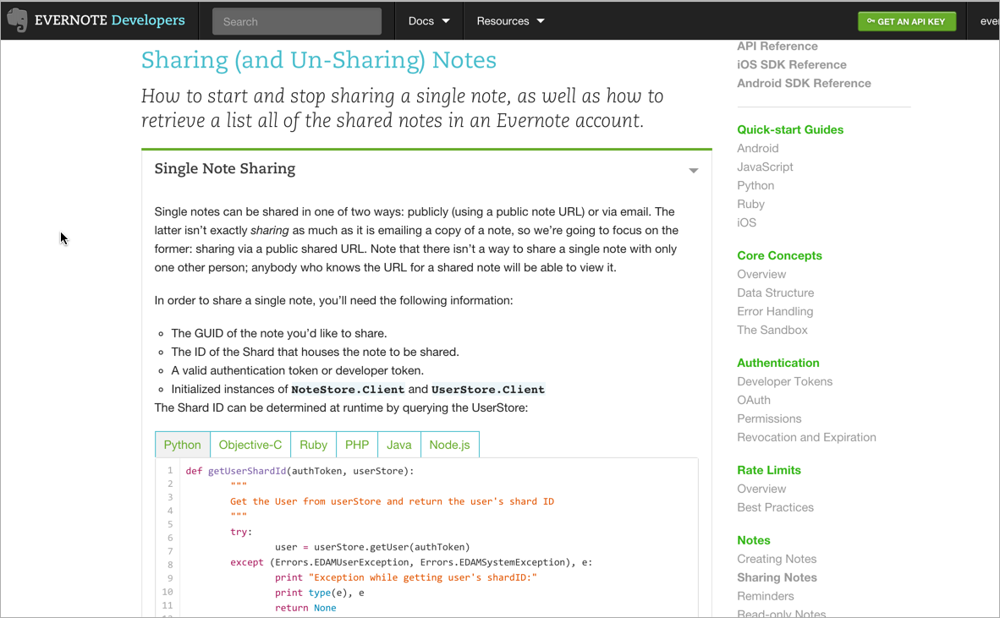

# Шаблоны проектирования сайтов API документации

В предыдущем разделе мы просмотрели длинный список сайтов документации API и искали похожие шаблоны в их дизайне. Шаблоны проектирования - это общие подходы или методики проектирования чего-либо. Хотя можно определить гораздо больше шаблонов, следующие шаблоны дизайна являются общими для сайтов документов API:

- структура и шаблоны,
- единый цельный веб-сайт,
- множество примеров кода,
- длинные страницы,
- интерактивные API explorers.

Каждый из этих элементов мы рассмотрим в этом разделе.

[Паттерн 1: структура и шаблоны](#first)

[Паттерн 2: единый цельный веб-сайт](#second)

[Паттерн 3: множество примеров кода](#third)

[Паттерн 4: длинные страницы](#fourth)

[Паттерн 5: интерактивность API](#fifth)

[Кое-что из не-шаблонов на сайтах API документации](#nonPattern)

<a name="first"></a>
## Паттерн 1: Структура и шаблоны

Одной из основных общих черт сайтов документации API является то, что они имеют общую структуру, особенно это касается документации конечных точек. В модуле [Документирование конечных точек API](../documenting-api-endpoints/README.md) мы рассмотрели общие разделы в документации конечных точек API.

С точки зрения инструмента, если есть общие разделы для каждой конечной точки, имеет смысл формализовать шаблон для размещения публикации этого контента. Шаблон может обеспечить согласованность, автоматизировать публикацию и стили, а также упростить изменение дизайна без ручного переформатирования каждого раздела. (Без шаблона можно просто забыть добавить одни и те же разделы на каждой странице, что требует больше усилий для обеспечения согласованности.) С помощью шаблона можно вставлять различные значения (описания, методы, параметры и т.д.) в вывод, в комплекте со сложным стилем.

Различные инструменты имеют разные способы обработки шаблонов. В [Jekyll](Jekyll-and-cloudCannon.md), генераторе статичных
 сайтов, можно создавать значения в [файле YAML](../openAPI-specification/working-in-YAML.md) и идти по ним, используя Liquid для доступа к значениям.

Вот как можно это делать. Во frontmatter страницы (например, endpoints.yml) можно перечислить пары ключ-значение для каждого раздела.

```
resource_name: surfreport
resource_description: Gets the surf conditions for a specific beach.
endpoint: /surfreport
```

и так далее.

После чего можно использовать [цикл for](https://help.shopify.com/en/themes/liquid/objects/for-loops) для циклического перебора каждого из элементов и вставки их в шаблон:

```html

<div class="resName">{{p.resource_name}}</div>
<div class="resDesc">{{p.resource_description}}</div>
<div class="endpointDef">{{p.endpoint}}</div>

```

Такой подход позволяет легко менять шаблон без переформатирования всех страниц. Если нужно будет изменить порядок элементов на странице, или добавить новые классы или другое значение, просто меняется шаблон. Значения остаются неизменными, так как они могут быть обработаны в любом порядке.

Полноценным примером API-шаблонов является [Тема Aviator от CloudCannon](https://github.com/CloudCannon/aviator-jekyll-template). Пример конечной точки для добавления книг в теме «Авиатор» выглядит следующим образом:

```
---
title: /books
position: 1.1
type: post
description: Create Book
right_code: |
  ~~~ json
  {
    "id": 3,
    "title": "The Book Thief",
    "score": 4.3,
    "dateAdded": "5/1/2015"
  }
  ~~~
  {: title="Response" }

  ~~~ json
  {
    "error": true,
    "message": "Invalid score"
  }
  ~~~
  {: title="Error" }
---
title
: The title for the book

score
: The book's score between 0 and 5

The book will automatically be added to your reading list
{: .success }

Adds a book to your collection.

~~~ javascript
$.post("http://api.myapp.com/books/", {
  "token": "YOUR_APP_KEY",
  "title": "The Book Thief",
  "score": 4.3
}, function(data) {
  alert(data);
});
~~~
{: title="jQuery" }
```

(`~~~` - это альтернативная разметка для обратного апострофа. Обозначение `{: .success}` - это синтаксис [kramdown](https://kramdown.gettalong.org/) для пользовательских классов.) Автор темы создал макет, который просматривает эти значения и помещает содержимое в формат HTML. Если вы посмотрите [файл index.html в Aviator](https://github.com/CloudCannon/aviator-jekyll-template/blob/master/index.html), вы увидите следующий код:

```html


  
  
     <section class="doc-content">
       <section class="left-docs">
         <h3>
           <a id="{{ doc.id | replace: '/', '' | replace: '.', '' }}">
             {{ doc.title }}
             
             <span class="endpoint {{ doc.type }}"></span>
             
           </a>
         </h3>
         
         <p class="description">{{doc.description}}</p>
         
         {{ doc.content | replace: "<dl>", "<h6>Parameters</h6><dl>" }}
         </section>
         
         <section class="right-code">
           {{ doc.right_code | markdownify }}
         </section>
         
       </section>
       

```

Этот код использует циклы `for` в [сценариях Liquid](https://help.shopify.com/en/themes/liquid/basics) для итерации по элементам в коллекции `docs` и вставляет содержимое в стили HTML шаблона. Результат выглядит так:


Такая структура действительно необходима, только при наличии многих разных конечных точек. Если их несколько, нет необходимости автоматизировать процесс шаблона.

Jekyll здесь только в качестве примера. Многие из веб-платформ и технологий, используемых для документации API, реализуют аналогичный шаблонный подход.

Игровой стартап Badgeville публикует документы с использованием Drupal. Их дизайнерское агентство разработало шаблон в Drupal. Для публикации справочной документации API, инженеры написали собственный скрипт, который сгенерировал контент из базы данных в файл JSON, который затем импортировался в Drupal. В процесс импорта поля заполнялись в шаблоне Drupal.

В результате получился сногсшибательный, визуально привлекательный дизайн. Чтобы достичь такого стиля в UX, потребовалось бы множество пользовательских тегов `div` для применения классов и других сценариев на странице. Отделяя контент от формата шаблона, можно работать с контентом, не беспокоясь о правильных тегах стиля и другом форматировании. При поиске инструментов документирования нужно помнить о необходимости шаблонизировать справочную документацию API.


Может быть весело создавать свои собственные шаблоны (если вы хотите поработать с документами), но могут возникнуть и  проблемы, связанные с пользовательскими шаблонами. Шаблоны полностью произвольны, с терминами и структурой, основанными на предполагаемых потребностях и стилях дизайнера. Если будем писать документацию для конкретного шаблона, что произойдет, если захотим переключить темы или продукты? Придется создавать новые шаблоны, которые будут обрабатывать один и тот же пользовательский frontmatter, а это означает большое количество кода.

Учитывая, что API-интерфейсы REST соответствуют сходным характеристикам и разделам, не имеет ли смысла создавать стандарт в способе описания API-интерфейсов, а затем использовать инструменты, которые анализируют эти стандартные описания? Да! Вот что такое спецификация OpenAPI. В этом курсе есть пояснения [нескольких форматов описания API REST](../openAPI-specification/overview-specification-formats.md), а также [обширное руководство по спецификации OpenAPI](../openAPI-specification/openapi-tutorial-overview.md). Есть также и учебное пособие по чтению спецификации OpenAPI при помощи [Swagger UI](../openAPI-specification/swagger-ui-tutorial.md), а также [задание по созданию собственного Swagger UI](../openAPI-specification/swagger-ui-tutorial.md#createDoc).

Задача этого курса заключается в том, что бы не перегружать технических писателей проблемами кодирования при создании собственных шаблонов API. Тема Aviator демонстрирует один индивидуальный подход, и он выделен здесь с примерами кода, чтобы продемонстрировать сложность и индивидуальность определения собственных шаблонов. Но это не единственный подход и даже не рекомендуемый подход.

<a name="second"></a>
## Паттерн 2: Единый цельный веб-сайт

Многие API-сайты предоставляют *один интегрированный веб-сайт* для представления всей информации. Справка не открывается в новом окне, отдельно от другого контента. Веб-сайт имеет такой же внешний вид, как и продукт. Вот пример из Yelp:



Как уже упоминалось ранее в разделе [Рынок документации REST API](../introduction-rest-apis/api-doc-market.md), документация API обычно не имеет графического интерфейса пользователя (GUI), который дополняет ее. В большинстве случаев сама документация API - это и есть интерфейс, по которому пользователи переходят к использованию продукта. Таким образом, пользователи будут ожидать от такого продукта большего.

Одной из проблем использования документации, сгенерированной в [OpenAPI и Swagger](../openAPI-specification/introduction-openapi-and-swagger.md) или другого инструмента генерации документов, является выяснение того, как интегрировать ее с остальной частью сайта. В идеале нужно, чтобы пользователи имели беспроблемный доступ ко всему сайту. Если конечные точки отображаются в отдельном представлении, как интегрировать ссылку на конечную точку в остальную часть документации?

Интеграция брендинг с поиском может не заинтересовать пользователей. Но если создается впечатление, что пользователи перемещаются по нескольким сайтам, к тому же плохо объединенным в единое целое, взаимодействие с UX будет нарушено.

Стоит подумать о другом контенте, с которым пользователи будут взаимодействовать. Например, о маркетинговом контенте, условиях обслуживания, поддержке и т.д. Как собрать всю эту информацию в единый сайт, не прибегая к перегруженной CMS или какой-либо другой веб-среде?

Реальность такова: большинство сайтов документации API являются специально разработанными веб-сайтами, которые органично сочетаются с другим маркетинговым контентом на сайте, потому что документ API должен продавать API. В качестве платформы веб-сайта (а не справки по Tripane) можно использовать все методы HTML, CSS и JS, доступные при создании веб-сайтов. Нет ограничения небольшого доступных инструментов, которые используются для создания справки; вместо этого в распоряжении мы имеем полный набор веб-инструментов.

Открытое приглашение использовать веб-инструменты для создания своего сайта API-документации является как преимуществом, так и проблемой. Преимущество в том, что, по большей части, ничего нельзя сделать со своей документацией. Ограничения только в отсутствии знаний о frontend'e. Но это также проблема, потому что многие из потребностей в документах (единый источник, PDF, переменные и т.д .) могут быть недоступны для большинства веб-инструментов.

<a name="third"></a>
## Паттерн 3: Множество примеров кода

Больше всего на свете разработчики любят [примеры кода](../conceptual-topics/code-samples.md), и обилие выделенного синтаксиса. Правильно отформатированный пример кода на сайте API тоже представляет шаблон дизайна. Чем больше кода можно добавить в свою документацию, тем лучше. Вот пример из API Evernote:



Джеймс Ю из компании Parse дает следующий совет:

> Разбросайте побольше примеров из реальной жизни по всей документации. Ни один разработчик не будет жаловаться на то, что примеров слишком много. Они значительно сокращают время, необходимое для разработчиков, чтобы понять продукт. На самом деле, у нас даже есть пример кода прямо на нашей домашней странице. ([Designing Great API Docs](https://www.pixelstech.net/article/1331352900-Designing-Great-API-Docs))

Используя примеры кода всегда хочется включить подсветку синтаксиса. Подсветка синтаксиса окрашивает различные элементы примера кода соответствующим образом в зависимости от языка программирования. Существует множество видов подсветки синтаксиса, которые обычно можно включать в свою платформу. Например, Jekyll по умолчанию использует [Rouge](https://github.com/jneen/rouge). Другим распространенным маркером являются [Pygments](http://pygments.org/). Эти маркеры имеют таблицы стилей, подготовленные для выделения языков на основе определенного синтаксиса.

Обычно инструменты, используемые для написания контента, будут включать утилиты подсветки (основанные на Ruby или Python) в процессе генерации HTML. Обычно подсветка синтаксиса не реализуется как отдельный инструмент. Если нет доступа к подсветке синтаксиса для платформы, можно добавить подсветку [вручную с помощью различных библиотек](https://code.tutsplus.com/tutorials/quick-tip-how-to-add-syntax-highlighting-to-any-project--net-21099).

Другим важным элементом в примерах кода является использование согласованного пробела. Используйте инструмент для форматирования кода с соответствующим интервалом и переносами строк. Форматировать код нужно в соответствии с соглашениями языка программирования. К счастью, в Интернете есть много инструментов для улучшения кода (например, [Code Beautify](https://codebeautify.org/)).

Для разработки есть официальные руководства по стилю (style guides) для форматирования примеров кода. Такие руководства по стилю для кода могут предписывать следующие детали:

- пробелы внутри скобок;
- разрывы строк;
- встроенные стили комментариев кода

Например, вот [style guide Google JavaScript](http://google.github.io/styleguide/javascriptguide.xml). Если у разработчиков нет официального руководства по стилю, можно попросить их дать ссылки в Интернете, а затем сравнить примеры своего кода с приведенными рекомендациями в тех style guide'ах. Подробнее о примерах кода в разделе [Описание и образцы кода](../conceptual-topics/code-samples.md).

<a name="fourth"></a>
## Паттерн 4: Длинные страницы

Одно из самых резких отличий между обычной документацией для конечного пользователя и документацией для разработчиков заключается в том, что страницы документации для разработчиков имеют тенденцию быть намного длиннее. Почему страницы длиннее? В книге [Как API-документация терпит провалы?](https://ieeexplore.ieee.org/document/7140676) (опубликованной на [IEEE Software](https://ieeexplore.ieee.org/Xplore/home.jsp)) Мартин Робиллард и Гиас Уддин рассмотрели общие причины, по которым у разработчиков возникают серьезные проблемы с документацией по API. В добавление к неполноте, неоднозначности и другим причинам, исследователи также обнаружили, что упоминалась «фрагментация» как общая проблема (которая больше связана с представлением контента, чем с самим контентом).

Робиллард и Уддин поясняют:

> Когда респондентам приходилось переходить по нескольким страницам документа API, чтобы изучить функциональность и использование элемента API, они считали ненужным разделение описаний на таком микроуровне.

В том опросе разработчики  сказали, что им «было трудно перемещаться по бесчисленным страницам в документе API для поиска информации», причем один респондент объяснил:

> Фрагментированную документацию мне действительно трудно использовать, когда приходится 10 раз кликнуть по ссылкам, чтобы найти нужную информацию, и просмотреть страницу за страницей.

При использовании в своей документации информационной модели, которая разделяет информацию на части, стоит убедиться, что  контент не разбит на слишком много отдельных частей (как описано в статье [«Призывает ли DITA авторов фрагментировать информацию на миллион маленьких кусочков»](https://idratherbewriting.com/2013/04/22/does-dita-encourage-authors-to-fragment-information-into-a-million-little-pieces/)).

Джеймс Ю из Parse также повторяет подобные отзывы о фрагментации. Он говорит:

> Не секрет, что разработчики ненавидят кликать лишний раз. Не распространяйте свою документацию на миллион разных страниц. Держите связанные темы близко друг к другу на одной странице.
Мы большие поклонники длинных одностраничных гайдов, которые позволяют пользователям видеть общую картину с возможностью легко увеличивать детали с помощью навигационной панели. Создается большой побочный эффект от того, что пользователи могут искать весь контент с помощью поиска в браузере.
Прекрасным примером этого является документация Backbone.js, в которой есть все под рукой. ([Designing Great API Docs](https://www.pixelstech.net/article/1331352900-Designing-Great-API-Docs))

Документация Backbone.js доводит длину своей страницы до крайности, публикуя все на одной странице:


Еще один пример длинных страниц на сайте Reddit API


Почему на сайтах API есть такие длинные страницы? Вот несколько причин:

- **Предоставляет общую картину:** как указывает Джеймс Ю, одностраничные документы позволяют пользователям увеличивать или уменьшать масштаб в зависимости от необходимой им информации. Новый разработчик может уменьшить масштаб, чтобы получить общую картину, изучив базовый путь REST и способ отправки вызовов. Но более опытному разработчику, уже знакомому с API, может потребоваться только проверка параметров, разрешенных для конкретной конечной точки. Одностраничная модель документа позволяет разработчикам переходить на нужную страницу и использовать `Ctrl + F`, чтобы найти информацию;
- **На многих платформах отсутствует поиск:** на многих сайтах, посвященных API, нет хороших поисковых систем. У многих вообще нет встроенных функций поиска. Отчасти это связано с тем, что Google делает такую ​​работу лучше, поэтому поиск по сайту любого веб-сайта зачастую скуден для сравнения. Кроме того, некоторые другие инструменты генерации документов и статичного сайта не имеют поиска (как и Javadoc). Без поиска информацию можно найти, создав длинные страницы и используя `Ctrl + F`.
- **Все у вас под рукой:** если информация разбита на кусочки, требующие от пользователей постоянных кликов, чтобы что-то найти (как это часто бывает в [информационной модели DITA](https://idratherbewriting.com/2013/04/22/does-dita-encourage-authors-to-fragment-information-into-a-million-little-pieces/)), опыт может быть похож на игру в информационный пинбол. При общей стратегии, хочется включить полную информацию на странице. Если у ресурса API есть несколько различных методов, разделение их на отдельные страницы может создать проблемы с возможностью поиска. См. [Single Page Docs: Stop the Click Insanity](https://www.youtube.com/watch?v=rXcdTYuxwys) Брэндона Филлипса для получения дополнительной информации. Иногда имеет смысл хранить всю связанную информацию в одном месте, все под рукой. Такой подход, который выбрали авторы спецификации [OpenAPI для GitHub](https://github.com/OAI/OpenAPI-Specification/blob/master/versions/3.0.2.md) - одна бесконечная страница с возможностью использовать `Ctrl + F` для перемещения по экрану.
- **Современные средства управления навигацией сложны:** сегодня существуют более удобные средства управления навигацией для перемещения по длинным страницам, чем это было в прошлом. Например, [функция Bootstrap Scrollspy](https://getbootstrap.com/docs/4.0/components/scrollspy/) динамически выделяет место на боковой панели, при прокрутке страницу вниз. Другие решения позволяют сворачивать или разворачивать разделы, чтобы показать контент, только если это необходимо пользователям.

Обычно длинные страницы на сайте являются ссылочными страницами. У длинных страниц могут возникать проблемы со ссылками.

<a name="fifth"></a>
## Паттерн 5: Интерактивность API

Повторяющаяся функция на многих сайтах публикации документов API - это интерактивность запросов. [Swagger UI](https://swagger.io/tools/swagger-ui/), [Readme.io](https://readme.io/), [Apiary](https://apiary.io/) и многие другие платформы позволяют проверять запросы и видеть ответы прямо в браузере.

На иных платформах подключение API Explorer часто выполняется инженерами. Уже имея функциональность API для выполнения запросов и получения ответов, создание API Explorer обычно не является сложной задачей для разработчика пользовательского интерфейса. Просто создается форма для заполнения параметров конечной точки и выводится ответ на странице.

Вот пример API-интерфейса из **Watson’s AlchemyLanguage API**, который использует [Swagger или OpenAPI](../openAPI-specification/introduction-openapi-and-swagger.md) для обеспечения интерактивности.


APIexplorers в новинку или тяжеловаты? Если собираемся делать много запросов, нет никаких причин, по которым нельзя просто использовать [curl](../like-developer/make-curl-call.md#curlRequest) или [Postman](../like-developer/submit-requests-postman.md#postmanRequest) (в частности, [кнопку Run Postman](../conceptual-topics/getting-started.md#button) ), чтобы быстро сделать запрос и увидеть ответ. Однако API Explorer, встроенный непосредственно в документацию, предоставляет больше графического пользовательского интерфейса, который делает конечные точки доступными для большего количества людей. И не нужно беспокоиться о вводе правильного синтаксиса в запросе - вам просто нужно заполнить пробелы.

API Explorer, как правило, лучше работают с более простыми API. Если API требует извлечения данных, до использования определенной конечной точки, или если отправляемые данные, являются объектом JSON в теле сообщения, или есть другая сложная взаимозависимость с конечными точками, API Explorer может не быть таким полезным. Тем не менее, это тоже шаблон проектирования, обеспечивающий ​​интерактивность в документации API.

Если пользователи входят в систему, можно хранить их ключи API и динамически заполнять запросы и примеры кода ключами API. Ключ API, скорее всего, может быть переменной, в которой хранится ключ API пользователя. Такая функция API-ключа предоставляется на сайтах, например [Readme.io](Headless-cms-options.md#readme).

Хранение API ключей клиента на своем сайте может создать требования к аутентификации и входу в систему, что сделает сайт более сложным для создания. При индивидуальной работе, возможно, понадобится помощь фронтенд дизайнера и веб-разработчика.

<a name="nonPattern"></a>
## Кое-что из не-шаблонов на сайтах API документации

Наконец, кратко упомянем некоторые не-шаблоны в документации API. На многих сайтах документации API редко можно увидеть что-либо из следующего:

- видео инструкции;
- PDF;
- комментарии;
- локализация;
- выводы из одного источника для разных ролей.

Их можно считать «не шаблонами» на сайтах API. Из-за отсутствия шаблонов эти элементы не являются хорошей идеей, но, как правило, они не выделяются в качестве основных требований в документации API. Если нужно будет предоставлять такие результаты в рамках требований к документации, стоит посмотреть, как это реализовано на других сайтах API. Их частое упущение может повлиять на решение и оказать некоторую поддержку в обосновании или отказе требования.

[🔙](API-doc-sites-list.md)

[Go next ➡](Doc-as-code-tools.md)
