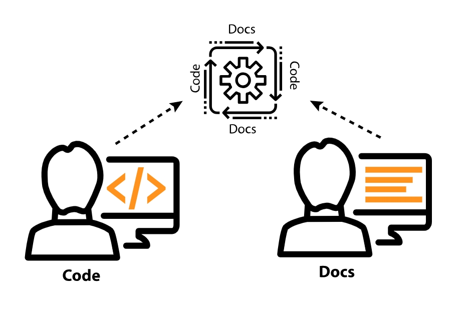

# Инструменты подхода Docs-as-code

Задумываясь об инструментальных средствах  для документирования API, во-первых нужно понять, кто будет писать. Если технические писатели будут создавать всю документацию, выбор инструментов не имеет большого значения. Но если разработчики будут вносить свой вклад в документацию, как правило, выгодно интегрировать ваши средства разработки и публикации в набор инструментов и рабочий процесс разработчика. Ориентированные на разработчика инструменты для документации часто называют инструментами docs-as-code. Инструменты Docs-as-code встречаются гораздо чаще, чем традиционные инструменты создания справки с документацией API.

[Интеграция инструментов разработчика с рабочими процессами](#integration)

[Что значит "Инструменты docs-as-code"](#tools)

[Преимущества подхода docs-as-code для документирования](#advantages)

[- Сотрудничество с разработчиками](#collaboration)

[- Постоянное обновление](#delivery)

[- Расширенное сотрудничество с другими участниками процесса](#Increased)

[- Гибкость и контроль](#flexibility)

[Более сложные факторы](#challengeFactor)

[Заключение](#conclusion)

## Интеграция инструментов разработчика с рабочими процессами

Риона Макнамара, технический писатель Google, говорит, что несколько лет назад внутренняя документация в Google была разбросана по вики, сайтам Google, документам Google и другим местам. В ходе внутренних опросов в Google многие сотрудники отметили, что невозможность найти точную и актуальную документацию является одной из их наиболее важных проблем. Несмотря на превосходство Google в организации внешней информации в Интернете, ее внутренняя организация оказалась сложной.

Риона говорит, что они смогли решить проблему, интегрировав документацию в рабочий процесс инженера. Вместо того, чтобы пытаться втиснуть инструменты, ориентированные на писателя, инженеру, они встраивают документацию в инструменты, ориентированные на разработчика. Разработчики теперь пишут документацию в файлах Markdown в том же хранилище, что и их код. Разработчики также имеют скрипт для отображения этих файлов Markdown в браузере непосредственно из репозитория кода.

Метод быстро завоевал популярность и сотни проектов разработчиков приняли его. Теперь вместо создания документации в отдельной системе (с использованием инструментов, ориентированных на писателя), разработчики просто добавляют документ в тот же репозиторий, что и код. Это расположение гарантирует, что любой, кто использует код, также может найти документацию. Инженеры могут либо читать документацию непосредственно в источнике Markdown, либо читать ее в браузере.

Если вы планируете что разработчики будут писать документацию, обязательно ознакомьтесь с презентацией Riona Macnamara на конференции Write the Docs 2015: [«Документация нарушена»: как два технических писателя изменили культуру разработки Google](https://www.youtube.com/embed/EnB8GtPuauw).

## Что значит "Инструменты docs-as-code

Написание документации разработчиками или внесение своего вклада ими в документацию должно повлиять на выбор инструмента документирования API. Если вы планируете привлекать разработчиков к написанию и редактированию, вы, естественно, выберете инструменты docs-as-code. Docs-as-code подразумевает обработку документов так же, как разработчики обрабатывают код. Обработка документов как код обычно означает выполнение некоторых из следующих действий:

- **Работа в простых текстовых файлах** (а не в бинарных форматах, таких как Adobe FrameMaker или Microsoft Word);
- **Использование генератора статичных сайтов** с открытым исходным кодом, такого как [Sphinx](Static-site-generators.md#sphinx), [Jekyll](Static-site-generators.md#jekyll) или [Hugo](Static-site-generators.md#hugo), для создания файлов локально через командную строку (вместо использования коммерческих программ, такой как FrameMaker или Word);
- **Работа с файлами при помощи текстовых редакторов** таких как Atom или Sublime Text (вместо того, чтобы полагаться на коммерческие инструменты с запатентованными закрытыми системами, которые функционируют как черные ящики);
- **Фиксация изменений документации при помощи систем контроля версий** (обычно это Git-репозиторий) аналогично хранению программного кода (вместо хранения документов в другом пространстве, например SharePoint или на общем диске); также, если необходимо, возможно хранение документов в том же хранилище, что и сам код;
- **Сотрудничество с другими авторами, использующими контроль версий**, например Git, для ветвления, слияния, отправки и извлечения обновлений (вместо совместной работы через большие системы управления контентом или сайты, подобные SharePoint);
- **Автоматизация процесса сборки сайта с непрерывным обновлением** для обновления информации на сервере при обновлении определенной ветви (вместо ручной публикации и передачи файлов из одного места в другое);
- **Запуск тестов** с использованием пользовательских сценариев для проверки неработающих ссылок, неправильных терминов / стилей и ошибок форматирования (вместо выборочной проверки содержимого вручную.

В общем, docs-as-code означает использование тех же систем, рабочих процессов и подходов к работе документами, что и с программным кодом.

## Преимущества подхода docs-as-code для документирования

Только потому, что можем управлять документами, как кодом, не так ли? В чем именно заключаются преимущества обработки документов как кода? Вот несколько причин для использования подхода docs-as-code.

### Сотрудничество с разработчиками

Если вы работаете с документацией для разработчиков, скорее всего, вы будете работать над широким спектром глубоко технических тем и будете зависеть от инженеров, которые будут  просматривать и редактировать документы. Часто документация для разработчиков является настолько сложной, что только разработчики могут действительно написать и просмотреть ее. Если у вас нет опыта работы в области проектирования, понимание всех деталей в программировании, конфигурации сервера или других технических платформах может оказаться за пределами вашей способности документировать (без большого количества исследований, интервью и тщательного ведения заметок).

> В посте [What technical writing trends will we see in 2018?](https://idratherbewriting.com/2018/01/02/technical-writing-trends-2018-and-2017-review/) находится описание того, как специализация заставляет технических писателей становиться более универсальным в работе с контентом.

Кроме того, некоторые разработчики предпочитают просто написать документ самостоятельно. Если разработчик является читателем, а другой разработчик - писателем, скорее всего, они могут найти общий язык в предположениях, предварительных знаниях и каких-то точных вещах. Короче говоря, бывает и такое, что разработчики сами пишут контент. Одного этого факта достаточно, чтобы обосновать необходимость использования подхода «docs-as-code».

Большинству разработчиков удобно работать с Markdown, им нравится работать в их существующем текстовом редакторе или IDE (интегрированная среда разработки) для редактирования контента, они предпочитают работать в репозитории Git с использованием инструментов ветвления, слияния и проверки кода, и, как правило, им удобен и привычен весь процесс написания кода и его окружение. Используя знакомые им инструменты, вы даете им возможность участвовать и вносить свой вклад в разработку и публикацию документации.

Несомненно, разработчики, которые пишут документацию, часто становятся жертвами [проклятия знаний](https://idratherbewriting.com/2007/01/24/the-curse-of-knowledge-the-more-you-know-the-worse-communicator-you-become/). То есть, чем больше они знают о теме, тем больше допущений  они позволяют при общении, при этом нужная информация оказывается потерянной. Несмотря на это, технические писатели не всегда могут иметь время для написания документации на инженерные темы. Во многих случаях группа разработчиков, имеющая API, может даже не иметь доступного технического писателя. Разработчики могут самостоятельно обрабатывать все, от кодирования до документов.

При наличии технических писателей, документация по API становится совместной работой разработчиков и технических писателей. Разработчики, как правило, больше внимания уделяют написанию адресной документации, тогда как технические писатели уделяют больше внимания концептуальной документации. Независимо от разделения труда, как технические писатели, так и разработчики стремятся тесно сотрудничать друг с другом. Таким образом, инструменты docs-as-code становятся необходимыми.

### Непрерывное обновление

Непрерывное обновление документов означает пересборку обновлений данных путем коммитов и загрузки содержимого в репозиторий Git, который затем обнаруживает, изменяет и осуществляет сборку и публикацию. Такое обновление значительно упрощает акт публикации. Можно редактировать десятки страниц и вносить свой код в репозиторий документов. При объединении ветви с  производственной средой, серверный процесс автоматически начинает сборку и развертывание контента на вашем сервере. Вам не нужно отправлять файлы на FTP сервер или выполнять какой-либо другой процесс развертывания вручную.

Первое знакомство с правильными командами Git может занять некоторое время. Но после практики в течение нескольких недель эти команды отойдут на второй план и станут автоматическими. Устранение хлопот, связанных с публикацией и развертыванием документов, позволяет вам больше сосредоточиться на контенте, быстрее и легче выдавать обновления. Публикация и развертывание обновлений больше не отнимает время. Непрерывное обновление - это убийственная функция, которая облегчает подход docs-as-code (когда дело доходит до публикации) по сравнению с другими решениями.

### Расширенное сотрудничество с другими участниками процесса

При работе команды технических писателей в одном и том же Git-репозитории с контентом, можно обнаружить гораздо большую осведомленность о том, что делают остальные участники команды. Перед фиксацией ваших изменений в репозиторий вы запускаете `git pull` для получения обновлений из удаленного репозитория. Вы видите файлы, над которыми работают остальные участники команды, внесенные ими изменения, и всем легче работать над контентом друг друга.

Работая в одном и том же хранилище, вы не раскиданы по отдельным проектам, которые существуют в разных пространствах. Инструменты Docs-as-code поощряют сотрудничество.

### Гибкость и контроль

Инструменты Docs-as-code предоставляют невероятную гибкость и контроль, чтобы приспособиться к конкретной среде или инфраструктуре компании. Например, предположим, что локализованная версия нашего веб-сайта требует, чтобы мы выводили контент с определенным шаблоном URL, или мы хотим доставлять контент со специальным макетом в некоторых средах, или включать собственные метаданные для обработки файлов конкретным образом с механизмами аутентификации или `whitelisting` вашей компании. С помощью инструментов docs-as-code файлы открываются и настраиваются в соответствии с желаемой логикой. Эти открытость и гибкость могут быть особенно важны, при интеграции документов на веб-сайт, а не генерируете отдельный вывод (см. [Шаблон 2: одностраничный веб-сайт](Design-patterns.md#second)).

Инструменты docs-as-code прямо пропорциональны вашим знаниям в кодировании. На базовом уровне почти все инструменты docs-as-code используют HTML, CSS и JavaScript. Так что, если вы мастер в этих веб-технологиях, то нет ничего невозможного.

Кроме того, многие генераторы статичных сайтов позволяют использовать логику сценариев, такую ​​как Liquid, которая упрощает JavaScript и упрощает выполнение сложных операций (таких как перебор файлов и вставка определенных полей в шаблоны). Логика сценариев дает вам возможность обрабатывать сложные сценарии. Вы можете использовать переменные, повторно использовать контент, абстрагировать сложный код с помощью шаблонов и многое другое.

> Подробнее о переходе к инструментам docs-as-code см. В разделе [Кейс для изучения: Переход на Docs-as-code](Switching-tools.md)

## Более сложные факторы

Многие решения docs-as-code не созданы с учетом требований технической документации. Предположим, у вас есть некоторые из следующих требований:

- локализация;
- повторное использование контента;
- версионирование;
- аутентификация;
- PDF.

Часто можно найти способы решения таких проблем при помощи нетрадиционных инструментов, но это не будет просто нажатие кнопки. Возможно потребуются некоторое творчество или более высокий уровень технических навыков и кодирования.

В одной компании, где автор использовал Jekyll, были требования как к выводу PDF, так и к версионированию. Было решено разделить контент на 8 разных продуктов (для разных продуктовых линеек и языков программирования). Ресурсов было потрачено вдвое больше, чем если включили вывод PDF для одного и того же контента.

Jekyll предоставляет язык шаблонов под названием Liquid, который позволяет выполнять условную фильтрацию, повторное использование контента, переменные и т. Д., Что соответствует требованиям выше. Автор использовал эту продвинутую логику, чтобы получить исходный код без дублирования содержимого. Другие генераторы статичных сайтов (такие как Hugo или Sphinx) имеют похожую логику шаблонов и сценариев, которая позволяет выполнять сложные задачи.

Для того, чтобы справиться с PDF при помощи Jekyll, был интегрирован инструмент под названием [Prince](https://www.princexml.com/), который преобразует список HTML-страниц в документ PDF, в комплекте с текущими верхними и нижними колонтитулами, нумерацией страниц и другими стилями печати (в нем даже используется CSS для стиля). также можно использовать [Pandoc](https://pandoc.org/), чтобы выполнять более простые требования PDF. Обработка PDF возможна, но обычно такая функция не является коробочной (кроме [Sphinx](http://www.sphinx-doc.org/en/master/)).

С любыми требованиями можно справиться при помощью нетрадиционных инструментов, но для этого может потребоваться больше опыта и творческого подхода.

## Заключение

В пространстве документации для разработчиков генераторы статичных сайтов доминируют в среде разработки и публикации. Привычные инструменты письма используются не так часто. Этот акцент на уникальных, нетрадиционных инструментах публикации является причиной, почему я посвятил целый раздел в этом курсе документации.
