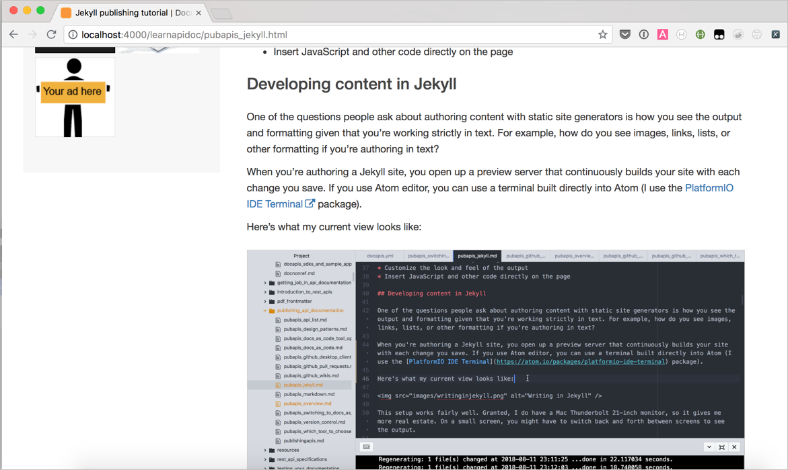
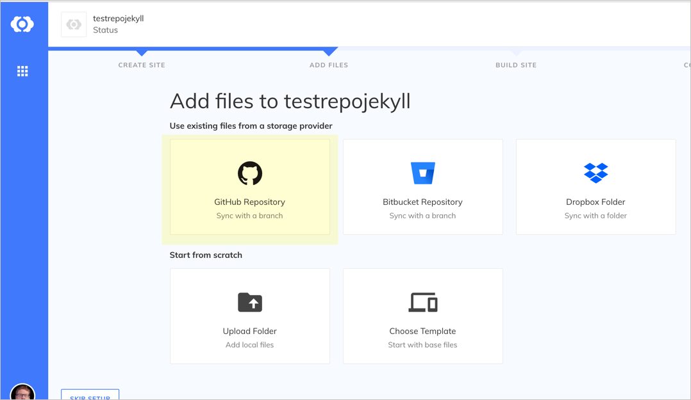
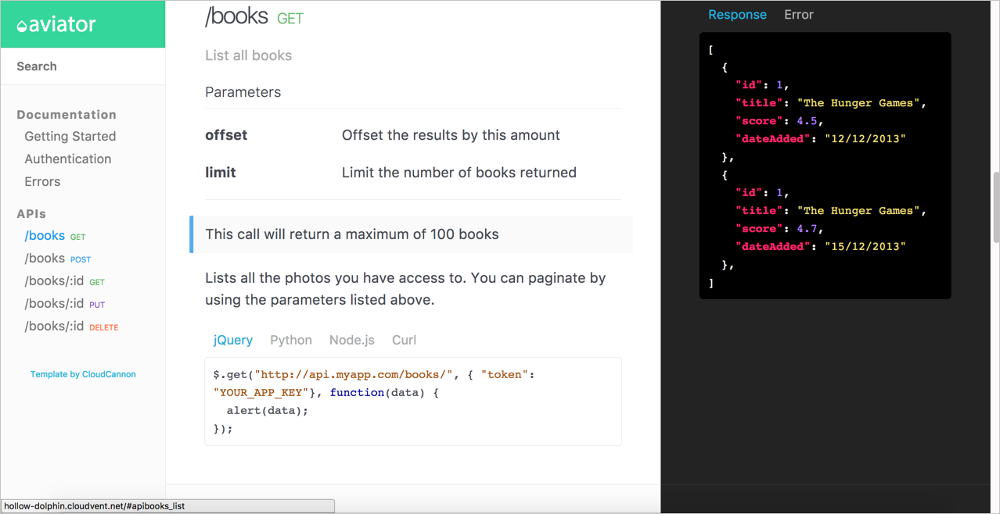

# Непрерывное развертывание Jekyll и CloudCannon


[Генераторы статических сайтов](Static-site-generators.md) - это разновидность компиляторов веб-сайтов, которые упаковывают группу файлов (обычно написанных с помощью [Markdown](More-about-Markdown.md)) и превращают их в полностью развертываемый веб-сайт. Одним из наиболее популярных генераторов статических сайтов (глядя на количество загрузок, использования и сообщества) является [Jekyll](https://jekyllrb.com/). Автор курса выбрал его, т.к. имеет большой опыт, поэтому сосредоточимся здесь на Jekyll, особенно на том, как можно интегрировать Jekyll с CloudCannon для решения публикации с непрерывной доставкой.

[О Jekyll](#about)

[Разработка контента в Jekyll](#develop)

[Автоматизация сборок из GitHub](#build)

[Настройка темы документации на GitHub](#setup)

[Обновление репозитория GitHub](#update)

[Тема Jekyll Aviator](#aviator)

<a name="about"></a>
## О Jekyll

Jekyll - это [генератор статических сайтов](Static-site-generators.md#jekyll) на основе Ruby, то есть он использует Ruby в качестве основного языка программирования для компиляции сайта. Сайт с оригиналом курса и [блог автора](https://idratherbewriting.com/) используют Jekyll. [Здесь](https://developer.amazon.com/appstore/documentation) документация также использует Jekyll. С Jekyll можно опубликовать полнофункциональный веб-сайт технической поддержки, который включает повторное использование контента, условную фильтрацию, переменные, вывод PDF и все то, что может понадобиться техническому писателю.

Вот [тема документации](https://idratherbewriting.com/documentation-theme-jekyll/), которую Том Джонсон разработал для Jekyll:


Здесь нет никакого специального форматирования конечной точки API, но платформа настолько гибкая, что можно делать с ней все, что угодно, если знать HTML, CSS и JavaScript (основной язык Интернета). Благодаря генератору статического сайта у нас есть инструмент создания полноценного веб-сайта с использованием практически любого стиля или JavaScript-фреймворка. На веб-сайте Jekyll можно включить сложную навигацию, повторное использование контента, переменные и многое другое.

Генераторы статических сайтов дают большую гибкость. Такие сайты являются хорошим выбором, если нужен обширный контроль и гибкие настройки сайта. В них отсутствует привязка к жестким шаблонам и стилям. Свои собственные шаблоны и вещи можно определять и структурировать по желанию. Например, со статическими генераторами сайтов можно сделать следующее:

- писать в текстовом редакторе, работающем с Markdown;
- создавать кастомные шаблоны документации;
- использовать рабочий процесс репозитория контроля версий;
- настраивать внешний вид вывода документации;
- вставлять JavaScript и другой код прямо на странице.

<a name="develop"></a>
## Разработка контента в Jekyll

Один из вопросов, которые люди задают при создании контента с помощью статических генераторов сайтов, - как выглядит вывод и форматирование, учитывая, что работа строго в тексте. Например, как выглядят изображения, ссылки, списки или другое форматирование при создании текста?

Вот как выглядит оригинал курса в Jekyll в редакторе Atom:


> отображение Atom во время работы в Jekyll

При создании сайта в Jekyll, сначала создается локальный предварительный просмотр с помощью этой команды:

```
bundle exec jekyll serve
```

Ответ будет выглядеть примерно так:

```
~/projects/learnapidoc [master] $ bundle exec jekyll serve
Configuration file: /Users/tomjoht/projects/learnapidoc/_config.yml
            Source: /Users/tomjoht/projects/learnapidoc
       Destination: _site
 Incremental build: disabled. Enable with --incremental
      Generating...
                    done in 6.457 seconds.
 Auto-regeneration: enabled for '/Users/tomjoht/projects/learnapidoc'
    Server address: http://127.0.0.1:4000/learnapidoc/
  Server running... press ctrl-c to stop.
  ```

> При использовании редактора Atom, можно использовать терминал, встроенный непосредственно в Atom (например пакет [Terminal Platform IDE](https://atom.io/packages/platformio-ide-terminal)).

После чего копируется адрес сервера предварительного просмотра (в данном случае http://127.0.0.1:4000/learnapidoc/) и вставляется в браузер. Этот сервер предварительного просмотра постоянно создает ваш сайт при каждом сохранении файла. Удобно использовать просмотр браузера рядом с редактором Atom, чтобы убедиться, что форматирование и изображения выглядят правильно:


> Сервер предпросмотра Jekyll

Такая настройка очень удобна. Конечно, большой монитор дает больше недвижимости. На маленьком экране, возможно, придется переключаться между экранами назад и вперед, чтобы увидеть результат.

Следует признать, что формат Markdown прост в использовании, но подвержен ошибкам, особенно если есть сложное форматирование списка. Но в основном, писать в Markdown - это радость. Можно сосредоточиться на контенте, не зацикливаясь на тегах. Если нужны сложные теги, все, что можно написать в HTML или JavaScript, можно добавить на свою страницу.

<a name="build"></a>
## Автоматизация сборок из GitHub

Jekyll можно интегрировать в такие платформы, как GitHub Pages или CloudCannon, чтобы создавать публикации с непрерывном развертыванием. Непрерывное развертывание подразумевает автоматическое добавление коммитов репозитория сразу на сайт Jekyll.

[GitHub Pages](Hosting-and-deployment-options.md#githubPages) бесплатен, используется автором курса для своего блога и  оригинала данного курса по документированию API. Но CloudCannon предоставляет больше возможностей, которые могут понадобиться организации. Итак, давайте последуем примеру публикации в [CloudCannon](https://cloudcannon.com/), которая описывает себя как «Облачная CMS для Jekyll».

На этом занятии мы создадим публикацию в CloudCanon, используя [тему документации для Jekyll](https://idratherbewriting.com/documentation-theme-jekyll/) (созданную автором курса). Не обязательно иметь компьютер с Windows, чтобы облегчить сборку и публикацию - сделать все через CloudCannon и Github. (Конечно, возможность сборки локально важна, при работе с Jekyll, но хотелось бы избежать здесь статей [по установке Jekyll](https://jekyllrb.com/docs/installation/) и просто продемонстрировать функции непрерывного развертывания, которые предоставляет такой хост, как CloudCannon.) Это руководство покажет, как подключиться к надежной платформе хостинга, которая читает контент, хранящийся и управляемый на GitHub.

<a name="setup"></a>
## Настройка темы документации на GitHub

1. Переходим на страницу [Github темы документации для Jekyll](https://github.com/tomjoht/documentation-theme-jekyll) и нажимаем **Fork** в верхнем правом углу.

Когда мы нажимаем **Fork**, копия проекта (с тем же именем) добавляется в наш репозиторий Github. Проект становится доступным по адресу `https://github.com/{your github username}/documents-theme-jekyll`.

Иногда люди копируют репозитории, чтобы внести изменения, а затем предлагают Pull requests исходному репо. В других случаях люди копируют репозитории, чтобы создать исходную точку для ветки проекта оригинала. Github полностью посвящен совместному кодированию - конечная точка одного человека является отправной точкой другого человека, и несколько проектов могут быть объединены друг с другом. Узнать больше о копировании можно по [ссылке](https://help.github.com/en/articles/fork-a-repo).

2. Создаем учетную запись на [CloudCannon](https://cloudcannon.com/); войдем в систему, используя свои учетные данные GitHub.
3. После входа в систему нажимаем **Create Site**, и присваиваем новому сайту имя. Затем нажимаем **Enter**, чтобы создать сайт.
4. Выбираем ячейку **GitHub Repository**


> Синхронизация с GitHub

5. Выбираем репозиторий GitHub, который копировали, - document-theme-jekyll. Переходим в ветку gh-pages.

6. CloudCannon извлечет файлы из синхронизированного репозитория в CloudCannon. Когда синхронизация закончится, нажимаем **Start Site Build**, чтобы CloudCannon собрал Jekyll с сервера.

По завершению сборки появится зеленая галочка в правом верхнем углу.

7. Переходим на панель инструментов.
8. На панели инструментов кликнем URL-адрес, который отображается под изображением вашего сайта:


> Отображение сайта

URL предварительного просмотра будет случайным, например `https://balmy-sunglasses.cloudvent.net/`. Нужно будет нажать **Continue to sample site**, потому что мы используем бесплатный план. При посещении URL, тема должна выглядеть точно так же, как [тема документации для Jekyll](https://idratherbewriting.com/documentation-theme-jekyll/).

Используя пользовательский интерфейс CloudCannon, можно вносить обновления в файлы, и обновления будут синхронизироваться с GitHub. Аналогично, при отправке обновления в GitHub, CloudCannon будет получать уведомления, извлекать изменения и перестраивать выходные данные.

Интеграция CloudCannon и GitHub довольно шокирующая. С помощью CloudCannon можно избавиться от всех хлопот, связанных с хостингом и обслуживанием сайта,  но нет блокировки в системе частным образом. Контент живет в специальной теме Jekyll на GitHub.

CloudCannon автоматически создает сайт при фиксации новых обновлений в репозитории GitHub, полностью удаляя этап публикации и развертывания веб-сайта. CloudCannon также предоставляет дополнительные функции для аутентификации, метрики, предлагаемые улучшения и многое другое.

Единственный недостаток CloudCannon заключается в том, необходимо разрешение от вашей организации на размещение документации на GitHub. Кроме того, CloudCannon взимает ежемесячную плату (см. [цены](https://cloudcannon.com/pricing/)). Если нужно обосновать сторонний хостинг, я рекомендую сделать это, проанализировав стоимость внутреннего хостинга и обслуживания.

Если стоимость является проблемой, и нет каких-либо ограничений конфиденциальности для ваших документов, можно рассмотреть возможность использования [GitHub Pages](https://pages.github.com/). GitHub Pages также предоставляет непрерывную интеграцию для проектов GitHub, и он бесплатный.

<a name="update"></a>
## Обновление репозитория GitHub

При подключении репозитория GitHub к CloudCannon, эти два сайта синхронизируют файлы. Посмотрим на рабочий процесс в действии.

1. В браузере на сайте GitHub переходим в форкнутый репозиторий и делаем изменения в файле.

Например, найдем файл `index.md` кликнем на иконку карандаша (`Edit this file`) обновим данный и закоммитим изменения.

2. Вернемся на CloudCannon и посмотрим, как сайт автоматически начнет пересобираться.


> CloudCannon обнаружит изменения и автоматически пересоберет Jekyll.

Подождем окончания сборки (синие вращающиеся стрелки поменяются на зеленую галочку), а затем найдем изменения в URL предварительного просмотра. Изменение должно быть отражено.

Теперь у нас есть рабочий процесс, включающий Github в качестве хранилища для синхронизации с темой Jekyll, размещенной на CloudCannon. Публикации делаем на лету, основываясь на коммитах репозитория. Такая непрерывная публикация, основанная на коммитах Git, является важной характеристикой [рабочего процесса docs-as-code](Doc-as-code-tools.md).

<a name="aviator"></a>
## Тема Jekyll Aviator

Тема документации по Jekyll, рассмотренная выше - это всего лишь одна возможность для сайта Jekyll. (Большинство людей, которые ее используют, в конечном итоге сильно настраивают ее под свои нужды.) Можно [тему документации Aviator API](https://github.com/CloudCannon/aviator-jekyll-template), в которой есть встроенный шаблонизатор API, или можно выбрать одну из многих других тем Jekyll. Автор курса написал [учебник по созданию собственной темы Jekyll](https://jekyllrb.com/tutorials/convert-site-to-jekyll/), где можно использовать сайт своей компании в качестве шаблона.


> Aviator theme

Для вдохновения вот несколько сайтов, использующих Jekyll:

- [Bootstrap](https://getbootstrap.com/)
- [Stack Overflow blog](https://stackoverflow.blog/)
- [RethinkDB](https://rethinkdb.com/docs/)
- [Github docs](https://help.github.com/en)
- [Basekit](http://docs.basekit.com/)
- [Jekyllrb docs](https://jekyllrb.com/docs/)
- [SendGrid docs](https://sendgrid.com/docs/)
- [Atlassian Design](https://atlassian.design/)
- [CloudCannon docs](https://docs.cloudcannon.com/)
- [Wistia help center](https://wistia.com/support)
- [Liquid (Shopify)](https://help.shopify.com/en/themes/liquid/basics)
- [devo.ps documentation](https://help.shopify.com/en/themes/liquid/basics)
- [healthcare.gov](https://www.healthcare.gov/)
