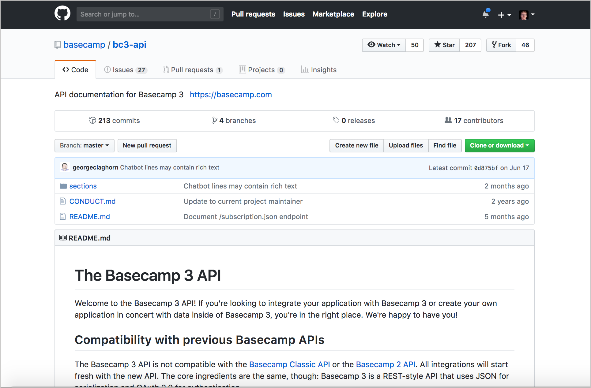
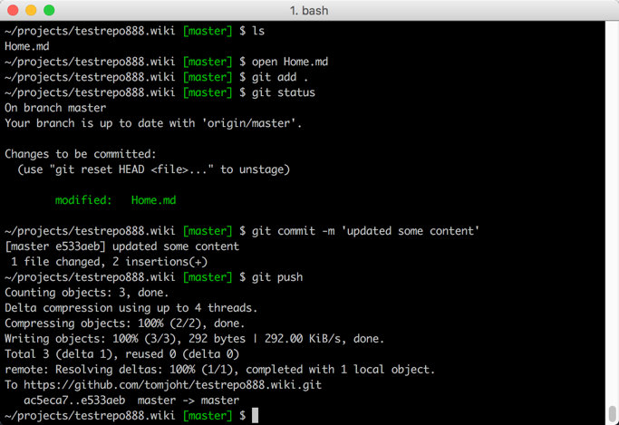

# Практическое занятие: Управляем контентом в Wiki Github

На этом занятии мы рассмотрим процесс публикации на одной из самых распространенных платформ для разработчиков: GitHub. Созданный репозиторий на GitHub имеет свою Wiki, к которой можно добавлять страницы. Wiki удобна, если исходный код хранится на GitHub. Хотя GitHub может и не быть платформой, на которой мы будем  публиковать свою документацию, понимание того, как работать с этой платформой важно для понимания [контроля версий](Version-control-system.md).

Изучение GitHub позволит ознакомиться с рабочими процессами управления версиями, которые являются общими для многих [инструментов docs-as-code](Doc-as-code-tools.md). По этой причине на этом курсе есть подробное руководство по использованию GitHub. Независимо от того, используется GitHub в качестве инструмента публикации, это руководство познакомит с рабочими процессами работы Git с контентом.

[О wiki на GitHub](#about)

[Ограничения wiki на GitHub](#limitations)

[Установка Git](#install)

[Настройка автоматической аутентификации GitHub](#setup)

[Практическое занятие: Создаем Wiki на GitHub и публикуем пример страницы](#activity-wiki)

[Практическое занятие: Делаем локальную копию репозитория](#activity-clone)

[Практическое занятие: Отправляем локальные изменения в удаленный репозиторий](#activity-push)

[Предотвращение конфликтов слияния при редактировании онлайн и локально](#merge-conflict)

<a name="about"></a>
##  О Wiki на GitHub

Wii на GitHub можно использовать в качестве сайта документации. Вот пример API Basecamp, который размещен на GitHub.



В отличие от других Wiki, создаваемый Wiki на GitHub - это собственный репозиторий, который можно клонировать и работать локально. (Если посмотреть на ссылку «Клонировать эту Wiki локально», то увидим, что это хранилище, отдельное от основного хранилища кода.) С файлами можно работать локально, и фиксировать их в хранилище Wiki. Можно расположить ссылки на вики-страницы на боковой панели.

Wiki-страницы на GitHub используют синтаксис Markdown. Для этого есть специальная версия, названная [Github-flavored Markdown](https://help.github.com/en/categories/writing-on-github) или GFM. Эта версия Markdown позволяет создавать таблицы, классы для блоков кода (для корректной подсветки синтаксиса) и т.д.

Поскольку с вики-файлами можно работать локально, можно использовать другие инструменты (например, генераторы статичных сайтов или даже DITA) для генерации файлов Markdown при желании. Работая локально, можно обрабатывать переиспользование, условную фильтрацию и другую логику за пределами вики-сайта GitHub. После чего можно вывести свой контент в виде файлов Markdown и зафиксировать их в своем хранилище GitHub.

> Git используется только для отслеживания текстовых файлов. Не работает Git c большими двоичными файлами, такими как аудиофайлы, видеофайлы, файлы Microsoft Word или файлы Adobe PDF. Системы контроля версий действительно не справляются с такими форматами, и размер репозитория будет возрастать в геометрической прогрессии. Используя Git для управления документацией, такие файлы исключаются через файл [.gitignore](https://git-scm.com/docs/gitignore). Можно также исключить изображения, так как они увеличивают размер вашего репо.

<a name="limitations"></a>
## Ограничения wiki на GitHub

Github имеет некоторые ограничения:

- **ограниченный дизайн:** все Wiki GitHub в значительной степени выглядят одинаково;
- **открытый доступ в Интернете:** если документация должна быть приватной, GitHub вряд ли будет подходящим местом для хранения (однако, есть опция делать репозитории приватными);
- **нет структуры:** Вики-страницы GitHub выдают пустую страницу и позволяют добавлять разделы. Но нет возможности делать какие-либо продвинутые стили или интерактивные функции.

> Здесь речь именно о встроенной функции Wiki на GitHub, а не [GitHub Pages](https://pages.github.com/). Для стилизования
 и автоматического создания контента можно использовать такие инструменты, как Jekyll.  Более подробно GitHub Pages рассмотрим в [руководстве по Jekyll](Jekyll-and-cloudCannon.md).

<a name="install"></a>
## Установка Git

Прежде чем начать работать с GitHub нужно настроить Git и установить все необходимые инструменты и учетные данные для работы с GitHub (особенно если вы работаете в Windows).

### Установка на Mac

Установка Git на Mac: [Installing on Mac](https://git-scm.com/download/mac)

После установки можно пользоваться Git несколькими вариантами:

- в предустановленном терминале, выбрав **Applications > Utilities > Terminal**;
- установить сторонний терминал [iTerm](https://www.iterm2.com/);
- использовать [PlatformIO IDE Terminal](https://atom.io/packages/platformio-ide-terminal) в [Atom](https://atom.io/) (наверное самый удобный способ работы с проектами)

### Установка на Windows

Самый подходящий установщик для Windows это [Git for Windows](https://gitforwindows.org/)

Этот инсталлятор включает в себя эмулятор терминала Git BASH, который позволят использовать команды Git и Unix.

Проверить, установлен ли у вас Git, открыв терминал и введя следующее:

    git --version

<a name="setup"></a>
## Настройка автоматической аутентификации GitHub

Git можно настроить так, чтобы не приходилось каждый раз вводить имя пользователя и пароль каждый раз при внесении изменений в GitHub. Как настроить можно почитать по ссылкам:

- [Set up Git](https://help.github.com/en/articles/set-up-git)
- [Generating a new SSH key and adding it to the ssh-agent](https://help.github.com/en/articles/generating-a-new-ssh-key-and-adding-it-to-the-ssh-agent)
- [Adding a new SSH key to your GitHub account](https://help.github.com/en/articles/adding-a-new-ssh-key-to-your-github-account)
- [Associating text editors with Git](https://help.github.com/en/articles/associating-text-editors-with-git)

Чтобы настройки вступили в силу терминал нужно перезапустить.

> GitHub и Git - это разные вещи. Git обеспечивает распределенный контроль версий. GitHub - это платформа, которая помогает управлять проектами Git. GitHub также предоставляет графический интерфейс, который позволяет выполнять множество команд Git.

<a name="activity-wiki"></a>
## 👨‍💻 Практическое занятие: Создаем Wiki на GitHub и публикуем пример страницы

**Создаем wiki на GitHub и публикуем контент на пробной странице**

В этом упражнении создадим новый репозиторий на сайте GitHub и опубликуем файла.

1. Открываем [GitHub](https://github.com/) и логинимся там. После нажимаем кнопку `+` и выбираем `New repository`


*Создание нового репозитория на GitHub*

3. Вписываем имя репозитория, краткое описание, выбираем видимость `public`, выбираем `Initialize the repo with a README` и затем нажимаем `Create repository` (Не стоит обращать внимания на выбор лицензии настроек gitignore для этого упражнения).

4. Переходим на вкладку **Wiki** в навигационной панели нового репозитория.

5. Нажимаем кнопку `Create the first page` (Если wiki уже существует, то нажимаем `New Page`).

6. На начальной странице `Home` вставляем свой документ, предпочтительно написанный в Markdown. Или можно просто перетащить содержимое страницы [fake endpoint called surfreport here](https://idratherbewriting.com/learnapidoc/assets/files/surfreportendpointdoc.md).

7. В поле `Edit message`  вписываем краткое описание (коммит).

8. Нажимаем `Save Page`

Обратите внимание, как GitHub автоматически преобразует синтаксис Markdown в HTML и стилизует его для удобства чтения.

Можно работать с этой вики-страницей GitHub в браузере, чтобы несколько человек могли совместно работать и редактировать контент. Однако, в отличие от других вики, с помощью GitHub вы также можете перевести весь контент в автономный режим и редактировать его локально, а затем зафиксировать свои изменения и отправить их обратно в online.

<a name="activity-clone"></a>
## 👨‍💻  Практическое занятие: Делаем локальную копию репозитория

**Клонируем репозиторий на локальную машину**

До сих пор мы работали с GitHub в браузере. Теперь мы возьмем тот же контент и будем работать с ним локально. Это то, что делает вики GitHub уникальным среди других вики - это репозиторий Git, поэтому вы можете управлять контентом так же, как и любым другим репозиторием Git (работая локально, выдвигая, вытягивая, объединяя, разветвляя и т. Д.).

1. Если на компьютере до сих пор не установлен клиент **Git**, тогда самое время его установить. (Проверить установку можно командой  `git --version` в командной строке. Подробно об установке **Git** [выше](#install)).

2. Просматривая вики-страницу GitHub в своем браузере, обратим внимание на раздел `Clone this wiki locally`. Нажмите кнопку буфера обмена. (Копируется URL клона в ваш буфер обмена.)


*Клонируем на локальный компьютер*

> Вики - это имеет отдельный URL, не относящийся к репозиторию проекта. Убедитесь, что вы просматриваете вики, а не  проект. URL клона будет включать `.wiki.`


В отличие от раздела `Clone this wiki locally`, кнопка «Clone in Desktop» запускает клиент GitHub Desktop и позволяет управлять репозиторием и вашими измененными файлами, фиксировать, передавать и извлекать через клиент GitHub Desktop. Об этом написано в практическом занятии [Используем клиент GitHub для десктопа](Use-GitHub-Desktop.md)

3. Открываем командную строку

 - те кто пользуется Windows, открывают эмулятор терминала [**Git Bash**](https://gitforwindows.org/),  
 - пользователи MacOS запускают **Applications > Utilities > Terminal** или [iTerm](https://iterm2.com/)

4. Репозиторий можно скачать в корневой каталог или в любой другой (тогда в терминале нужно перейти в нужный каталог командой `cd`)

5. Введите `git clone`? затем вызываем правой кнопкой мыши контекстное меню и нажимаем `paste`. Сохраненный в буфере URL нашей wiki добавится в строку команды (можно и вручную ввести url wiki):

```
git clone https://github.com/tomjoht/weatherapi.wiki.git
```

Нажимаем `Enter` и ждем пока система клонирует wiki. В это время видим на экране исполнение команды:

```
Cloning into 'weatherapi.wiki'...
remote: Enumerating objects: 3, done.
remote: Counting objects: 100% (3/3), done.
remote: Compressing objects: 100% (2/2), done.
remote: Total 9 (delta 0), reused 0 (delta 0), pack-reused 6
Unpacking objects: 100% (9/9), done.
```

В примере Git создал папку `weatherapi.wiki` 	

Клонирование вики делает копию содержимого на вашем локальном компьютере. Git - это программное обеспечение для контроля версий, поэтому у каждого есть своя собственная копия. Когда вы клонируете репозиторий, вы создаете копию на своем локальном компьютере; версия в облаке на GitHub называется «origin». Таким образом, у вас есть два экземпляра контента.

Однако, когда вы клонируете репозиторий, вы не просто копируете файлы, а инициализируете Git в папке, куда сохранен репозиторий. Инициализация Git означает, что Git создаст невидимую папку Git в этом каталоге, и Git может начать отслеживать ваши изменения в файлах, обеспечивая контроль версий. С инициализацией Git вы можете запускать команды `pull`, чтобы получать обновления из онлайн-хранилища (источника) в локальную копию. Вы также можете фиксировать `commit` свои изменения и затем вернуть их «origin».

6. Переходим в папку с клонированным репозиторием, чтобы посмотреть какие файлы клонированы.

<a name="activity-push"></a>
## 👨‍💻 Практическое занятие: Отправляем локальные изменения в удаленный репозиторий

**Отправляем локальные изменения на удаленный репозиторий**

1. В текстовом редакторе открываем наш файл, скачанный с репозитория git Hub. Файл будет открыт в приложении по умолчанию, связанном с этим типом файла. Вы также можете открыть файл, перейдя к нему вручную и открыв его, как обычно (просмотр в Finder или Explorer).

2. Внесем изменения и сохраним файл. Например напишем свое имя вверху документа.

3. В терминале удостоверимся, что находимся в нужной папке.

Для просмотра впишем команду `ls` под текущей строкой. Потом введем команду `сd/{имя папки}` для входа в папку или `cd ../`для перемещения на уровень выше.

4. Добавим все файлы:

```
git add .
```

Git не отслеживает все файлы в той папке, где он был инициализирован. Git отслеживает изменения только для файлов, которые были «добавлены» в Git. Набрав `git add .` или `git add --all`, вы говорите Git начать отслеживать изменения всех файлов в этом каталоге. Вместо этого вы также можете ввести здесь определенное имя файла, например `git add Home.md`, чтобы просто добавить определенный файл (а не все файлы, которые были изменены) для отслеживания в Git.		

После команды `git add` Git добавляет файлы в так называемую область подготовки. Используя спортивную аналогию, площадка для постановки похожа на беговую дорожку. Эти файлы готовы для фиксации, когда вы запускаете `git commit`.

5. Просмотреть статус файла можно командой

```
git status
```

Git ответит сообщением, указывающим, какие файлы готовы для коммита.

```
Changes to be committed:
	(use "git reset HEAD <file>..." to unstage)

		modified:   Home.md
```

В области подготовки перечислены все файлы, которые были добавлены в Git и которые вы каким-либо образом изменили.

Рекомендуется всегда проверять `git status` перед фиксацией файлов, потому что вы можете понять, что, набрав `git add .`, Вы могли случайно добавить некоторые файлы, которые вы не собирались отслеживать (например, большие двоичные файлы). Если вы хотите удалить этот файл из промежуточной области, вы можете ввести команду `git reset HEAD Home.md`, чтобы удалить его.

6. Коммитим изменения

```
git commit -m "updated some content"
```

Коммит создает слепок файла в данный момент времени для версионирования.

Команда `git commit -m` является ярлыком для фиксации и ввода сообщения коммита. Обновления таким способом гораздо проще фиксировать.

Если ввести только git commit, то будет предложено ввести описание коммита в режиме редактора Bash. Опишите изменения в верхней строке, а затем сохраните и закройте окно.

На Mac новое окно не открывается. Вместо этого в терминале открывается режим редактора Vim. («Vi» обозначает visual, а «m» - режим, но это не очень визуальный редактор.) Для выхода из редактора нажимаем клавишу Escape. Затем вводим `q`, чтобы выйти. (См. [Здесь команды Vim](https://coderwall.com/p/adv71w/basic-vim-commands-for-getting-started).) Возможно захочется настроить терминал так, чтобы открывался внешний редактор, такой как Sublime Text. Подробности в разделе [Связывание текстовых редакторов с Git](https://help.github.com/articles/associating-text-editors-with-git/).

7. Отправляем изменения на удаленный репозиторий командой

```
git push
```

Если автоматическая аутентификация на GitHub не настроена, то будет предложено ввести ваши учетные данные: логин и пароль (Ваш `username` - это логин ID на GitHub).

Обратите внимание: когда вы набираете `git push` или `git pull` и не указываете ветку, GitHub использует ветку по умолчанию из источника. Ветвь по умолчанию на GitHub называется `master`. Таким образом, фактически переданная команда - `это git push origin master` (это означает: отправить эти изменения в удаленный репозиторий origin, в ветке master). Некоторые разработчики предпочитают указывать хранилище и ветвь, чтобы обеспечить взаимодействие с нужными хранилищами и ветвями.

Окно терминала на Mac, будет выглядеть примерно так:



*Окно терминала с командами Git*

8. Теперь проверим наши изменения. Заходим на удаленный репозиторий и посмотрим изменения.

<a name="merge-conflict"></a>
## Предотвращение конфликтов слияния при редактировании онлайн и локально

Визуальный редактор на [GitHub.com](http://github.com/) может быть легким способом для специалистов в предметной области, в то время как технические писатели, вероятно, захотят клонировать репо и работать локально. Если некоторые люди вносят изменения в браузер, а другие редактируют локально, то можно столкнуться с конфликтами слияния. Чтобы избежать конфликтов слияния, всегда запускайте `git pull` перед запуском `git push`. Если два человека одновременно редактируют один и тот же контент между коммитами, вероятно, потребуется [разрешить конфликты слияния](https://help.github.com/en/articles/resolving-a-merge-conflict-using-the-command-line).
