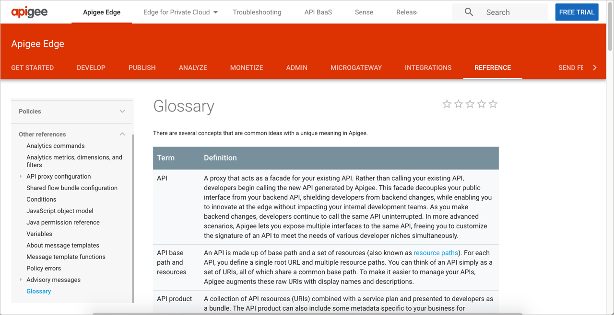

# API Глоссарий

В глоссарии API определяются все термины, которые могут быть уникальными для компании или API. Глоссарии часто пропускаются, но их важность не следует преуменьшать, поскольку большая часть понимания пользователем документации API зависит от ясности и согласованности конкретных терминов.

[Определяем любые слова](#define)

[Нужен ли глоссарий?](#provide)

[Глоссарии и требования к локализации](#requirements)

[Специализированные и неспециализированные термины](#terms)

[Интеграция глоссария с документацией](#integration)

[Образцы глоссария](#sample)

- [Lyft](#lyft)

- [Yext](#yext)

- [Apigee](#apigee)

[Практическое занятие: Глоссарий](#activity)

## Определяем любые слова

В отличие от большинства других профессиональных письменных дисциплин, техническая документация печально известна количеством специализированных терминов в своем содержании. Мало того, что у нас есть уникальные термины, относящиеся к нашим продуктам, так есть еще отраслевые жаргоны и термины, специфичные для компаний, вклинивающиеся в документацию, что и усложняет ее.

Евангелист API Kin Lane недавно отметил свое разочарование по поводу языка API, когда он обнаружил неопределенную аббревиатуру в некоторых документах API, которые он просматривал. Лейн объясняет:

> Я наткнулся на набор ресурсов API для управления DEG на днях. Вы можете добавлять, обновлять, удалять и получать DEG. Вы также можете использовать аналитику, историю и другие элементы DEG. Я потратил 10-15 минут на просмотр их портала для разработчиков, документации и даже поиска в Google, но так и не смог понять, что такое DEG. Нигде в своей документации они никогда не рассказывали потребителям, что такое DEG, вы просто должны были знать, я полагаю. Дизайнер API (если это произошло) и разработчик никогда не задумывались о том, что, возможно, кто-то наткнется на их общедоступный API и не знает, что такое DEG. ([Using Plain Language In Your API Paths](https://apievangelist.com/2018/07/09/use-plain-language-in-api-paths/))

В этом случае DEG должен быть аббревиатурой, специфичной для API разработчика. В таких случаях нет оправдания тому, что не определены собственные акронимы домашних животных и уникальный словарь.

Но во многих случаях аббревиатуры и незнакомые термины являются частью специализированной области. Техническому писателю необходимо использовать правильные термины в области знаний и  продукте, и те термины, которые часто соприкасаются с конкретной областью знаний.

Нельзя просто так взять и опустить необходимую терминологию и заменить более понятными именами. Нужно научить пользователей правильному языку, чтобы они могли участвовать в разговоре. Один общий подход к обучению пользователей тому, как говорить на этом языке, заключается в определении незнакомых слов для пользователя с помощью глоссария.

> Глоссарии не только дают пользователям ясность в отношении терминов, но и помогают авторам более четко и последовательно мыслить на эту тему.

На этом курсе [Глоссарий API находится здесь](../glossary-and-resourses/Glossary-for-API-documentation.md), в котором определены многие термины, относящиеся к документации API. Если встретится незнакомый жаргон, неопределенный в разделе, всегда можно обратиться к этому глоссарию.

## Нужен ли глоссарий?

Обычно, предоставление глоссария в документации похоже на выход за рамки служебного долга. Однако определение терминов имеет огромное преимущество как для автора, так и для пользователя. Определение терминов помогает распознать специальную терминологию, которая может использоваться в API - термины, к которым возможно, выработался иммунитет, из-за частого упоминания их на совещаниях по проекту. Определяя термины, вы гарантируете, что вы используете эти термины более точно и точно (вместо того, чтобы переключаться на синонимы для разнообразия).

## Глоссарии и требования к локализации

Если планируется локализация документацию по API, большинству переводчиков потребуется глоссарий. В документации API возможно присутствие многих технических терминов, о которых нужно знать переводчикам, чтобы они могли решить, следует ли переводить такие термины.

Например, предположим, в примере приложения для Android есть такие термины, как `PlaybackState` и «media session», «callback» и `BroadcastReceiver`. Переводчики должны быть достаточно подкованы технически, чтобы знать, должны ли эти термины быть переведены или оставлены как есть. Термины, выделенные в тегах кода, обычно не переводятся, но и многие другие термины, относящиеся к техническим элементам, также лучше не переводить. Бывает неясно, когда технический термин не обозначен как код, а относится к технической концепции или классу (например, «MediaSession»).

После того, как переводчики закончат переводить контент, перевод должен быть проверен специалистом по предмету на этом языке - обычно полевым инженером, который работает с клиентами в этой локализации. Глоссарий также поможет экспертам в данной области, рассматривающим перевод.

## Специализированные и неспециализированные термины

Одной из проблем при создании глоссария является различие между специализированными терминами, уникальными для одного API, и терминами, которые являются общими в отрасли или области знаний. Не нужно определять в глоссарии термины, которые являются общими в области знаний, в которой идет работа. Например, в примере приложения Android не нужно определять adb (Android Debug Bridge) в своем глоссарии, потому что любой, кто разрабатывает на Android, по-видимому, уже знаком с ADB.

Однако, если перечисление некоторых отраслевых терминов в глоссарии было бы полезно пользователям, которым может потребоваться больше информации, стоит добавить такие термины. Глоссарии могут легко вместить десятки или даже сотни терминов. В определения можно включать ссылки на внешние сайты, где доступна дополнительная информация.

Глоссарий - это место, где многие проблемы, связанные с документацией для разработчиков, становятся предметом внимания. Отделение терминологии API от общей области знаний становится причиной того, почему документация для разработчиков может быть настолько сложной для технических писателей (которые часто не являются экспертами в области знаний). Приходится полагаться на инженеров, которые помогут определить термины, которые необходимо определить.

> Подробнее о глоссарии в [«Снижение сложности технического языка»](https://idratherbewriting.com/simplifying-complexity/reducing-the-complexity-of-technical-language.html). В качестве наилучшей практики можно получить представление о том, используются ли правильные термины стандартным способом, прочитав документацию конкурента.

## Интеграция глоссария с документацией

Вопрос, который следует рассмотреть, - это как и где интегрировать глоссарий в технической документации. Например, предположим, что в контенте есть термины «ближнее поле» и «дальнее поле», относящиеся к голосовым взаимодействиям с устройством. Можно использовать эти термины в нескольких разделах и на разных страницах. Конечно, можно и определить эти термины на первой странице документации, при их используете, но что если они появятся на многих страницах? Пользователи могут начинать не с первой страницы, на которой есть определения терминов.

Можно использовать всплывающие подсказки терминов (например, [всплывающие подсказки от Bootstrap](https://getbootstrap.com/docs/4.1/components/tooltips/)), при их первом появлении на страницах документации. Но далее, проще всего ссылаться на определение в глоссарии, а не постоянно включать всплывающие подсказки. Пусть пользователи пробираются к глоссарию, когда им нужна помощь с термином. Если страница глоссария находится в четко видимом пространстве, не нужно будет связывать термины с их определениями в глоссарии при каждом использовании.

## Образцы глоссария

Ниже приведены образцы глоссариев

### Lyft

> Глоссарий Lyft

В глоссарии Lyft нет тонны терминов (их около 10), но все они   относятся к миру Lyft API. Видны такие термины, как «Lyft Line», «Lyft Lux», «Lyft Plus» и так далее. Здорово, что документация для разработчиков старается определить термины, которые могут часто использоваться в областях маркетинга и продаж. Всякий раз, когда компания включает глоссарий, она демонстрирует лояльность компании к пользователям. Компания не предполагает, что ее пользователи понимают все специализированные термины компании.

### Yext

> Глоссарий Yext

Обратите внимание, в глоссарии Yext, определения стандартных отраслевых терминов, такие как «SSO», охватывают и конкретное использование компанией SSO. Yext объясняет: «Единая регистрация, которая является функцией, доступной корпоративным клиентам и партнерам…». Затем следует подробный рассказ о партнерах и сотрудниках корпоративных клиентов и о том, как каждый из них может использовать SSO.

На боковой панели отображаются все термины, которые являются ссылками  на описания этих терминов. Такой подход может привести к тому, что пользователи теряют контекст своей боковой панели документации. Если глоссарий является общим для нескольких комплектов документации, можно было бы надеяться, что определения глоссария разработаны в едином источнике.

Одна из задач этого примера Yext - распределение глоссария по нескольким наборам документов. Предположим, что только некоторые из этих терминов относятся к одному набору документов, а другие термины относятся к другому набору документов. Разделяется ли глоссарий на несколько специализированных глоссариев по продуктам, или есть один общий глоссарий по всем продуктам?

Нужно использовать стратегию, имеющую смысл для конкретной документации. По большей части, не имеет значения, включены ли другие термины (не относящиеся к контексту документа),поскольку пользователи в основном переходят на одну конкретную запись глоссария. С другой стороны, фильтрация определений в соответствующем подмножестве также побудит читателей просмотреть определения.

### Apigee

> Глоссарий Apigee

Глоссарий Apigee - еще одна хорошая модель для подражания. Одним интересным решением глоссария Apigee является форматирование записей в виде таблицы. Формат, не имеет большого значения, но, учитывая, что в HTML есть официальные элементы списка определений, кажется немного странным отклонять списки определений и использовать вместо них таблицы. Списки определений обычно лучше отображаются на мобильных устройствах, таких как телефоны и планшеты, и с ними, в целом, легче работать.

Слишком часто глоссарии игнорируются в документации (не только в документации API). Так не должно быть. Сложность технического контента во многом обусловлена ​​большим количеством специализированных терминов - терминов, которые, по мнению групп разработчиков, часто знает их аудитория (но на самом деле это не так).

## 👨‍💻  Практическое занятие: Глоссарий

В своем [найденном опен-сорс проекте](../documenting-api-endpoints/find-open-source-project.md) найдем глоссарий (или его отсутствие). Ответим на следующие вопросы:

1. Есть ли глоссарий в API?
2. Если в API отсутствует глоссарий, какие определения стоит включить в глоссарий?
3. Если API включает в себя глоссарий, сделайте ссылку в определении терминов на нужный раздел документации для получения дополнительной информации.
4. Определены ли незнакомые термины в контексте самих тем?
5. Соответствуют ли термины в глоссарии тем же терминам, которые используются в документации конкурента?

[🔙](quick-reference-guide.md)

[Go next ➡](best-practices.md)
