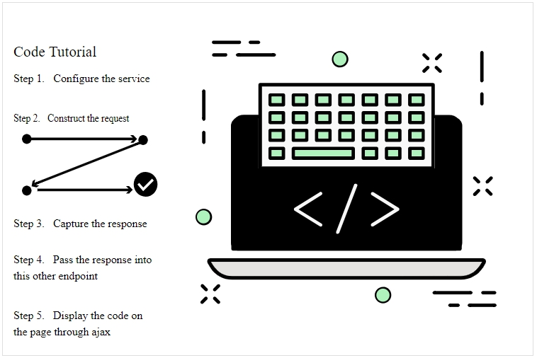
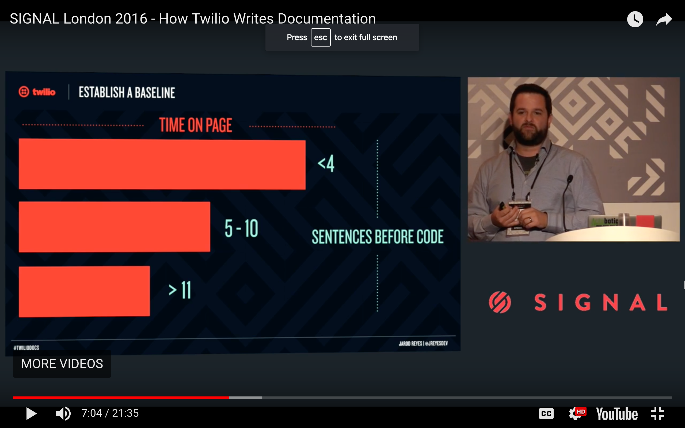
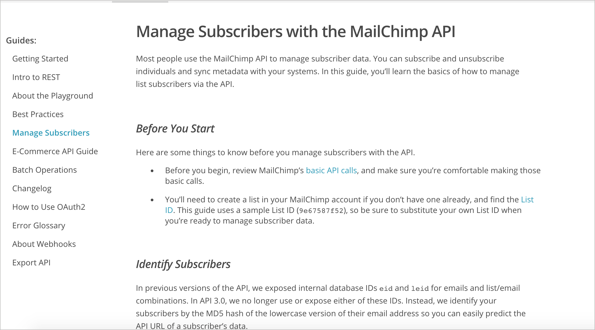

# Описание и образцы кода

У документации для разработчиков есть тенденция включать большое количество примеров кода. Примеры кода могут быть не включены в конечные точки, которые документируются. Но по мере того, как будут создаваться задачи и более сложные рабочие процессы, касающиеся того, как использовать API для достижения различных целей, будут использоваться разные конечные точки в которых будет указываться, как решать различные сценарии. Руководства по коду являются важной частью руководства пользователя.

#### Содержание раздела

[Образцы кода - конфета для разработчика](#candy)

[Дело не только в адресной документации](#refs)

[Фокус на "Почему?" а не "Что?"](#why)

[Добавляем комментарии к коду и пояснения "до и после"](#comments)

[Делаем примеры кода простыми](#simple)

[Делаем удобные примеры кода для "копипасты"](#copypaste)

[Предоставляем образец на целевом языке](#lang)

[Примеры описания кода](#samples)

- [Weather Underground](#weather)

- [Eventful](#eventful)

- [Twilio](#twilio)

- [Mailchimp](#mailchimp)

- [IBM Watson](#ibm)

[Пример кода для API прогноза погоды](#sampleCode)

[Практическое занятие: примеры кода](#activity)

## Образцы кода - конфета для разработчика

Образцы кода играют важную роль, помогая разработчикам использовать API. Код является другим языком, и когда пользователи, использующие этот язык, видят его, они получают гораздо больше, чем от простого текста (каким бы хорошим ни было описание).

> Код написан на другом языке, поэтому, как ни стараться описать общение на таком другом языке с помощью текста, все часто оказывается неэффективным. Разработчики понимают код гораздо лучше, чем текст.

В ходе пользовательского тестирования документации, проведенного Twilio, было обнаружено, что страницы, имеющие примеры кода, удобнее пользователям.

> В Twilio обнаружили, что когда у страниц было меньше предложений перед примерами кода, страницы привлекали пользователей больше.

В частности, страницы с менее чем 4 предложениями перед примерами кода выполняются дважды также, как и страницы с 11 предложениями перед примерами кода. Jarod Reyes объясняет:

> Дело больше в умственном блоке, чем в неспособности видеть код. Текст сообщает разработчику, что этой странице есть, что сказать, и что у него (разработчика) много работы. Разработчики не будут тратить время на чтение того, что вы хотите сказать. Мы видели это по всем разделам; мы видели это на всех страницах. Всякий раз, когда на странице много прозы и не так много кода, такая страница хорошо не работает. ([Как Twilio пишет документацию](https://eventil.com/talks/PPSznP-jarod-reyes-how-twilio-writes-documentation))

Другими словами, когда разработчики видят код, это равносильно просмотру темы, основанной на задачах, в руководстве пользователя - код указывает конкретное действие, которое должен предпринять разработчик, что привлекает внимание разработчиков.

## Дело не только в адресной документации

Иногда разработчики хотят избегать включения примеров кода в документы API, поскольку считают, что адресная документация по конечным точкам содержит всю информацию, необходимую разработчикам. Однако эта точка зрения часто недальновидна. В статье о программируемой сети под названием [Шесть столпов полной документации для разработчиков](https://www.programmableweb.com/news/six-pillars-complete-developer-documentation/2011/09/12) авторы объясняют:

> В то время как руководство разработчика должно помочь понять основные принципы использования API и его функциональных возможностей, оно не может охватить все возможные варианты использования этого API согласованным образом. Именно здесь появляются статьи и учебные пособия, чтобы научить разработчиков касательно или специализированному использованию API, например сочетать его с другим сервисом, фреймворком или API.

Другими словами, статьи и учебные пособия дополняют адресную документацию для предоставления полной инструкции. Примеры кода, которые показывают, как использовать различные конечные точки для достижения цели, занимают важное место в руководстве пользователя.

Кроме того, даже если включать примеры кода, уровень детализации и объяснения также может быть спорным. Многие разработчики предполагают, что аудитория имеет набор навыков, схожий с их собственным, без признания различных специализаций разработчиков. И поэтому они добавят пример кода, но не будут давать никаких объяснений по этому поводу. Внутренние разработчики часто говорят: «Если пользователь не понимает этот код, то и использовать наш API не стоит».

Если вы сталкиваетесь с таким отношением, напомните разработчикам, что пользователи часто имеют технические знания в разных областях. Например, пользователь может быть экспертом по Java, но только слегка знаком с JavaScript. Кто-то, кто является программистом базы данных, будет иметь другой набор навыков, чем тот, кто является программистом Python, у которого будет другой набор навыков и т.д. Учитывая эти различия и вероятную вероятность того, что у вас будет много начинающих (или незнакомых) пользователей, необходимы более обширные учебные руководства и пояснения.

## Фокус на "Почему?" а не "Что?"

Как только у вас появятся примеры кода в документации появится и вопрос: "как их документировать?" Пользовательские интерфейсы имеют четкие задачи - кнопки для нажатия, линейные рабочие процессы и т.д. Но документирование кода может быть более сложным. Стоит запомнить основной принцип: в любом примере кода надо сосредоточиться на вопросе «почему?», а не «что?». Нужно пояснить, почему вы делаете то, что делаете, а не подробно описывать то, что происходит, особенно когда вопрос "что?" относится к стандартной механике программирования, которая не уникальна для вашего API.

Например, вот разница:

- **ЧТО?**: "В этом коде несколько аргументов передаются в метод jQuery `ajax`. Ответ присваивается аргументу данных функции обратного вызова, что в данном случае является `success`";
- **ПОЧЕМУ?**: "Используйте метод `ajax` из jQuery, потому что он разрешает асинхронные ответы, которые не будут блокировать загрузку вашей страницы."

Разработчики, не знакомые с общим кодом, не связанным с вашей компанией (например, метод `.ajax()` из jQuery), должны обратиться к внешним источникам для получения руководств по этому коду. Не стоит писать свою собственную версию документации для другого языка программирования или сервиса. Вместо этого лучше сосредоточиться на частях кода, уникальных для своей компании. В остальном пусть разработчик полагается на другие источники (не стесняйтесь вставлять ссылки на другие сайты).

## Добавляем комментарии к коду и пояснения "до и после"

Документация кода должна сочетать комментарии кода с некоторыми пояснениями до или после примера кода. Разные языки имеют разные обозначения комментариев, но, как правило, краткие комментарии к коду выделяются косой чертой `//` в коде; более длинные комментарии выделяются между слешами и звездочками, например: `/ * .... * /`.

Комментарии в коде обычно представляют собой короткие однострочные заметки, которые появляются после каждых 5-10 строк кода. Можно дополнить код более подробными объяснениями в своей документации, но лучше всего разбавить примеры кода комментариями, потому что он помещает объяснение рядом с кодом, выполняющим действие. Такой подход добавления кратких комментариев в коде, сопровождаемый более здравыми объяснениями после кода, согласуется с принципами [постепенного раскрытия информации](https://idratherbewriting.com/2012/08/09/applying-progressive-information-disclosure-to-online-help-navigation/), которое помогает как опытным, так и начинающим типам пользователей. В этом случае постепенное раскрытие информации означает, что вы предоставляете некоторые подробности в контексте действия, а затем добавляете ссылки для получения дополнительной информации, если это необходимо пользователю.

Разве не будет несколько избыточным писать комментарии, перемежающиеся в коде, а также в разделах до или после кода? На самом деле, нет. Некоторые исследования о том, как разработчики используют документацию, обнаружили, что существует два распространенных поведения: разработчики, которые начинают с кода и читают концептуальную документацию высокого уровня только по мере необходимости (так называемое «оппортунистическое» поведение). И разработчики, которые начинают с концептуальной документации более высокого уровня, прежде чем переходить к коду (так называемое «систематическое» поведение). Майкл Мэн, Стефани Штайнхардт и Андреас Шуберт объясняют:

> Как только сформировалось понимание уровня и функций API, появились два разных пути, которые очень похожи на «систематических» и «оппортунистических» личностей разработчиков, описанных Clarke (2007) (см. Также Stylos, 2009). По словам Кларка (2007), систематические разработчики работают сверху вниз в том смысле, что они пытаются глубже понять систему в целом, прежде чем переходить к отдельным компонентам. С другой стороны, цели обучения оппортунистических разработчиков более узко сфокусированы на решении конкретной проблемы и зависят от конкретных проблем и блокировщиков, с которыми они сталкиваются при работе над решением («Документация интерфейса прикладного программирования: чего хотят разработчики программного обеспечения?» технического письма и коммуникации. 2018, том 48 (3) 295–330. [ResearchGate](https://www.researchgate.net/publication/318733467_Application_Programming_Interface_Documentation_What_Do_Software_Developers_Want))

Для оппортунистического разработчика, который сначала запускает код, комментарии в коде могут быть полезнее документации.  Но не все начинают с кода. Некоторые предпочитают сначала читать документацию.

Дополнительные сведения о том, как документировать код, см. В статье «Когда не следует комментировать: вопросы и компромиссы с документацией API для проектов C ++», написанной Эндрю Хедом, Кейтлин Садовски, Эмерсоном Мерфи-Хиллом и Андреа Найт (2018 ACM / IEEE 40-я Международная конференция по Программная инженерия. [ResearchGate](https://www.researchgate.net/publication/325732077_When_not_to_comment_questions_and_tradeoffs_with_API_documentation_for_C_projects)). Исследователи выясняют, где более склонны искать разработчики: в верхнеуровневых файлах (где появляются более формальные описания класса и методов) или в коде реализации документации (они сосредоточены на C ++). В некоторых случаях чтение кода реализации напрямую обеспечивает более ясный путь к пониманию для разработчиков. Кроме того, некоторые разработчики не доверяют актуальности документации и поэтому предпочитают смотреть на код напрямую. Однако для более сложного кода было полезно учиться на более сложной документации верхнеуровневых файлов.

В целом, программисты могут читать код по-разному. Но, как показывают исследования, было бы неплохо включать комментарии непосредственно в код, а также давать более формальные объяснения вне кода. Если разработчики дают кусок кода, в котором есть комментарии, не стоит думать, что комментарии кода каким-то образом отделены от документации или находятся за пределами руководства технического писателя. Стоит подумать о комментариях в коде как об эквивалентной контекстной справке в пользовательском интерфейсе - во многих отношениях это может быть наиболее читаемый контент из всех.

## Делаем примеры кода простыми

Примеры кода должны быть сокращены до их самой простой формы. Предоставление кода для всей HTML-страницы, вероятно, не требуется. Но включение некоторого окружающего кода никому не повредит, а для новичков может помочь им увидеть общую картину. (Также легче копировать и вставлять.)

Кроме того, избегайте включения большого количества стилей или других деталей в код, которые потенциально отвлекут аудиторию от основного момента. Чем минималистичнее пример кода, тем лучше. Например, если вы демонстрируете простую функцию JavaScript, у вас может возникнуть желание поддержать ее с помощью тщательно разработанного стиля CSS, чтобы демонстрация выглядела четко. Тем не менее, весь дополнительный CSS будет только вносить больше сложности и путаницы, которые конкурируют с оригинальным принципом, который вы пытаетесь показать с примером кода.

Когда разработчики интегрируют код в производственную среду, они, вероятно, внесут какие-то изменения, учитывая масштабирование, многопоточность и эффективность, а также другие факторы производственного уровня.

## Делаем удобные примеры кода для "копипасты"

Часто разработчики копируют и вставляют код непосредственно из документации в свое приложение. После чего правят его под свои конкретные параметры или методы.

Если предполагается, что пользователи будут так поступать с кодом, нужно убедиться, что он работает. Например, в описании на сайте API Ajax, параметр `dataType` был записан как `datatype`. В результате код не работал (он возвращал ответ в виде текста, а не JSON). Потребовалось около 30 минут для устранения неполадок, прежде чем обратились к [методу `ajax`](http://api.jquery.com/jquery.ajax/) и поняли, что это должен быть тип данных с большой буквы `T`.

В идеале, нужно протестировать все примеры кода самостоятельно (или внедрить более надежный процесс для тестирования кода). Тестирование позволяет выявлять ошибки, понимать, являются ли все параметры полными и действительными, и многое другое. В видео от Twilio авторы говорят, что они хотели обрабатывать примеры кода в документации как их другой инженерный код, поэтому они хранили свой код в отдельном контейнере (также помещенном в GitHub) для выполнения регулярных тестов. Они вставили код в свою документацию. Для длинных примеров кода можно рассмотреть возможность хранения кода на GitHub. Таким образом, инженеры могут легче тестировать его как часть своих тестов для каждого выпуска. Иногда, когда блоки кода скрываются в документации, они теряются в новых релизах.

## Предоставляем образец на целевом языке

REST API позволяет разработчикам использовать практически любой язык программирования для выполнения запроса. Неизбежно возникнет один вопрос: следует ли показывать примеры кода, охватывающие несколько языков? Если да, сколько языков?

Предоставление примеров кода - это хорошо, поэтому, если есть пропускная способность для отображения примеров кода на разных языках, нужно этим пользоваться. Достаточно предоставлять только один пример кода на целевом языке аудитории. Если для большинства пользователей не существует стандартного языка, можно просто предоставить примеры curl в документации, а затем предлагать пользователям [коллекции Postman](../like-developer/submit-requests-postman.md) или [файл спецификации OpenAPI](../openAPI-specification/introduction-openapi-and-swagger.md) - оба эти подхода позволят разработчикам создавать примеры кода в много разных языков.

Каждый пример предоставленного кода должен быть протестирован. ПРи обновлении API, нужно будет обновлять каждый из примеров кода на используемых языках. Когда API выдвигает новую версию, нужно проверять все примеры кода, чтобы убедиться, что код не нарушает изменения в новой версии (это называется «регрессионное тестирование» на языке QA).

Включение большого количества примеров кода увеличивает объем работы тестирования и обслуживания, но, с другой стороны, примеры кода -  наиболее полезный тип контента для пользователей.

## Примеры описания кода

Ниже приведены несколько примеров разделов с примерами кода в документации API.

### Weather Underground

> Примеры кода Weather Underground

В этом примере Weather Underground есть несколько примеров кода на нескольких языках, но нет объяснения того, что возвращает пример кода. В этом случае код, достаточно прост, чтобы разработчики могли посмотреть на него и понять из самого кода, что происходит. Тем не менее, некоторые объяснения обычно оправданы, особенно если есть несколько способов сделать запрос.

Иногда разработчики могу говорить, что код «самодокументируется», то есть из самого кода видно, что происходит. Без знания языка программирования трудно оценить это утверждение. Если столкнуться с таким выражением, нужно рассмотреть возможность проверки этого утверждения у других разработчиков, особенно вне группы разработчиков продукта (или с пользователями, если к ним есть доступ).

### Eventful

> Код Eventful

Здесь не видно примеров кода, но документы Eventful содержат различные примеры параметров строки запроса для конечных точек. Хотя эти параметры также определены в их [справочной документации для конечной точки поиска](http://api.eventful.com/docs/events/search), этот раздел раскрывает, как использовать параметры более удобным и подробным способом.

У Eventful хорошее описание в разделе, оно показывает, как документация, которая обычно содержится в справочном материале, может быть извлечена и объяснена более подробно с помощью примеров. Это показывает больше разницы между справочной и учебной информацией.

### Twilio

> коды Twilio

Раздел "Примеры кода" Twilio, пожалуй, самый впечатляющий и имеет самые подробные описания из приведенных здесь примеров. Они не только проводят пользователей от начала до конца, но и представлены на многих языков. Конкретные примеры кода расположены в правую колонку, в то время как описательная часть раздела занимает среднюю колонку. Все шаги не сразу отображаются в разделе. При достижении одного конца шага, нужно нажать кнопку, чтобы показать следующий шаг. Такое постепенное раскрытие информации может уменьшить чувство страха, которое могут испытывать пользователи в начале работы.

Хотя средний столбец уже правого столбца, на самом деле средний столбец просто содержит повествовательный текст для аннотирования и пояснения кода. Если нажать кнопку в руководстве, то справа откроется код, размывая остальную часть экрана. Их реализация - технический подвиг, который редко где встретишь.

### Mailchimp

> коды Mailchimp

Как обычно, Mailchimp предоставляет полные описания своих продуктов. В разделе «Перед началом работы» перечислены все необходимые предварительные условия перед началом работы. Каждая часть раздела выделяется заголовками.

Выделение разделов заголовками более приемлемо, чем нумерованные списки (шаги). Большинство технических писателей используют нумерованные шаги в качестве привычки в технических документах, поэтому, когда они начинают писать описание кода, первое желание состоит в том, чтобы пронумеровать шаги. Но в разделе описания кода могут быть длинные примеры кода, за которыми следуют подробные объяснения и так далее. Ведение пронумерованных шагов может стать обременительным. Заголовки разделов обеспечивают менее проблематичное форматирование, и по-прежнему можно вводить заголовок каждого раздела с помощью «Шаг 1», «Шаг 2» и т.д.

### IBM Watson

> коды IBM Watson

У IBM Watson описание отлично справляется с задачей, разбивая этапы на различные разделы с простыми шагами в каждом из. Предварительно в нем перечислены цели обучения, продолжительность и предпосылки. Нет ничего особенно сложного в форматировании или отображении - акцент делается на контент.

## Пример кода для API прогноза погоды

На этом курсе мы рассмотрели [каждый элемент адресной документации](../documenting-api-endpoints/new-endpoint.md) для вымышленной конечной точки, называемой `surfreport`, в API сервиса прогноза погоды, с которым мы работали. Давайте вкратце вернемся к этому сценарию и предположим, что мы также хотим добавить описание кода для отображения отчета о серфинге на веб-странице. Как может выглядеть тако описание? Вот пример:

    Code tutorial for `surfreport` endpoint

    В примерах кода ниже показано, как использовать конечную точку `surfreport` для получения высоты прибоя для определенного пляжа.

        <!DOCTYPE html>
        <head>
        
        
        </head>
        <body>
        <h2>Surf Height</h2>
        

        </body>
        </html>

        В этом примере используется метод `ajax` из jQuery, поскольку он позволяет асинхронно загружать удаленный ресурс.

        В запросе мы отправляем авторизацию в URL строки запроса. Конечная точка ограничивает количество дней, возвращаемых к 1, для увеличения скорости загрузки.

        В демонстрационных целях ответ присваивается аргументу `response` метода `done`, а затем записывается в тег `surfheight` на странице.

        Мы получаем только высоту прибоя, но есть много других данных, которые можно выбрать для отображения.

Можно объяснить детали более подробно, даже построчно просматривая код, но здесь комментарии уже составляют примерно половину длины кода. Присутствуют комментарии и в самом коде. Комментарии больше относятся к вопросу «почему?», а не «что?».

Документирование кода может быть одним из самых сложных аспектов документации. Часть проблемы заключается в том, что код не организован таким образом, что построчное (или блочное) описание не имеет смысл. Переменные часто определяются в первую очередь, вызываются функции, которые определены в другом месте, да и многие другие аспекты также являются нелинейными. Объясняя логику, можно обнаружить, что приходится прыгать по разным местам кода, не обязательно перемещаясь сверху вниз.

> Для более глубокого понимания того, как документировать примеры кода, см. презентацию автра курса[ «Создание примеров кода для документации API / SDK»](https://idratherbewriting.com/2014/05/30/creating-code-samples-webinar-recording-slides-and-audio/).

## 👨‍💻 Практическое занятие: примеры кода

В своем [найденном опен-сорс проекте](../documenting-api-endpoints/find-open-source-project.md) найдем примеры кода в API документации. Ответим на следующие вопросы:

1. Есть ли примеры кода? На каких языках?
2. Сколько примеров кода есть? Много? Немного? Ни одного?
3. Есть ли комментарии внутри кода?
4. Как концептуальные объяснения указывают на конкретные строки кода? Объяснение дается до, во время или после блоков кода?
5. Сосредоточены ли объяснения кода на вопросе «почему?» (решения, лежащие в основе кода) или «что?» (механика кода)?

[🔙](rate-limiting.md)

[Go next ➡](sdks-sample-apps.md)
