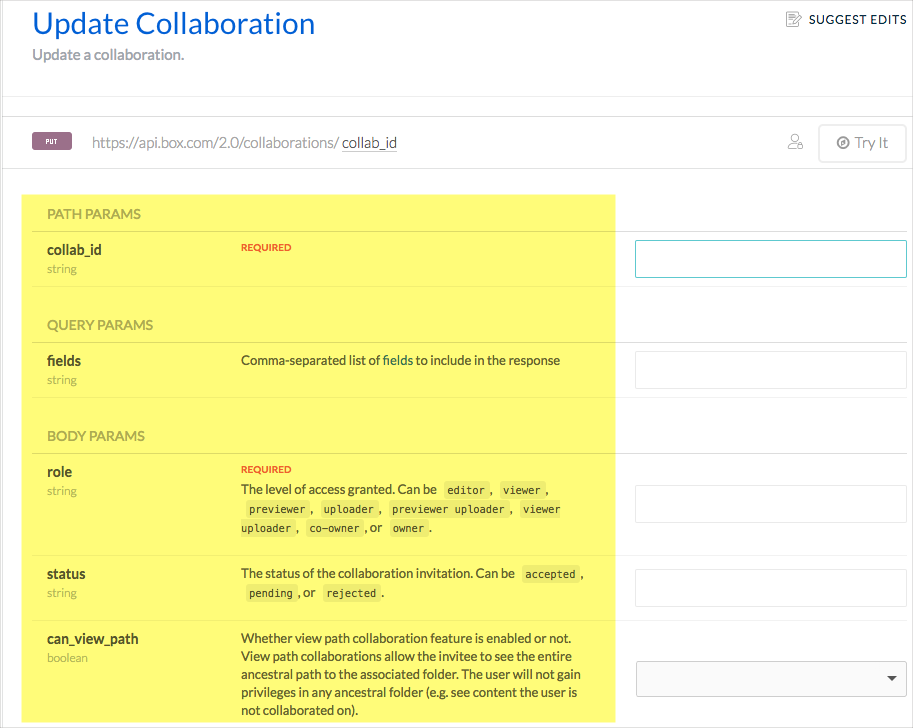

# 👨‍💻 Практическое занятие: Поиск open-source проекта

Чтобы проникнуть в мир API документации, нам нужно подумать о примерах API документации в нашем портфолио. Портфолио является ключом к [работе технического писателя API документации](../Getting-job/README.md). Без портфолио, содержащего убедительные примеры, будет сложно найти работу по документации API.

[Избегаем "Уловки-22"](#catch22)

[Поиск опен-сорс проекта с API](#opensourseSearch)

[Практика: Поиск проекта с необходимостью документирования API](#docNeed)

[Понимание типа API, используемого в проекте](#recognize)

[Содействие потребует навыков работы с Git](#gitSkill)

[Не недооценивайте свои писательские навыки](#docSkill)

[Дополнительное чтение](#reading)

[Следующие шаги](#nextSteps)

## Избегаем "Уловки-22"

Предположим, у нас нет опыта работы с API документацией, но мы пытаемся получить работу техписателя API документации. Работодатели будут готовы не обращать внимания на опыт, если мы сможем продемонстрировать примеры написания документации API. Но как мы получим примеры описания API без API-документации? И без примеров API документации как мы можем получить желаемую работу? Это может показаться невозможной ситуацией.

Обойти эту "Уловку-22" очень просто: создаем примеры документации API с помощью проектов с открытым исходным кодом, в которые мы внесли свой вклад. Вот где пригодится данное практическое занятие.

Вместо того, чтобы просто завершать модули и отслеживать свои успехи в завершении курса, выполняемые нами практические занятия помогут пополнить наш портфолио примерами документации API, помогая либо получить задание по документированию API, либо выполнить домашний запуск проект по API документации.

## Поиск опен-сорс проекта с API

Если у вас уже есть проект API в вашей работе, или если вы разработчик, работающий над проектом API, просто выберите свой существующий API для курсовых работ. Однако, если вы развиваете свои навыки API документации с нуля, вам нужно найти проект документации API с открытым исходным кодом, в который вы можете внести свой вклад.

Поиск подходящего проекта может быть сложной задачей, но он важен для вашего портфолио и вашего успеха в проникновении в мир документации API. К счастью, почти все проекты с открытым исходным кодом используют GitHub, и GitHub предоставляет различные теги для документации и «help wanted» для привлечения добровольцев. (Задача настолько распространена, GitHub предоставляет [советы по поиску проектов с открытым исходным кодом](https://help.github.com/articles/finding-open-source-projects-on-github/).)

Идеальный опен-сорс проект должен отвечать следующим критериям:

- проект содержит API (не [нативную библиотеку API](../Native-library/Overview-of-library.md) или какой-либо другой инструмент разработчика, который не является API);
- проект нуждается в документации API;
- проект не должен быть настолько технически сложным, чтобы вы не могли его изучить. (Если вы уже знакомы с языком программирования, вы можете ориентироваться на проекты, ориентированные на этот язык.);
- Проект должен быть активным, с недавними коммитами.

## 👨‍💻 Практика: Поиск проекта с необходимостью документирования API

Для поиска нужного проекта:

1. Открываем [расширенный поиск GitHub](https://github.com/search/advanced)
2. Скроллим экран и ищем раздел **Issues Options**. В поле **With the labels** вписываем `help wanted`. Это стандартный тег, который команды используют для привлечения добровольцев в свой проект (но некоторые команды, которым нужна помощь, могут его и не использовать). Скроллим вверх и замечаем, что надпись: «Требуется помощь» автоматически заполняется в поле **Advanced Search**.
3. В поле **Advanced Search** добавляем ключевые слова `documentation` и `api` перед тегом `help wanted`  

4. Нажимаем кнопку `Search` и видим результат.

В полученном списке можно поискать проект REST API (а не API нативной библиотеки, такой как Java API). Есть ли проекты, которые выглядят интересными или перспективными? Если так, отлично. Если нет, добавляем ключевые слова и продолжаем искать.

5. Если поиск на GitHub не дал подходящих проектов, можно поискать на следующих ресурсах:
 - [Trending GitHub projects](https://github.com/trending)
 - [Crowdforge](https://crowdforge.io/)
 - [Up for Grabs](https://up-for-grabs.net/#/)
 - [Bus Factor](https://libraries.io/experiments/bus-factor)
 - [Code Triage](https://www.codetriage.com/)
 - [Changelog](https://changelog.com/)
 - [24-hour Pull Requests](https://24pullrequests.com/)
 - [Programmableweb.com API directory](https://www.programmableweb.com/category/all/apis)

> Примечание. Можно потратить много времени на поиск, оценку и участие в проекте с открытым исходным кодом. Для этого упражнения хорошо бы сосредоточиться на проекте, который выглядит только слегка интересным. Не обязательно сразу коммититься, это можно сделать в любое время.

6. После выбора проекта пометим следующее:

 - Задействован ли REST API в проекте?
 - Как в проекте помечены проблемы, связанные с документацией? Например, используется ли в нем ярлык «документация»?
 - Определяем текущее состояние документации проекта: является ли она надежной, скудной, обширной, есть она вообще?
 - Насколько активен проект? (Какова частота коммитов?)
 - Сколько участников в проекте?

> Примечание: Пока не нужно связываться или взаимодействовать с командой. Мы просто собираем информацию и анализируем потребности в документации здесь.

## Понимание типа API, используемого в проекте

Во время поиска проекта API, нужно понять, что существует множество различных типов API. Многие из API-интерфейсов, с которыми мы работаем, могут быть [исходными библиотеками API](../Native-library/Overview-of-library.md), которые не используют веб-протоколы для выполнения запросов и ответов (как это делают API-интерфейсы REST), а скорее подключают к проекту библиотеки для конкретного языка. Если кажется, что API фокусируется на определенном языке, а документация API выглядит автоматически, скорее всего это исходная библиотека API.

С другой стороны, если документация проекта содержит основные разделы конечных точек - это API REST.

## Содействие потребует навыков работы с Git

Прежде чем вносить свой вклад в опен-сорс проект, нужно понять основной процесс Git [Pull request](../Publishing-doc/Pull-request-workflows.md). Для понимания рабочего процесса Git возможно придется освоить [инструкции Git](https://www.atlassian.com/git/tutorials) или вот [Git на русском](https://githowto.com/ru). Но лучший способа изучения Git, это активная практика в реальном проекте.

Не стоит переживать о Git сейчас. Можно изучить его позже, когда будет рабочий контент. Пока же просто ищем проект.

## Не недооценивайте свои писательские навыки

Можно подумать, что слишком рано думать о присоединении к проекту, не говоря уже о внесении вклада в проект документации API, особенно когда мы только учимся этому. Когда мы взаимодействуем с командой разработки опен-сорс проекта, можно чувствовать страх, что нет навыков программирования. Однако не стоит недооценивать нашу роль в качестве автора документации (независимо от вклада). Проекты с открытым исходным кодом частенько сильно страдают от паршивой документации.

В обзоре [GitHub Survey: Open Source Is Popular, Plagued by Poor Docs and Rude People](https://adtmag.com/articles/2017/06/05/open-source-survey.aspx), Дэвид Рамел резюмирует результаты [опроса GitHub 2017 года](https://opensourcesurvey.org/2017/):

> Неполная или устаревшая документация является распространенной проблемой, наблюдаемой 93 процентами респондентов, однако 60 процентов участников говорят, что они редко или никогда не вносят свой вклад в документацию.

Также посмотрим [Open source documentation is bad, but proprietary software is worse](https://www.techrepublic.com/article/open-source-documentation-is-bad-but-proprietary-software-is-worse/) Мэтта Асаи. Мэтт выделяет результаты документации того же опроса GitHub:

> 93% респондентов скрежетали зубами от некачественной документации, но также признались, что практически ничего не сделали для улучшения ситуации. … Если вы считаете, что глубокая потребность в документации побудит большее количество разработчиков внести свою лепту и помочь, вы ошибаетесь: 60% разработчиков не могут потрудиться представить документацию.

Так что, да, как технические писатели, мы не исправляем ошибки в коде и не разрабатываем новые функции, но наша роль разработчика документации все еще крайне необходима и ценится. Мы - редкие птицы в лесу разработки.

Автору курса хорошо знакомо значение роли документации из его личного опыта написания документации для опен-сорс проектов. В какой-то момент, прежде чем сосредоточить свою энергию на этом курсе по API, он написал несколько руководств для документации по [Jekyll](https://jekyllrb.com/docs/). Том Джонсон добавил инструкции, которые включали много нового контента, и даже добавил раздел [Tutorials](https://jekyllrb.com/tutorials/home/).

Предполагалось, что другие разработчики будут продолжать создавать новые руководства, но они этого не делали. Разработчики, как правило, добавляют небольшие отрывки документации к страницам - предложение здесь, абзац там, обновление здесь, исправление там. Редко можно найти кого-то, кто пишет новую статью или учебник с нуля. Когда выпускается новый выпуск, часто не появляются заметки о выпуске - это просто ссылки на (загадочные) журналы проблем GitHub.

Поэтому нужно быть уверенным в ценности, которую мы можем внести в опен-сорс проект. Мы создаем необходимую документацию для проекта.

## Дополнительное чтение

Дополнительные материалы к изучению:

- [How to choose (and contribute to) your first open source project](https://github.com/collections/choosing-projects);
- [Contribute to open-source projects through documentation](https://mapzen.com/blog/open-source-docs/)

Справочник по GitHub Pull Request доступен в разделе [Процесс Pull request на GitHub](../Publishing-doc/Pull-request-workflows.md)

## Следующие шаги

Приступаем к следующему практическому занятию: [ Оценка ключевых элементов API документации](evaluate-api-referense-docs.md)

[🔙](whats-wrong.md)

[Go next ➡](evaluate-api-referense-docs.md)
