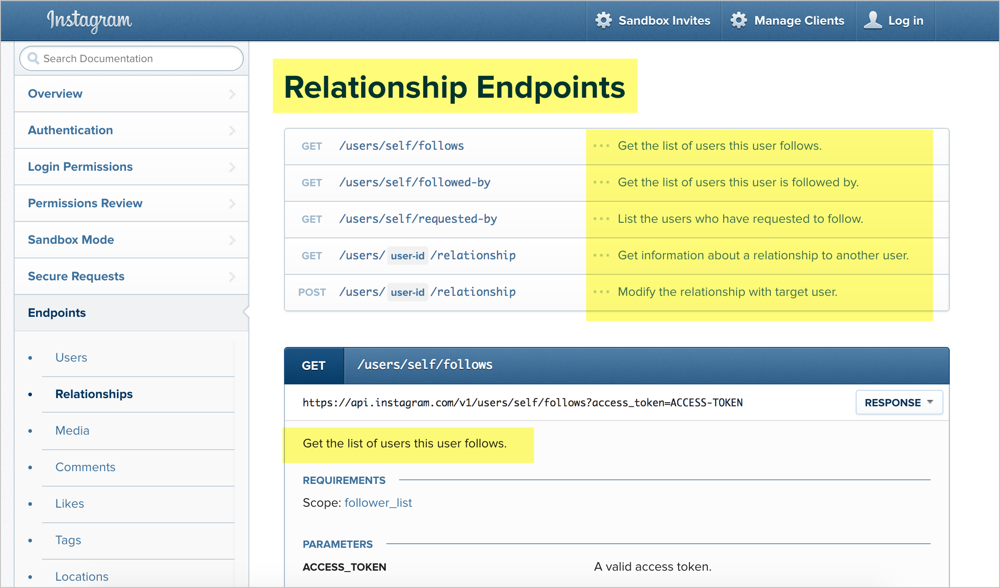

# Шаг 1. Описание ресурса (Описание API)

| [**Шаг 1. Описание ресурса**](step1-resourse-description.md) |-->| [*Шаг 2. Конечные точки и методы*](step2-endpoints-and-methods.md) |-->| [*Шаг 3. Параметры*](step3-parameters.md) |-->| [*Шаг 4. Пример запроса*](step4-request-example.md)|-->| [*Шаг 5. Пример и схема ответа*](step5-response-example-and-schema.md) |

«Ресурсы» относятся к информации, возвращаемой API. Большинство API могут иметь различные категории информации или ресурсы, которые могут быть возвращены.

Описание ресурса делают кратким (1-3 предложения) и обычно начинают с глагола. Ресурсы обычно имеют различные конечные точки доступа и несколько методов для каждой конечной точки. На одной и той же странице обычно описывается общий ресурс и ряд конечных точек для доступа к ресурсу.

[Примеры описания ресурсов](#examples)

[Терминология описания ресурса](#terminology)

[Познаем разницу между  пользовательской и API документацией](#docsvsguides)

[Описание ресурса конечной точки Surfreport](#surfReport)

[Следующие шаги](#nextSteps)

## Примеры описания ресурсов

Вот пример описания [API ресурса Campaigns](https://developer.mailchimp.com/documentation/mailchimp/reference/campaigns/#) проекта Mailchimp:

Как правило, API имеет несколько конечных точек, сгруппированных в одном ресурсе. В этом случае вы описываете как общий ресурс, так и отдельные конечные точки. Например, ресурс Campaigns имеет различные конечные точки, которые также описаны:

- POST `/campaigns`
- GET `/campaigns`
- GET `/campaigns/{campaign_id}`
- PATCH `/campaigns/{campaign_id}`
- DELETE `/campaigns/{campaign_id}`
- POST `/campaigns/{campaign_id}/actions/cancel-send`
- POST `/campaigns/{campaign_id}/actions/pause`
- POST `/campaigns/{campaign_id}/actions/replicate`
- POST `/campaigns/{campaign_id}/actions/resume`
- POST `/campaigns/{campaign_id}/actions/schedule`
- POST `/campaigns/{campaign_id}/actions/send`
- POST `/campaigns/{campaign_id}/actions/test`
- POST `/campaigns/{campaign_id}/actions/unschedule`

А вот описание API ресурса Membership Object в проекте [Box](https://developer.box.com/reference#membership-object)

Для ресурса "Membership" (или "Object", как они его называют) существует 7 различных конечных точек или методов, которые вы можете вызвать. API Box описывает ресурс Membership и каждую из конечных точек, которые позволяют получить доступ к ресурсу.

Иногда общий ресурс не описан; вместо этого в нем просто сгруппированы конечные точки. Основная часть описания появляется в каждой конечной точке. Например, в API Eventbrite есть ресурс Events:

Хотя ресурс "Events" здесь не описан, описания добавлены для каждой конечной точки. Ресурс Events содержит все эти конечные точки:

- `/events/search/`
- `/events/`
- `/events/:id/`
- `/events/:id/`
- `/events/:id/publish/`
- `/events/:id/cancel/`
- `/events/:id/`
- `/events/:id/display_settings/`
- `/events/:id/display_settings/`
- `/events/:id/ticket_classes/`
- `/events/:id/ticket_classes/:ticket_class_id/`
- `/events/:id/canned_questions/`
- `/events/:id/questions/`
- `/events/:id/attendees/`
- `/events/:id/discounts`

и так далее

> Когда разработчики создают API-интерфейсы, у них возникает вопрос проектирования: использовать много вариантов конечных точек (как в API-интерфейсе Eventbrite) или предоставить множество параметров для настройки одной и той же конечной точки. но все же лучше найти баланс. Кажется, что тенденция заключается в предоставлении отдельных конечных точек, а не в предоставлении множества потенциально запутанных параметров для одной и той же конечной точке. С другой стороны, API-интерфейсы GraphQL (которые я не рассматриваю в этом курсе) предоставляют одну конечную точку различными способами запроса информации, содержащейся в конечной точке. См. [Различия в GraphQL и REST, объясняемые на бургерах](https://apievangelist.com/2018/06/29/rest-api-and-graphql-burger-king/), для пояснения GraphQL и REST.

В качестве еще одного примера вот пример ресурса Relationship API Instagram

Ресурс `Relationship` не описан, но является контейнером для конечных точек этого ресурса. Описания добавлены для каждого из ресурсов, сгруппированных в ресурсе Relationships:

- GET `/users/self/followsGet`
- GET `/users/self/followed-byGet`
- GET `/users/self/requested-byList`
- GET `/users/user-id/relationshipGet`
- POST `/users/user-id/relationshipModify`

и еще в качестве пример API с ресурсами и конечными точками, проверьте [API Trello](https://developers.trello.com/v1.0/reference#introduction).

> Скорее всего, описание ресурса мы будем использовать в разных местах - обзоры продуктов, учебные пособия, примеры кода, быстрые ссылки и т.д. В результате приложим немало усилий для его создания. Давайте подумаем о том, чтобы сохранить описание многократно используемого фрагмента в своем инструменте разработки, чтобы мы могли использовать его, не прибегая к "копипасте" в нашем [кратком руководстве](../conceptual-topics/quick-reference-guide.md).

## Терминология описания ресурса

Точного термина *ресурс* не существует. На «вещи», к которым мы обращаемся с помощью URL, можно ссылаться различными способами, но *ресурс* является наиболее распространенным термином, потому что обращаемся к этим вещам через URL (Uniform Resource Locator - унифицированный указатель ресурса). Помимо «ресурсов», можно встретить такие термины, как вызовы API, конечные точки, методы API, вызовы, объекты, сервисы и запросы. В некоторых документациях обходят термины, называя все просто «Ссылка».

Несмотря на разнообразие терминологии, обычно API имеет различные «ресурсы», к которым мы обращаемся через «конечные точки». Конечные точки предоставляют нам доступ к ресурсу. Но терминология не является стандартной, поэтому разнообразие документации обязательно будет.

## Познаем разницу между  пользовательской и API документацией

Описания ресурсов (а также описания конечных точек) обычно делают короткие, в 1-3 предложения. Что делать, если вы хотите добавить больше деталей? В этих ситуациях имейте в виду разницу между документацией ресурса и руководствами пользователя / пошаговыми инструкциями:

- документация ресурса: краткая информация, на которую разработчики могут быстро ссылаться;
- руководства пользователя / пошаговые инструкции: более подробные сведения о том, как использовать API, включая пошаговые инструкции, примеры кода, концепции и процедуры. Более подробно узнаем об этом в главе [Концептуальные разделы](../conceptual-topics/README.md).

Хотя описание ресурса API содержит сводную информацию, содержащуюся в ресурсе, в 1-3 предложениях, можно дать более развернутую информацию в руководстве пользователя. (Можете дать ссылку на места в руководстве, где предоставлена более подробная информация.)

## Описание ресурса конечной точки Surfreport

Давайте посмотрим на пример [wiki-страницы Surfreport](new-endpoint.md#wikiSerf) и попробуем сделать описание ресурса в 1-3 предложения.

Вот пример автора:

**Surfreport**

Содержит информацию об условиях серфинга, включая высоту прибоя, температуру воды, ветер и прилив. Также предоставляет общую рекомендацию о том, стоит ли заниматься серфингом.

## Следующие шаги

Теперь пришло время перечислить [конечные точки и методы](step2-endpoints-and-methods.md)

[🔙](api-reference-tutorial-overview.md)

[Go next ➡](step2-endpoints-and-methods.md)
