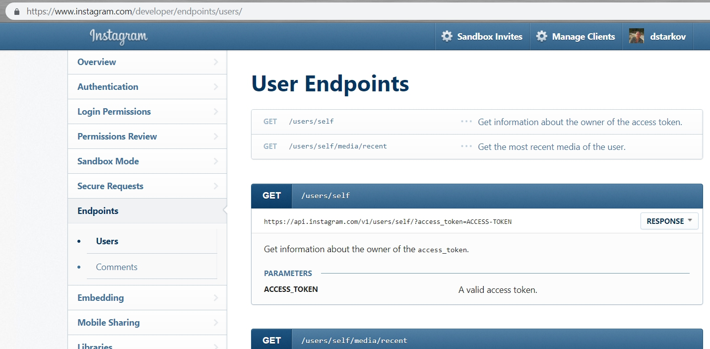
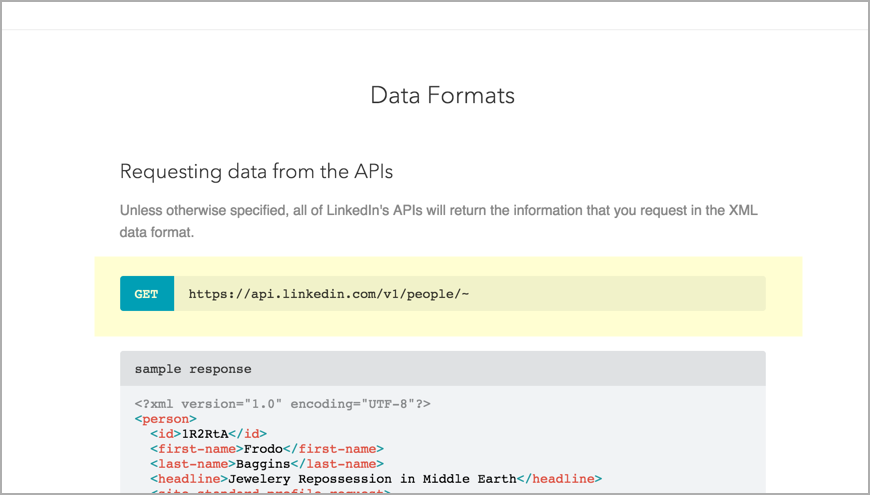

# Шаг 2: Конечные точки и методы

| [*Шаг 1. Описание ресурса*](step1-resourse-description.md) |-->| [**Шаг 2. Конечные точки и методы**](step2-endpoints-and-methods.md) |-->| [*Шаг 3. Параметры*](step3-parameters.md) |-->| [*Шаг 4. Пример запроса*](step4-request-example.md)|-->| [*Шаг 5. Пример и схема ответа*](step5-response-example-and-schema.md) |

Конечные точки указывают, как получить доступ к ресурсу, а метод указывает разрешенные взаимодействия (такие как GET, POST или DELETE) с ресурсом.

Один и тот же ресурс обычно имеет множество связанных конечных точек, каждая из которых имеет разные пути и методы, но возвращает различную информацию об одном и том же ресурсе. Конечные точки обычно имеют краткие описания, похожие на общее описание ресурса, только еще короче. Кроме того, конечная точка показывает только конечный путь URL ресурса, а не базовый, общий для всех конечных точек, путь.

[Примеры конечных точек](#endpointsExamples)

[Представление параметра пути при помощи фигурных скобок](#brackets)

[Перечисляем методы конечной точки](#methodList)

[Конечная точка показывает только конечный путь](#endPath)

[Как сгруппировать несколько конечных точек одного ресурса](#multiple)

[Как ссылаться к конечным точкам в инструкциях](#endpointRefer)

[Конечная точка API surfReport](#surfEndpoint)

[Следующие шаги](#nextSteps)

<a name="endpointsExamples"></a>
## Примеры конечных точек

Вот пример конечной точки ресурса `User` API Instagram



Конечная точка обычно выделяется стилизованным образом для придания ей более визуального внимания. Большая часть документации строится вокруг конечной точки, поэтому, может, имеет смысл визуально выделить конечную точку в нашей документации.

Конечная точка, возможно, является наиболее важным аспектом документации API, потому что она является тем, что разработчики будут реализовывать для выполнения своих запросов.

<a name="brackets"></a>
## Представление параметра пути при помощи фигурных скобок

[Параметры пути](step3-parameters.md#pathParam) в конечных точках, представляют в фигурных скобках. Например, вот пример из API Mailchimp:

    /campaigns/{campaign_id}/actions/send

По возможности, параметр пути выделяют другим цветом, для его выделения:

    /campaigns/{campaign_id}/actions/send


Фигурные скобки для параметров пути являются условием, понятным пользователям. В приведенном выше примере почти ни одна конечная точка не использует фигурные скобки в синтаксисе фактического пути, поэтому `{campaign_id}` является очевидным плэйсхолдером.

Вот пример из API Facebook, где параметр пути выделен цветом для его легкой идентификации:


Для выделения параметров, при их описании в документации Facebook, используется зеленый цвет, который помогает пользователям понять их значение.

Параметры пути не всегда выделяются уникальным цветом (например, некоторым может предшествовать двоеточие), но, как бы то ни было, нужно убедиться, что параметр пути легко идентифицируется.

<a name="methodList"></a>
## Перечисляем методы конечной точки

Для конечной точки обычно перечисляют методы (GET, POST и т. Д.). Метод определяет работу с ресурсом. Вкратце, каждый метод выглядит следующим образом:

- GET: получает ресурс;
- POST: создает ресурс;
- PUT: обновляет или создает в существующем ресурсе;
- PATCH: частично изменяет существующий ресурс;
- УДАЛИТЬ: Удаляет ресурс.

См. [Request methods](https://en.wikipedia.org/wiki/Hypertext_Transfer_Protocol#Request_methods) в статье Wikipedia по HTTP для получения дополнительной информации. (Существуют дополнительные методы, но они редко используются.)

Поскольку о самом методе особо говорить нечего, имеет смысл сгруппировать метод с конечной точкой. Вот пример из Box API:


А вот пример API LinkedIn:



> Иногда этот метод называют «глаголом». GET, PUT, POST, PATCH и DELETE - это все глаголы.

<a name="endPath"></a>
## Конечная точка показывает только конечный путь

Когда мы описываем конечную точку, мы указываем только конечный путь (отсюда и термин «конечная точка»). Полный путь, который содержит как базовый путь, так и конечную точку, часто называют URL-адресом ресурса.

В нашем примере сценария API конечной точкой является просто `/surfreport/{beachId}`. Вам не нужно каждый раз указывать полный URL ресурса (который будет [https://api.openweathermap.org/surfreport{beachId}](https://api.openweathermap.org/surfreport{beachId}).
Указание полного URL ресурса может отвлечь внимание пользователей. В своем руководстве пользователя мы будем объяснять полный URL-адрес ресурса вместе с необходимой информацией по [авторизации](../conceptual-topics/authentication-and-authorization.md) в вводном разделе (например, в  [Руководстве по началу работы](../conceptual-topics/getting-started.md)).

<a name="multiple"></a>
## Как сгруппировать несколько конечных точек одного ресурса

Еще стоит обращать внимание при документировании конечных точек и методов, как группировать и перечислять конечные точки, особенно если у нас много конечных точек для одного и того же ресурса. В [Примерах описания ресурсов](step1-resourse-description.md#examples) мы рассмотрели различные API. Многие сайты документации используют различные схемы группировки или перечисления каждой конечной точки ресурса, поэтому не будем возвращаться к тем же примерам. Группируйте конечные точки таким образом, осмысленно, например, по методу или по типу возвращаемой информации.

Предположим, у нас есть три конечных точки GET и одна конечная точка POST, причем все они относятся к одному и тому же ресурсу. На некоторых сайтах документации все конечные точки для одного и того же ресурса могут перечисляться на одной странице. На других сайтах может встречаться разбивка методов на отдельных страницах. На третьих могут быть созданы одна группа для конечных точек GET, а другая - для конечных точек POST. Это зависит от того, что и сколько должно быть сказано о каждой конечной точке.

Если конечные точки в основном совпадают, объединение их на одной странице может иметь смысл. Но если они в значительной степени уникальны (с разными ответами, параметрами и сообщениями об ошибках), разделение их на разные страницы, вероятно, лучше (и проще в управлении). Опять же, создав более сложный дизайн сайта, мы можем сделать большую информацию доступной для навигации на той же странице.

В разделе, посвященном [шаблонам проектирования](../Publishing-doc/Design-patterns.md), есть пояснение, что [длинные страницы](../Publishing-doc/Design-patterns.md#fourth) - это общий шаблон документации для разработчиков, отчасти потому, что они позволяют легко находить контент для разработчиков с помощью `Ctrl + F`.

<a name="endpointRefer"></a>
## Как ссылаться к конечным точкам в инструкциях

Как ссылаться к конечным точкам в разделе API в руководствах и другом безадресном контенте? Ссылка на конечную точку `/aqi` или на конечную точку `/weatherdata` не имеет большого значения. Но для более сложных API-интерфейсов использование конечной точки для описания ресурса может оказаться непростым делом.

В одной компании URL-адреса конечных точек ресурса Rewards выглядели так:

```
/rewards
/rewards/{rewardId}
/users/{userId}/rewards
/users/{userId}/rewards/{rewardId}
```

А Rewards в контексте Missions выглядели вот так:

```
/users/{userId}/rewards/{missionId}
/missions/{missionid}/rewards
```

Сказать, что можно использовать ресурс Rewards, не всегда было достаточно конкретно, потому что было несколько Rewards и конечных точек Missions.

В этом случае, возможно, неудобно обращаться к конечной точке. Например, может быть такое предложение: «При вызове `/users/{userId}/rewards/`, вы получаете список всех наград. Чтобы получить конкретное вознаграждение за определенную миссию для конкретного пользователя, конечная точка `/users/{userId}/rewards/{missionId}` принимает несколько параметров… »

Чем длиннее конечная точка, тем более громоздкой становится ссылка. Эти виды описаний будут чаще встречаться в [концептуальных разделах](../conceptual-topics/README.md) вашей документации. Как правило, нет четкого правила, как ссылаться на громоздкие конечные точки. Смысловой подход нашего API определим самостоятельно.

<a name="surfEndpoint"></a>
## Конечная точка API surfReport

Давайте создадим описание «Конечные точки и методы» для нашего вымышленного [API Surfrefport](new-endpoint.md). Вот пример:

    Endpoints

    GET surfreport/{beachId}

    Получает условия серфинга для определенного идентификатора пляжа.

<a name="nextSteps"></a>
## Следующие шаги

Теперь, когда мы описали ресурс и перечислили конечные точки и методы, пришло время заняться одной из самых важных частей API: [раздел "Параметры"](step3-parameters.md).

[🔙](step1-resourse-description.md)

[Go next ➡](step3-parameters.md)
