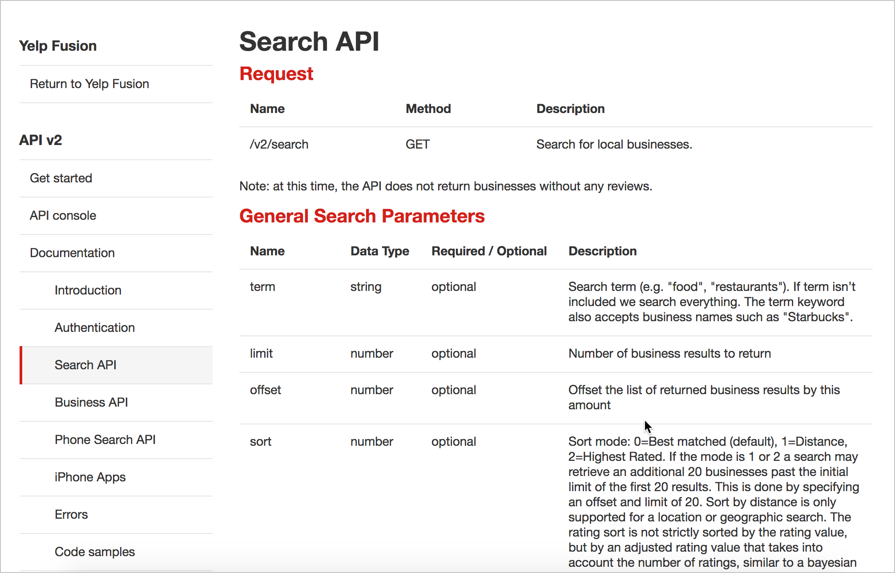
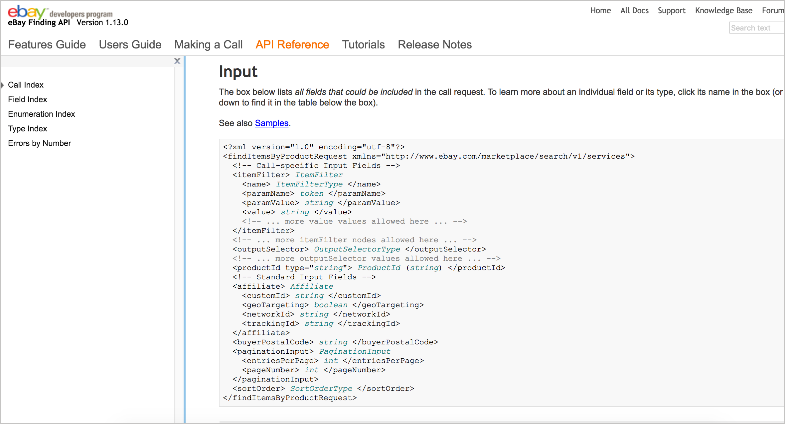
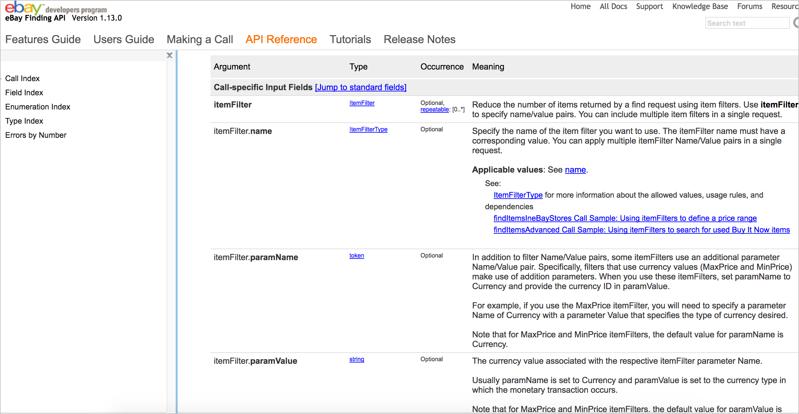

# шаг 3 Параметры

| [*Шаг 1. Описание ресурса*](step1-resourse-description.md) |-->| [*Шаг 2. Конечные точки и методы*](step2-endpoints-and-methods.md) |-->| [**Шаг 3. Параметры**](step3-parameters.md) |-->| [*Шаг 4. Пример запроса*](step4-request-example.md)|-->| [*Шаг 5. Пример и схема ответа*](step5-response-example-and-schema.md) |

Параметрами являются опции, которые можно передать конечной точке (например, указать формат ответа или возвращаемую сумму), чтобы повлиять на ответ. Существует четыре типа параметров:

- параметры заголовка,
- параметры пути,
- параметры строки запроса,
- параметры тела запроса.

Различные типы параметров часто документируются в отдельных группах на одной странице. Не все конечные точки могут содержать каждый тип параметра.

[Примеры параметров](#paramExample)

[Четыре типа параметров](#paramTypes)

[Что следует отметить в документировании параметров](#whattoNote)

[Типы данных параметров](#dataTypes)

[Максимальное и минимальное значения параметров](#maxMin)

[Параметры заголовка](#headersParam)

[Параметры пути](#pathParam)

[Цветовая кодировка параметра пути](#colorCode)

[Параметры строки запроса](#queryParam)

[Параметры тела запроса](#bodyParam)

[Документирование параметров тела сложного запроса](#complexRequest)

[Подход Swagger к параметрам тела запроса](#swaggerApproach)

[Параметры конечной точки SurfReport](#surfParam)

[Следующие шаги](#nextSteps)

## Примеры параметров

Скриншот ниже является примером раздела параметров с Box API:

*Пример параметра BOX API*

В этом примере параметры сгруппированы по типу:

- параметры пути,
- параметры запроса,
- параметры тела.

Конечная точка также выделяет параметр пути `collab_id` распознаваемым образом в определении конечной точки.

Часто параметры просто перечислены в таблице или списке определений, как в этом примере:

| Параметр | Обязательно/Опционально | Тип данных |
|:--:|:--:|:--:|
| format | Optional | String |

Вот пример документации API Yelp

Можно форматировать значения различными способами, кроме таблицы. При использовании списка определений или другого не табличного формата, обязательно нужно разработать стили, которые сделают значения легко читаемыми.

## Четыре типа параметров

REST API обладают 4 типами параметров:

- **Параметры заголовка**: параметры, включенные в заголовок запроса, обычно относятся к авторизации.
- **Параметры пути**: Параметры в пределах пути конечной точки перед строкой запроса, отделяются знаком `?`. Обычно эти параметры выделяются фигурными скобками.
- **Параметры строки запроса**: Параметры в строке запроса конечной точки, располагаются после знака `?`.
- **Параметры тела запроса**: Параметры, включенные в тело запроса. Обычно в формате JSON.

> Термины для каждого из этих типов параметров взяты из [спецификации OpenAPI](../openAPI-specification/openapi-tutorial-overview.md), которая определяет формальную спецификацию, которая включает описания каждого типа параметра (см. [Шаг 4: Объект `paths`](step4-request-example.md) ). Использование терминологии промышленного стандарта поможет разработать словарь элементов API для их описания.

## Что следует отметить в документировании параметров

Независимо от типа параметра, определите следующее для каждого параметра:

[Типы данных параметров](#dataTypes)

[Максимальное и минимальное значения параметров](#maxMin)

### Типы данных параметров

API могут некорректно обрабатывать параметр, если он имеет неправильный тип данных или неправильный формат. Перечисление типа данных является хорошей идеей для всех типов параметров, но особенно важно для параметров тела запроса, поскольку они обычно форматируются в JSON.

Вот типы данных наиболее распространенные в REST API:
- **string**: буквенно-цифровая последовательность букв и / или цифр;
- **integer**: целое число - может быть положительным или отрицательным;
- **boolean**: true или false значение;
- **object**: пара ключ-значение в формате JSON
- **array**: массив значений

> В программировании намного больше типов данных, и если имеются более конкретные типы данных, которые важно отметить, обязательно нужно их документировать. Например, в Java важно отметить допустимый тип данных, поскольку Java выделяет пространство памяти в зависимости от размера данных. Таким образом, Java получает гораздо более конкретную информацию о размере чисел. Есть byre, short, int, double, long, float, char, boolean и так далее. Однако, обычно, в REST API такой уровень детализации не нужно указывать.

### Максимальное и минимальное значения параметров

Помимо указания типа данных, параметры должны указывать максимальные, минимальные и допустимые значения. Например, если API сервиса погоды допускает только координаты долготы и широты конкретных стран, эти ограничения должны быть описаны в документации в разделе параметров.

Пропуск информации о максимальных / минимальных значениях или других недопустимых значениях является распространенной ошибкой в ​​документации. Разработчики часто не осознают всех «творческих» способов, которыми пользователи могут использовать API. Команда тестирования или обеспечения качества (QA), вероятно, является лучшим ресурсом для определения значений, которые не должны допускаться, потому что задача QA - попытаться взломать API.

> При тестировании API, можно попробовать запустить конечную точку без обязательных параметров, либо с неправильными параметрами, либо со значениями, которые превышают максимальные или минимальные значения. Изучить ответ об ошибке, который  возвращается. Включить этот ответ в раздел [статусы и коды ошибок](../conceptual-topics/status-error-codes.md). О важности тестирования узнаем больше в модуле [Тестирование документации](../testing-api-doc/test-documentaion.md).

## Параметры заголовка

Параметры заголовка включаются в заголовок запроса. Обычно заголовок включает в себя только параметры авторизации, которые являются общими для всех конечных точек; в результате параметры заголовка обычно не документируются для каждой конечной точке. Детали авторизации в параметрах заголовка документированы в разделе [Аутентификация и авторизация](../conceptual-topics/authentification-and-authorization.md).

Однако, если ваша конечная точка требует, чтобы в заголовке передавались уникальные параметры, вы должны документировать их в документации по параметрам в каждой конечной точке.

## Параметры пути

Параметры пути являются частью конечной точки. Например, в следующей конечной точке `{user}` и `{bikeId}` являются обязательными параметрами пути:

    /service/myresource/user/{user}/bicycles/{bicycleId}

Параметры пути обычно устанавливаются с помощью фигурных скобок. Но в некоторых API документациях стили  прописывают перед значением двоеточие или используют вообще иной синтаксис. При документировании параметров пути указываются значения по умолчанию, допустимые значения и другие сведения.

### Цветовая кодировка параметра пути

При перечислении параметров пути в конечной точке, может помочь цветовое кодирование параметров, для их легкой идентификации. Цветовое выделение параметров дает понять, что является параметром пути, а что нет. Посредством цвета мы создаем непосредственную связь между конечной точкой и определениями параметров.

Например, если выделить цветом параметры `{user}` и `{bicycleId}` в конечной точке:

    /service/myresource/user/{user}/bicycles/{bicycleId}

То позже можно использовать этот же цвет при описании этих же параметров.

| Параметр URL | Описание параметра |
|:--|:--|
| `user` | Описание параметра user |
| `bicycleId` | Описание параметра bicycleId |

Использование цвета для выделения параметров позволяет легко выделить определяемый параметр и его связь с определением конечной точки.

## Параметры строки запроса

Параметры строки запроса указываются после знака вопроса `?` В конечной точке. Знак вопроса, параметры, которые следуют за ним и их значения, называется «строкой запроса». В строке запроса каждый параметр перечисляется один за другим с амперсандом `&`, разделяющим их. Порядок параметров строки запроса не имеет значения.

Эта строка запроса:

    /surfreport/{beachId}?days=3&units=metric&time=1400

или эта

    /surfreport/{beachId}?time=1400&units=metric&days=3

вернут один и тот же результат.

Однако в параметрах пути порядок имеет значение. Если параметр является частью фактической конечной точки (не добавляется после строки запроса), это значение обычно описывается в описании самой конечной точки.

## Параметры тела запроса

Часто с запросами POST (где мы что-то создаем) мы отправляем объект JSON в теле запроса. Этот параметр и есть тело запроса. Обычно форматом тела запроса является JSON. Этот JSON объект может быть длинным списком пар ключ-значение с несколькими уровнями вложенности.

Например, конечной точкой может быть что-то простое, например `/surfreport/{beachId}`. Но в тело запроса мы можем включить объект JSON со многими парами ключ-значение, например:

    {
    "days": 2,
    "units": "imperial",
    "time": 1433524597
    }

### Документирование параметров тела сложного запроса

Документирование данных JSON (как в параметрах тела запроса, так и в ответах) является одной из самых сложных частей документации API. Документирование JSON объекта будет легким, если этот объект прост, с несколькими парами ключ-значение на одном уровне. Но если у нас есть  JSON объект с несколькими объектами внутри объектов, множественными уровнями вложенности и большими объемными данными, это может быть сложно. И если объект JSON занимает более 100 строк, или 1000, нам необходимо тщательно продумать, как представить информацию.

Таблицы хороши для документирования JSON, но в них трудно различать элементы верхнего уровня и подуровня. Объект, который содержит объект, который также содержит объект, и другой объект и т. Д., Может сбивать с толку.

Безусловно, если объект JSON относительно мал, таблица, вероятно, является лучшим вариантом. Но есть и другие дизайнерские подходы.

Взгляните на ресурс eBay [findItemsByProduct](http://developer.ebay.com/DevZone/finding/CallRef/findItemsByProduct.html). Вот параметр тела запроса (в данном случае формат XML):

Ниже параметра тела запроса находится таблица, которая описывает каждый параметр:

Но пример запроса также содержит ссылки на каждый из параметров. При клике на значение параметра в примере запроса, мы переходим на страницу, которая предоставляет более подробную информацию о значении этого параметра, например `ItemFilter`. Отдельная страница с более подробной информацией лучше и удобнее, потому что значения параметров являются более сложными и требуют подробного объяснения.

Те же значения параметров могут использоваться и в других запросах, поэтому подход eBay, вероятно, облегчает повторное использование. Тем не менее, кому-то может не нравиться прыгать на другие страницы для получения необходимой информации.

### Подход Swagger к параметрам тела запроса

Пользовательский интерфейс [Swagger](../openAPI-specification/swagger-ui-tutorial.md), который мы рассмотрим позже, а также его [демо](h../openAPI-specification/swagger-ui-demo.md), предоставляет другой подход к документированию параметра тела запроса. Swagger UI показывает параметры тела запроса в формате, который вы видите ниже. Интерфейс Swagger позволяет переключаться между представлением «Пример значения» и представлением «Модель» для ответов и параметров тела запроса.

Посмотрим на [Swagger Petstore](http://petstore.swagger.io/) для изучения. "Пример значения" показывает образец синтаксиса вместе с примерами. При нажатии на ссылку "Модель"", вы видите пример параметра тела запроса и описания каждого элемента.

Модель включает в себя переключатели «развернуть / свернуть» со значениями. ([Демо Petstore](http://petstore.swagger.io/) не имеет множество описаний параметров в модели, но если включить описания, они будут отображаться в модели, а не в примере значения.)

> Мы познакомимся с Swagger более подробно в разделе [Знакомство со спецификациями OpenAPI и Swagger](../openAPI-specification/introduction-openapi-and-swagger.md). А пока сосредоточимся на этих основных элементах справочной документации API. Мы увидим, что эти же разделы появляются в спецификации OpenAPI.

Можно заметить, что существует множество вариантов документирования JSON и XML в параметрах тела запроса.   Правильного способа документировать информацию нет. Как всегда, выбираем метод, который отображает параметры нашего API наиболее простым и легким для чтения способом.

Если у нас относительно простые параметры, наш выбор не будет иметь большого значения. Но если сложные, громоздкие параметры, то, возможно, придется прибегнуть к пользовательским стилям и шаблонам, чтобы представить их более четко. Исследуем эту тему более подробно в разделе [Пример и схема ответа](step5-response-example-and-schema.md).

## Параметры конечной точки SurfReport

Давайте посмотрим доступные параметры и создадим таблицу с описанием параметров для нашего нового ресурса surfreport. Вот пример, как может выглядеть информация о параметрах:

### Параметры

#### Параметры пути

| Параметр пути | Описание |
|:--|:--|
| {beachId} | Относится к идентификатору пляжа, который вы хотите посмотреть. Все коды beachId доступны на нашем сайте [sampleurl.com](https://sampleurl.com). |

### Параметры строки запроса

| Параметр строки запроса | Обзательно/ необязательно | Описание | Тип данных |
|:--|:--|:--|:--|
| days | Optional | Количество дней, включаемых в ответ. По умолчанию = 3 | Integer |
| time | Optional | При указании времени в ответе будет выводиться только указанный час | Integer. Unix format (ms since 1970) UTC |

> Если использовать Markdown для документации, можно рассмотреть возможность использования синтаксиса HTML для создания таблиц. HTML позволяет задавать ширину столбцов. У Markdown нет такой возможности. В HTML можно использовать свойство `colgroup`, чтобы указать `col width` (ширину) столбца для каждого столбца.

## Следующие шаги

После того, как мы задокументировали параметры пора посмотреть на [Пример запроса](step4-request-example.md) к ресурсу
