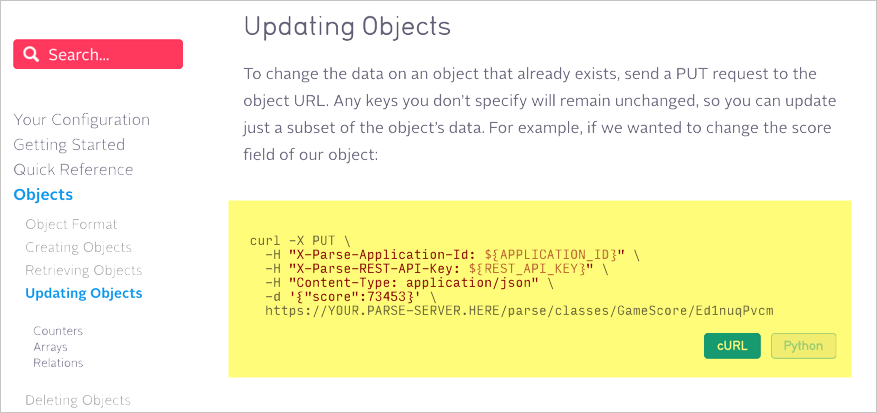
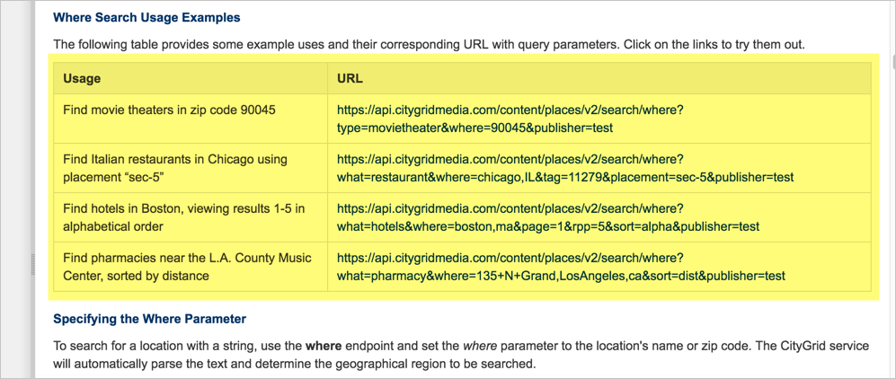
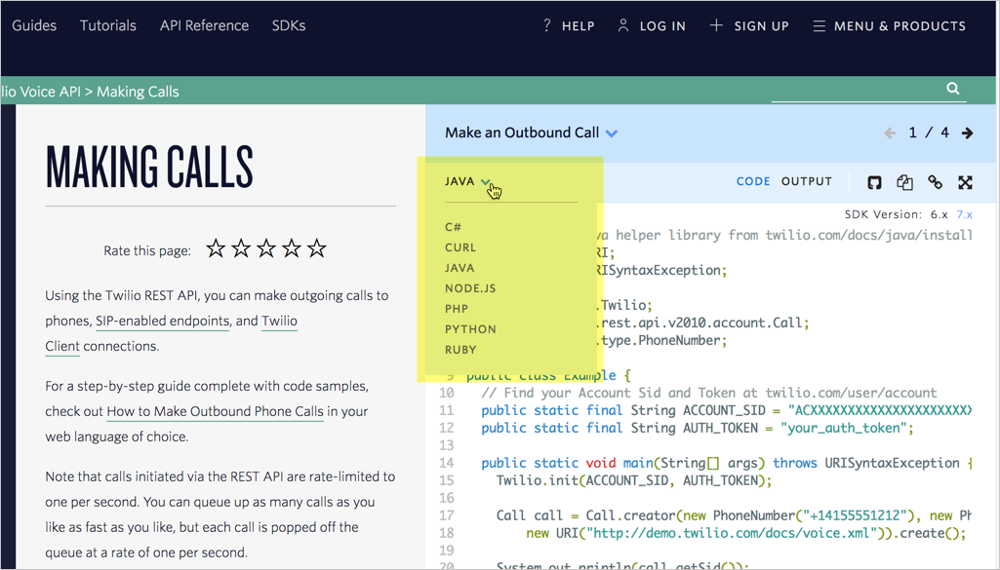
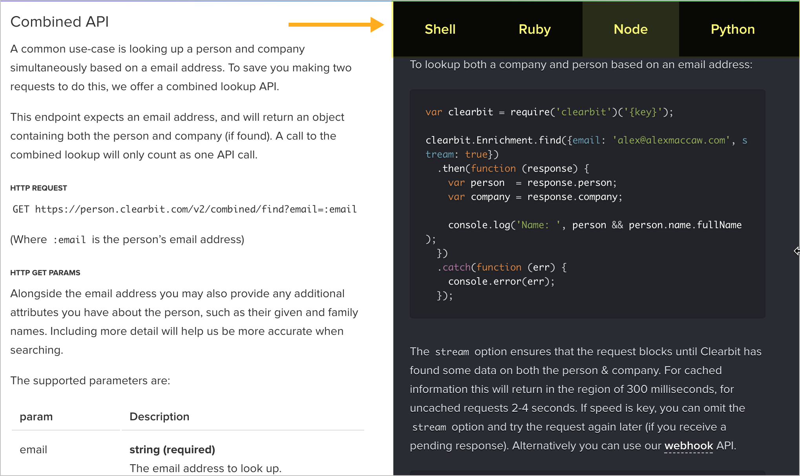
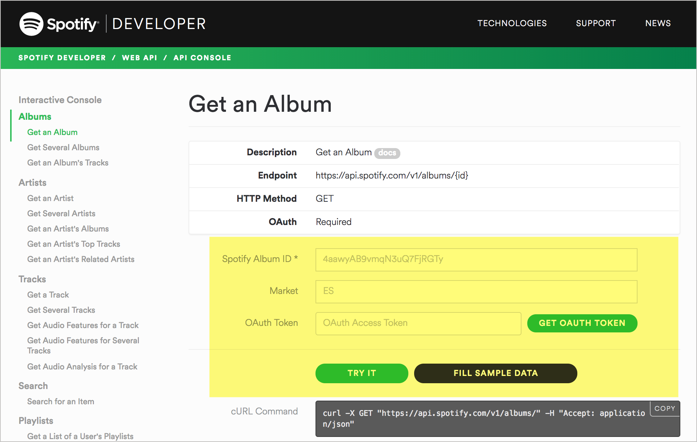
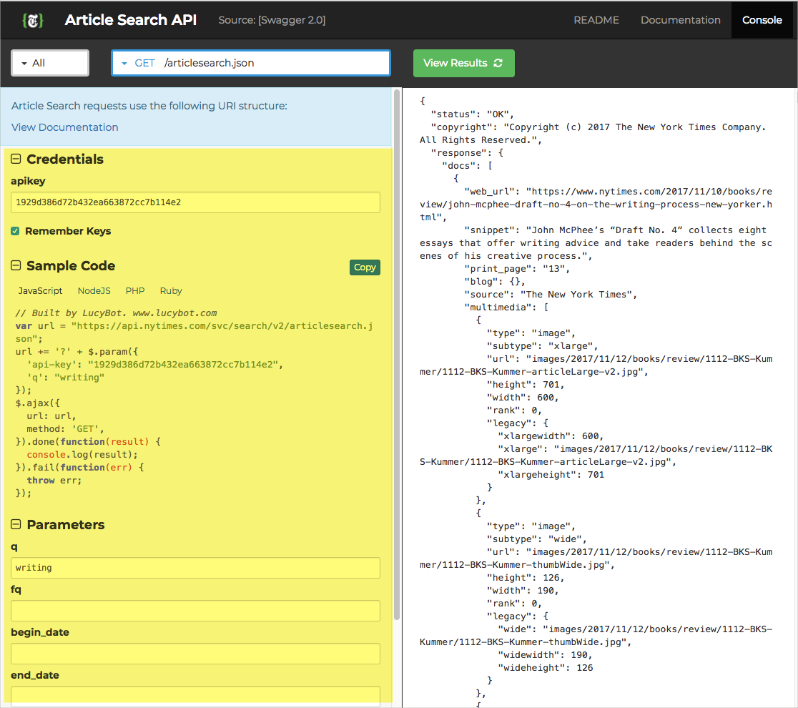
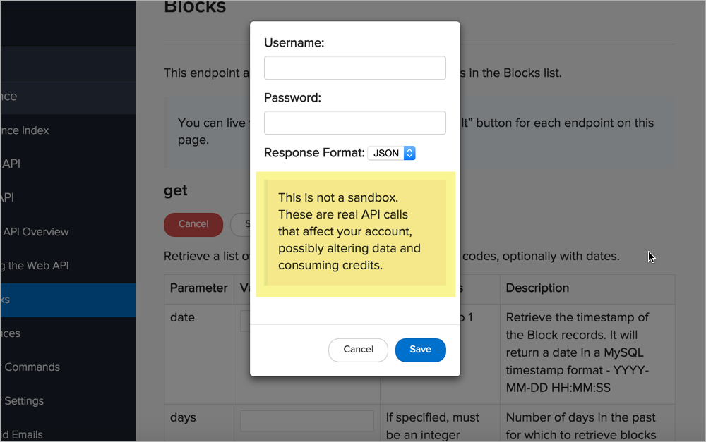
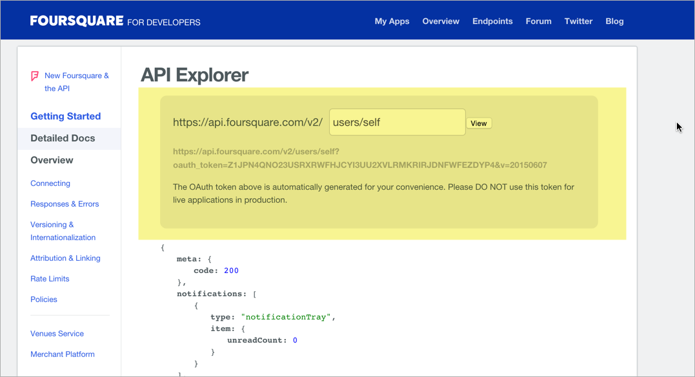

# Шаг 4: Пример запроса

| [*Шаг 1. Описание ресурса*](step1-resourse-description.md) |-->| [*Шаг 2. Конечные точки и методы*](step2-endpoints-and-methods.md) |-->| [*Шаг 3. Параметры*](step3-parameters.md) |-->| [**Шаг 4. Пример запроса**](step4-request-example.md)|-->| [*Шаг 5. Пример и схема ответа*](step5-response-example-and-schema.md) |

Пример запроса включает в себя запрос с использованием конечной точки, показывающий некоторые настроенные параметры. Пример запроса обычно не показывает все возможные конфигурации параметров, но он должен быть максимально насыщенным параметрами.

Примеры запросов может содержать фрагменты кода, которые показывают один и тот же запрос на разных языках (помимо curl). Запросы, показанные на других языках программирования, являются необязательными (но при их наличии, пользователи приветствуют их).

[Примеры запросов](#examples)

[Множественные примеры запросов](#multiple)

[Запросы на разных языках](#languages)

[Авто генерация примеров кода](#autoGenerate)

[SDK представляют инструменты для API](#sdk)

[API explorer обеспечивает интерактивность с нашими собственными данными](#explorer)

[API Explorer может быть опасным в руках пользователя](#danger)

[Пример запроса для SurfReport](#surfReportRequest)

[Следующие шаги](#nextSteps)

<a name="examples"></a>
## Примеры запросов

Пример ниже показывает пример запроса Callfire API


Дизайн этого сайта API задуман таким образом, что  примеры запросов и ответов размещаются в правом столбце страницы. Запрос отформатирован в curl, который мы рассмотрели ранее в разделе [Создание curl запроса](../like-developer/make-curl-call.md).

```js
curl -u "username:password" -H "Content-Type:application/json" -X GET "https://api.callfire.com/v2/texts?limit=50&offset=200"
```

curl - это обычный формат для отображения запросов по нескольким причинам:

- curl не зависит от языка, поэтому он не относится к какому-либо конкретному языку программирования;
- curl показывает информацию заголовка, необходимую в запросе;
- curl показывает метод, используемый в запросе.


В общем, чтобы показать пример запроса, используйте curl. Вот еще один пример запроса curl в Parse API:



Можно добавить обратную косую черту в curl, чтобы разделить каждый параметр на отдельной строке (хотя, как оговаривалось раньше, в [Windows возникают проблемы с обратной косой чертой](../like-developer/make-curl-call.md#curlWindows) ).


Бывает и так, что сайты документации API могут использовать полный URL-адрес ресурса, например, этот простой пример из Twitter:


URL ресурса включает в себя как базовый путь, так и конечную точку. Проблема с отображением полного URL ресурса состоит в том, что он не указывает, нужно ли передавать какую-либо информацию заголовка для авторизации запроса. (Если ваш API состоит только из запросов GET и не требует авторизации, отлично, но только немногие API настроены таким образом.) Запросы curl могут легко отображать любые параметры заголовка.

<a name="multiple"></a>
## Множественные примеры запросов

Если имеется много параметров, можно попробовать включить несколько примеров запросов. В API CityGrid Places конечная точка `where` выглядит следующим образом:

```
https://api.citygridmedia.com/content/places/v2/search/where
```

Однако есть буквально [17 возможных параметров строки запроса](https://docs.citygridmedia.com/display/citygridv2/Places+API#PlacesAPI-WhereSearchRequest), которые можно использовать с этой конечной точкой. В результате документация включает несколько примеров запросов, которые показывают различные комбинации параметров:



Добавление множественных примеров запросов имеет смысл, когда параметры обычно не используются вместе. Например, есть несколько случаев, когда можно фактически включить все 17 параметров в один и тот же запрос, поэтому любой пример будет ограничен в том, что он может показать.

В этом примере показано, как «Найти отели в Бостоне, просматривая результаты с 1 по 5 страницы в алфавитном порядке»:

```
https://api.citygridmedia.com/content/places/v2/search/where?what=hotels&where=boston,ma&page=1&rpp=5&sort=alpha&publisher=test&format=json
```

Если [кликнуть по ссылке](https://api.citygridmedia.com/content/places/v2/search/where?what=hotels&where=boston,ma&page=1&rpp=5&sort=alpha&publisher=test&format=json), то увидим ответ. В следующем разделе есть описание [динамического отображении ответа](step5-response-example-and-schema.md#embedding), когда пользователь нажимает на запрос.

Сколько разных запросов и ответов нужно показать? Вероятно, это не простой ответ, но, не более, чем несколько. Нам решать, что нужно для нашего API. Пользователи обычно вникнут в шаблон после нескольких примеров.

<a name="languages"></a>
## Запросы на разных языках

Как было сказано ранее в разделе [Что такое REST API?](../introduction-rest-apis/what-is-rest-api.md) REST API не зависит от языка. Универсальный протокол помогает облегчить широкое распространение для разных языков программирования. Разработчики могут кодировать свои приложения на любом языке, от Java до Ruby, JavaScript, Python, C #, Node JS или каком-либо еще. Пока разработчики могут отправлять HTTP-запросы на своем языке, они могут использовать API. Ответ от веб-запроса будет содержать данные в формате JSON или XML.

Поскольку невозможно знать, на каком языке будут писать конечные пользователи, попытка предоставить примеры кода на каждом языке бесполезна. Многие API просто показывают формат для отправки запросов и пример ответа, и авторы предполагают, что разработчики будут знать, как отправлять HTTP-запросы на своем конкретном языке программирования.

Однако некоторые API отображают простые запросы на разных языках. Вот пример из Twilio:



в выпадающем списке можно выбрать, какой язык использовать для примера запроса: C #, curl, Java, Node.js, PHP, Python или Ruby.

Вот еще пример API от Clearbit:



Можно увидеть запрос в Shell (curl), Ruby, Node или Python. Разработчики могут легко скопировать необходимый код в свои приложения, вместо того чтобы выяснить, как заставить запрос curl перевести на определенный язык программирования.

Предоставление различных запросов, подобных этому, часто отображаемых на [вкладках](https://getbootstrap.com/docs/3.3/javascript/#tabs), помогает упростить реализацию  API. Еще лучше, если есть возможность автоматически заполнять ключи API фактическими пользовательскими ключами API на основе их авторизованного профиля.


Но нас не испугает этот шведский стол с примерами кода. Некоторые инструментальные средства API (такие как [Readme.io](../Publishing-doc/Headless-cms-options.md#readme) или [SwaggerHub](../openAPI-specification/swaggerhub-introduction-and-tutorial.md)) могут автоматически генерировать эти примеры кода, поскольку паттерны выполнения запросов REST на разных языках программирования следуют общему шаблону.

> Менеджеры продуктов часто знают, на каких языках программирования целевые пользователи разрабатывают приложения. Если известен предпочитаемый язык программирования целевой аудитории, можно добавлять примеры кода только на нужном языке.

<a name="autoGenerate"></a>
## Авто генерация примеров кода

Если технический писатель не пользуется инструментом с функцией автоматической генерации примера кода, но предоставить эти фрагменты кода необходимо, то можно автоматически генерировать примеры кода из Postman и Paw.

[Paw](https://paw.cloud/) (на MacOS) позволяет экспортировать запрос практически на все мыслимые языки:


После того, как мы сконфигурировали запрос (процесс похож на [Postman](../like-developer/submit-requests-postman.md)), можно сгенерировать фрагмент кода, выбрав **Файл> Экспорт запроса**.

Приложение Postman также может генерировать фрагменты кода аналогичным образом. Мы рассмотрели этот процесс раннее в разделе  [Изучение полезных данных JSON ответа](../like-developer/inspect-json.md). В Postman после конфигурации запроса, кликаем ссылку `Code` (которая появляется под кнопкой «Сохранить» в правом верхнем углу).


Затем выбираем нужный язык, например **JavaScript> Jquery AJAX**:


> Хотя эти генераторы кода, вероятно, полезны, они могут и не работать для нашего API. Всегда нужно просматривать примеры кода совместно с разработчиками. В большинстве случаев разработчики предоставляют примеры кода для документации, а технические писатели кратко комментируют примеры кода.


(Для практики, включающей использование сгенерированного кода jQuery из Postman, см. [Изучение полезных данных JSON ответа](../like-developer/inspect-json.md) и [Доступ и вывод на страницу определенного значения JSON](../like-developer/access-print-value.md).)

<a name="sdk"></a>
## SDK представляют инструменты для API

Часто разработчики создают [SDK (комплект разработки программного обеспечения)](../conceptual-topics/sdks-sample-apps.md#sdk), который сопровождает REST API. SDK помогает разработчикам реализовать API с помощью специальных инструментов. API не зависят от языка, SDK зависит от языка.

Например, в одной компании был и REST API, и JavaScript SDK. Поскольку JavaScript был целевым языком, над которым работали разработчики, компания разработала SDK JavaScript, чтобы упростить работу с REST с использованием JavaScript. Стало возможным отправлять вызовы REST через JavaScript SDK, передавая ряд параметров, относящихся к веб-дизайнерам.

SDK по сути, это любой инструмент, облегчающий работу с API. Обычно компании предоставляют независимый от языка REST API, а затем разрабатывают SDK, который облегчает реализацию API на том основном языке, на котором они ожидают, что пользователи будут реализовывать API. Таким образом, добавлять в свои примеры запросов небольшие фрагменты запросов на других языках не так страшно, так как SDK обеспечивает более простую реализацию. Если у вас есть SDK, вы захотите сделать более подробные примеры кода, показывающие, как использовать SDK.

<a name="explorer"></a>
## API explorer обеспечивает интерактивность с нашими собственными данными

Многие API имеют функцию API Explorer, которая позволяет пользователям делать реальные запросы непосредственно из документации. Например, вот типичная справочная страница для документов API Spotify:



API Flickr также имеют встроенный API Explorer:


Как и API New York Times:



API Explorer позволяет вставлять свои собственные значения, свой собственный ключ API и другие параметры в запрос, чтобы увидеть ответы непосредственно в API Explorer. Возможность видеть свои собственные данные делает ответ более реальным.

Однако, если у вас нет нужных данных в вашей системе, использование собственного ключа API может не показать вам полный возможный ответ. Это работает лучше всего, когда ресурсы включают публичную информацию, а запросами являются запросы GET.

<a name="danger"></a>
## API Explorer может быть опасным в руках пользователя

Хотя интерактивность является мощным средством, API Explorer может быть опасным дополнением к вашему сайту. Что, если начинающий пользователь, который пробует метод DELETE, случайно удалит данные? Как мы позже удалим тестовые данные, добавленные методами POST или PUT?

Одно дело разрешить методы GET, но если включить другие методы, пользователи могут случайно повредить свои данные. В API Sendgrid появляется предупреждающее сообщение для пользователей перед проверкой вызовов с помощью их API Explorer:




Документация API Foursquare раньше имела встроенный API Explorer в предыдущей версии своих документов (см. Ниже), но позже его удалили. Возможно, они столкнулись с некоторыми из этих проблем.



Что касается интеграции пользовательских инструментов API Explorer, эта задача должна быть относительно простой для разработчиков. Все, что делает API Explorer, это отображает значения из поля в вызов API и возвращает ответ в тот же интерфейс. Другими словами, API-интерфейс - это все, что нужно, плюс немного понимания JavaScript и навыков фронтенда, для успешной работы.

Не обязательно создавать свои собственные инструменты. Существующие инструменты, такие как [Swagger UI](https://swagger.io/tools/swagger-ui/) (который анализирует [спецификацию OpenAPI](../openAPI-specification/openapi-tutorial-overview.md)) и [Readme.io](http://readme.io/) (который позволяет вводить детали вручную или из спецификации OpenAPI), могут интегрировать функционал API Explorer непосредственно в документацию.

> Пособие по созданию собственного API Explorer см. В [Руководство Swagger UI](../openAPI-specification/swagger-ui-tutorial.md).

<a name="surfReportRequest"></a>
## Пример запроса для SurfReport

Вернемся к нашей [конечной точке](new-endpoint.md#wikiSerf) `surfreport/{beachId}` и создадим пример запроса для нее:

### Sample Request

```js
curl -I -X GET "https://api.openweathermap.org/data/2.5/surfreport?zip=95050&appid=fd4698c940c6d1da602a70ac34f0b147&units=imperial&days=2"
```

<a name="nextSteps"></a>
## Следующие шаги

Теперь, когда мы создали образец запроса, естественно, следующий шаг - включить пример ответа, который соответствует этому запросу. Также мы задокументируем модель или схему ответа. Переходим в [Шаг 5: Пример и схема ответа](step5-response-example-and-schema.md)

[🔙](step3-parameters.md)

[Go next ➡](step5-response-example-and-schema.md)
