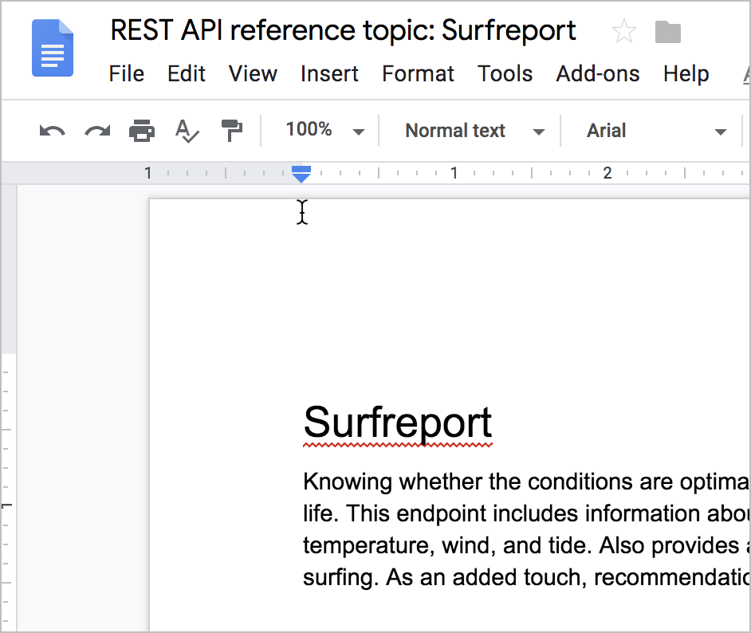

# 👨‍💻 Практическое занятие: Что не так в разделе API?

На этом занятии попробуем раскритиковать справочный раздел API чтоб понять, что там не так.

[Что не так с разделом API?](#wrong)

[Surfreport](#surfreport)

- [Конечные точки](#endpoints)
- [Параметры](#parameters)
- [Пример запроса](#request)
- [Пример ответа](#response)
- [Определения ответа](#definitions)
- [Ответы](#answeres)

<a name="wrong"></a>
## Что не так с разделом API?

Ниже приведен пример справочной темы по API для конечной точки, которая называется `surfreport`. Там есть примерно 25 ошибок. Копия документации доступна в [Google Docs](https://docs.google.com/document/d/1LU0QJTDHHKFu9FIC24ZrF1I5HC7mzX86fH0YZ1SUHyo/edit) только для чтения. В Google Docs можно перейти в **File> Make a Copy**, чтобы создать свой собственный экземпляр. Затем прокомментировать все ошибки в файле Google Docs.



<a name="surfreport"></a>
## Surfreport

Понимание того, насколько условия оптимальны для серфинга, является необходимой деталью в жизни каждого серфера. Конечная точка содержит информацию об условиях серфинга, включая высоту прибоя, температуру воды, ветер и прилив. Также предоставляется общая рекомендация о том, стоит ли заниматься серфингом. В качестве бонуса, рекомендации выражены на серферском жаргоне. Лови волну!

<a name="endpoints"></a>
### Конечные точки

**GET/POST** `surfreport/{:beachId}`

<a name="parameters"></a>
### Параметры

| Параметр | Использование | Описание | Тип данных |
|:--|:--|:--|:--|
| {beachId} | Обязательно | Идентификатор пляжа, о котором нужно получить информацию | Number |
| days | Опционально | Количество дней, отображаемых в ответ. По умолчанию выводит 3, максимальное значение = 10 | Integer |
| time | Опционально | Время, о котором нужно получить отчет | Integer. Формат ISO 8601. Пример: `20180915T155300+0500` |

<a name="request"></a>
### Пример запроса

```
https://api.openweathermap.org/data/2.5/surfreport/12345?zip=95050&appid=fd4698c940c6d1da602a70ac34f0b147&days=1
```

<a name="response"></a>
### Пример ответа

```yaml
{
    "surfreport": [
        {
            "beach": "Santa Cruz",
            "monday": {
                "1pm": {
                    "tide": 5,
                    "wind": 15,
                    "watertemp": 80,
                    "surf_height": 5,
	          "riptide": "moderate",
                    "recommendation": "Carve it up, brah! The waves are crankin' wild out there."
                },
                "2pm": {
                    "tide": -1,
                    "wind": 1,
                    "watertemp": 50,
                    "surf_height": 3,
	          "riptide": "extreme",
                    "recommendation": "Waves are foam and frothy but rideable in places. Gravitate to the impact zone, due, and hang loose."
                },
                "3pm": {
                    "tide": -1,
                    "wind": 10,
                    "watertemp": 65,
                    "surf_height": 1,
                    "recommendation": "Scene is blown out. Bail inland and chill on the beach instead or you’ll the one who’ll be shredded, due."
                }
                ...
            }
        }
    ]
}
```

<a name="definitions"></a>
### Определения ответа

В таблице ниже пояснения по каждому пункту ответа

| Пункт ответа | Описание | Тип данных |
|:--|:--|:--|
| beach | Выбранный в запросе на основе идентификатора пляж. Название пляжа - это официальное название, описанное в базе геоданных Службы национальных парков | string |
| {day}  | Запрошенный (-ые)  день (дни) недели | object |
| {time} | Время для которого нужно вывести условия | string |
| tide | Уровень прилива на пляже за определенный день и время. Прилив - это расстояние внутри, до которого поднимается вода, и может быть положительным (прилив) или отрицательным (отлив) числом. При отливе число отрицательное. При приливе число положительное. Точка 0 отражает линию, когда прилив находится в переходе между двумя состояниями | string |
| wind | Скорость ветра на пляже. Ветер влияет на высоту прибоя и общие условия. Скорость ветра более 15 делает условия для серфинга нежелательными, потому что ветер создает белые шапки и неспокойную воду | int |
| waterTemp | Температура воды. При температуре воды ниже 70<sup>0</sup> F обычно требуется носить гидрокостюм. При температуре ниже 60<sup>0</sup> F  понадобится как минимум 3-миллиметровый гидрокостюм и желательно пинетки, чтобы согреться | string |
| surfheight | Высота волн возвращается в футах или сантиметрах в зависимости от указанных вами единиц измерения. Высота прибоя 3 фута - минимальный размер, необходимый для серфинга. Если высота прибоя превышает 10 футов, заниматься серфингом небезопасно | map |
| recommendation | Общая рекомендация, основанная на сочетании различных факторов (ветра, водной температуры, высоты полета) и т.д. | string |

<a name="answeres"></a>
### Ответы

Посмотреть ошибки можно в разделе [Описание ошибок](../glossary-and-resourses/answeres-whats-wrong.md)

[🔙](putt-all-together.md)

[Go next ➡](find-open-source-project.md)
