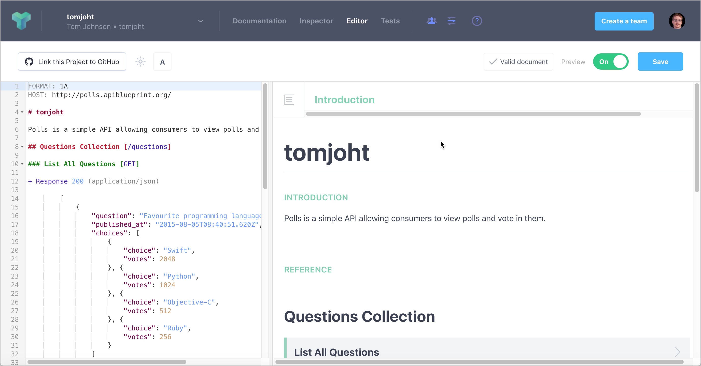
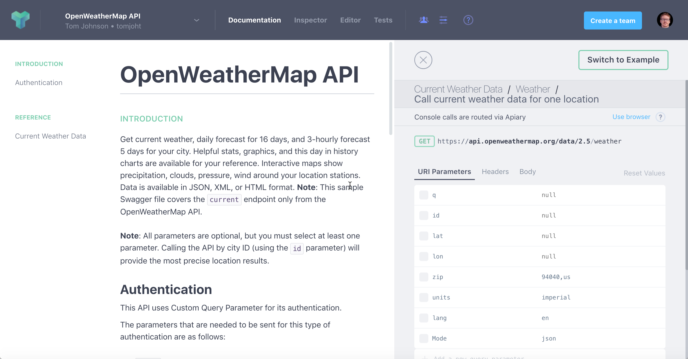
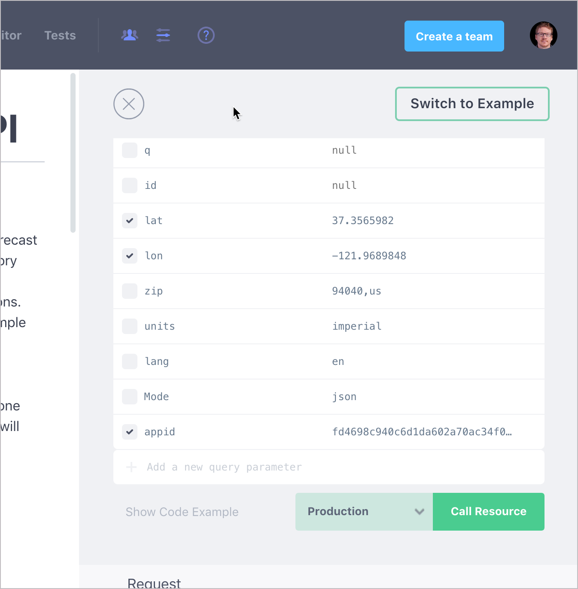

# Справочник API Blueprint

API Blueprint, так же, как и Swagger определяет спецификацию для описания REST API. Инструменты, которые поддерживают API Blueprint, могут читать и отображать информацию.

> Если не используется платформа, которая требует именно  API Blueprint, лучше использовать [спецификацию OpenAPI](../openAPI-specification/openapi-tutorial-overview.md).

[Что такое API Blueprint](#apiblueprint)

[Пример blueprint](#sample)

[Анализ blueprint](#parsing)

[Создаем пример вывода HTML используя API Blueprint и Apiary](#createSample)

- [Создаем проект Apiary](#project)
- [Взаимодействие с API на Apiary](#interact)

<a name="apiblueprint"></a>
## Что такое API Blueprint

Спецификация API Blueprint написана с использованием синтаксиса Markdown. Blueprint представляет собой конкретную схему, которая является допустимой или недействительной на основе имен элементов, порядка, расстояния и других деталей. Поэтому, он не так гибок, как Markdown. Но он может быть предпочтительнее, чем YAML.

<a name="sample"></a>
## Пример blueprint

Вот пример Blueprint для понимания синтаксиса:

```markdown
FORMAT: 1A
HOST: http://polls.apiblueprint.org/

# test

Polls is a simple API allowing consumers to view polls and vote in them.

# Polls API Root [/]

This resource does not have any attributes. Instead, it offers the initial
API affordances in the form of the links in the JSON body.

It is recommended to follow the “url" link values,
[Link](https://tools.ietf.org/html/rfc5988), or Location headers where
applicable to retrieve resources. Instead of constructing your own URLs,
to keep your client decoupled from implementation details.

## Retrieve the Entry Point [GET]

+ Response 200 (application/json)

        {
            "questions_url": "/questions"
        }

## Group Question

Resources related to questions in the API.

## Question [/questions/{question_id}]

A Question object has the following attributes:

+ question
+ published_at - An ISO8601 date when the question was published.
+ url
+ choices - An array of Choice objects.

+ Parameters
    + question_id: 1 (required, number) - ID of the Question in form of an integer

### View a Questions Detail [GET]

+ Response 200 (application/json)

        {
            "question": "Favourite programming language?",
            "published_at": "2014-11-11T08:40:51.620Z",
            "url": "/questions/1",
            "choices": [
                {
                    "choice": "Swift",
                    "url": "/questions/1/choices/1",
                    "votes": 2048
                }, {
                    "choice": "Python",
                    "url": "/questions/1/choices/2",
                    "votes": 1024
                }, {
                    "choice": "Objective-C",
                    "url": "/questions/1/choices/3",
                    "votes": 512
                }, {
                    "choice": "Ruby",
                    "url": "/questions/1/choices/4",
                    "votes": 256
                }
            ]
        }

## Choice [/questions/{question_id}/choices/{choice_id}]

+ Parameters
    + question_id: 1 (required, number) - ID of the Question in form of an integer
    + choice_id: 1 (required, number) - ID of the Choice in form of an integer

### Vote on a Choice [POST]

This action allows you to vote on a question's choice.

+ Response 201

    + Headers

            Location: /questions/1

## Questions Collection [/questions{?page}]

+ Parameters
    + page: 1 (optional, number) - The page of questions to return

### List All Questions [GET]

+ Response 200 (application/json)

    + Headers

            Link: </questions?page=2>; rel="next"

    + Body

            [
                {
                    "question": "Favourite programming language?",
                    "published_at": "2014-11-11T08:40:51.620Z",
                    "url": "/questions/1",
                    "choices": [
                        {
                            "choice": "Swift",
                            "url": "/questions/1/choices/1",
                            "votes": 2048
                        }, {
                            "choice": "Python",
                            "url": "/questions/1/choices/2",
                            "votes": 1024
                        }, {
                            "choice": "Objective-C",
                            "url": "/questions/1/choices/3",
                            "votes": 512
                        }, {
                            "choice": "Ruby",
                            "url": "/questions/1/choices/4",
                            "votes": 256
                        }
                    ]
                }
            ]

### Create a New Question [POST]

You may create your own question using this action. It takes a JSON
object containing a question and a collection of answers in the
form of choices.

+ question (string) - The question
+ choices (array[string]) - A collection of choices.

+ Request (application/json)

        {
            "question": "Favourite programming language?",
            "choices": [
                "Swift",
                "Python",
                "Objective-C",
                "Ruby"
            ]
        }

+ Response 201 (application/json)

    + Headers

            Location: /questions/2

    + Body

            {
                "question": "Favourite programming language?",
                "published_at": "2014-11-11T08:40:51.620Z",
                "url": "/questions/2",
                "choices": [
                    {
                        "choice": "Swift",
                        "url": "/questions/2/choices/1",
                        "votes": 0
                    }, {
                        "choice": "Python",
                        "url": "/questions/2/choices/2",
                        "votes": 0
                    }, {
                        "choice": "Objective-C",
                        "url": "/questions/2/choices/3",
                        "votes": 0
                    }, {
                        "choice": "Ruby",
                        "url": "/questions/2/choices/4",
                        "votes": 0
                    }
                ]
            }
```

Справочники по синтакису API Blueprint можно посмотреть на ресурсах:

- [API Blueprint tutorial](https://apiblueprint.org/documentation/tutorial.html)
- [Apiary tutorial](https://help.apiary.io/api_101/api_blueprint_tutorial/)
- [Github API Blueprint tutorial](https://github.com/apiaryio/api-blueprint/blob/master/Tutorial.md)

Различные примеры Blueprint можно посмотреть [здесь](https://github.com/apiaryio/api-blueprint/tree/master/examples) Примеры помогают понять различные аспекты спецификации.

<a name="parsing"></a>
## Анализ blueprint

Анализировать API Blueprint могут многие инструменты. Одним из основных парсеров Blueprint является [Drafter](https://github.com/apiaryio/drafter). Другие инструменты основаны на Drafter и генерируют статические HTML-результаты проекта. Например, [Aglio](https://github.com/danielgtaylor/aglio) может парсить Blueprint и генерировать статичные HTML-файлы.

Полный список инструментов можно найти в секции [Tooling](https://apiblueprint.org/tools.html) на сайте https://apiblueprint.org/ Некоторые инструменты могут потребовать танцы с бубном, поэтому на этом курсе мы их пропустим.

<a name="createSample"></a>
## Создаем пример вывода HTML используя API Blueprint и Apiary

В этом руководстве мы будем использовать платформу Apiary для чтения и отображения проекта API. Apiary - это хостинг-платформа, которая устраняет необходимость установки локальных библиотек и утилит для генерации выходных данных.

<a name="project"></a>
### Создаем проект Apiary

1. Открываем сайт [apiary.io](https://apiary.io/) и кликаем на `Quick start with Github`. Входим под учетной записью GitHub (если аккаунта на GitHub нет, создаем его для начала).

2. Регистрируем бесплатную учетную запись и создаем новый проект.

Нас перекинет в редактор API Blueprint



По умолчанию загружается шаблон the Polls, чтобы посмотреть, как он выглядит. Blueprint показывает пример необходимого формата инструмента Apiary для анализа и отображения содержимого. Необработанный файл можно посмотреть [здесь](https://raw.githubusercontent.com/apiaryio/api-blueprint/master/examples/Polls%20API.md).

3. С этого момента начинаем документировать наш API? используя синтаксис редактора Blueprint. В случае ошибок будут появляться флаги с подсказками, что не так.

Можно почитать [справочник API Blueprint](https://help.apiary.io/api_101/api_blueprint_tutorial/)  и структурировать документацию в формате Blueprint.

Синтаксис учитывает разные методы, применяемые к одним и тем же источникам.

Здесь мы интегрируем информацию API сервиса прогноза погоды  OpenWeatherMap, отформатированную в формате Blueprint.

 4. Скопируем следующий код, который соответствует спецификации API Blueprint, и вставим его в редактор Apiary Blueprint.

```markdown
FORMAT: 1A
HOST: https://api.openweathermap.org/data/2.5/

# OpenWeatherMap API
Get the current weather, daily forecast for 16 days, and a three-hour-interval forecast for 5 days for your city. Helpful stats, graphics, and this day in history charts are available for your reference. Interactive maps show precipitation, clouds, pressure, wind around your location stations. Data is available in JSON, XML, or HTML format. **Note**: This sample Swagger file covers the `current` endpoint only from the OpenWeatherMap API. <br/><br/> **Note**: All parameters are optional, but you must select at least one parameter. Calling the API by city ID (using the `id` parameter) will provide the most precise location results.

## Authentication
This API uses Custom Query Parameter for its authentication.

The parameters that are needed to be sent for this type of authentication are as follows:
+ `appid` - API key to authorize requests. If you don't have an OpenWeatherMap API key, use `fd4698c940c6d1da602a70ac34f0b147`.

# Group Current Weather Data

## Weather [/weather{?q,id,lat,lon,zip,units,lang,Mode}]

### Call current weather data for one location [GET]
Access current weather data for any location on Earth including over 200,000 cities! Current weather is frequently updated based on global models and data from more than 40,000 weather stations.
+ Parameters
    + q (string, optional)

        **City name**. *Example: London*. You can call by city name, or by city name and country code. The API responds with a list of results that match a searching word. For the query value, type the city name and optionally the country code divided by a comma; use ISO 3166 country codes.

    + id (string, optional)

        **City ID**. *Example: `2172797`*. You can call by city ID. The API responds with the exact result. The List of city IDs can be downloaded [here](http://bulk.openweathermap.org/sample/). You can include multiple cities in this parameter &mdash; just separate them by commas. The limit of locations is 20. *Note: A single ID counts as a one API call. So, if you have city IDs, it's treated as 3 API calls.*

    + lat (string, optional)

        **Latitude**. *Example: 35*. The latitude coordinate of the location of your interest. Must use with `lon`.

    + lon (string, optional)

        **Longitude**. *Example: 139*. Longitude coordinate of the location of your interest. Must use with `lat`.

    + zip (string, optional) -

        **Zip code**. Search by zip code. *Example: 95050,us*. Please note that if the country is not specified, the search uses USA as a default.

        + Default: 94040,us
        + Sample: 94040,us
    + units (enum[string], optional)

        **Units**. *Example: imperial*. Possible values: `metric`, `imperial`. When you do not use the `units` parameter, the format is `standard` by default.

        + Default: standard
        + Sample: imperial
        + Members
            + `standard`
            + `metric`
            + `imperial`

    + lang (enum[string], optional)

        **Language**. *Example: en*. You can use lang parameter to get the output in your language. We support the following languages that you can use with the corresponded lang values: Arabic - `ar`, Bulgarian - `bg`, Catalan - `ca`, Czech - `cz`, German - `de`, Greek - `el`, English - `en`, Persian (Farsi) - `fa`, Finnish - `fi`, French - `fr`, Galician - `gl`, Croatian - `hr`, Hungarian - `hu`, Italian - `it`, Japanese - `ja`, Korean - `kr`, Latvian - `la`, Lithuanian - `lt`, Macedonian - `mk`, Dutch - `nl`, Polish - `pl`, Portuguese - `pt`, Romanian - `ro`, Russian - `ru`, Swedish - `se`, Slovak - `sk`, Slovenian - `sl`, Spanish - `es`, Turkish - `tr`, Ukrainian - `ua`, Vietnamese - `vi`, Chinese Simplified - `zh_cn`, Chinese Traditional - `zh_tw`.

        + Default: en
        + Sample: en
        + Members
            + `ar`
            + `bg`
            + `ca`
            + `cz`
            + `de`
            + `el`
            + `en`
            + `fa`
            + `fi`
            + `fr`
            + `gl`
            + `hr`
            + `hu`
            + `it`
            + `ja`
            + `kr`
            + `la`
            + `lt`
            + `mk`
            + `nl`
            + `pl`
            + `pt`
            + `ro`
            + `ru`
            + `se`
            + `sk`
            + `sl`
            + `es`
            + `tr`
            + `ua`
            + `vi`
            + `zh_cn`
            + `zh_tw`

    + Mode (enum[string], optional)

        **Mode**. *Example: html*. Determines the format of the response. Possible values are `xml` and `html`. If the mode parameter is empty, the format is `json` by default.

        + Default: json
        + Sample: json
        + Members
            + `json`
            + `xml`
            + `html`


+ Response 200 (application/json)

        Successful response

    + Attributes (Successful response)


+ Response 404

        Not found response

# Data Structures

## Successful response (object)


### Properties
+ `coord` (Coord, optional)
+ `weather` (array[Weather], optional) - (more info Weather condition codes)
+ `base`: `cmc stations` (string, optional) - Internal parameter
+ `main`: `cmc stations` (Main, optional)
+ `visibility`: `16093` (number, optional) - Visibility, meter
+ `wind`: `16093` (Wind, optional)
+ `clouds`: `16093` (Clouds, optional)
+ `rain`: `16093` (Rain, optional)
+ `snow`: `16093` (Snow, optional)
+ `dt`: `1435658272` (number, optional) - Time of data calculation, unix, UTC
+ `sys`: `1435658272` (Sys, optional)
+ `id`: `2172797` (number, optional) - City ID
+ `name`: `Cairns` (string, optional)
+ `cod`: `200` (number, optional) - Internal parameter


## Coord (object)


### Properties
+ `lon`: `145.77` (number, optional) - City geo location, longitude
+ `lat`: `-16.92` (number, optional) - City geo location, latitude


## Weather (object)


### Properties
+ `id`: `803` (number, optional) - Weather condition id
+ `main`: `Clouds` (string, optional) - Group of weather parameters (Rain, Snow, Extreme etc.)
+ `description`: `broken clouds` (string, optional) - Weather condition within the group
+ `icon`: `04n` (string, optional) - Weather icon id


## Main (object)


### Properties
+ `temp`: `293.25` (number, optional) - Temperature. Unit Default: Kelvin, Metric: Celsius, Imperial: Fahrenheit.
+ `pressure`: `1019` (number, optional) - Atmospheric pressure (on the sea level, if there is no sea_level or grnd_level data), hPa
+ `humidity`: `83` (number, optional) - Humidity, %
+ `temp_min`: `289.82` (number, optional) - Minimum temperature at the moment. This is a deviation from current temp that is possible for large cities and megalopolises geographically expanded (use this parameter optionally). Unit Default: Kelvin, Metric: Celsius, Imperial: Fahrenheit.
+ `temp_max`: `295.37` (number, optional) - Maximum temperature at the moment. This is a deviation from current temp that is possible for large cities and megalopolises geographically expanded (use this parameter optionally). Unit Default: Kelvin, Metric: Celsius, Imperial: Fahrenheit.
+ `sea_level`: `984` (number, optional) - Atmospheric pressure on the sea level, hPa
+ `grnd_level`: `990` (number, optional) - Atmospheric pressure on the ground level, hPa


## Wind (object)


### Properties
+ `speed`: `5.1` (number, optional) - Wind speed. Unit Default: meter/sec, Metric: meter/sec, Imperial: miles/hour.
+ `deg`: `150` (number, optional) - Wind direction, degrees (meteorological)


## Clouds (object)


### Properties
+ `all`: `75` (number, optional) - Cloudiness, %


## Rain (object)


### Properties
+ `3h`: `3` (number, optional) - Rain volume for the last 3 hours


## Snow (object)


### Properties
+ `3h`: `6` (number, optional) - Snow volume for the last 3 hours


## Sys (object)


### Properties
+ `type`: `1` (number, optional) - Internal parameter
+ `id`: `8166` (number, optional) - Internal parameter
+ `message`: `0.0166` (number, optional) - Internal parameter
+ `country`: `AU` (string, optional) - Country code (GB, JP etc.)
+ `sunrise`: `1435610796` (number, optional) - Sunrise time, unix, UTC
+ `sunset`: `1435650870` (number, optional) - Sunset time, unix, UTC
```
> Если сложно копипасить код, файл с кодом можно загрузить из [источника](https://idratherbewriting.com/learnapidoc/assets/files/apiblueprintweatherdata.md).

5. Нажимаем `Save`

Также как и Swagger, Apiary покажет вывод в правой части панели.

<a name="interact"></a>
### Взаимодействие с API на Apiary

В панели навигации Apiary переходим к разделу **Documentation**. И будем взаимодействовать с API на Apiary, нажав сначала на выбор конечной точки, а затем нажав **Switch to Console**. Вызовем источники и просмотрим ответы.



В документации можно переключаться между отображением Example и Console. Раздел **Example** показывает готовые ответы. Раздел **Console** позволяет вводить собственные значения и генерировать динамические ответы на основе собственного ключа API. Такой двойной дисплей - как пример, так и вид консоли - может лучше соответствовать потребностям пользователя:

- пользователи, которые могут не иметь корректные данные или не желают делать запросы, которые могут повлиять на их данные, могут просмотреть **Example**;
- пользователи, которые хотят увидеть, как API возвращает их данные или конкретные параметры, могут использовать **Console**.

Чтобы успешно вызвать ресурс, корректно настроим значения `lat` и `lon` (например, `37.3565982` и `-121.9689848`), а также добавим параметр `appid`, значением которого является ключ API (например, `fd4698c940c6d1da602a70ac34f0b147`). Затем сможем успешно вызвать ресурс.



[Apiary](https://apiary.io/) предлагает впечатляющую платформу для разработки и публикации справочных документов по API. He нужно использовать API Blueprint в качестве формата спецификации. Можно разработать свою спецификацию, используя OpenAPI (называемый «Swagger» в интерфейсе Apiary).

[🔙](RAML-tutorial.md)

[Go next ➡](answeres-whats-wrong.md)
