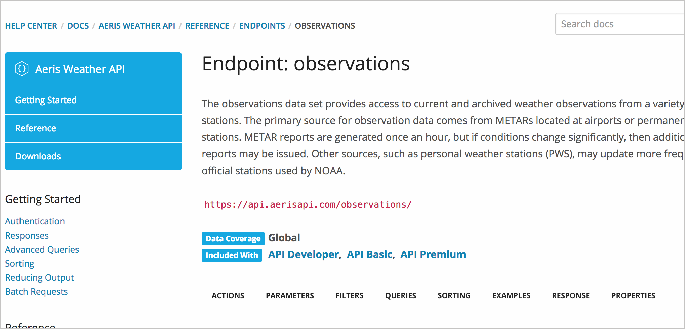
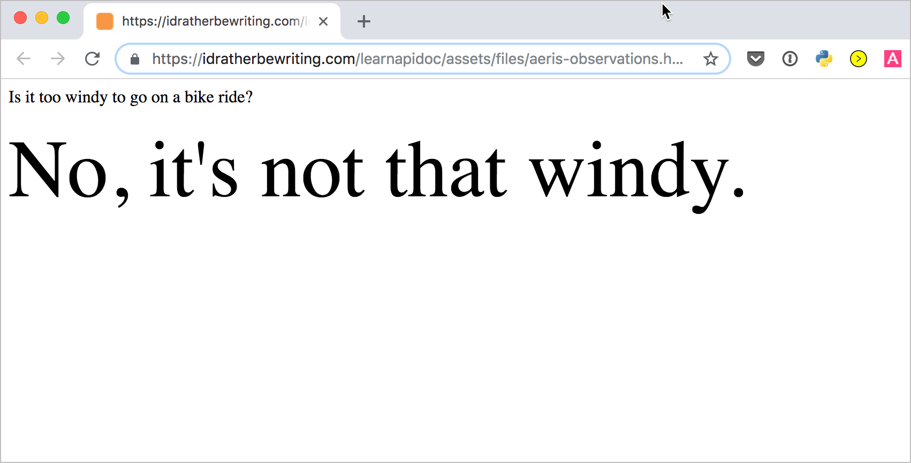

# 👨‍💻 Практическое занятие: Получить скорость ветра, используя API сервиса Aeris Weather

На этом занятии мы будем использовать API сервиса прогноза погоды AERIS для получения скорости ветра выбранного нами места. После, на веб-странице мы отобразим скорость ветра, основываясь на некоторой условной логике о значении скорости ветра.

[API сервиса прогноза погоды AERIS](#overview)

[1. Получаем API ключ](#getKey)

[2. Создаем запрос](#request)

[3. Анализируем ответ](#response)

[4. Получаем значения ответа](#pullValues)

<a name="overview"></a>
## API сервиса прогноза погоды AERIS

Ранее мы практиковались с интеграцией информации из [API OpenWeatherMap](https://openweathermap.org/api). Вероятно, было бы неплохо сравнить этот API OpenWeatherMap с API иного сервиса погоды. [Aeris Weather API](https://www.aerisweather.com/support/docs/api/) - один из самых интересных, хорошо документированных и мощных API сервисов прогноза погоды, с которыми мне приходилось сталкиваться.

<a name="getKey"></a>
## 1. Получаем API ключ

Открываем страницу [Getting Started](https://www.aerisweather.com/support/docs/api/getting-started/), изучаем информацию как зарегистрироваться и получить API ключ (получаем бесплатную версию ключей, доступных для проектов разработки). Для вызовов API на понадобятся и идентификатор и секретный код. Детали получения секретного кода и идентификатора API сервиса прогноза погоды Aeris можно изучить [по ссылке](../like-developer/get-authorization-keys.md#idAeris). (Или можно воспользоваться [ключами Автора курса](https://idratherbewriting.com/learnapidoc/assets/files/apikeys.txt) )

<a name="request"></a>
## 2. Создаем запрос

Переходим на страницу [конечных точек](https://www.aerisweather.com/support/docs/api/reference/endpoints/#all:all) API сервиса, и ищем ту, которая позволит получить скорость ветра. Конечная точка [`oservations`](https://www.aerisweather.com/support/docs/api/reference/endpoints/observations/), как и [`forecasts`](https://www.aerisweather.com/support/docs/api/reference/endpoints/forecasts/) предоставляет информацию о скорости ветра. Ответ от `oservations` выглядит проще, поэтому будем использовать ее.



Чтобы получить детали прогноза для Санта Клара в Калифорнии добавим `santa%20clara,ca` после `/observations`:

```
http://api.aerisapi.com/observations/santa%20clara,ca?client_id=CLIENT_ID&client_secret=CLIENT_SECRET
```
> В приведенном выше коде нужно будет вставить свой собственный CLIENT_ID и CLIENT_SECRET.

<a name="response"></a>
## 3. Анализируем ответ

Ответ на запрос будет [следующим](http://api.aerisapi.com/observations/santa%20clara,ca?client_id=ByruDorHEne2JB64BhP1k&client_secret=Jp4xullRcy6DXTPSTKBGXAvGGTaT04iiUQXPj0ob):

```yaml
{
  "success": true,
  "error": null,
  "response": {
    "id": "KSJC",
    "loc": {
      "long": -121.91666666667,
      "lat": 37.366666666667
    },
    "place": {
      "name": "san jose",
      "state": "ca",
      "country": "us"
    },
    "profile": {
      "tz": "America/Los_Angeles",
      "elevM": 24,
      "elevFT": 79
    },
    "obTimestamp": 1544806380,
    "obDateTime": "2018-12-14T08:53:00-08:00",
    "ob": {
      "timestamp": 1544806380,
      "dateTimeISO": "2018-12-14T08:53:00-08:00",
      "tempC": 14.4,
      "tempF": 58,
      "dewpointC": 6.1,
      "dewpointF": 43,
      "humidity": 58,
      "pressureMB": 1016,
      "pressureIN": 30,
      "spressureMB": 1014,
      "spressureIN": 29.94,
      "altimeterMB": 1017,
      "altimeterIN": 30.03,
      "windKTS": 14,
      "windKPH": 26,
      "windMPH": 16,
      "windSpeedKTS": 14,
      "windSpeedKPH": 26,
      "windSpeedMPH": 16,
      "windDirDEG": 140,
      "windDir": "SE",
      "windGustKTS": 20,
      "windGustKPH": 37,
      "windGustMPH": 23,
      "flightRule": "VFR",
      "visibilityKM": 16.09344,
      "visibilityMI": 10,
      "weather": "Cloudy",
      "weatherShort": "Cloudy",
      "weatherCoded": "::OV",
      "weatherPrimary": "Cloudy",
      "weatherPrimaryCoded": "::OV",
      "cloudsCoded": "OV",
      "icon": "cloudy.png",
      "heatindexC": 14,
      "heatindexF": 58,
      "windchillC": 14,
      "windchillF": 58,
      "feelslikeC": 14,
      "feelslikeF": 58,
      "isDay": true,
      "sunrise": 1544800479,
      "sunriseISO": "2018-12-14T07:14:39-08:00",
      "sunset": 1544835063,
      "sunsetISO": "2018-12-14T16:51:03-08:00",
      "snowDepthCM": null,
      "snowDepthIN": null,
      "precipMM": 0,
      "precipIN": 0,
      "solradWM2": 55,
      "solradMethod": "estimated",
      "ceilingFT": 7000,
      "ceilingM": 2133.6,
      "light": 24,
      "QC": "O",
      "QCcode": 10,
      "windGustSpeedKTS": 20,
      "windGustSpeedKPH": 37,
      "windGustSpeedMPH": 23,
      "sky": 100
    },
    "raw": "KSJC 141653Z 14014G20KT 10SM FEW024 BKN070 OVC110 14/06 A3003 RMK AO2 SLP168 T01440061",
    "relativeTo": {
      "lat": 37.35411,
      "long": -121.95524,
      "bearing": 68,
      "bearingENG": "ENE",
      "distanceKM": 3.684,
      "distanceMI": 2.289
    }
  }
}
```

`windSpeedMPH` - нужное нам значение

<a name="pullValues"></a>
## 4. Получаем значения ответа

Чтобы получить `windSpeedMPH`, мы должны получить к нему доступ через нотацию: `data.response.ob.windSpeedMPH`

Чтобы добавить немного разнообразия в примеры кода, давайте добавим немного условной логики для отображения. Следующий код проверяет, является ли `data.response.ob.windSpeedMPH` больше `15`. Если это так, вывод будет: `Yes, it's too windy.` Если меньше, вывод будет: `No, it's not that windy`.

```html
<html>
   <body>
      <script src="https://ajax.googleapis.com/ajax/libs/jquery/1.11.1/jquery.min.js"></script>
      <script>

         jQuery.ajax({
             url: "http://api.aerisapi.com/observations/santa%20clara,ca",
             type: "GET",
             data: {
                 "client_id": "CLIENTID",
                 "client_secret": "CLIENTSECRET",
             },
         })
         .done(function(data, textStatus, jqXHR) {
             console.log("HTTP Request Succeeded: " + jqXHR.status);
             console.log(data);
             if (data.response.ob.windSpeedMPH > 15) {
         	var windAnswer = "Yes, it's too windy.";
         }
         	else  {
         	 var windAnswer = "No, it's not that windy.";
         	}
             $("#windAnswer").append(windAnswer)
         })
         .fail(function(jqXHR, textStatus, errorThrown) {
             console.log("HTTP Request Failed");
         })
         .always(function() {
             /* ... */
         });


      </script>
      <p>Is it too windy to go on a bike ride?</p>
      <div id="windAnswer" style="font-size:76px"></div>

   </body>
</html>
```

Вот результат:



Ради эксперимента изменим значение с `15` на `1` в коде и обновим страницу. Вероятно, он скажет: «Да, это слишком ветрено». JavaScript - это весело, потому что легко настроить некоторые параметры и просмотреть результаты через браузер. Для других языков программирования может потребуется скомпилировать или запустить код в IDE, чтобы увидеть результат. В обоих случаях всегда лучше проверить код и запустить его самостоятельно.

[🔙](Retrieve-gallery-using-Flickr-API.md)

[Go next ➡](RAML-tutorial.md)
