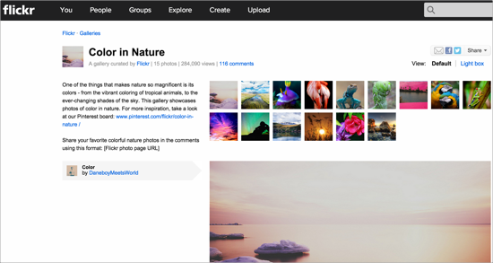
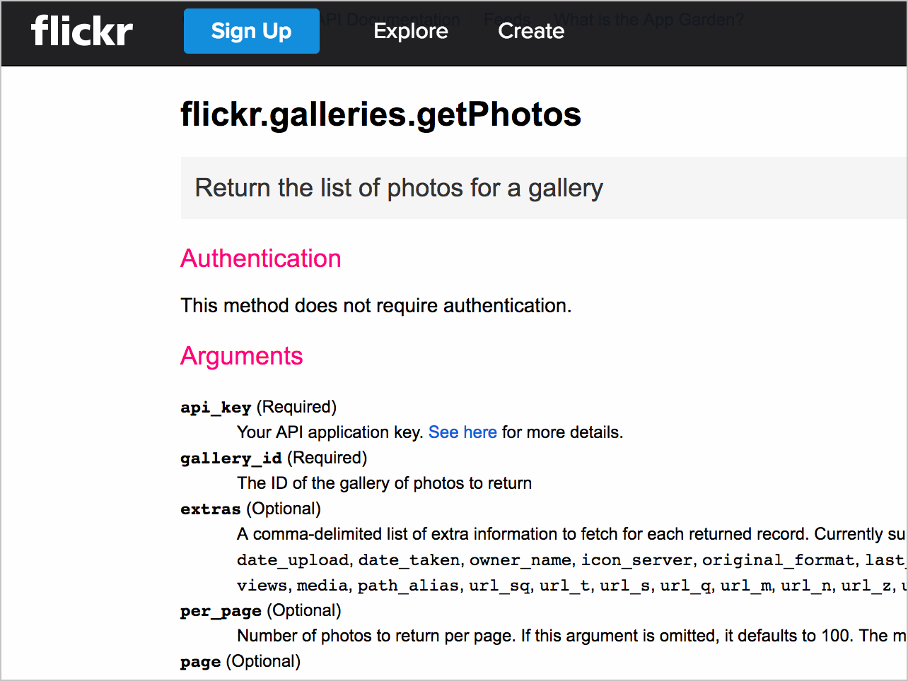
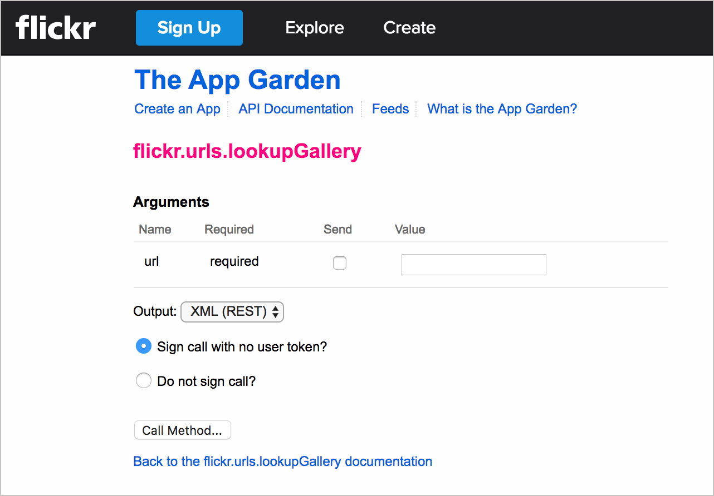
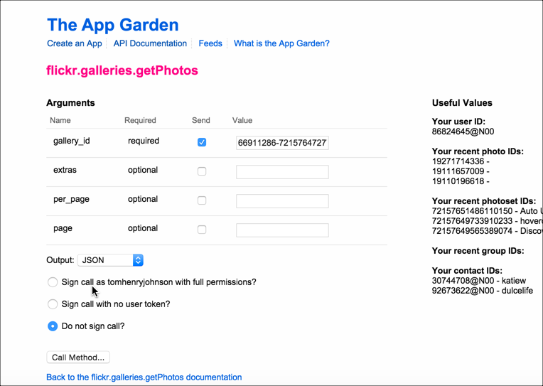
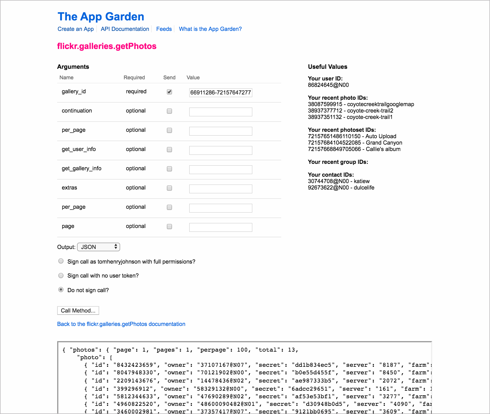
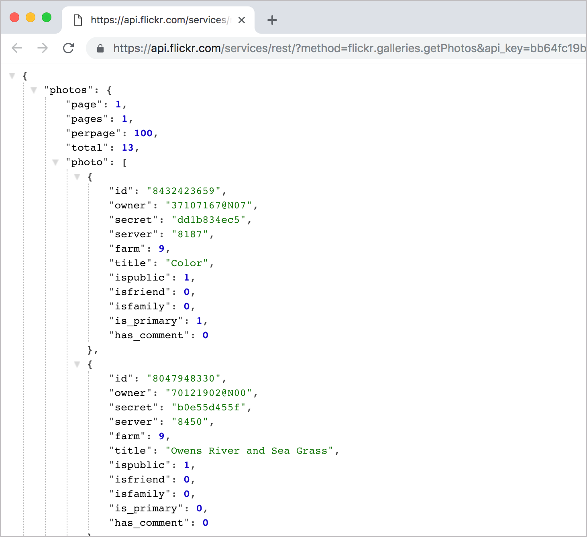
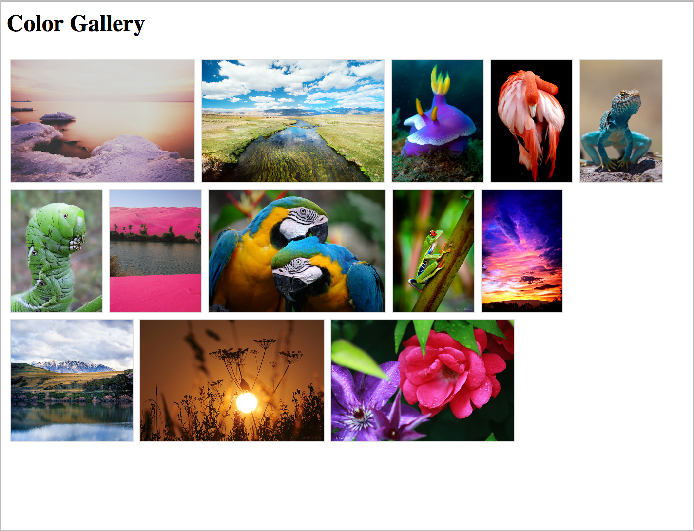

# 👨‍💻 Практическое занятие: Извлечь галерею, используя API сервиса Flickr

На этом занятии используем API Flickr чтобы извлечь фото из [этой галереи Flickr](https://www.flickr.com/photos/flickr/galleries/72157647277042064/)

[Обзор Flickr](#overview)

[1. Получаем API ключ для создания запросов](#getKey)

[2. Определяем нужные источник и эндпоинт](#determine)

[3. Создаем запрос](#request)

[4. Анализируем ответ](#response)

[5. Получаем нужную информацию](#pullInfo)

[Финальный результат](#final)

<a name="overview"></a>
## Обзор Flickr

В этом примере Flickr API мы хотим получить все фотографии из определенной галереи Flickr под названием [Color in Nature](https://www.flickr.com/photos/flickr/galleries/72157647277042064/) и отобразить их на веб-странице. Вот галерея, которую мы хотим:



Чтобы достичь нашей цели, нужно сделать вызовы нескольких конечных точек. Это упражнение продемонстрирует недостатки наличия справочной документации. Когда одной конечной точке требуется ответ другой конечной точки в качестве входных данных, нам, придется обрабатывать эти рабочие процессы с помощью учебных пособий.

<a name="getKey"></a>
## 1. Получаем API ключ для создания запросов

Прежде чем делать запросы в API Flickr нам понадобится API ключ, про который  можно почитать [здесь](https://www.flickr.com/services/apps/create/). После регистрации приложения нам будет предоставлен API ключ и секретный код.

<a name="determine"></a>
## 2. Определяем нужные источник и эндпоинт

В списке [методов API Flickr](https://www.flickr.com/services/api/) есть конечная точка [ flickr.galleries.getPhotos](https://www.flickr.com/services/api/flickr.galleries.getPhotos.html), которая будет получать фотографии из галереи.



Одним из аргументов, который нам нужен для конечной точки `getPhotos`, является `gallery_id`. Однако прежде чем мы сможем получить `gallery_id`, мы должны использовать другую конечную точку для его получения. Несколько неочевидно, что `gallery_id` - это не идентификатор, который отображается в URL-адресе галереи.

Вместо этого мы используем конечную точку [flickr.urls.lookupGallery](https://www.flickr.com/services/api/explore/flickr.urls.lookupGallery), указанную в разделе ресурса URL-адресов, чтобы получить `gallery_id` из URL-адреса галереи:




`Gallery_id` для [Color in Nature](https://www.flickr.com/photos/flickr/galleries/72157647277042064/) - 66911286-72157647277042064. Теперь у нас есть аргументы, которые нам нужны для конечной точки `flickr.galleries.getPhotos`.

<a name="request"></a>
## 3. Создает запрос

Теперь мы можем сделать запрос, чтобы получить список фотографий для этого конкретного `gallery_id`.

Flickr предоставляет API Explorer для упрощения вызовов к конечным точкам. Если мы перейдем в [API Explorer для конечной точки `galleries.getPhotos`](https://www.flickr.com/services/api/explore/flickr.galleries.getPhotos), мы можем подключить `gallery_id` и посмотреть ответ, а также получить синтаксис URL для конечной точки.



Вставляем `gallery_id`, выбираем **JSON** для вывода, выбираем **Do not sign call** (поскольку мы только тестируем, дополнительная защита нам не нужна), а затем нажимаем **Call Method**.

И вот результат:



URL под ответом показывает правильный синтаксис для использования этого метода:

```
https://www.flickr.com/services/rest/?method=flickr.galleries.getPhotos&api_key&gallery_id=66911286-72157647277042064&format=json&nojsoncallback=1
```

> в URL убран API ключ для исключения злоупотребления им, но свой ключ каждый увидит в своем URL.

Если отправить запрос непосредственно в браузере, используя указанный URL-адрес, то увидим тот же ответ, но в браузере, а не в API Explorer:



> Для читаемого отображения ответа JSON можно использовать плагин JSON Formatting для Chrome (для браузера Chrome. Без этого плагина отображение будет сжатым)

<a name="response"></a>
## 4. Анализируем ответ

Вся необходимая информация включена в этот ответ для показа фотографий на нашем сайте, но не совсем интуитивно понятно, как мы строим URL-адреса источника изображения из ответа.

Другими словами, информация, необходимая пользователю для достижения цели, не указана в справочной документации API. Справочная документация объясняет только то, что возвращается в ответе, а не то, как на самом деле использовать ответ.

Страница [Photo Source URL](https://www.flickr.com/services/api/misc.urls.html) в документации поясняет:

Вы можете создать исходный URL-адрес фотографии, когда вы знаете ее идентификатор, server ID, farm ID и секретный код, как возвращают многие методы API. URL имеет следующий формат:

```
https://farm{farm-id}.staticflickr.com/{server-id}/{id}_{secret}.jpg
	or
https://farm{farm-id}.staticflickr.com/{server-id}/{id}_{secret}_[mstzb].jpg
	or
https://farm{farm-id}.staticflickr.com/{server-id}/{id}_{o-secret}_o.(jpg|gif|png)
```

Вот как выглядит элемент в ответе JSON:

```json
{
  "photos": {
    "page": 1,
    "pages": 1,
    "perpage": 100,
    "total": 13,
    "photo": [
      {
      "id": "8432423659",
      "owner": "37107167@N07",
      "secret": "dd1b834ec5",
      "server": "8187",
      "farm": 9,
      "title": "Color",
      "ispublic": 1,
      "isfriend": 0,
      "isfamily": 0,
      "is_primary": 1,
      "has_comment": 0
      },
      ...
    ]
    }
}
```

Доступ к этим полям мы получаем в точечной записи. Хорошая идея записать весь объект на консоль, чтобы лучше изучить его.

<a name="pullInfo"></a>
## 5. Получаем нужную информацию

Следующий код использует jQuery для циклического просмотра каждого из ответов и вставляет необходимые компоненты в тег изображения для отображения каждой фотографии.

```html
<html>
<style>
img {max-height:125px; margin:3px; border:1px solid #dedede;}
</style>
<body>

<script src="https://ajax.googleapis.com/ajax/libs/jquery/1.11.1/jquery.min.js"></script>


<script>

var settings = {
  "async": true,
  "crossDomain": true,
  "url": "https://api.flickr.com/services/rest/?method=flickr.galleries.getPhotos&api_key=APIKEY&gallery_id=66911286-72157647277042064&format=json&nojsoncallback=1",
  "method": "GET",
  "headers": {}
}

$.ajax(settings).done(function (data) {
  console.log(data);


$("#galleryTitle").append(data.photos.photo[0].title + " Gallery");
    	$.each( data.photos.photo, function( i, gp ) {

var farmId = gp.farm;
var serverId = gp.server;
var id = gp.id;
var secret = gp.secret;

console.log(farmId + ", " + serverId + ", " + id + ", " + secret);

//  https://farm{farm-id}.staticflickr.com/{server-id}/{id}_{secret}.jpg

$("#flickr").append('');

});
});

</script>


<h2><div id="galleryTitle"></div></h2>
<div style="clear:both;"/>
<div id="flickr"/>


</body>
</html>
```

Вот что делает код:

- метод [ajax из jQuery](http://api.jquery.com/jquery.ajax/) в коде получает полезную нагрузку JSON. Полезная нагрузка назначается аргументу `data` и затем регистрируется на консоли;
- объект `data` содержит объект с именем `photos`, который содержит массив с именем `photo`. Поле `title` является свойством объекта в массиве `photo`. `title` доступен через эту точечную запись: `data.photos.photo[0].title`;
- чтобы получить каждый элемент в объекте, [каждый метод](http://api.jquery.com/jquery.each/) jQuery просматривает свойства объекта. Метод jQuery `each` обычно используется для просмотра результатов полученных значений. Для первого аргумента (`data.photos.photo`) мы указываем объект, к которому хотите получить доступ. Для аргументов `function( i, gp )` мы указываем индекс и значение. Здесь можно использовать любые имена. `gp` становится переменной, которая ссылается на объект `data.photos.photo`, который мы просматриваем. `i` ссылается на начальную точку через объект. (Здесь нам не нужно ссылаться на `i`, под экземпляром, если мы не хотим начать или завершить цикл в определенный момент.);
- для доступа к свойствам JSON мы используем `gp.farm` вместо `data.photos.photo[0].farm`, потому что `gp` является ссылкой на объект `data.photos.photo[i]`;
- после того, как функция `each` выполняет итерацию ответа, добавим несколько переменных, чтобы облегчить работу с этими компонентами (используя `server ID` вместо `gp.server` и т.д.) Сообщение `console.log` проверяет, что мы получаем значения для каждого из необходимых нам элементов;
- комментарий ниже показывает, где нам нужно подключить каждую из переменных:

```javascript
//  https://farm{farm-id}.staticflickr.com/{server-id}/{id}_{secret}.jpg
```

Последняя строка показывает как нужно вставлять эти переменные в HTML код:

```javascript
$("#flickr").append('');
```
> Распространенным паттерном в программировании является циклический просмотр ответа. Этот пример кода использовал метод `each` из jQuery, чтобы просмотреть все элементы в ответе и что-то сделать с каждым элементом. Иногда мы включаем логику, которая проходит по элементам и ищет определенные условия, чтобы решить, следует ли предпринять какое-либо действие. Стоит обратить внимание на методы зацикливания, так как они являются распространенными сценариями в программировании.

Дополнительно можно посмотреть разделы:

- [Изучение полезных данных JSON ответа](../like-developer/inspect-json.md)
- [Доступ и вывод на страницу определенного значения JSON](../like-developer/access-print-value.md)
- [Точечная нотация](../like-developer/dot-notation.md)

<a name="final"></a>
## Финальный результат

Демо интеграции Color Gallery можно посмотреть [здесь](https://idratherbewriting.com/learnapidoc/assets/files/flickr-gallery-example.html)

Результат выглядит так:



[🔙](Get-event-information-using-Eventbrite-API.md)

[Go next ➡](Get-wind-speed-using-Aeris-API.md)
