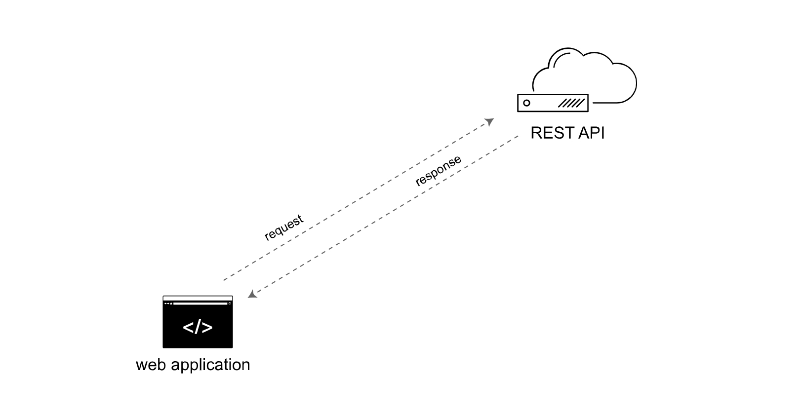

# Документация API: руководство для технических писателей

На этом курсе по созданию документации REST API, вместо простых разговорах об абстрактных понятиях, мы будем применять практический подход к документированию REST API. Изучим документацию API на примере использования различных API сервисов погоды.

Используя API на этом курсе, мы узнаем о конечных точках, их параметрах, типах данных, аутентификации, curl, JSON, командной строке, консоли разработчика Chrome, JavaScript и многих других деталях, связанных с REST API.

Идея курса состоит в том, что вместо изучения этих концепций вне контекста, погрузить себя в реальные сценарии использования API. Такой подход сделает этот курс намного эффективнее.

На курсе мы изучим стандарты, инструменты и спецификации REST API. Узнаем о необходимых разделах в документации API, проанализируем примеры документации REST API от различных компаний, узнаем, как присоединиться к проекту с открытым исходным кодом, для получения опыта, и многое другое.

Будет интересно!

**Содержание**

[О REST API](#about)

[От практики до документации](#from-practice-to-doc)

[Для кого этот курс](#who-the-course-is-for)

[Организация курса](#course-org)

[Последовательность и действия](#activities)

[Поможет ли курс найти работу техписателя?](#job-getting)

[Никаких навыков программирования не требуется](#no-skills)

[Инструменты для работы](#tools)

[Видеозапись](#videos)

[Слайды](#slides)

[Актуальность контента курса](#content-update)

[Оставаться в курсе](#news)

## О REST API

Вкратце, REST API (которые является разновидностью веб-API) используют запросы и ответы, что мало чем отличается от посещения веб-страницы. Вы делаете запрос к ресурсу, хранящемуся на сервере, и сервер отвечает запрошенной информацией. Протокол, используемый для передачи данных, -  HTTP. «REST» (Representational State Transfer) означает репрезентативную передачу состояния.

*REST API используют запросы и ответы по протоколу HTTP*

Более подробно о принципах REST в файле [Что такое REST API?](what-is-rest-api.md). В документации API REST описываются различные конечные точки, их методы, параметры и другие сведения, а также документируются образцы ответов от конечных точек.

## От практики до документации

В этом курсе, после практики с API в роли разработчика, изменятся перспективы и простой технический писатель станет техническим писателем, которому поручено документировать новую конечную точку API.

Как технические писатели, будем рассматривать каждый элемент в документации REST API:

1. [Описание ресурса](../documenting-api-endpoints/step1-resourse-description.md)
2. [Конечная точка и методы](../documenting-api-endpoints/step2-endpoints-and-methods.md)
3. [Параметры](../documenting-api-endpoints/step3-parameters.md)
4. [Пример запроса](../documenting-api-endpoints/step4-request-example.md)
5. [Пример ответа](../documenting-api-endpoints/step5-response-example-and-schema.md)

Изучение этих разделов даст четкое представление о том, как документировать REST API. Также узнаем, как документировать [концептуальные разделы API](../conceptual-topics/README.md), такие как [руководство по началу работы](../conceptual-topics/getting-started.md), [коды статусов и ошибок](../conceptual-topics/status-error-codes.md), [авторизация запроса](../conceptual-topics/authentication-and-authorization.md) и т.д.

Наконец, изучим разные способы [публикации API документации](../Publishing-doc/README.md), изучим инструменты и спецификации, такие как [GitHub](../Publishing-doc/Manage-wiki-content.md), [Jekyll](../Publishing-doc/Jekyll-and-сloudCannon.md) и подходы [Docs-as-code](../Publishing-doc/Doc-as-code-tools.md). Узнаем, как использовать шаблоны, создавать интерактивные консоли API, чтобы пользователи могли опробовать запросы и посмотреть ответы, а также узнаем, как управлять своим контентом с помощью [контроля версий](../Publishing-doc/Version-control-system.md).

Мы также окунемся в спецификации, такие как [спецификация OpenAPI](../openAPI-specification/openapi-tutorial-overview.md) и [Swagger](../openAPI-specification/introduction-openapi-and-swagger.md), который предоставляют инструментарий для спецификации OpenAPI. Кроме того, вы узнаете, [как документировать нативные библиотеки API](../Native-library/README.md) и генерировать [Javadoc](../Native-library/Activity-Generate-Javadoc.md). Все концепции в реальные с примерами и демонстрациями.

## Для кого этот курс

Курс в первую очередь нужен следующим специалистам:

- Профессиональные технические писатели, желающие перейти от документации GUI к документации, ориентированной на API для разработчиков;
- Студенты изучающие область технических коммуникаций, которая все больше фокусируется на документации для разработчиков;
- Разработчики, которые документируют свои собственные API-интерфейсы и хотят узнать лучшие практики по структуре, терминологии и стилю с помощью технических документов.

## Организация курса

1. [Введение в REST API](README.md)
 - API-интерфейсы REST очень популярны в мире IT, и веб превращается в совокупность взаимосвязанных API-интерфейсов. API REST состоят из запросов и ответов от сервера. Технические писатели способные писать документацию для разработчиков имеют огромные перспективы. Этот курс поможет разобраться с документированием API, особенно при помощи практических занятий.
2. [Используем REST API в роли разработчика](../like-developer/README.md)
 - Роль разработчика поможет лучше понять потребности разработчиков, а также то, что разработчики обычно ищут в документации API. Разработчики часто используют такие инструменты, как Postman или curl, для совершения запросов. Они смотрят на структуру ответа и динамически интегрируют необходимую информацию в веб-страницы и другие приложения.
3. [Документирование конечных точек API](../documenting-api-endpoints/README.md)
 - документация конечных точек API состоит из пяти основных разделов: описания ресурсов, конечные точки и методы, параметры, примеры запросов, примеры ответов и схемы. Чтобы задокументировать конечные точки API, старайтесь предоставлять подробную информацию для каждого из этих разделов.
4. [Спецификация OpenAPI и Swagger](../openAPI-specification/README.md)
 - Спецификация OpenAPI предоставляет один из способов описания REST API и включает все разделы, упомянутые в модуле [Документирование конечных точек API](../documenting-api-endpoints/README.md). Фреймворки, такие как Swagger UI, могут анализировать спецификацию OpenAPI и генерировать интерактивную документацию, которая позволяет пользователям опробовать конечные точки при изучении API.
5. [Тестирование документации API](../testing-api-doc/REDME.md)
 - Тестирование документации имеет решающее значение для предоставления точной, полной информации. Из-за высокого уровня сложности и технических требований документации API и иной документации разработчиков многие технические писатели склонны брать информацию из такой документации и добавлять ее без личного тестирования. Однако простая игра в редакционную/издательскую функцию может сделать из вас простого секретаря.
6. [Концептуальные разделы API](../conceptual-topics/README.md)
 - В то время как адресные темы в API, как правило, получают наибольшее внимание, безадресные разделы, такие как разделы о начале работы, информация об авторизации, ограничении скорости, кодах состояния и ошибок, кратких справочных руководствах и других темах, составляют около половины документации. Этими вопросами обычно занимаются технические писатели, а не разработчики. Вы можете оценить качество документации API, посмотрев, включает ли она эти не справочные темы.
7. [Публикация документации API](../Publishing-doc/README.md)
 - Документация по API часто соответствует принципу docs-as-code, где инструменты для создания и публикации документации тесно связаны с теми же инструментами, которые разработчики используют для написания, управления, построения и развертывания кода. Docs-as-code включает в себя использование облегченных форматов, таких как Markdown, совместную работу с помощью Git или других систем управления версиями, создание сайта документации с помощью генератора статического сайта и развертывание его с помощью модели непрерывной сборки, где сборка происходит на сервере при фиксировании изменений в определенной ветви.
8. [Работа технического писателя API](../Getting-job/README.md)
 - Чтобы получить работу, имеющую отношение к документации API, нужно продемонстрировать портфолио и технические способности. В портфолио должны быть включены образцы документации, написанной для разработчиков. Одним из способов создания такого портфолио является работа над проектом с открытым исходным кодом. Желательно находиться в техническом центре, где доступны задания по документации API, например, в Калифорнии, Техасе, Нью-Йорке или Вирджинии. В целом, развитие в мире документации для разработчиков потребует постоянного изучения здоровой порции кода, несмотря на свою сложность.
9. [Нативные библиотеки API](../Native-library/README.md)
 - API нативных библиотек относятся к Java, C ++ или другим API, специфичным для программирования. При таком подходе вместо запроса информации через Интернет, библиотека кода загружается и интегрируется в проект. Библиотека компилируется непосредственно в сборку приложения (а не доступна через веб-протоколы, как с REST API). Хотя этот тип API встречается реже, он включен здесь частично, для пояснения, что отличает API REST от API нативных библиотек.
10. [Глоссарий и источники](../glossary-and-resourses/README.md)
 - Документация API полна жаргонов, сокращений и множества новых терминов. Этот глоссарий предоставляет список терминов и определений.
Кроме того, этот модуль содержит дополнительные упражнения и информацию, например, дополнительные действия по вызову API или дополнительную информацию об альтернативных спецификациях.

## Последовательность и действия

Нет необходимости изучать модули по порядку - можно "гулять" по ним по своему усмотрению. Но некоторые из модулей (например, [Используем REST API в роли разработчика](../like-developer/README.md) и [Конечные точки API](../documenting-api-endpoints/README.md)) все-таки должны быть последовательны.

Поскольку цель курса - помочь в обучении, существует множество видов деятельности, которые требуют практического программирования и других упражнений. Наряду с учебной деятельностью существуют также концептуальные глубокие погружения, но основное внимание всегда уделяется обучению на практике.

Практические занятия помечаются значком в заголовке раздела: 👨‍💻

Упражнения интегрированы в модули, но можно увидеть список заданий в [«Практических занятиях»](workshop-activities.md).

Курс назван «курсом», а не книгой или веб-сайтом, главным образом потому, что в каждом модуле включены практические занятия для наработки опыта.

## Поможет ли курс получить работу техписателя API?

Самая распространенная причина, по которой люди проходят этот курс, - понимание документирования API. Курс поможет осуществить задуманное, но пассивное чтение содержимого не поспособствует этому. Необходимо выполнять упражнения, в каждом модуле, особенно те, которые связаны с работой над контентом из проекта с открытым исходным кодом. Эти действия имеют решающее значение для накопления опыта и пополнения портфолио. Более подробные сведения приведены в модуле [Работа технического писателя API](../Getting-job/README.md).

## Навыки программирования не требуются

Что касается необходимого технического уровня для курса, вам не нужны какие-либо программные знания или другие предварительные условия, но зная базу HTML, CSS и JavaScript будет немного легче.

Если вы немного знакомы с концепцией программирования, вы можете перешагивать некоторые разделы и переходить к темам, которые хотите узнать больше. Этот курс рассчитан для новичков.

Некоторые примеры кода в этом курсе используют JavaScript. JavaScript может быть, а может и не быть языком, который вы фактически используете при документировании REST API, но, скорее всего, будет какой-то язык или платформа программирования, которые важно знать.

JavaScript - один из самых полезных и простых языков для изучения, поэтому его проще использовать в примерах кода для данного введения в документацию по REST API. JavaScript позволяет вам тестировать код, просто открывая его в браузере (а не компилируя в IDE). ([Быстрый ускоренный курс по JavaScript](https://idratherbewriting.com/javascript/)).

## Инструменты для работы

- Текстовый редактор ([Atom](https://atom.io/) или [Sublime text](http://www.sublimetext.com/))
- браузер [Chrome](https://www.google.com/chrome/) есть встроенная консоль Javascript, которая хорошо подходит для проверки JSON, поэтому мы будем использовать Chrome. [Firefox](https://www.mozilla.org/en-US/firefox/) тоже подойдет
- [Postman](https://www.getpostman.com/) - приложение, которое позволяет вам делать запросы и видеть ответы через клиент GUI.
- [curl](https://curl.haxx.se/) необходим для выполнения запросов к конечным точкам из командной строки. На компьютерах Mac уже установлен curl. Пользователи Windows должны следовать инструкциям по установке curl [здесь](http://www.confusedbycode.com/curl/). (Примечание: выберите одну из «бесплатных» версий для установки curl.)
- [Git](https://git-scm.com/) - инструмент контроля версий, который разработчики часто используют для совместной работы над кодом. Для Windows [здесь](https://gitforwindows.org/) установка и настройки Git и эмулятор терминала Git BASH. Для Mac смотрите [Загрузка Git](https://git-scm.com/download/mac), а также рассмотрите возможность установки [iTerm2](https://iterm2.com/).
- аккаунт на [GitHub](https://github.com/) будет использоваться для различных действий, иногда для демонстрации рабочего процесса Git, а иногда в качестве службы аутентификации для инструментов разработчика. Если у вас еще нет учетной записи GitHub, зарегистрируйте ее.
- аккаунт [StopLight](https://next.stoplight.io/) предоставляет инструменты визуального моделирования для работы со спецификацией OpenAPI. Создайте учетную запись Stoplight, используя свои учетные данные GitHub.
- ключ к API OpenWeatherMap Мы будем использовать [API OpenWeatherMap](https://openweathermap.org/) для некоторых упражнений. Для активации ключа API OpenWeatherMap требуется несколько часов, поэтому лучше, если вы получите ключ API заранее - тогда, когда вы приступите к действиям API OpenWeatherMap, все будет готово. Чтобы получить свой (бесплатный) ключ API OpenWeatherMap, перейдите по адресу [https://openweathermap.org/](https://openweathermap.org/). Нажмите Зарегистрироваться в верхней панели навигации и создайте учетную запись. После того, как вы зарегистрируетесь, войдите в систему и найдите ключ API по умолчанию на панели инструментов разработчика. Он находится на вкладке API Keys. Скопируйте ключ в место, где его легко найти.

## Видео записи

Видео записи курса [здесь](). Самым последним полнометражным видео всего курса является семинар по API, который я провел в Менло-Парке, штат Калифорния, в ноябре 2018 года. Этот видеофрагмент не настолько детализирован, как в письменном материале, но будет быть хорошим началом.  

Подборка предстоящих презентаций в [блоге автора курса](https://idratherbewriting.com/presentations/) для получения подробной информации о будущих семинарах и презентациях.

## Слайды курса

Есть различные слайды, охватывающие различные модули этого курса, которые можно использовать при подготовке и проведения семинаров. Преподаватель, адаптирующий этот материал для курса по документации API в программе технической коммуникации, может клонировать и изменять слайды. [Слайды курса здесь](https://idratherbewriting.com/learnapidoc/docapis_course_slides.html).

Слайды используют [RevealJS](https://github.com/hakimel/reveal.js/), который представляет собой HTML / CSS / JS-фреймворк для слайдов.

## Актуальность контента курса

Одной из проблем любого технического курса является обеспечение актуальности контента. Технологии быстро меняются, и благодаря многим практическим занятиям в этом курсе, некоторые шаги легко устаревают с течением времени. Автор курса пытается сохранить здоровый баланс между общими и конкретными деталями в содержании курса. Если вы обнаружите, что что-то устарело, или найдены ошибки, pull requests are welcome.

## Оставаться в курсе

Если вы проходите этот курс, скорее всего, захотите узнать больше об API. Автор публикует регулярные статьи, в которых рассказывается об API и стратегиях их документирования. Вы можете оставаться в курсе об этих сообщениях, [подписавшись на его бесплатную рассылку](https://tinyletter.com/tomjoht).

[🔙](README.md)

[Go next ➡](video-presentations.md)
