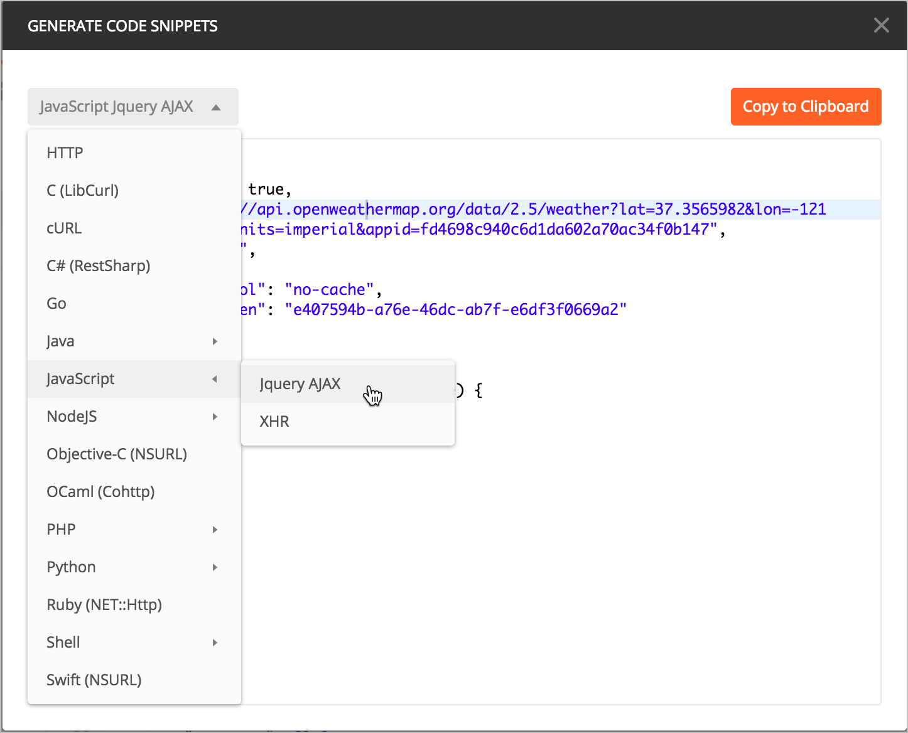
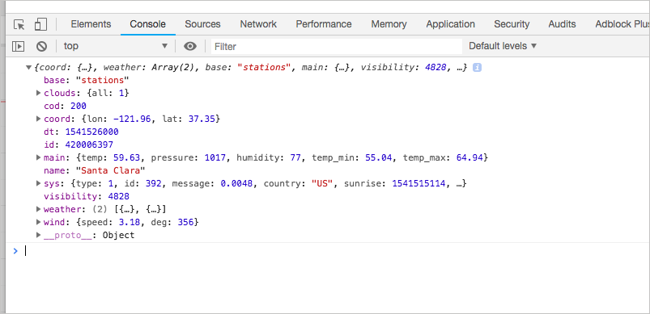

# Изучение полезных данных JSON ответа

Видеть ответы curl или Postman - это круто, но как использовать данные JSON? В большей части документации API не нужно показывать, как использовать данные JSON. Полагаем, что разработчики будут использовать свои front-end навыки, чтобы анализировать данные и отображать их соответствующим образом в своих приложениях. Чтобы лучше понимать, как разработчики получают доступ к данным, пройдем краткое руководство, как отображать ответ API на веб-странице.

[Практическое занятие: делаем запрос на странице при помощи AJAX](#ajaxRequest)

[Метод AJAX из jQuery](#jquery)

[Логгирование ответов в консоли](#logging)

[Практическое занятие: Изучаем полезные данные](#payload)

<a name="ajaxRequest"></a>
## 👨‍💻 Практическое занятие: делаем запрос на странице при помощи AJAX

На этом занятии мы будем использовать JavaScript для отображения ответа API на веб-странице. В частности, будем использовать  автоматически сгенерированный код jQuery из Postman для создания запроса AJAX.

1. В текстовом редакторе создаем новый html-файл и вставляем в него шаблон (который содержит основные теги HTML и ссылку на jQuery):

```html
<html>
<meta charset="UTF-8">
    <head>
        <title>Sample page</title>
        <script src="https://ajax.googleapis.com/ajax/libs/jquery/1.11.1/jquery.min.js"></script>
    </head>
    <body>
    <h1>Sample page</h2>

    </body>
</html>
```

2. сохраняем файл с именем **weather.html**

3. Открываем Postman и переходим к конечной точке "Текущие данные погоды", которую мы сконфигурировали ранее в [Отправке запросов в Postman](submit-requests-postman.md)

4. Нажимаем на ссылку `Code` (под кнопкой `Save`) и выбираем **JavaScript > jQuery AJAX**



Код AJAX должен выглядеть так:

```javascript
var settings = {
  "async": true,
  "crossDomain": true,
  "url": "https://api.openweathermap.org/data/2.5/weather?zip=95050&appid=fd4698c940c6d1da602a70ac34f0b147&units=imperial",
  "method": "GET",
  "headers": {
    "cache-control": "no-cache",
    "postman-token": "e9be9756-b922-89b3-7109-66bc4cf06b17"
  }
}

$.ajax(settings).done(function (response) {
  console.log(response);
});
```

5. Нажимаем на `Copy to clipboard` чтобы скопировать пример кода.

6. В примере кода, который написали в первом пункте добавляем пару `<script></script>` под ссылкой jQuery и вставляем между этими тегами код, полученный в Postman.

7. В коде jQuery удаляем объект `headers`, который вставил Postman:

```
"headers": {
    "cache-control": "no-cache",
    "postman-token": "e9be9756-b922-89b3-7109-66bc4cf06b17"
}   
```

8. Также удалим точку после метода GET `"method": "GET"` .

Финальный код должен выглядеть так:

```html
<!DOCTYPE html>
<html>
   <meta charset="UTF-8">
   <head>
      <meta charset="UTF-8">
      <script src="https://ajax.googleapis.com/ajax/libs/jquery/1.11.1/jquery.min.js"></script>
      <title>Sample Page</title>
      <script>
         var settings = {
           "async": true,
           "crossDomain": true,
           "url": "https://api.openweathermap.org/data/2.5/weather?zip=95050&appid=fd4698c940c6d1da602a70ac34f0b147&units=imperial",
           "method": "GET"
         }

         $.ajax(settings).done(function (response) {
           console.log(response);
         });
      </script>
   </head>
   <body>
      <h1>Sample Page</h1>
   </body>
</html>
```

> Файл можно посмотреть по адресу [ idratherbewriting.com/learnapidoc/assets/files/weather-plain.html](https://idratherbewriting.com/learnapidoc/assets/files/weather-plain.html) Там же добавлены инструкции, как открыть консоль разработчика, потому что в противном случае отображение страницы на этом этапе в учебнике будет полностью пустым.

9. Открываем **Chrome**, кликаем правой кнопкой мыши и нажимаем `view code` в правой верхней части переходим на вкладку `console` и раскрываем `Object`

10. В Chrome переходим в «Файл»> «Открыть файл» и выберите файл weather.html. (Если вы не видите меню «Файл» в Chrome, нажмите Cmd + O или Ctrl + O или просто перетащите файл weather.html в окно браузера.)

Тело страницы будет пустым, но ответ о погоде должен быть записан в консоли JavaScript (из-за кода console.log (response) в запросе). Если развернуть объект, возвращенный в консоль, он будет выглядеть следующим образом:



Теперь эта информация доступна для интеграции на вашей странице.

<a name="jquery"></a>
## Метод AJAX из jQuery

В этом разделе узнаем больше о функции `ajax`, которую мы использовали ранее. Возможно, эта информация не важна для документирования API, но ее хорошо понимать. Скрипт `ajax`в коде выглядит так:

```javascript
<script>
   var settings = {
     "async": true,
     "crossDomain": true,
     "url": "https://api.openweathermap.org/data/2.5/weather?zip=95050&appid=fd4698c940c6d1da602a70ac34f0b147&units=imperial",
     "method": "GET"
   }

   $.ajax(settings).done(function (response) {
     console.log(response);
   });
</script>
```

Если вы работаете с JavaScript и API, [метод `ajax` из jQuery](http://api.jquery.com/jquery.ajax/) может помочь с примерами кода. Метод `ajax` ниже принимает один аргумент: `settings`

```JavaScript
$.ajax(settings)
```

Аргумент `settings` - это объект, который содержит множество пар ключ-значение.

```javascript
var settings = {
}
```

Каждая из разрешенных пар ключ-значение определены в [документации jQuery ajax](http://api.jquery.com/jquery.ajax/#jQuery-ajax-settings).  

Одно важное значение - это `url`, который является URI или конечной точкой, на которую вы отправляете запрос. Другое значение - это `headers`, которые позволяют включать в запрос пользовательские заголовки.

Посмотрим на пример кода, который создали. Переменная `settings` передается в качестве аргумента методу `ajax`. jQuery делает запрос к URL-адресу HTTP асинхронно, что означает, что он не будет зависать на компьютере, пока мы ждем ответа. Можно продолжать использовать свое приложение при выполнении запроса.

Получаем ответ, вызвав метод `done`.

```JavaScript
$.ajax(settings).done(function (response) {
})
```

В предыдущем примере кода `done` содержит анонимную функцию (функцию без имени), которая выполняется при вызове `done`. Объект ответа от вызова `ajax` назначается аргументу метода `done`, который в данном случае является `response`. (Можно назвать аргумент как угодно.)

Затем можно получить доступ к значениям из объекта ответа, используя обозначение объекта. В этом примере ответ только зарегистрирован в консоли.

Новичку в JavaScript, возможно, будет немного непонятно сейчас. Если это так, не беспокойтесь - чем больше вы его используете, тем яснее становится код.

> Заметили, как сложно объяснить код? Это одна из задач документации. К счастью, нам не нужно много объяснять о стандартных языках программирования, таких как JavaScript. Но, возможно, понадобиться объяснить, как работать с API на разных языках. Рассмотрим эту тему более подробно в разделе [Описание и образцы кода](../conceptual-topics/code-samples.md).

<a name="logging"></a>
## Логгирование ответов в консоли

Строка кода, которая логгирует ответы в консоль, была просто такой:

    console.log(response);

Логгирование ответов в консоли может быть полезным способом проверить, работает ли ответ API (что также полезно для отладки или устранения неполадок в коде). Консоль сворачивает каждый объект внутри расширяемой секции. Можно проверить полезные данные в консоли, чтобы увидеть, содержатся ли ожидаемые значения (без вывода значений на страницу).

Можно добавить другую информацию в сообщение журнала консоли. Чтобы предварить сообщение журнала своей строкой, можно сделать так:

```
console.log("Here's the response: " + response);
```

Строки всегда заключаются в кавычки, и используем знак `+` для объединения строк с переменными JavaScript, такими как response.

Настройка сообщений журнала полезна для логгирования различных выходных данных в консоли, если нужно пометить их идентификатором.


<a name="payload"></a>
## 👨‍💻 Практическое занятие: Изучаем полезные данные

Посмотрим на полезные данные, развернув [каждый из разделов, возвращаемых в консольном объекте JSON](https://idratherbewriting.com/learnapidoc/assets/files/weather-plain.html). Основываясь на полученной информации, можно узнать прогноз на сегодня?

[🔙](analyze-json-response.md)

[Go next ➡](access-print-value.md)
