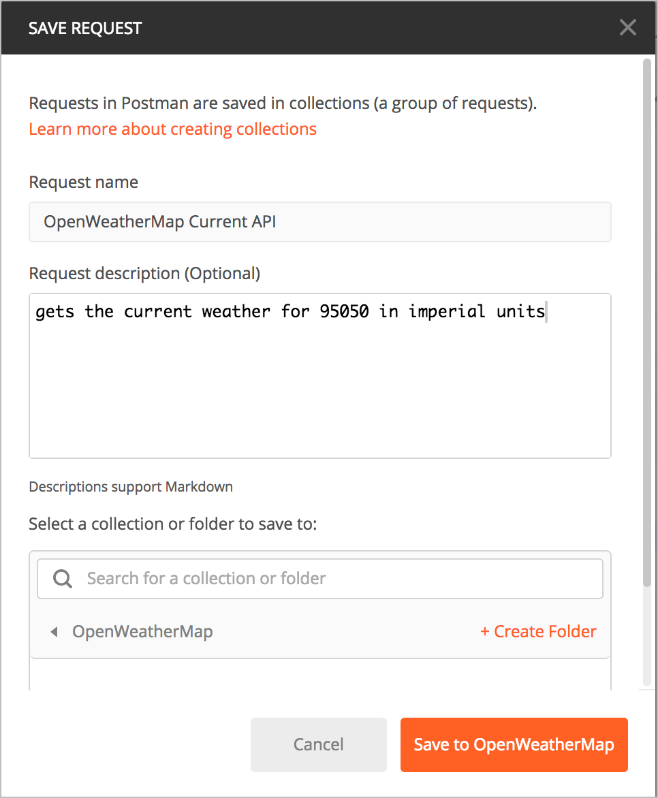
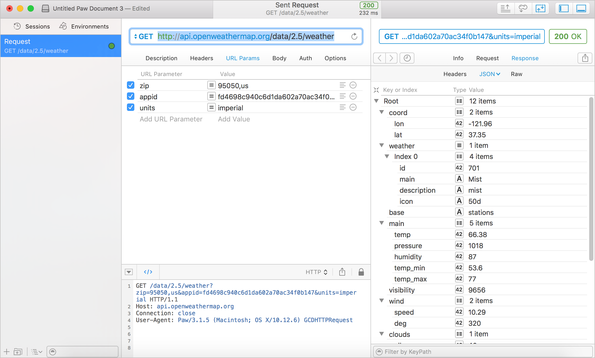

# Отправка запросов в Postman

При тестировании конечных точек с различными параметрами, можно использовать один из множества доступных графических интерфейсов для выполнения запросов. (Графический интерфейс пользователя с полями и кнопками, на которые можно щелкнуть.) Также можно использовать [curl](curl-intro-and-instalation.md) (о чем мы поговорим в ближайшее время), но графический интерфейс, как правило, упрощает тестирование API REST.

[Зачем нужен графический интерфейс?](#whyGui)

[Популярные инструменты](#popularGUI)

[Практическое занятие: создаем запрос в Postman](#postmanRequest)

[Создаем запрос](#make)

[Сохраняем запрос](#save)

[Создаем запрос на 5-дневный прогноз OpenWeatherMap](#5daysRequest)

[Создаем еще один запрос OpenWeatherMap](#oneMoreRequest)

[Аналогичные запросы в Paw вместо Postman](#paw)

[Вводим несколько запросов для Aeris API в Postman](#aerisAPI)

[Автоматический импорт коллекций Postman](#autoImport)

[Коллекция OpenWeatherMap API](#openweathermapAPI)

[Коллекция Aeris Weather API](#aerisCollection)


<a name="whyGui"></a>
## Зачем нужен графический интерфейс?

Возможности графического интерфейса:

- Сохраняет ваши запросы (и многочисленные варианты) для легкого запуска в будущем;
- легкий ввод информации в правильном формате;
- просмотр ответа в формате JSON или в необработанном виде;
- легкое включение информации заголовка.

В графическом интерфейсе не нужно переживать о правильности синтаксиса curl и анализировать запрос и ответы в командной строке.

<a name="popularGUI"></a>
## Популярные инструменты

Вот некоторые популярные инструменты:

- [Postman](https://www.getpostman.com/);
- [Paw](https://paw.cloud/) для MacOS;
- [Advanced REST Client](https://chrome.google.com/webstore/detail/advanced-rest-client/hgmloofddffdnphfgcellkdfbfbjeloo/related) расширение Google Chrome;
- [REST Console](https://github.com/geetarista/rest-console)

Из всех графических инструментов, пожалуй Postman является самым лучшим, т.к. он позволяет сохранять как запросы, так и ответы, работает как на MacOS, так и на Windows, обладает гибкой конфигурацией и бесплатный.

> Часто теоретические знания не имеют смысла, пока вы не сможете связать их с действием. В этом курсе автор больше следует методологии «сначала опыт». После выполнения практического занятия подробно рассматривается теория. Так что, если кажется, что сейчас автор зацикливается на понятиях, таких как метод GET или конечная точка, держитесь. Когда мы окунемся в разделы [Documenting API endpoints](../documenting-api-endpoints/README.md), все станет намного понятнее.

<a name="postmanRequest"></a>
## 👨‍💻 Практическое занятие: создаем запрос в Postman

<a name="make"></a>
### Создаем запрос

Использование инструмента Postman для создания запроса о текущих погодных данных при помощи конечной точки API OpenWeatherMap.

1. Если еще не установлен Postman, откройте сайт [https://www.getpostman.com/](https://www.getpostman.com/) и установите приложение
2. Запустить приложение
3. Выбрать метод GET (обычно выбирается по умолчанию)
4. Вставить конечную точку  [https://api.openweathermap.org/data/2.5/weather](https://api.openweathermap.org/data/2.5/weather) в ячейку справа от метода
5. Открыть вкладку `Params` под методом и вписать следующие значения:

	key: `zip` / value: `95050`

	key: `units` / value: `imperial`

	key: `appid` / value: `APIKEY`

Вставить в значение ZIP и appid нужный индекс и ключ авторизации API

Интерфейс Postman будет выглядеть так:


При добавлении параметров они будут отображаются в виде строки запроса к URL-адресу конечной точки в поле GET.

В пример конечная точка будет выглядеть так: [https://api.openweathermap.org/data/2.5/weather?zip=95050&units=imperial&appid=8d3f4ca3fe57058a39b58b2a30945699](https://api.openweathermap.org/data/2.5/weather?zip=95050&units=imperial&appid=8d3f4ca3fe57058a39b58b2a30945699) (но с другими значениями API ключа)

Параметры строки запроса отображаются после знака "?" и разделяются между собой амперсандом "&". Порядок параметров в строке запросов значения не имеет.

Многие API передают ключ API в заголовке, а не в качестве параметра строки запроса в URL-адресе запроса. (Если бы это было так, вы бы кликнули вкладку «Headers» и вставили необходимую пару ключ-значение в заголовок.)

6. Кликнуть на кнопку `Send`

Ответ появится в нижней панели. Пример:

 

<a name="save"></a>
### Сохраняем запрос

1. В Postman нажать на кнопку `Save` (правее `Send`)
2. В диалоговом окне ввести имя запроса, например: "OpenWeatherMap Current API"
3. В описании запроса написать краткое описание запроса (опционально), например: "gets the current weather for 95050 in imperial units."
4. Проскроллить окно немного вниз и нажать `Create collection` для создания папки, куда будет сохранен запрос. После создания выбрать созданную папку.

После создания папки кнопка `Save` станет активной. Диалоговое окно будет выглядеть примерно так:



5. Нажать `Save to (имя папки)`

Сохраненные конечные точки будут видны в панели слева в Коллекциях. Если панель "Коллекции" не видна, нажать кнопку `Show/Hide Sidebar` в нижнем левом углу.

<a name="5daysRequest"></a>
### Создаем запрос на 5-дневный прогноз OpenWeatherMap

Теперь вместо получения текущей погоды, используем другую конечную точку OpenWeatherMap для получения прогноза. Введите данные в Postman для [5-дневного прогноза](https://openweathermap.org/forecast5). В Postman вы можете щелкнуть новую вкладку или щелкнуть стрелку рядом с «Сохранить» и выбрать «Сохранить как». Затем выберите свою коллекцию и запросите название.

Пример конечной точки для 5-дневного прогноза, который указывает местоположение по почтовому индексу, выглядит следующим образом:

```
https://api.openweathermap.org/data/2.5/forecast?zip=95050,us
```
Добавим в параметры запроса значения API и units

```
https://api.openweathermap.org/data/2.5/forecast?zip=95050&appid=APIKEY&units=imperial
```
В своей ссылке замените `APIKEY` на ключ API

<a name="oneMoreRequest"></a>
### Создаем еще один запрос OpenWeatherMap

Сделаем еще один запрос API OpenWeatherMap, на этот раз изменив параметры, которые использовали ранее для указания местоположения (для любой конечной точки). Например, если указали местоположение по почтовому индексу, изменим его на географические координаты lat и lon.

Например:

```
https://api.openweathermap.org/data/2.5/weather?lat=37.3565982&lon=-121.9689848&units=imperial&appid=fd4698c940c6d1da602a70ac34f0b147
```

<a name="paw"></a>
## Аналогичные запросы в Paw вместо Postman

Хотя Postman является популярным REST-клиентом, можно использовать и другие, например Paw.

На следующем рисунке показан тот же запрос API текущей погоды, который был сделан в [Paw](https://paw.cloud/) для Mac.



Как и Postman, Paw также позволяет видеть заголовки запросов, заголовки ответов, параметры URL и другие данные. Здорово, что Paw показывает ответ в расширяемом / разборном виде. Функция "развернуть / свернуть" может облегчить изучение ответа. Но стоит обратить внимание, что Paw относится только к Mac и, как и большинство продуктов Mac, стоит денег.

<a name="aerisAPI"></a>
## Вводим несколько запросов для Aeris API в Postman

Теперь давайте посмотрим информацию о погоде из [Aeris Weather API](https://www.aerisweather.com/), которую изучили [исследуя API Aeris](using-api-scenario.md#aeris). Сконструировать конечную точки для Aeris Weather API немного сложнее, поскольку для конфигурации конечной точки можно использовать много разных запросов, фильтров и других параметров.

Вот несколько предварительно настроенных запросов для настройки для Aeris.

Можно вставить запросы непосредственно в поле запроса URL-адреса в Postman (после настройки значений `CLIENTID` и `CLIENTSECRET`), и параметры будут автоматически заполнены в нужных полях.

Как и в случае OpenWeatherMap API, Aeris API не использует поле заголовка для передачи ключей API - ключ и секрет передаются непосредственно в URL-адресе запроса, как часть строки запроса.

> При создании следующих запросов, вставьте свои собственные значения для `CLIENTID` и `CLIENTSECRET` (при условии, что вы получили их, выполняя практическое занятие [Получаем секретный код и ID Aeris Weather API](get-authorization-keys.md#idAeris) ). При отсутствии `CLIENTID` и `CLIENTSECRET`, можно использовать [ключи автора](https://idratherbewriting.com/learnapidoc/assets/files/apikeys.txt).

Получаем прогноз погоды для  своего района, используя конечную точку [Observations](https://www.aerisweather.com/support/docs/api/reference/endpoints/observations/):

```
http://api.aerisapi.com/observations/Santa+Clara,CA?client_id=CLIENTID&client_secret=CLIENTSECRET&limit=1
```

Получите погоду из города на экваторе - Чимборасо, Эквадор, используя ту же точку [Observations](https://www.aerisweather.com/support/docs/api/reference/endpoints/observations/):

```
http://api.aerisapi.com/observations/Chimborazo,Ecuador?client_id=CLIENTID&client_secret=CLIENTSECRET&limit=1
```

Узнайте, вся ли музыка кантри в Ноксвилле, штат Теннесси, дает людям мигрени, используя конечную конечную точку [Indices](https://www.aerisweather.com/support/docs/api/reference/endpoints/indices/):

```
http://api.aerisapi.com/indices/migraine/Knoxville,TN?client_id=CLIENTID&client_secret=CLIENTSECRET
```

Подумываете о переезде в Аризону, но вы хотите найти получше место? Используйте конечную точку [normals](https://www.aerisweather.com/support/docs/api/reference/endpoints/normals/)

```
http://api.aerisapi.com/normals/flagstaff,az?client_id=CLIENTID&client_secret=CLIENTSECRET&limit=5&filter=hassnow
```

> И с OpenWeatherMap, и с Aeris Weather API можно сделать эти запросы, просто перейдя по URL-адресу в адресной строке (поскольку API передаются в строке запроса, а не в заголовке). Используйте [расширение JSON Formatter для Chrome](https://chrome.google.com/webstore/detail/json-formatter/bcjindcccaagfpapjjmafapmmgkkhgoa?hl=en), чтобы автоматически форматировать ответ JSON в представлении браузера.

Изучив эти два разных API сервисов прогноза погоды, можно увидеть различия в способе вызова и возврата информации. Однако, по сути, оба API имеют конечные точки, которые можно настраивать с помощью параметров. При создании запроса с конечными точками, получаем ответы, которые содержат информацию, часто в формате JSON. Это основа работы REST API: отправляем запрос - получаем ответ.

<a name="autoImport"></a>
## Автоматический импорт коллекций Postman

Postman имеет отличную функцию импорта, которая будет автоматически получать введенные запросы. Можно пройти по ссылкам для автоматического импорта этих коллекций в ваш Postman

<a name="openweathermapAPI"></a>
### Коллекция OpenWeatherMap API

[OpenWeatherMap API для Postman](https://www.getpostman.com/collections/abd0d0741e8206266958)

<a name="aerisCollection"></a>
### Коллекция Aeris Weather API

[Aeris Weather API для Postman](https://www.getpostman.com/collections/65dcddab41ff7a773bb1)

Для импорта: нужно скопировать адрес ссылки, в Postman нажать `Import` в верхнем левом углу. Затем перейдите на вкладку `Import from link`, вставить адрес и нажать `Import`.

> Если вы хотите узнать больше о Postman, послушайте это [интервью с основателем Postman](https://idratherbewriting.com/2018/01/22/postman-for-docs-podcast/). Интервью записано как часть подкаста [Write the Docs](https://podcast.writethedocs.org/). Дополнительные сведения о создании кнопок «Выполнить в Postman» см. в разделе [Run in Postman button](../conceptual-topics/getting-started.md#button) .

[🔙](get-authorization-keys.md)

[Go next ➡](curl-intro-and-instalation.md)
