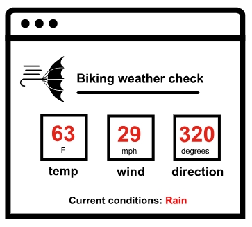
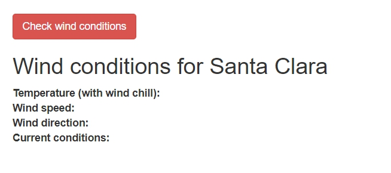

# Сценарий использования API прогнозных сервисов

Давайте перейдем к практике API, чтобы больше узнать о том, как они работают. В этой главе изучим API сервисов прогноза погоды в контексте конкретного варианта использования: получим прогноза погоды. Попробовав себя роль разработчика, работающего с API, мы поймем, как наша аудитория будет использовать API, какой тип информации понадобится, и что можно будет делать с полученной информацией.

[Пример сценария: Насколько ветрено?](#windy)

[Идея конечной цели](#endGol)

[Исследуем API OpenWeatherMap](#OpenWeatherMap)

[Практика: Знакомство с API OpenWeatherMap](#familiar)

[Исследуем API Aeris](#aeris)

[API других прогнозных сервисов](#weatherAPI)

## Пример сценария: Насколько ветрено?

Допустим, я - веб-разработчик и хочу добавить информацию о погоде на свой сайт. Мой сайт для велосипедистов. Я хочу, чтобы пользователи, которые заходят на мой сайт, могли видеть текущее состояние ветра и температуры. Что-то вроде этого:

У меня нет собственной метеорологической службы, поэтому мне предстоит сделать несколько звонков в службу погоды, чтобы получить эту информацию. После этого я выдам информацию пользователям.

## Идея конечной цели

Чтобы понимать конечную цель, вот пример:

[idratherbewriting.com/learnapidoc/assets/files/wind-openweathermap.html](https://idratherbewriting.com/learnapidoc/assets/files/wind-openweathermap.html)

Конечно пример отличается от макета выше, но здесь есть место для ответов на вопрос: «Какой сейчас ветер и температура?»

Нажмем кнопку `Check wind conditions`, чтобы просмотреть сведения о ветре и температуре. Когда мы запрашиваем эти данные, вызывается API сервиса OpenWeatherMap. API получает информацию, а код JavaScript печатает информацию на странице.

Пример выше очень прост. Можно сделать более привлекательный интерфейс, например как этот:

Концепция и общие приемы более или менее совпадают. За кулисами код делает запросы к API сервиса погоды, а затем отображает возвращенную информацию в стилизованном пользовательском интерфейсе.

## Исследуем API OpenWeatherMap

Несмотря на то, что для разработчиков есть [много хороших API-интерфейсов сервисов погоды](https://superdevresources.com/weather-forecast-api-for-developing-apps/), было решено использовать API [OpenWeatherMap](https://openweathermap.org/)  в этом курсе, потому что сервис прост в использовании, бесплатен и стабилен.

## 👨‍💻 Практика: Знакомство с API OpenWeatherMap

Изучим основные разделы [OpenWeatherMap API](https://openweathermap.org/api/)

1. Открываем сайт [https://openweathermap.org](https://openweathermap.org).
2. Перейдем в раздел API, кликнув по нему в навигационной панели.
3. В секции **Current weather data** кликнуть на кнопку `API Doc`

Разбираемся в информации, предоставленной в Current weather data API. Вызовы API позволяют разработчикам запрашивать информацию для своих приложений. Другими словами, API предоставят данные для приложений, которые разрабатывают разработчики.

4. Ответим на вопросы о конечных точках API Current weather data :

 - Предоставляет ли API нужную информацию о температуре, скорости и направлении ветра, и текущих условиях (Подсказка: посмотрите на пример ответа API, кликнув по ссылке `Example`)?
 - Какими способами можно указать местоположение для информации о погоде?
 - Как выглядит пример запроса?
 - Сколько конечных точек имеет API?
 - Какие учетные данные нужны для получения ответа?  

## Исследуем API Aeris

Прежде чем углубляться в API OpenWeatherMap, рассмотрим API другого сервиса погоды. В отличие от OpenWeatherMap API, [Aeris Weather API](#familiar) более надежный и обширный. Исследуйте Aeris Weather API, выполнив следующие действия:

1. Открываем сайт [https://www.aerisweather.com/](https://www.aerisweather.com/)
2. Переходим в раздел документации, кликнув на название раздела `Documentation`
3. Нажимаем на `Weather API`
4. Нажимаем на `Data Endpoints`
5. Нажимаем на `Reference` в боковом меню и выбираем `Endpoints`(или переходим сразу [по прямой ссылке](https://www.aerisweather.com/support/docs/api/reference/endpoints/))

6. в списке конечных точек выберем [`observations`](https://www.aerisweather.com/support/docs/api/reference/endpoints/observations/)
7. Просмотрите на тип информации, доступной через эту конечную точку. Предоставляет ли эта конечная точка информацию о ветре и температуре, подходящую для нашего сценария?

> Вот API прогноза погоды Aeris в действии, совершающий в основном те же вызовы, показанные ранее с OpenWeatherMap: .

Для нашего сценария (отображение прогноза погоды на веб-сайте), мы могли бы использовать десятки различных API погоды.

Создавая документацию по API, нужно думать о том, как пользователи могут принимать те же решения при выборе API. Есть ли несколько API, которые предоставляют аналогичную информацию? Что сделает наш API более заметным? Хотя вы, вероятно, не можете выбрать, какую информацию возвращает ваш API, вы можете, по крайней мере, утверждать, что документы для вашего API будут превосходны!

## 👨‍💻 API других прогнозных сервисов

API-интерфейсы значительно различаются по своему дизайну, представлению, ответам и другим деталям.

Для большего сравнения, посмотрим на следующие API погоды:

- [Dark Sky API](https://darksky.net/dev);
- [Accuweather API](https://developer.accuweather.com/);
- [Weather Underground API](https://www.wunderground.com/weather/api/);
- [Weatherbit API](https://www.weatherbit.io/api).

Каждый сервис погоды имеет свой подход к документированию API. Как мы увидим, пройдя этот курс, разнообразие и уникальность каждого сайта, посвященного API, (даже при приближении к одной и той же теме - прогнозу погоды) создает много проблем для команд технических писателей. Меняются не только стили веб-сайтов, но и терминология API и словарный запас для описания похожих концепций.

Как упоминалось ранее, REST API - это архитектурный стиль, который следует общим характеристикам и принципам; не все они соответствуют одному и тому же стандарту или спецификации. Пользователи должны прочитать документацию, чтобы понять, как использовать API. (См. [REST - это стиль, а не стандарт»](../introduction-rest-apis/what-is-rest-api.md#style).)

[🔙](README.md)

[Go next ➡](get-authorization-keys.md)
