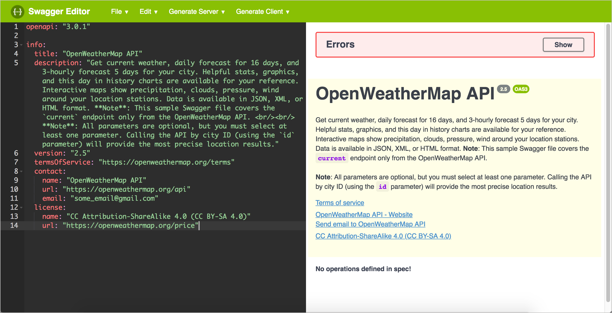

# Руководство OpenAPI Шаг 2: Объект `info`

| [*Шаг 1: объект* `openapi`](step1-openapi-object.md) | --> | [**Шаг 2: объект** `info`](step2-info-object.md) | --> | [*Шаг 3: объект* `servers`](step3-servers-object.md) | --> | [*Шаг 4: объект* `paths`](step4-paths-object.md) | --> | [*Шаг 5: объект* `components`](step5-components-object.md) | --> | [*Шаг 6: объект* `security`](step6-security-object.md) | --> | [*Шаг 7: объект* `tags`](step7-tags-object.md) | --> | [*Шаг 8: объект* `externalDocs`](step8-externalDocs-object.md) |

Объект `info` содержит основную информацию о вашем API, включая заголовок, описание, версию, ссылку на лицензию, ссылку на условия обслуживания и контактную информацию. Многие из свойств являются необязательными.

[Пример объекта `info`](#sample)

[Отображение в Swagger UI](#appearance)

<a name="sample"></a>
## Пример объекта `info`

Вот пример объекта `info` и его свойств

```yaml
openapi: "3.0.2"
info:
  title: "OpenWeatherMap API"
  description: "Get the current weather, daily forecast for 16 days, and a three-hour-interval forecast for 5 days for your city. Helpful stats, graphics, and this day in history charts are available for your reference. Interactive maps show precipitation, clouds, pressure, wind around your location stations. Data is available in JSON, XML, or HTML format. **Note**: This sample Swagger file covers the `current` endpoint only from the OpenWeatherMap API. <br/><br/> **Note**: All parameters are optional, but you must select at least one parameter. Calling the API by city ID (using the `id` parameter) will provide the most precise location results."
  version: "2.5"
  termsOfService: "https://openweathermap.org/terms"
  contact:
    name: "OpenWeatherMap API"
    url: "https://openweathermap.org/api"
    email: "some_email@gmail.com"
  license:
    name: "CC Attribution-ShareAlike 4.0 (CC BY-SA 4.0)"
    url: "https://openweathermap.org/price"
```

> При описании свойств можно использовать [CommonMark Markdown](https://spec.commonmark.org/0.27/), который  более точен, однозначен и надежен, чем оригинальный Markdown. Например, CommonMark Markdown предлагает [обратные слэши](https://spec.commonmark.org/0.27/#backslash-escapes) и точно определяет, сколько пробелов нужно в списках и других пунктуациях. Также можно переходить на новые строки с помощью `\n` и избегать проблемные символы, такие как кавычки или двоеточия с обратной косой чертой.

При написании контента в свойствах `description`, нужно обратить внимание, что двоеточия являются проблематичными в YAML, потому что они обозначают новые уровни. Либо избегайте двоеточий с обратной косой чертой, либо заключите значение `description` в кавычки. Можно использовать одинарные или двойные кавычки для значений свойств. (Если заключать значения в кавычки, в текстовых редакторах может отображаться подсветка кода свойств и значений.)

<a name="appearance"></a>
## Отображение в Swagger UI

Двигаемся дальше: вставляем [код](#sample) вместе с объектом `openapi` из предыдущего шага в редактор Swagger. В Swagger UI отображены ошибки рендеринга (поскольку в документе спецификации еще нет объектов `path`), но содержимое все равно будет отображаться. (Можно пока свернуть окно ошибок в верхней части нажав `Hide`).

Информация в Swagger UI будет отображаться следующим образом:



В `description`, в дополнение к описанию общего API, можно предоставить пользователям несколько основных инструкций по использованию Swagger UI. Если есть тестовая учетная запись, которую они должны использовать, можно предоставить им необходимую информацию в этом поле.

[🔙](step1-openapi-object.md)

[Go next ➡](step3-servers-object.md)
