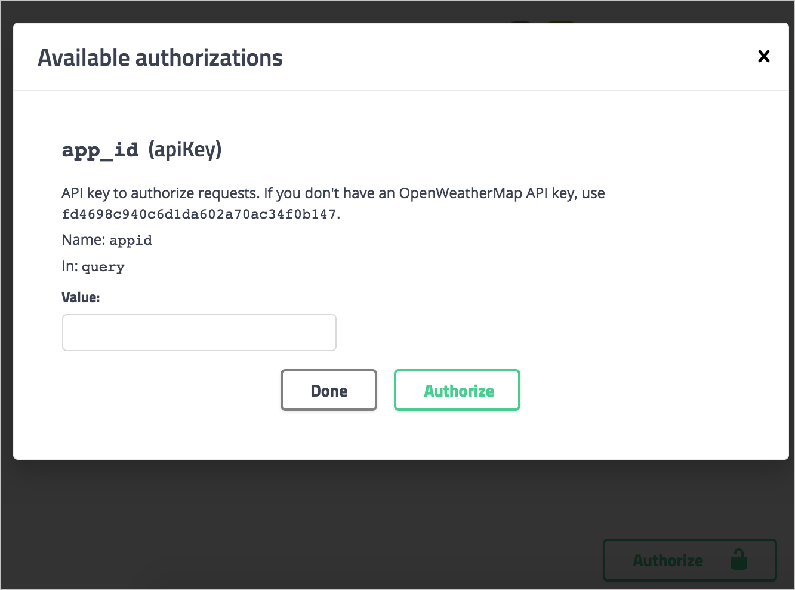
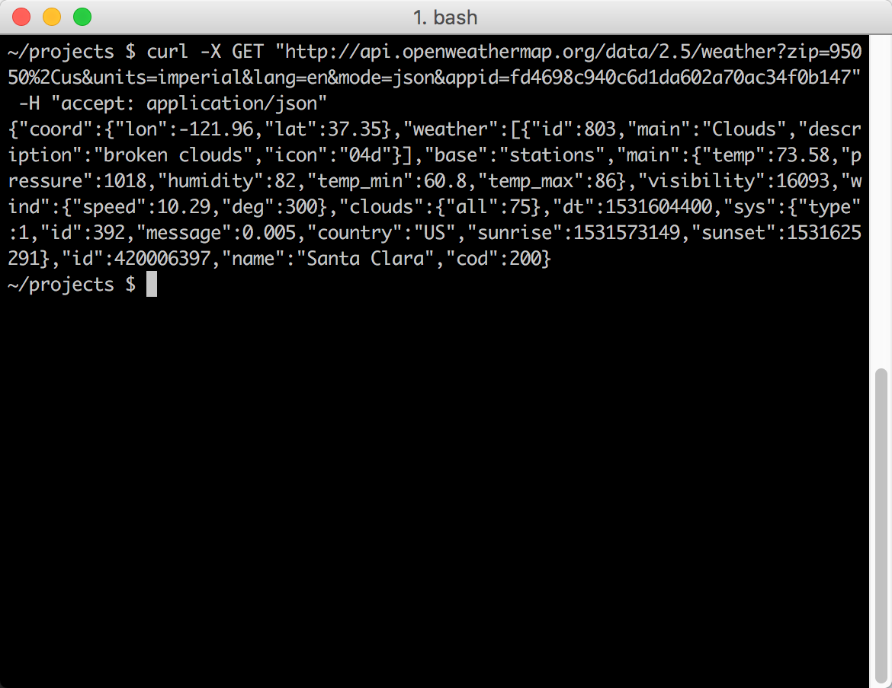

# Руководство OpenAPI Шаг 6: Объект `security`

| [*Шаг 1: объект* `openapi`](step1-openapi-object.md) | --> | [*Шаг 2: объект* `info`](step2-info-object.md) | --> | [*Шаг 3: объект* `servers`](step3-servers-object.md) | --> | [*Шаг 4: объект* `paths`](step4-paths-object.md) | --> | [*Шаг 5: объект* `components`](step5-components-object.md) | --> | [**Шаг 6: объект** `security`](step6-security-object.md) | --> | [*Шаг 7: объект* `tags`](step7-tags-object.md) | --> | [*Шаг 8: объект* `externalDocs`](step8-externalDocs-object.md) |

Swagger UI предоставляет функцию **Try it out**, которая позволяет пользователям отправлять реальные запросы. Для отправки запросов, авторизованных нашим сервером API, спецификация должна содержать информацию о безопасности, которая авторизует запрос. [Объект `security`](https://github.com/OAI/OpenAPI-Specification/blob/master/versions/3.0.2.md#securityRequirementObject) указывает протокол безопасности или авторизации, используемый при отправке запросов.

[Выбор схемы безопасности](#which)

[Авторизация API ключом](#apikeyAuth)

[Объект `security`](#securityObject)

[Ссылка на схему безопасности в компонентах](#schmenaInComponents)

[Отображение в Swagger UI](#appearanse)

[Тест авторизации](#test)

## Выбор схемы безопасности

В API REST могут использоваться различные подходы безопасности для авторизации запросов. Рассмотрим наиболее распространенные методы авторизации в [Требованиях аутентификации и авторизации](../conceptual-topics/authentification-and-authorization.md). Swagger UI поддерживает четыре схемы авторизации:

- API ключ;
- HTTP;
- OAuth 2.0;
- Open ID Connect.

На этом шаге руководства по OpenAPI мы будем использовать подход с использованием API ключа, поскольку именно его использует API-интерфейс OpenWeatherMap. Если ваш API использует [OAuth 2.0]() или другой метод, надо прочитать [Security Scheme information](https://github.com/OAI/OpenAPI-Specification/blob/master/versions/3.0.2.md#security-scheme-object), чтобы узнать, как ее настроить. Тем не менее, все методы безопасности в основном следуют одному и тому же шаблону.

## Авторизация API ключом

В примере API OpenWeatherMap, который мы используем в этом курсе, используется ключ API, переданный в строке запроса URL-адреса (а не в заголовке). Если вы отправляете запрос без ключа API в строке запроса (или без действительного ключа API), сервер отклоняет запрос. Для получения подробной информации о модели авторизации OpenWeatherMap см. [How to start](https://openweathermap.org/appid#use).

## Объект `security`

На корневом уровне документа OpenAPI добавим объект `security`, который определяет глобальный метод безопасности API:

    security:
    - app_id: []

`app_id` - произвольное имя, которое мы дали этой схеме безопасности в нашем объекте `securitySchemes`. Мы могли бы назвать ее как угодно. Мы определим `app_id` в `components`.

Все пути будут использовать метод безопасности `app_id` по умолчанию, если он не переопределен значением на [уровне объекта `path`](step4-paths-object.md). Например, на уровне пути мы могли бы перезаписать метод глобальной безопасности следующим образом:

    /current:
      get:
        ...
        security:
        - some_other_key: []

Тогда путь `weather` будет использовать метод безопасности `some_other_key`, в то время как все другие пути будут использовать глобально объявленную безопасность `app_id`.

## Ссылка на схему безопасности в компонентах

В [объекте `components`](step5-components-object.md) добавим [объект `securitySchemes`](https://github.com/OAI/OpenAPI-Specification/blob/master/versions/3.0.2.md#securitySchemeObject), который определяет подробности о схеме безопасности, которую использует API:

    components:
      ...

      securitySchemes:
        app_id:
          type: apiKey
          description: API key to authorize requests. If you don't have an OpenWeatherMap API key, use `fd4698c940c6d1da602a70ac34f0b147`.
          name: appid
          in: query

Свойства, которые можно использовать для каждого элемента в объекте `securitySchemes`, включают следующее:

- `type`: протокол авторизации - `apiKey`, `http`, `oath2` или `openIdConnect`.
- `description`: Описание метода безопасности. В Swagger UI это описание появляется в модале авторизации (см. Скриншот ниже). CommonMark Markdown разрешена.
- `name`: Имя значения заголовка, представленного в запросе. Используется только для безопасности типа `apiKey`.
- `in`: Указывает, где применяется ключ безопасности. Варианты: `query`, `header` или `cookie`. Используется только для безопасности типа `apiKey`.
- `scheme`: Используется с авторизацией типа `http`.
- `bearerFormat`: Используется с авторизацией типа `http`.
- [объект `flow`](https://github.com/OAI/OpenAPI-Specification/blob/master/versions/3.0.2.md#oauthFlowsObject): Используется с авторизацией типа `oath2`
- `openIdConnectUrl`: Используется с авторизацией типа `openIdConnect`

## Отображение в Swagger UI

В редакторе Swagger, если еще не указано, добавим объект `security` на корневом уровне:

    security:
    - app_id: []

И вставим объект `securitySchemes` в объект `components` (на том же уровне, что и `parameters` и `responses`):

    components:
      parameters:
      ...
      responses:
      ...

      securitySchemes:
        app_id:
          type: apiKey
          description: API key to authorize requests. If you don't have an OpenWeatherMap API key, use `fd4698c940c6d1da602a70ac34f0b147`.
          name: appid
          in: query

И проверим, как изменился наш Swagger UI в правой части: появилась кнопка `Authorize`

>Добавление в спецификацию информации о безопасности

Если нажать на кнопку, то появится `description` и другие детали авторизации:

После ввода ключа API ([Ключ мы получали во втором модуле](../like-developer/get-authorization-keys.md#key) ) и нажатия кнопки `Authorize` метод авторизации устанавливается для любого количества запросов. Сессия авторизации истекает только тогда, когда пользователи обновляют страницу.

## Тест авторизации

Теперь, когда мы добавили авторизацию, попробуем сделать фактический запрос API. В редакторе Swagger (правая панель) нажмите кнопку `Authorize`, вставляем образец ключа API, показанного в описании, в поле **Value** (или используйте свой собственный ключ API OpenWeatherMap) и нажимаем `Authorize`. После чего кликаем `Close` , чтобы закрыть окно авторизации.

В разделе «Current Weather Data» разворачиваем конечную точку погоды GET и кликаем `Try it out`. В поле почтовый индекс введем свой почтовый индекс и сокращение страны (например, 95050, США), а затем нажмите `Execute`.

При выполнении запроса, Swagger UI показывает отправленный запрос. Например, после выполнения запроса погоды, curl выглядит следующим образом:

    curl -X GET "https://api.openweathermap.org/data/2.5/weather?zip=95050%2Cus&units=imperial&lang=en&mode=json&appid=fd4698c940c6d1da602a70ac34f0b147" -H "accept: application/json"

`&Appid = fd4698c940c6d1da602a70ac34f0b147` "указывает, что ключ API включается в строку запроса, поэтому запрос будет авторизован. Если вы скопируете отправленный curl и вставите его в командную строку, вы увидите успешный ответ:

> Успешный curl response

Ответ сервера также отображается непосредственно в Swagger UI со ссылкой для его загрузки:

    {
      "coord": {
        "lon": -121.96,
        "lat": 37.35
      },
      "weather": [
        {
          "id": 500,
          "main": "Rain",
          "description": "light rain",
          "icon": "10d"
        },
        {
          "id": 701,
          "main": "Mist",
          "description": "mist",
          "icon": "50d"
        }
      ],
      "base": "stations",
      "main": {
        "temp": 55.24,
        "pressure": 1012,
        "humidity": 77,
        "temp_min": 51.08,
        "temp_max": 59
      },
      "visibility": 16093,
      "wind": {
        "speed": 5.82,
        "deg": 320
      },
      "rain": {
        "1h": 0.25
      },
      "clouds": {
        "all": 40
      },
      "dt": 1544039760,
      "sys": {
        "type": 1,
        "id": 5122,
        "message": 0.0052,
        "country": "US",
        "sunrise": 1544022470,
        "sunset": 1544057391
      },
      "id": 420006397,
      "name": "Santa Clara",
      "cod": 200
    }

Обратите внимание, если вы обнаружите при реализации Swagger UI, что запрос curl работает? но ответ не отображается в Swagger UI, может возникнуть проблема CORS с вашими запросами на блокировку API от веб-приложений, таких как Swagger. Подробнее см. [Troubleshooting issues with Swagger UI]().
