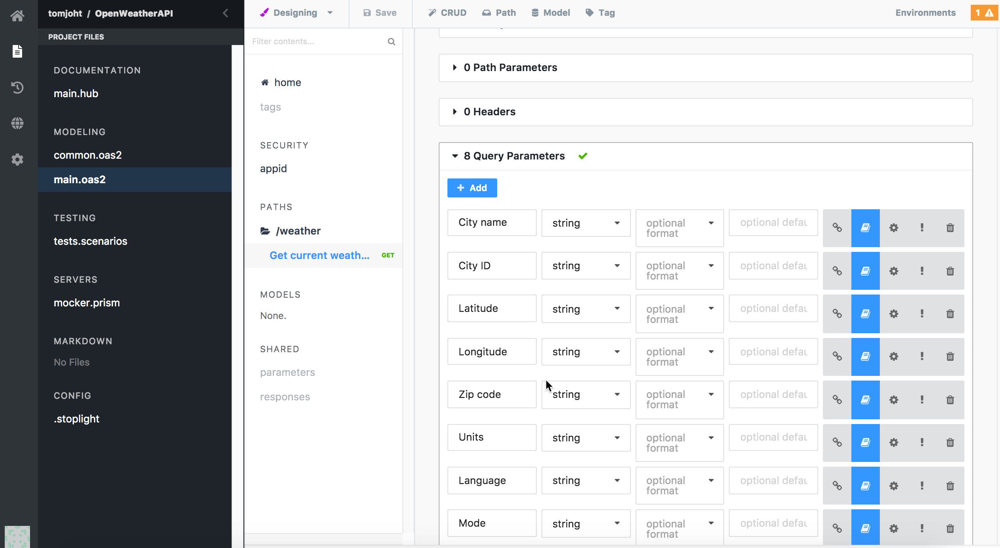
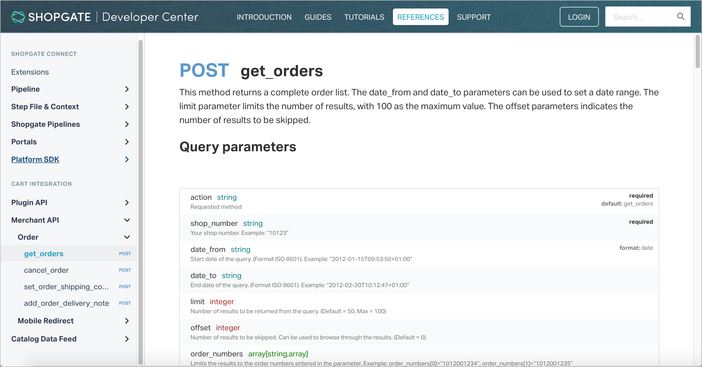
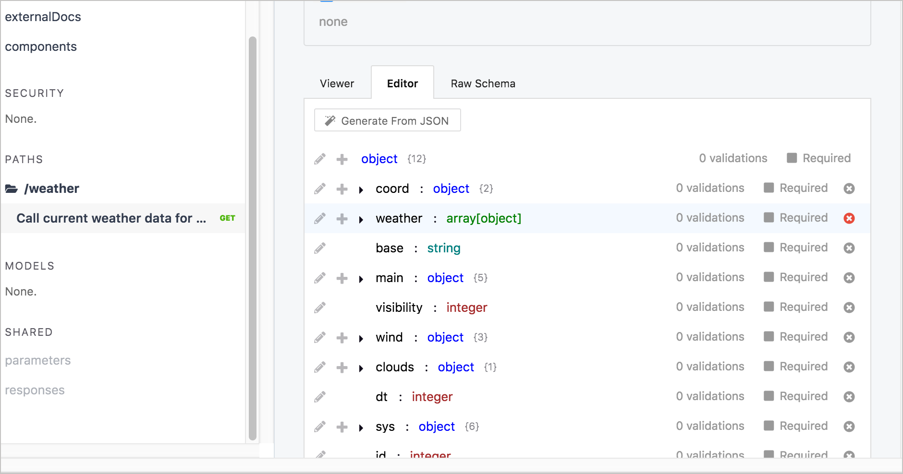

# Stoplight - инструмент визуального моделирования для создания спецификаций

Ранее мы рассмотрели [SwaggerHub](swaggerhub-introduction-and-tutorial.md) - инструмент, упрощающий создание и публикацию [спецификации OpenAPI](openapi-tutorial-overview.md). Теперь давайте рассмотрим другой инструмент под названием [Stoplight.io](https://stoplight.io/?utm_source=idratherbewriting).

Среди других сервисов Stoplight предоставляет инструменты визуального моделирования для создания документации OpenAPI - без необходимости знать детали спецификации OpenAPI или кодировать строки построчно. Этот документ спецификации API может выступать в качестве единого источника знаний, который расширяет возможности всего жизненного цикла API, от прототипирования UX до тестирования, разработки, документации, продаж и многого другого.

#### Содержание раздела

[Ограничения построчного кодирования спецификации](#limits)

[Не просто инструменты, а философия, ориентированная на дизайн](#philosophy)

[Не пост-дизайн артефакт для создания документации](#artifact)

[Особенности размещения документации на Stoplight](#features)

[Практическое занятие: Используем Stoplight для редактирования спецификации OpenAPI](#activity)

- [Загружаем и заполняем Stoplight спецификацией OpenAPI](#download)

- [Автоматическая генерация документации схемы](#schema)

<a name="limits"></a>
## Ограничения построчного кодирования спецификации

Прежде чем перейти к деталям, узнаем, почему Stoplight является ценным инструментом, и почему он включен в этом курсе и создано [практическое занятие по использованию Stoplight](#activity). На [конференции TC Camp в Санта-Кларе в 2018 году](http://www.tccamp.org/) организаторы провели семинар по API, занявший целый день, посвященный OpenAPI и Swagger. Хорошая тема для семинара, потому что кодирование спецификации - это и самая сложная, и самая важная часть документации по API.

Один из участников был немного разочарован тем, что было посвящено много времени [YAML](working-in-YAML.md), обсуждая различные части [определения спецификации OpenAPI](openapi-tutorial-overview.md). Этот участник сказал, что большую часть дня посвятили YAML, и это было неприятно, утомительно и скучно. Он не так это себе представлял, когда регистрировался, чтобы узнать, как создавать интерактивные документы по API.

В защиту ведущего семинар участнику сообщили, что описание API с использованием спецификации OpenAPI в значительной степени предполагает жизнь в YAML в течение всего дня, и это утомительно, очень подвержено ошибкам и сложно технически. Евангелист API Kin Lane, объясняет, что «создание вручную даже определения базового API для любого API отнимает много времени». Это действие «быстро превращается в часы, если вы считаете, что необходимая работа работа закончена [«Автоматизированная картография Вселенной API…»](http://apievangelist.com/2016/02/05/automated-mapping-of-the-api-universe-with-charles-proxy-dropbox-openapi-spec-and-some-custom-apis/).

Лейн говорит, что он изучал способы автоматизации определения API с использованием различных инструментов, таких как Charles Proxy. За это время он начал изучать [Stoplight.io](http://stoplight.io/), платформу для моделирования API-интерфейсов и многое другое, и увлекся рабочими процессами и инструментами дизайна. Он говорит:

> Я слишком поздно ложился спать, играя с некоторыми новыми функциями в Stoplight.io. Если вы не знакомы с тем, что готовила команда Stoplight - они усердно работали над созданием довольно изящного набора инструментов моделирования API. Я чувствую, что платформа предоставляет мне новый способ взглянуть на жизненный цикл API - перспективу, которая охватывает несколько измерений, включая дизайн, определение, виртуализацию, документацию, тестирование, обнаружение, оркестровку и клиент. … Мне любопытно посмотреть, что дизайнеры и архитекторы API делают со Stoplight - я чувствую, что у него есть потенциал для значительного изменения ландшафта, чего я давно не видел ни у одного поставщика API-услуг. [Автоматическое определение инфраструктуры API при работе с Stoplight.io](http://apievangelist.com/2016/02/16/automagically-defining-your-api-infrastructure-as-you-work-using-stoplightio/)

Автор курса Том Джонсон также начал изучать Stoplight. Было любопытно посмотреть, могут ли инструменты визуального моделирования для описания API снять скуку работы в YAML на построчном уровне со спецификацией. Используя Stoplight для создания описания OpenAPI для недавнего веб-API на своей работе, он нашел Stoplight полезным. Stoplight значительно упростил создание документа спецификации OpenAPI.

Инструменты визуального моделирования Stoplight устраняют необходимость в ознакомлении с форматом спецификации OpenAPI. Не нужно знать тип данных для каждого свойства, должно ли свойство быть вложенным или определено напрямую и т. Д. Этот уровень сложности был удален в GUI для разработки вашего API.



> Stoplight предоставляет инструменты визуального моделирования для описания вашего API. На приведенном выше снимке экрана показан пользовательский интерфейс для документирования параметров. Пользовательский интерфейс Stoplight создает действительный документ спецификации OpenAPI, который затем используется для управления другими службами и действиями API на их сайте.

Интерфейс Stoplight приветствуется как часть инструментов визуального моделирования для описания схем JSON (используется в телах запросов или ответах). Подробности о том, как документировать схемы JSON, не полностью описаны в спецификации OpenAPI, поэтому они могут быть сложными. Что особенно приятно в Stoplight, так это то, что можно вставлять фрагмент JSON, и он будет автоматически описывать JSON в правильном для вас синтаксисе. Делается это с помощью кнопки Generate from JSON, как  продемонстрировано в этом коротком [видео](https://youtu.be/0IOWY0Hj3Xc)

Кроме того, можно легко переключаться между визуальными инструментами и кодом спецификации. Если надо работать с кодом, изменения также обновят содержимое в пользовательском интерфейсе. Синхронизация работает идеально, при обновлениях в любом режиме. Вот короткое [видео](https://youtu.be/vqDJBa-haYs), показывающее эту синхронизацию

<a name="philosophy"></a>
## Не просто инструменты, а философия, ориентированная на дизайн

[Марк Маклеод](https://www.linkedin.com/in/marcmacleod/), основатель Stoplight, вот что говорит о том, чем Stoplight отличается от [SwaggerHub](swaggerhub-introduction-and-tutorial.md) и [Readme](../Publishing-doc/Headless-cms-options.md#readme): когда спецификация была впервые представлена, он увидел ценность наличия стандартной спецификации для API, но в то время все инструменты требовали, чтобы пользователи писали спецификацию построчно. Такой подход был подвержен ошибкам, он был медленным и утомительным.

Марк и его команда разработали Stoplight с инструментами визуального моделирования, которым не требуется, чтобы команды знали детали спецификации OpenAPI. Это упрощение инструментария открывает возможности разработки спецификации для более широкого круга командных игроков - для менеджеров по продуктам, разработчиков, дизайнеров UX, технических писателей и многих других. Барьер для входа в разработку и создание прототипа API выходит за рамки просто инженеров.

Создание документа спецификации, вероятно, является наиболее важным видом деятельности в разработке API, потому что описание API является по сути единственным источником знаний. Этот единственный источник знаний может затем информировать и расширять возможности других ролей: разработчиков, тестировщиков, UX-дизайнеров, технических писателей, специалистов по продажам и многих других. Основная философия Марка заключается в том, что документ спецификации OpenAPI является ключевым для разработки API. После получения документа спецификации, можно будет создавать инструменты для него, чтобы расширить возможности других команд. Например:

- UX-дизайнеры могут создавать прототипы API, используя мок-сервер, чтобы пользователи могли выполнять запросы и видеть примеры ответов - прежде чем разработчики даже напишут одну строку кода;
- Разработчики могут писать код, следуя конкретному контракту, как строительная бригада работает по проектом. Все решения и вопросы включены в документ спецификации, чтобы сделать его действующим;
- QA могут автоматизировать модульное тестирование из описания API, для ускорения тестирования конечных точек по множеству параметров и сценариев;
- Технические писатели могут добавлять описания и другие примеры к описанию спецификации, а затем генерировать интерактивную документацию, не беспокоясь о разработке шаблонов, стилей или другого форматирования и организации.

Разве не имеет смысла строить вашу платформу на основе спецификации OpenAPI, если спецификация действительно поддерживает все эти действия? И в более широком плане, чтобы построить свой бизнес на основе спецификации? Вот что делает Stoplight. Это то, что делает их принципиально отличными от других платформ API. Вероятно, именно это имел в виду Кин Лэйн, когда сказал, что Stoplight предоставляет «новый взгляд на жизненный цикл API - перспективу, охватывающую несколько измерений, включая дизайн, определение, виртуализацию, документацию, тестирование, исследование, оркестровку».

<a name="artifact"></a>
## Не пост-дизайн артефакт для создания документации

Спецификация OpenAPI - это не просто артефакт, который описывает то, что разработчики уже закодировали. Кроме того, это не просто способ создания интерактивных документов со встроенным обозревателем API или способ создания API читаемыми для использования другими системами. Спецификация OpenAPI - это способ разработки и моделирования API. С этой целью инструменты для проектирования и моделирования API должны быть более гибкими, более простыми в обращении и доступными для дизайнеров и менеджеров по продукту.

Рассмотрим эту аналогию. Для создания сообщений в блоге, часто используют редакторы, такие как Google Docs, Bear, Ulysses или даже Word, потому что эти инструменты позволяют легче выразить себя. Можно редактировать и перемещать контент или вставлять заметки и задумки. Только после завершения содержания, его конвертируют в Markdown или HTML, а затем заполняют структурированный YAML в frontmatter сообщения. То же самое и со спецификацией API. При разработке и моделировании API, не нужно беспокоиться о том, валиден ли синтаксис YAML, не нужно постоянно обращаться к справочной документации, чтобы запомнить, какие свойства требуются на каждом уровне спецификации.

Редактор YAML со своим жестким синтаксисом не поможет моделировать или проектировать API-интерфейсы в команде. Без инструментов для совместного проектирования и моделирования, спецификация моделируется и разрабатывается в других местах (например, на страницах Confluence или в документе Word на компьютере менеджера по продукту). Документ спецификации становится вторичным для разработки, документом пост-разработки, созданным техническим специалистом (например, разработчиком или техническим писателем) после разработки.

К сожалению, подход "Спецификация потом" присутствует в большинстве API, спецификация создается после того, как API уже спроектирован и закодирован. Спецификация становится просто способом генерации справочной документации для существующего API, а не единственным источником истины, который расширяет весь жизненный цикл API от начала до конца. Неизменно, как только пользователь начинает тестирование, команда проекта обнаруживает недостатки в дизайне API, которые они не успевают исправить.

Такая практика предоставления спецификации последней (а не первой) в разработке API ограничивает область действия спецификации OpenAPI:

> Многие разработчики все еще видят OpenAPI (fka Swagger) при создании документации API, а не в качестве основного контракта, который используется на каждой остановке в течение жизненного цикла API. Большинство из них не понимают, что можно использовать макет вместо развертывания и даже предоставлять моковые данные, ошибки и другие сценарии, позволяющие создавать прототипы приложений на основе конструкций API. ([Code Generation Of OpenAPI (fka Swagger) Still The Prevailing Approach](http://apievangelist.com/2018/02/14/code-generating-openapi-still-prevailing-approach/))

Чтобы противостоять неэффективному методу разработки с подходом "Спецификация потом", все больше и больше платформ продвигают разработку кода в жизненном цикле API. Другими словами, дизайн и тестирование выполняются в первую очередь, разработка кода выполняется позже.

В модели "сначала дизайн" технические писатели также могут на ранних этапах участвовать в процессе разработки API, предоставляя информацию о форме и модели API в то время, когда их ввод может получить популярность. В закодированном API достаточно сложно изменить имя параметра, а тем более сам параметр.

<a name="features"></a>
## Особенности размещения документации на Stoplight

Помимо размещения спецификации OpenAPI в центр процесса жизненного цикла API, у Stoplight есть и другие функции, представляющие особый интерес для технических писателей. Stoplight предлагает решение для размещения документов, с помощью которого можно интегрировать свой безадресный контент (учебные пособия, руководства и другие инструкции) с адресными документами API. Вот пример страницы Stoplight для продукта под названием [Shopgate](https://developer.shopgate.com/):


> Пример страницы из центра разработчиков Shopgate, которые используют Stoplight для создания документации по API

Обратите внимание, можно интегрировать свою адресную и безадресную документацию в Stoplight в раздел doc. Интеграция этих двух типов контента была давней проблемой для технических писателей в пространстве документации API. (Подробнее о проблемах интеграции с документацией API см. в разделе [Интеграция Swagger с документацией](integrating-swagger-with-docs.md#).)

Stoplight также позволяет создавать переменные для использования как в спецификации, так и в инструкциях. Stoplight планирует сделать еще один шаг вперед, разрешив переиспользование [определений компонентов спецификации](step5-components-object.md) в [концептуальной документации](../conceptual-topics/README.md). (Но эта функция еще впереди.)

Многим нравится работать непосредственно с кодом, однако, Stoplight позволяет больше концентрироваться на контенте, а не на деталях формата спецификации. В идеале можно заставить разработчиков и других членов проектной группы самим заполнять адресный контент в Stoplight, поскольку в любом случае это действие должно происходить намного раньше в процессе разработки API.

При документировании API, стоит обратить внимание на [Stoplight](https://stoplight.io/) и размещенное в нем [решение doc](https://stoplight.io/documentation/). Но не стоит думать, что Stoplight - это просто платформа для документации или простой способ генерировать описание OpenAPI. Подумайте о том, чтобы с помощью Stoplight можно разрабатывать единый источник знаний, который позволит всем другим командам более эффективно использовать API.

<a name="activity"></a>
## 👨‍💻 Практическое занятие: Используем Stoplight для редактирования спецификации OpenAPI

Ранее мы редактировали или создавали [документ спецификации OpenAPI](create-openapi-specification.md#edit), а также создавали [отображение Swagger UI](swagger-ui-tutorial.md#createDoc) с этим документом спецификации. В этом примере мы внесем изменения в документ спецификации, используя визуальный редактор Stoplight.

<a name="download"></a>
### Загружаем и заполняем Stoplight спецификацией OpenAPI

Сейчас поработаем с файлом OpenAPI в Stoplight, который предоставляет графический редактор для работы со спецификацией OpenAPI. Чтобы ускорить процесс, возьмем предварительно созданный файл OpenAPI, который вставим в редактор Stoplight, а затем внесем в него некоторые изменения с помощью инструментов визуального моделирования Stoplight. Можно использовать Stoplight в браузере или в качестве веб-приложения. Для простоты мы будем использовать версию браузера.

Для работы с OpenAPI в Stoplight:

1. В настоящее время Stoplight поддерживает только OpenAPI 2.0, а не 3.0. Можно конвертировать спецификацию 3.0 с помощью [APIMATIC Transformer](https://www.apimatic.io/transformer) в 2.0, но для ускорения берем [уже конвертированный файл 2.0 OpenAPI JSON](https://idratherbewriting.com/learnapidoc/docs/rest_api_specifications/openweathermap_swagger20.json).
2. Переходим по адресу [next.stoplight.io](https://next.stoplight.io/)
3. Нажимаем `Login` в правом верхнем углу и авторизуемся, используя свою учетную запись GitHub
4. Нажимаем `New Personal Project`
5. Вводим имя проекта (например, **OpenWeatherMap API**), выбираем видимость проекта: публичный или приватный (это не имеет значения), и нажмите `Next`.
6. Наследующем экране (Project Designer) выбираем вкладку **Import Existing**. Нажимаем плашку `Upload OpenAPI (Swagger), Markdown or HTML File` и выбираем файл `openweathermap_swagger20.json` загруженный в п.1
7. Нажимаем на плашку `+openweathermap_swagger20.oas2.yml`. Файл OpenAPI загрузится в Stoplight и заполнит данными интерфейс Stoplight.
8. В верхней части экрана переключим между представлениями «Код» и «Дизайн», нажимая соответствующие кнопки вверху. Внесем  изменения в код, а затем переключитесь в представление «Дизайн», чтобы увидеть их изменения. (Обратите внимание, что Stoplight предпочитает JSON в качестве формата кода.) Весь процесс показан в этом [видео](https://youtu.be/vqDJBa-haYs).

*При переключении на представление кода, редактор автоматически переходит к части спецификации, созданной в визуальном редакторе, и выделяет ее. При переключении обратно, визуальный интерфейс обновляется с любыми изменениями, внесенными в код. Переключение между режимами происходит легко и просто.*

9. Можно изучить различные параметры в редакторе дизайна (в частности, развернем `Paths` и нажмем `/weather > Call current weather data for…`) и внесем несколько произвольных текстовых изменений, чтобы узнать, как обновлять информацию.

<a name="schema"></a>
### Автоматическая генерация документации схемы

Одна из самых крутых функций в Stoplight - это возможность автоматически генерировать документацию схемы из примера ответа JSON. Попробуем эту функцию автоматического создания, выполнив следующие действия:

1. В среднем столбце Stoplight кликаем `PATHS`, затем нажмем `/weather`, и `Call current weather data for…`.
2. В разделе `Responses`  кликаем `Raw Schema` и удаляем существующую схему ответов. (Даже при удалении информации в этом разделе, будут оставаться пустые фигурные скобки `{}`, при переключении вкладки, что хорошо.)
3. Переходим на вкладку `Editor`, жмем `Generate from JSON` и вставляем следующий ответ JSON от конечной точки погоды OpenWeatherMap:

```json
{
  "coord": {
    "lon": -121.96,
    "lat": 37.35
  },
  "weather": [
    {
      "id": 801,
      "main": "Clouds",
      "description": "few clouds",
      "icon": "02d"
    }
  ],
  "base": "stations",
  "main": {
    "temp": 75.51,
    "pressure": 1014,
    "humidity": 8,
    "temp_min": 66.92,
    "temp_max": 80.6
  },
  "visibility": 16093,
  "wind": {
    "speed": 11.41,
    "deg": 330
  },
  "clouds": {
    "all": 20
  },
  "dt": 1541544960,
  "sys": {
    "type": 1,
    "id": 479,
    "message": 0.0043,
    "country": "US",
    "sunrise": 1541515128,
    "sunset": 1541552625
  },
  "id": 420006397,
  "name": "Santa Clara",
  "cod": 200
}
```

4. Нажимает `Generate!`

Stoplight автоматически генерирует схему JSON, соответствующую спецификации OpenAPI. Мы только что спасли себе рабочий день!



[Вот короткое видео](https://youtu.be/0IOWY0Hj3Xc), показывающее процесс автоматической генерации JSON. Редактор Stoplight немного эволюционировал, но он все еще очень прост. (Также обратим внимание, что вместо того, чтобы начинать с приведенного выше примера JSON, видео выполняет запрос в Postman, а затем копирует ответ оттуда - но идея должна быть ясной.)

*Инструменты визуального моделирования Stoplight позволяют автоматически создавать правильное определение схемы JSON из вставленного вами блока JSON.*

5. Переходим на вкладку `Raw Schema`, чтобы увидеть код, который Stoplight автоматически написал на основе скопированного образца JSON.

Автоматически сгенерированная схема документации сделает жизнь техписателя  проще. Даже если предпочитаете вручную кодировать файлы спецификаций OpenAPI в другом редакторе, можно обнаружить переход на Stoplight просто для автоматической генерации документации схемы ответа.


[🔙](swaggerhub-introduction-and-tutorial.md)

[Go next ➡](integrating-swagger-with-docs.md)
