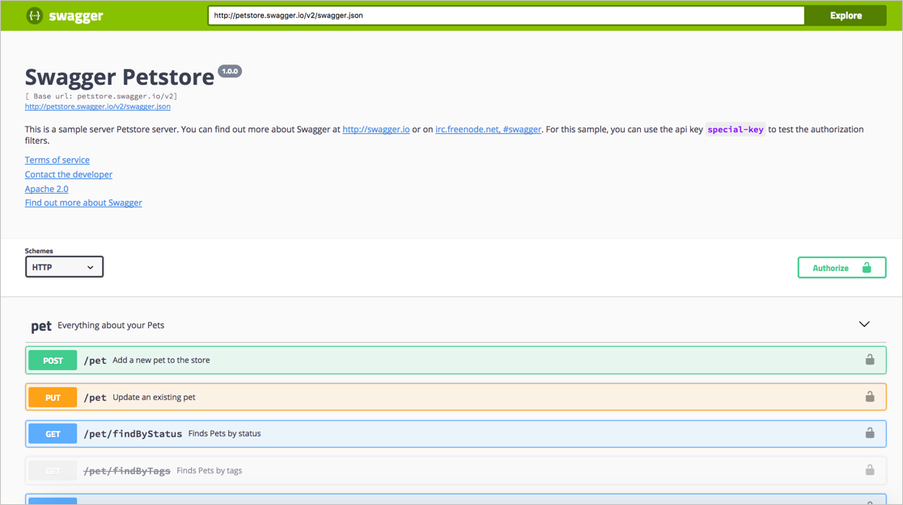

# Руководство Swagger UI

[Swagger UI](https://github.com/swagger-api/swagger-ui) предоставляет Фреймворк, который читает [спецификацию OpenAPI](https://github.com/OAI/OpenAPI-Specification). и создает веб-страницу с интерактивной документацией. В этом руководстве показано, как интегрировать документ спецификации OpenAPI в интерфейс Swagger.

Концептуальный обзор OpenAPI и Swagger можно посмотреть в разделе [Знакомство со спецификациями OpenAPI и Swagger](introduction-openapi-and-swagger.md). Пошаговое руководство по созданию документа спецификации OpenAPI смотрим в [Обзоре руководства OpenAPI 3.0](openapi-tutorial-overview.md).

#### Содержание раздела

[Обзор Swagger UI](#overview)

[Знакомство со Swagger при помощи Petstore](#petStore)

- [Авторизация запроса](#authRequest)

- [Создание запроса](#makeRequest)

- [Проверка создания питомца](#verify)

[Примеры сайтов с документаций по Swagger UI](#samples)

[Практическое занятие: Создание спецификации OpenAPI в Swagger UI](#createDoc)

[Конфигурация параметров Swagger UI](#config)

[Проблемы Swagger UI](#challenges)

[Устранение неполадок](#troubleshooting)

[Встраивание Swagger UI в существующий сайт](#embedding)

<a name="overview"></a>
## Обзор Swagger UI

Swagger UI - один из самых популярных инструментов для создания интерактивной документации. Swagger UI создает интерактивную консоль API для экспериментов с запросами в реальном времени. Кроме того, Swagger UI (активно [управляемый проект](https://github.com/swagger-api/swagger-ui) с лицензией Apache 2.0) поддерживает последнюю версию спецификации OpenAPI (3.x) и интегрируется с другими инструментами Swagger.


Прежде чем мы углубимся в Swagger, нужно прояснить ключевые термины.

#### Swagger

Относится к инструментам API, связанным со спецификацией OpenAPI. Некоторыми из этих инструментов являются [Swagger Editor](https://swagger.io/tools/swagger-editor/), [Swagger UI](https://swagger.io/tools/swagger-ui/), [Swagger Codegen](https://swagger.io/tools/swagger-codegen/), [SwaggerHub](https://app.swaggerhub.com/home) и [другие](https://swagger.io/tools/). Всеми инструментами управляет компания [Smartbear](https://smartbear.com/). Для получения дополнительной информации см. [Инструменты Swagger](https://swagger.io/tools/). «Swagger» являлся изначально оригинальным названием спецификации OpenAPI, но позже имя было изменено на OpenAPI, чтобы усилить открытый, не лицензионный характер стандарта. Люди иногда ссылаются на оба имени взаимозаменяемо (особенно на старых веб-страницах), но «OpenAPI» - это то, как следует обращаться к спецификации. Дополнительные сведения о разнице между OpenAPI и Swagger см. В разделе [«В чем разница между Swagger и OpenAPI?»](https://swagger.io/blog/api-strategy/difference-between-swagger-and-openapi/).

#### OpenAPI

Официальное название спецификации OpenAPI. Спецификация OpenAPI предоставляет набор свойств, которые можно использовать для описания REST API. Рабочий, валидный документ можно использовать для создания интерактивной документации, создания клиентских SDK, запуска модульных тестов и многого другого. Подробности спецификации можно изучить на GitHub по адресу [https://github.com/OAI/OpenAPI-Specification](https://github.com/OAI/OpenAPI-Specification). В рамках инициативы Open API с Linux Foundation спецификация OpenAPI направлена ​​на то, чтобы быть независимой от производителя (многие компании участвуют в ее разработке).

#### Swagger Editor

[Онлайн-редактор](http://editor.swagger.io/#/), который проверяет документацию OpenAPI на соответствие правилам спецификации OpenAPI. Редактор Swagger помечает ошибки и дает советы по форматированию.

#### Swagger UI

Веб-фрэймворк ([на GitHub](https://github.com/swagger-api/swagger-ui)), который анализирует документ в спецификации OpenAPI и создает веб-страницу интерактивной документации. Swagger UI - это инструмент, который превращает спецификацию в подобный [Petstore-сайт](http://petstore.swagger.io/).

#### Swagger Codegen

Генерирует код SDK для множества различных платформ (таких как Java, JavaScript, Scala, Python, PHP, Ruby, Scala и другие). Код SDK помогает разработчикам интегрировать API на конкретной платформе и обеспечивает более надежные реализации, которые могут включать в себя больше масштабирования, многопоточности и т.д.. В общем, SDK - это наборы инструментов для реализации запросов, сделанных с помощью API. Swagger Codegen генерирует клиентские SDK практически на каждом языке программирования. См. [Swagger Codegen](https://swagger.io/tools/swagger-codegen/) для получения дополнительной информации. Смотрите также [SDK и примеры приложений](../conceptual-topics/sdks-sample-apps.md).

<a name="petStore"></a>
## Знакомство со Swagger при помощи Petstore

Чтобы лучше понять интерфейс Swagger, давайте рассмотрим [пример Swagger Petstore](http://petstore.swagger.io/). В примере Petstore сайт генерируется с помощью [Swagger UI](https://github.com/swagger-api/swagger-ui).




Конечные точки сгруппированы следующим образом:

- [pet](http://petstore.swagger.io/#/pet)
- [store](http://petstore.swagger.io/#/store)
- [user](http://petstore.swagger.io/#/user)

<a name="authRequest"></a>
### Авторизация запроса

Прежде чем делать какие-либо запросы, нужна авторизация. Нажимаем кнопку **Authorize** и заполняем информацию, требуемую в окне «Авторизация», изображенном ниже:


Пример Petstore имеет модель безопасности OAuth 2.0. Код авторизации только для демонстрационных целей. Нет никакой реальной логики авторизации этих запросов, поэтому просто закрываем окно Авторизации.

<a name="makeRequest"></a>
### Создание запроса

Теперь создадим запрос:

1. Развернем конечную точку [**POST Pet**](http://petstore.swagger.io/#/pet/addPet)
2. Нажимаем кнопку `Try it out`


После того, как мы нажмем кнопку `Try it out`, значение примера в поле «Тело запроса» станет редактируемым.

3. В поле «Example Value» изменяем первое значение `id` на случайное целое число, например `193844`. Также значение второго `name` на другое (имя вашего питомца).
4. Нажимаем `Execute`


> Выполнение примера запроса Petstore


Пользовательский интерфейс Swagger отправляет запрос и показывает отправленный [curl](../like-developer/make-curl-call.md). Раздел Ответы показывает [ответ](../documenting-api-endpoints/step5-response-example-and-schema.md). (Если выбрать JSON вместо XML в раскрывающемся списке «Response content type», формат ответа будет показан в формате JSON.)


> !Важно! Petstore - это функционирующий API, и вы фактически создали питомца. Теперь вам нужно взять на себя ответственность за вашего питомца и начать кормить и ухаживать за ним! Шутки, шутками, но большинство пользователей не осознают, что играют с реальными данными, когда выполняют ответы в API (особенно при использовании своего собственного ключа API). Эти тестовые данные могут быть чем-то, что вам придется стереть при переходе от исследований и изучения API к использованию API для реального использования.

<a name="verify"></a>
### Проверка создания питомца

1. Разворачиваем точку [GET /pet/{petId}](http://petstore.swagger.io/#/pet/getPetById)
2. Нажимаем кнопку `Try it out`
3. Вводим ID питомца, который использовали в предыдущей операции. (Если забыли ID, посмотрите на конечную точку POST Pet, чтобы проверить значение.)
4. Нажимаем `Execute` . В ответе мы должны увидеть имя нашего питомца.

<a name="samples"></a>
## Примеры сайтов с документаций по Swagger UI

Прежде чем мы перейдем к другому API с этим пособием по Swagger (кроме демонстрации Petstore), посмотрим на другие реализации Swagger:

- [Reverb](https://reverb.com/swagger#/articles)
- [VocaDB](https://vocadb.net/swagger/ui/index)
- [Watson Developer Cloud](https://console.bluemix.net/developer/watson/documentation)
- [The Movie Database API](https://developers.themoviedb.org/3/account/get-account-details)
- [Zomato API](https://developers.zomato.com/documentation?lang=pl)

Некоторые из этих сайтов выглядят одинаково, но другие, такие как The Movie Database API и Zomato, были легко интегрированы в остальную часть их сайта документации.

Глядя на примеры, можно заметить краткость документации в реализации Swagger. Эта краткость объясняется тем, что дисплей Swagger предназначен для интерактивного взаимодействия, где можно опробовать вызовы и посмотреть ответы - используя свой собственный ключ API, чтобы увидеть свои собственные данные. такой подход получил название: «учись, практикуясь». Кроме того, Swagger UI охватывает только [адресные темы документации](../documenting-api-endpoints/README.md). [Концептуальные разделы](../conceptual-topics/README.md) обычно рассматриваются в отдельном руководстве.

<a name="createDoc"></a>
## 👨‍💻 Практическое занятие: Создание спецификации OpenAPI в Swagger UI

На этом занятии мы создадим документацию в Swagger UI в спецификации OpenAPI. Если вы используете один из предварительно созданных файлов OpenAPI, вы можете увидеть демонстрацию того, что мы создадим здесь: [OpenWeatherMap Swagger UI](https://idratherbewriting.com/learnapidoc/assets/files/swagger/) или [Sunrise/sunset Swagger UI](https://idratherbewriting.com/learnapidoc/assets/files/swagger-sunrise-sunset/index.html)).


Для интеграции спецификации OpenAPI в Swagger UI:

1. Подготавливаем действительный документ спецификации OpenAPI:

 - Инструкции по созданию документа спецификации OpenAPI с нуля см. В [обзоре руководства по OpenAPI](openapi-tutorial-overview.md).
 - Для использования предварительно созданного документа в спецификации OpenAPI, можно использовать [файл спецификации OpenWeatherMap](https://idratherbewriting.com/learnapidoc/docs/rest_api_specifications/openapi_openweathermap.yml) или [файл спецификации Sunrise/sunset API](https://idratherbewriting.com/learnapidoc/assets/files/swagger-sunrise-sunset/openapi_sunrise_sunset.yml) (Клик правой кнопкой мыши ссылку и сохраните файл YAML на рабочем столе.)
2. Нужно убедиться, что спецификация OpenAPI действительна. Для этого вставляем свой код спецификации OpenAPI в онлайн-редактор Swagger и видим, что слева не отображаются никакие предупреждения. Вид справа в редакторе Swagger показывает полностью функциональный дисплей Swagger UI.
3. Переходим в [проект Swagger UI на GitHub](https://github.com/swagger-api/swagger-ui)
4. Нажмите `Clone or download`, а затем нажмите `Download ZIP`. Загрузите файлы в удобное место на вашем компьютере и распакуйте файлы.

Единственная папка, с которой мы будем работать в загруженном zip-архиве, - это папка dist (сокращение от дистрибутива). Все остальное используется, только если мы перекомпилируем файлы Swagger, что выходит за рамки этого руководства.

5. Извлечем папку dist из папки swagger-ui-master в другой каталог. (После этого папку swagger-ui-master и zip-файл можно удалить.)
6. Перетащим файл спецификации OpenAPI (из шага 1) в папку dist. (Если вы используете предварительно созданные файлы OpenAPI, файл называется либо **openapi_openweathermap.yml**, либо **openapi_sunrise_sunset.yml**.) Ваша файловая структура должна выглядеть следующим образом:

        ├── dist
        │   ├── favicon-16x16.png
        │   ├── favicon-32x32.png
        │   ├── index.html
        │   ├── oauth2-redirect.html
        │   ├── swagger-ui-bundle.js
        │   ├── swagger-ui-bundle.js.map
        │   ├── swagger-ui-standalone-preset.js
        │   ├── swagger-ui-standalone-preset.js.map
        │   ├── swagger-ui.css
        │   ├── swagger-ui.css.map
        │   ├── swagger-ui.js
        │   ├── swagger-ui.js.map
        │   ├── swagger30.yml
        │   └── [your openapi specification file]

7. В папке **dist** открываем **index.html** в текстовом редакторе, таком как [Atom](https://atom.io/) или[Sublime Text](https://www.sublimetext.com/).
8. Ищем следующий код:
        url: "http://petstore.swagger.io/v2/swagger.json",
9. Меняем значение `url` на относительный путь к вашему файлу YAML, а затем сохраните файл. Например

```
url: "openapi_openweathermap.yml",
```

или

```
url: "openapi_sunrise_sunset.yml",
```

10. Изучим файл index.html локально в браузере. Стоит обратить внимание, что ограничения безопасности Chrome (возражения CORS) не позволяют просматривать файл Swagger UI локально. Но есть несколько обходных путей:
 - Просмотр файла локально с помощью [Firefox](https://www.mozilla.org/en-US/firefox/new/?v=c) (это самый простой способ);
 - Использование размещенного в Интернете URL-адреса [openapi_openweathermap.yml](https://idratherbewriting.com/learnapidoc/docs/rest_api_specifications/openapi_openweathermap.yml) или [openapi_sunrise_sunset.yml](https://idratherbewriting.com/learnapidoc/assets/files/swagger-sunrise-sunset/openapi_sunrise_sunset.yml). (Клик правой кнопкой мыши ссылку и выберите «Копировать адрес ссылки».);
 - Загрузка папки **dist** на веб-сервер и просмотр ее содержимого на сервере;
 - Поместить файл YAML в общедоступный [GitHub Gist](https://gist.github.com/) и затем нажать `Raw`. Использовать URL для этого Gist;
 - Использовать локальный сервер, такой как [simple local HTTP server](https://developer.mozilla.org/en-US/docs/Learn/Common_questions/set_up_a_local_testing_server).

Когда файл Swagger UI будет готов к публикации, просто загружаем папку на веб-сервер и переходим в файл index.html. Например, если название каталога dist осталось без изменений, переходим по адресу http://myserver.com/dist/. (Имя папки **dist** можно менять на любое другое.)

> Для получения дополнительных инструкций по работе с Swagger UI см. [Документацию Swagger.io](https://swagger.io/docs/open-source-tools/swagger-ui/usage/installation/).

<a name="config"></a>
## Конфигурация параметров Swagger UI

Swagger UI предоставляет различные [параметры конфигурации](https://github.com/swagger-api/swagger-ui/blob/master/docs/usage/configuration.md) (не связанные с параметрами OpenAPI), которые можно использовать для настройки интерактивного дисплея. Например, можно указать, будет ли каждая конечная точка развернута или свернута, как будут сортироваться теги и операции, показывать ли заголовки запросов в ответе, включать ли раздел «Модели» после списка конечных точек и многое другое.

В этом руководстве не будем вдаваться в подробности этих параметров конфигурации.

Если посмотреть на [код демонстрации пользовательского интерфейса Swagger](https://idratherbewriting.com/learnapidoc/assets/files/swagger/) (перейдите в View> Source), то увидим параметры, перечисленные в разделе `// Build a system`:

      // Build a system
    const ui = SwaggerUIBundle({
      url: "openapi_openweathermap.yml",
      dom_id: '#swagger-ui',
      defaultModelsExpandDepth: -1,
      deepLinking: true,
      presets: [
        SwaggerUIBundle.presets.apis,
        SwaggerUIStandalonePreset
      ],
      plugins: [
        SwaggerUIBundle.plugins.DownloadUrl
      ],
      layout: "StandaloneLayout"
    })


Все параметры (например, `deepLinking`, `dom_id` и т. Д.) являются значениями по умолчанию. Добавлен `defaultModelsExpandDepth: -1`, чтобы скрыть раздел «Модели» в нижней части экрана Swagger UI.

О параметрах конфигурации Swagger UI можете узнать в [документации Swagger](https://swagger.io/docs/open-source-tools/swagger-ui/usage/configuration/).

<a name="challenges"></a>
## Проблемы Swagger UI

Изучая интерфейс Swagger, можно заметить несколько ограничений:

- Не так много места для подробного описания работы конечных точек. При наличии нескольких абзацев с подробностями и сведениями о параметре, лучше всего ссылаться из описания на другую страницу в документации. Спецификация OpenAPI предоставляет способ ссылки на внешнюю документацию как в объекте `paths`, так и в объекте `info`, а также и в объекте `externalDocs`.
- Интерфейс Swagger выглядит практически одинаково для каждого API. Можно [настроить Swagger UI](https://swagger.io/docs/open-source-tools/swagger-editor/#customization-36) под свои собственные бренды, но понадобятся навыки UX. Относительно легко изменить цвет и изображение в верхней панели навигации.
- Swagger UI может быть отдельным сайтом от другой документации. Это означает, что в своей документации потребуется ссылаться на Swagger в качестве ссылки для конечных точек. В разделе [«Интеграция Swagger UI с остальными документами»](integrating-swagger-with-docs.md), описаны стратегии объединения справочных документов и руководства пользователя.

<a name="troubleshooting"></a>
## Устранение неполадок

При настройке Swagger UI, могут возникать проблемы. Следующие проблемы являются наиболее распространенными:

#### Проблема CORS

Если безопасность правильно настроена, но запросы отклоняются, это может быть связано с проблемой CORS (cross-origin resource sharing). CORS - это мера безопасности, которую веб-сайты внедряют, чтобы другие сценарии и процессы не могли получать свое содержимое через запросы от удаленных серверов. Подробности см. В разделе [«Поддержка CORS»](https://github.com/swagger-api/swagger-ui#cors-support) в документации по интерфейсу Swagger.

Если запросы не работают, переходим в консоль JavaScript браузера (в Chrome, View> Developer> Javascript Console), делаем запрос, и смотрим, относится ли ошибка к запросам разных источников. Если это так, можно попросить разработчиков включить CORS на конечных точках.

#### Проблемы с url хоста

Хост тестового сервера может быть еще одной причиной отклонения запросов. Некоторые API (например, Aeris Weather) требуют, создания идентификатор приложения на основе URL-адреса хоста, на котором будут выполняться запросы. Если зарегистрированным URL-адресом хоста является [`http://mysite.com`](http://mysite.com/), но тест отправляется по адресу [`https://editor.swagger.io/`](https://editor.swagger.io/), сервер API отклонит запросы.

<a name="embedding"></a>
## Встраивание Swagger UI в существующий сайт

Помимо публикации выходных данных пользовательского интерфейса Swagger в качестве отдельного сайта, можно встраивать файл Swagger в существующий сайт. Описание можно посмотреть здесь:

- [Standalone Swagger UI Demo](https://idratherbewriting.com/learnapidoc/assets/files/swagger/)
- [Embedded Swagger UI Demo](swagger-ui-demo.md)

Swagger UI адаптивен и хорошо масштабируется, что позволяет вписать его практически в любое пространство. Тем не менее, встроенный в существующий сайт Swagger выглядит как сайт внутри сайта.


[🔙](сreate-openapi-specification.md)

[Go next ➡](swagger-ui-demo.md)
